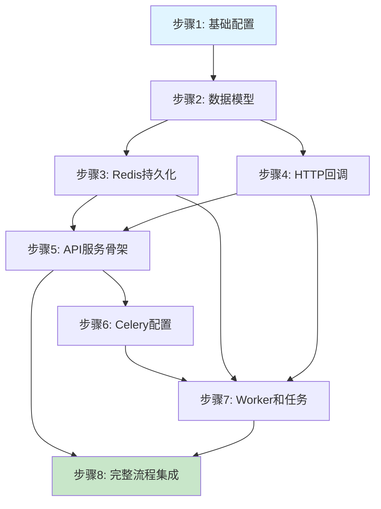
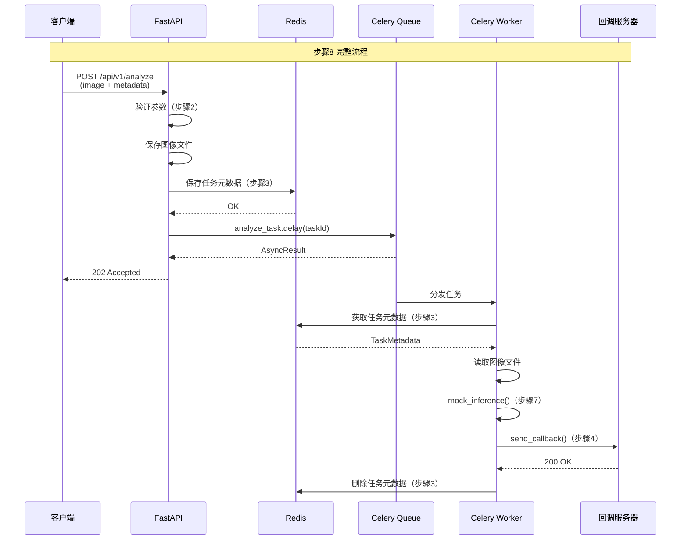

# X-Ray 推理服务渐进式开发计划

## 文档信息
- **版本**: v1.0
- **创建日期**: 2024-11-13
- **基于文档**: readme_server_lld.md
- **目标读者**: Cursor AI、开发工程师

---

## 目标代码目录结构

本次开发将基于现有项目结构，新增 `server/` 服务层模块：

```
Xray-inference/
│
├── config.yaml                 # 全局配置文件（新增）
├── requirements.txt            # Python 依赖（扩展）
│
├── main_api.py                # 【P1】API 服务启动入口（新增）
├── main_worker.py             # 【P2】Worker 服务启动入口（新增）
│
├── server/                    # 服务层模块（新增目录）
│   ├── __init__.py
│   ├── api.py                 # FastAPI 路由定义
│   ├── schemas.py             # Pydantic 数据模型
│   ├── worker.py              # Celery 应用配置
│   ├── tasks.py               # Celery 异步任务
│   │
│   └── core/                  # 核心组件
│       ├── __init__.py
│       ├── persistence.py     # Redis 状态持久化
│       └── callback.py        # HTTP 回调管理
│
└── pipelines/                 # 现有推理模块（保持不变）
    ├── pano/
    └── ceph/
```

---

## 受影响的现有模块说明

### 1. requirements.txt（扩展）
**变更类型**: 追加依赖

**新增依赖**:
- `fastapi`: Web 框架
- `uvicorn[standard]`: ASGI 服务器
- `celery`: 分布式任务队列
- `redis`: Redis 客户端
- `pydantic`: 数据验证
- `PyYAML`: 配置文件解析
- `requests`: HTTP 请求客户端
- `python-multipart`: 文件上传支持

### 2. pipelines/ 模块（保持独立）
**变更类型**: 无直接修改

**交互方式**: 
- 第一版使用 Mock 推理，不直接调用 `pipelines/`
- 第二版通过 `server/tasks.py` 调用 `pipelines.pano.PanoPipeline` 和 `pipelines.ceph.CephPipeline`
- 接口预留：`mock_inference()` 函数签名保持与真实推理一致

---

## 渐进式小步迭代开发步骤

### 步骤 1: 基础配置与依赖环境

**目标**: 创建全局配置文件和配置加载工具，完成依赖安装。

**文件操作**:
- 新增 `config.yaml`
- 扩展 `requirements.txt`
- 新增 `server/__init__.py`（含配置加载函数）

**实现内容**:

1. **config.yaml**: 完整的 YAML 配置文件，包含 Redis、Celery、API、Worker、Callback 和 Task 配置。

2. **requirements.txt**: 追加新增依赖：
   ```txt
   fastapi>=0.104.0
   uvicorn[standard]>=0.24.0
   celery>=5.3.0
   redis>=5.0.0
   pydantic>=2.4.0
   PyYAML>=6.0
   requests>=2.31.0
   python-multipart>=0.0.6
   ```

3. **server/__init__.py**: 实现配置加载函数
   ```python
   import yaml
   from pathlib import Path
   from typing import Any, Dict
   
   def load_config() -> Dict[str, Any]:
       """加载配置文件"""
       config_path = Path(__file__).parent.parent / "config.yaml"
       with open(config_path, 'r', encoding='utf-8') as f:
           return yaml.safe_load(f)
   ```

**验证方式**:
```bash
# 安装依赖
pip install -r requirements.txt

# 测试配置加载
python -c "from server import load_config; print(load_config())"
```

**预期输出**: 打印完整的配置字典

---

### 步骤 2: 数据模型定义

**目标**: 实现所有 Pydantic 数据模型，确保请求验证和响应序列化规范。

**文件操作**:
- 新增 `server/schemas.py`

**实现内容**:

定义以下数据模型（约 150 行）：

1. **AnalyzeRequest**: 请求验证模型
   - 字段：`taskId`, `taskType`, `callbackUrl`
   - 验证器：`validate_task_id()`, `validate_task_type()`, `validate_callback_url()`

2. **AnalyzeResponse**: 202 响应模型
   - 字段：`taskId`, `status`, `message`

3. **ErrorDetail**: 错误详情模型
   - 字段：`code`, `message`

4. **ErrorResponse**: 错误响应模型
   - 字段：`code`, `message`, `detail`

5. **CallbackPayload**: 回调负载模型
   - 字段：`taskId`, `data`, `error`

**关键实现**:
```python
from pydantic import BaseModel, field_validator
from typing import Optional, Dict, Any
import uuid

class AnalyzeRequest(BaseModel):
    taskId: str
    taskType: str
    callbackUrl: str
    
    @field_validator('taskId')
    @classmethod
    def validate_task_id(cls, v: str) -> str:
        try:
            uuid.UUID(v, version=4)
            return v
        except ValueError:
            raise ValueError('taskId must be a valid UUID v4')
    
    @field_validator('taskType')
    @classmethod
    def validate_task_type(cls, v: str) -> str:
        if v not in ['pano', 'ceph']:
            raise ValueError('taskType must be either pano or ceph')
        return v
    
    @field_validator('callbackUrl')
    @classmethod
    def validate_callback_url(cls, v: str) -> str:
        if not (v.startswith('http://') or v.startswith('https://')):
            raise ValueError('callbackUrl must be a valid HTTP/HTTPS URL')
        return v
```

**验证方式**:
```python
# 创建测试脚本 test_schemas.py
from server.schemas import AnalyzeRequest, AnalyzeResponse, CallbackPayload, ErrorDetail

# 测试有效数据
req = AnalyzeRequest(
    taskId="550e8400-e29b-41d4-a716-446655440000",
    taskType="pano",
    callbackUrl="http://example.com/callback"
)
print(f"✓ AnalyzeRequest 验证通过: {req.taskId}")

# 测试无效数据
try:
    AnalyzeRequest(taskId="invalid", taskType="pano", callbackUrl="http://test.com")
except ValueError as e:
    print(f"✓ 捕获预期错误: {e}")
```

**预期输出**: 
```
✓ AnalyzeRequest 验证通过: 550e8400-e29b-41d4-a716-446655440000
✓ 捕获预期错误: 1 validation error for AnalyzeRequest...
```

---

### 步骤 3: Redis 持久化模块

**目标**: 实现 Redis 增删查功能，支持任务元数据管理。

**文件操作**:
- 新增 `server/core/__init__.py`
- 新增 `server/core/persistence.py`

**实现内容**:

实现 `TaskPersistence` 类（约 120 行）：

- **初始化方法**: 连接 Redis
- **save_task()**: 保存任务元数据（带 TTL）
- **get_task()**: 获取任务元数据
- **task_exists()**: 检查任务是否存在
- **delete_task()**: 删除任务元数据
- **_build_key()**: 构建 Redis key（私有方法）

**关键实现**:
```python
import redis
import json
import logging
from typing import Dict, Optional, Any

logger = logging.getLogger(__name__)

class TaskPersistence:
    """任务元数据持久化管理"""
    
    def __init__(self, config: Dict[str, Any]):
        """初始化 Redis 连接"""
        redis_config = config['redis']
        self.redis_client = redis.Redis(
            host=redis_config['host'],
            port=redis_config['port'],
            db=redis_config['db'],
            password=redis_config.get('password'),
            decode_responses=True
        )
        self.key_prefix = "task:"
        self.ttl = config['task']['result_ttl']
    
    def _build_key(self, task_id: str) -> str:
        """构建 Redis key"""
        return f"{self.key_prefix}{task_id}"
    
    def save_task(self, task_id: str, metadata: Dict[str, Any]) -> bool:
        """保存任务元数据"""
        try:
            key = self._build_key(task_id)
            value = json.dumps(metadata)
            self.redis_client.setex(key, self.ttl, value)
            logger.info(f"Task saved: {task_id}")
            return True
        except Exception as e:
            logger.error(f"Failed to save task {task_id}: {e}")
            return False
    
    # ... 其他方法实现
```

**验证方式**:
```python
# 创建测试脚本 test_persistence.py
from server import load_config
from server.core.persistence import TaskPersistence
import time

config = load_config()
persistence = TaskPersistence(config)

# 测试保存
task_id = "550e8400-e29b-41d4-a716-446655440000"
metadata = {
    "taskId": task_id,
    "taskType": "pano",
    "imagePath": "/tmp/test.jpg",
    "callbackUrl": "http://test.com/callback",
    "createdAt": time.time()
}

success = persistence.save_task(task_id, metadata)
print(f"✓ 保存任务: {success}")

# 测试读取
result = persistence.get_task(task_id)
print(f"✓ 读取任务: {result['taskType']}")

# 测试存在性检查
exists = persistence.task_exists(task_id)
print(f"✓ 任务存在: {exists}")

# 测试删除
deleted = persistence.delete_task(task_id)
print(f"✓ 删除任务: {deleted}")
```

**前置条件**: 需要启动 Redis 服务
```bash
redis-server  # 启动 Redis
```

**预期输出**:
```
✓ 保存任务: True
✓ 读取任务: pano
✓ 任务存在: True
✓ 删除任务: True
```

---

### 步骤 4: HTTP 回调模块

**目标**: 实现 HTTP 回调发送功能，支持超时控制和错误处理。

**文件操作**:
- 新增 `server/core/callback.py`

**实现内容**:

实现 `CallbackManager` 类（约 80 行）：

- **初始化方法**: 创建 requests.Session
- **send_callback()**: 发送 POST 回调
- 异常处理：超时、连接错误、HTTP 错误

**关键实现**:
```python
import requests
import logging
from typing import Dict, Any

logger = logging.getLogger(__name__)

class CallbackManager:
    """HTTP 回调管理"""
    
    def __init__(self, config: Dict[str, Any]):
        """初始化 HTTP 客户端"""
        self.timeout = config['callback']['timeout']
        self.session = requests.Session()
        self.session.headers.update({
            'Content-Type': 'application/json',
            'User-Agent': 'Xray-Inference-Service/1.0'
        })
    
    def send_callback(self, callback_url: str, payload: Dict[str, Any]) -> bool:
        """发送回调请求"""
        try:
            logger.info(f"Sending callback to: {callback_url}")
            response = self.session.post(
                callback_url,
                json=payload,
                timeout=self.timeout
            )
            
            if response.status_code == 200:
                logger.info(f"Callback success: {callback_url}")
                return True
            else:
                logger.error(f"Callback failed: {response.status_code}, {response.text}")
                return False
                
        except requests.Timeout:
            logger.error(f"Callback timeout: {callback_url}")
            return False
        except requests.RequestException as e:
            logger.error(f"Callback error: {callback_url}, {e}")
            return False
```

**验证方式**:

1. 启动一个简单的回调接收服务器：
```python
# 创建 test_callback_server.py
from flask import Flask, request, jsonify

app = Flask(__name__)

@app.route('/callback', methods=['POST'])
def callback():
    data = request.json
    print(f"收到回调: taskId={data['taskId']}")
    return jsonify({"status": "ok"}), 200

if __name__ == '__main__':
    app.run(port=5000)
```

2. 测试回调发送：
```python
# 创建 test_callback_send.py
from server import load_config
from server.core.callback import CallbackManager

config = load_config()
callback_mgr = CallbackManager(config)

payload = {
    "taskId": "550e8400-e29b-41d4-a716-446655440000",
    "data": {"teeth": [], "diseases": []},
    "error": None
}

success = callback_mgr.send_callback("http://localhost:5000/callback", payload)
print(f"✓ 回调发送: {success}")
```

**预期输出**:
```
# test_callback_send.py 输出
✓ 回调发送: True

# test_callback_server.py 输出
收到回调: taskId=550e8400-e29b-41d4-a716-446655440000
```

---

### 步骤 5: API 服务骨架

**目标**: 创建 FastAPI 应用和启动脚本，实现健康检查接口，验证服务可启动。

**文件操作**:
- 新增 `main_api.py`
- 新增 `server/api.py`

**实现内容**:

1. **server/api.py**: FastAPI 应用和路由（约 80 行）
   - `create_app()`: 创建 FastAPI 实例
   - `GET /`: 根路径，返回欢迎信息
   - `GET /health`: 健康检查
   - `GET /api/v1/health`: API 健康检查

2. **main_api.py**: 启动入口（约 40 行）
   - 加载配置
   - 创建上传目录
   - 启动 Uvicorn

**关键实现**:

```python
# server/api.py
from fastapi import FastAPI
from fastapi.middleware.cors import CORSMiddleware
from server import load_config
import logging

logger = logging.getLogger(__name__)

def create_app() -> FastAPI:
    """创建 FastAPI 应用"""
    app = FastAPI(
        title="X-Ray Inference Service",
        description="异步 AI 推理服务",
        version="1.0.0"
    )
    
    # CORS 中间件
    app.add_middleware(
        CORSMiddleware,
        allow_origins=["*"],
        allow_credentials=True,
        allow_methods=["*"],
        allow_headers=["*"],
    )
    
    # 加载配置
    app.state.config = load_config()
    
    return app

app = create_app()

@app.get("/")
async def root():
    """根路径"""
    return {
        "service": "X-Ray Inference Service",
        "version": "1.0.0",
        "status": "running"
    }

@app.get("/health")
@app.get("/api/v1/health")
async def health_check():
    """健康检查"""
    return {
        "status": "healthy",
        "service": "api"
    }
```

```python
# main_api.py
import uvicorn
import os
import logging
from server import load_config

logging.basicConfig(
    level=logging.INFO,
    format='%(asctime)s - %(name)s - %(levelname)s - %(message)s'
)

logger = logging.getLogger(__name__)

def main():
    """启动 API 服务"""
    config = load_config()
    
    # 创建上传目录
    upload_dir = config['api']['upload_dir']
    os.makedirs(upload_dir, exist_ok=True)
    logger.info(f"Upload directory: {upload_dir}")
    
    # 启动 Uvicorn
    host = config['api']['host']
    port = config['api']['port']
    
    logger.info(f"Starting API service on {host}:{port}")
    uvicorn.run(
        "server.api:app",
        host=host,
        port=port,
        log_level="info",
        reload=False
    )

if __name__ == "__main__":
    main()
```

**验证方式**:
```bash
# 启动 API 服务
python main_api.py

# 新终端测试
curl http://localhost:8000/
curl http://localhost:8000/health
curl http://localhost:8000/api/v1/health
```

**预期输出**:
```json
{"service":"X-Ray Inference Service","version":"1.0.0","status":"running"}
{"status":"healthy","service":"api"}
```

---

### 步骤 6: Celery Worker 配置

**目标**: 创建 Celery 应用配置，准备异步任务基础设施。

**文件操作**:
- 新增 `server/worker.py`

**实现内容**:

实现 Celery 应用配置（约 60 行）：

- 创建 Celery 实例
- 配置 broker 和 backend
- 配置序列化和时区
- 自动发现任务模块

**关键实现**:
```python
from celery import Celery
from server import load_config
import logging

logger = logging.getLogger(__name__)

def create_celery_app() -> Celery:
    """创建 Celery 应用"""
    config = load_config()
    celery_config = config['celery']
    
    # 创建 Celery 实例
    celery_app = Celery(
        'xray_inference',
        broker=celery_config['broker_url'],
        backend=celery_config['result_backend']
    )
    
    # 配置
    celery_app.conf.update(
        task_serializer='json',
        result_serializer='json',
        accept_content=['json'],
        timezone='UTC',
        enable_utc=True,
        task_track_started=True,
        task_time_limit=3600,  # 1 小时超时
        worker_prefetch_multiplier=1,  # 每次只取一个任务
    )
    
    # 自动发现任务
    celery_app.autodiscover_tasks(['server'], force=True)
    
    logger.info("Celery app created successfully")
    return celery_app

# 创建全局 Celery 实例
celery_app = create_celery_app()
```

**验证方式**:
```python
# 创建测试脚本 test_celery.py
from server.worker import celery_app

# 检查 Celery 配置
print(f"✓ Broker: {celery_app.conf.broker_url}")
print(f"✓ Backend: {celery_app.conf.result_backend}")
print(f"✓ Timezone: {celery_app.conf.timezone}")

# 检查 Celery 连接
try:
    celery_app.broker_connection().ensure_connection(max_retries=3)
    print("✓ Redis 连接成功")
except Exception as e:
    print(f"✗ Redis 连接失败: {e}")
```

**前置条件**: Redis 服务运行中

**预期输出**:
```
✓ Broker: redis://localhost:6379/0
✓ Backend: redis://localhost:6379/1
✓ Timezone: UTC
✓ Redis 连接成功
```

---

### 步骤 7: Worker 启动入口和 Mock 推理任务

**目标**: 实现 Worker 启动脚本和 Mock 推理任务，验证异步任务执行流程。

**文件操作**:
- 新增 `main_worker.py`
- 新增 `server/tasks.py`

**实现内容**:

1. **server/tasks.py**: 异步任务定义（约 150 行）
   - `mock_inference()`: 模拟 AI 推理函数
   - `analyze_task()`: Celery 任务主函数
   - 错误处理和日志记录

2. **main_worker.py**: Worker 启动入口（约 30 行）
   - 加载配置
   - 启动 Celery Worker

**关键实现**:

```python
# server/tasks.py
import logging
import os
import time
from typing import Dict, Any
from server.worker import celery_app
from server.core.persistence import TaskPersistence
from server.core.callback import CallbackManager
from server import load_config

logger = logging.getLogger(__name__)

def mock_inference(task_type: str, image_path: str) -> Dict[str, Any]:
    """模拟 AI 推理（第一版实现）"""
    logger.info(f"Running mock inference: {task_type}, {image_path}")
    
    # 模拟耗时
    time.sleep(2)
    
    if task_type == 'pano':
        return {
            "teeth": [
                {"id": 11, "status": "healthy", "confidence": 0.95},
                {"id": 12, "status": "healthy", "confidence": 0.93},
                {"id": 21, "status": "caries", "confidence": 0.87}
            ],
            "diseases": [
                {
                    "type": "caries",
                    "location": "tooth_21",
                    "severity": "mild",
                    "confidence": 0.87
                }
            ]
        }
    elif task_type == 'ceph':
        return {
            "landmarks": [
                {"name": "Sella", "x": 120.5, "y": 85.3, "confidence": 0.92},
                {"name": "Nasion", "x": 135.2, "y": 62.1, "confidence": 0.89}
            ],
            "measurements": {
                "SNA": 82.5,
                "SNB": 78.3,
                "ANB": 4.2
            }
        }
    else:
        return {}

@celery_app.task(name='server.tasks.analyze_task', bind=True)
def analyze_task(self, task_id: str):
    """异步推理任务"""
    logger.info(f"Task started: {task_id}")
    
    config = load_config()
    persistence = TaskPersistence(config)
    callback_mgr = CallbackManager(config)
    
    try:
        # 1. 获取任务元数据
        metadata = persistence.get_task(task_id)
        if not metadata:
            logger.error(f"Task not found: {task_id}")
            return
        
        task_type = metadata['taskType']
        image_path = metadata['imagePath']
        callback_url = metadata['callbackUrl']
        
        # 2. 检查图像文件
        if not os.path.exists(image_path):
            logger.error(f"Image file not found: {image_path}")
            payload = {
                "taskId": task_id,
                "data": None,
                "error": {
                    "code": 12002,
                    "message": "Image file not found"
                }
            }
            callback_mgr.send_callback(callback_url, payload)
            persistence.delete_task(task_id)
            return
        
        # 3. 执行 Mock 推理
        try:
            result = mock_inference(task_type, image_path)
            logger.info(f"Inference completed: {task_id}")
            
            # 4. 发送成功回调
            payload = {
                "taskId": task_id,
                "data": result,
                "error": None
            }
            
        except Exception as e:
            logger.error(f"Inference failed: {task_id}, {e}")
            payload = {
                "taskId": task_id,
                "data": None,
                "error": {
                    "code": 12001,
                    "message": f"AI inference failed: {str(e)}"
                }
            }
        
        # 5. 发送回调
        success = callback_mgr.send_callback(callback_url, payload)
        
        # 6. 清理任务元数据
        if success:
            persistence.delete_task(task_id)
            logger.info(f"Task completed and cleaned: {task_id}")
        else:
            logger.warning(f"Task completed but callback failed: {task_id}")
            
    except Exception as e:
        logger.error(f"Task execution failed: {task_id}, {e}")
```

```python
# main_worker.py
import logging
from server.worker import celery_app
from server import load_config

logging.basicConfig(
    level=logging.INFO,
    format='%(asctime)s - %(name)s - %(levelname)s - %(message)s'
)

logger = logging.getLogger(__name__)

def main():
    """启动 Worker 服务"""
    config = load_config()
    worker_config = config['worker']
    
    logger.info("Starting Celery Worker...")
    
    # 启动 Worker
    celery_app.worker_main([
        'worker',
        f'--loglevel={worker_config["loglevel"]}',
        f'--concurrency={worker_config["concurrency"]}',
        '--pool=solo' if os.name == 'nt' else '--pool=prefork'  # Windows 兼容
    ])

if __name__ == "__main__":
    import os
    main()
```

**验证方式**:

1. 启动 Worker:
```bash
python main_worker.py
```

2. 手动触发任务测试:
```python
# 创建 test_worker.py
from server.tasks import analyze_task
from server.core.persistence import TaskPersistence
from server import load_config
import time
import uuid

config = load_config()
persistence = TaskPersistence(config)

# 准备测试数据
task_id = str(uuid.uuid4())
metadata = {
    "taskId": task_id,
    "taskType": "pano",
    "imagePath": "/tmp/test.jpg",
    "callbackUrl": "http://localhost:5000/callback",
    "createdAt": time.time()
}

# 创建一个虚拟图像文件
import os
os.makedirs('/tmp', exist_ok=True)
with open('/tmp/test.jpg', 'wb') as f:
    f.write(b'fake image data')

# 保存元数据
persistence.save_task(task_id, metadata)
print(f"✓ 任务已创建: {task_id}")

# 触发任务
result = analyze_task.delay(task_id)
print(f"✓ 任务已入队: {result.id}")
```

**前置条件**:
- Redis 运行中
- Worker 运行中
- 回调接收服务器运行中（test_callback_server.py）

**预期输出**:
```
# test_worker.py 输出
✓ 任务已创建: 550e8400-e29b-41d4-a716-446655440000
✓ 任务已入队: xxx-xxx-xxx

# Worker 日志
Task started: 550e8400-e29b-41d4-a716-446655440000
Running mock inference: pano, /tmp/test.jpg
Inference completed: 550e8400-e29b-41d4-a716-446655440000
Task completed and cleaned: 550e8400-e29b-41d4-a716-446655440000

# 回调服务器输出
收到回调: taskId=550e8400-e29b-41d4-a716-446655440000
```

---

### 步骤 8: 完整流程集成 - 实现 /api/v1/analyze 接口

**目标**: 实现核心 API 接口，集成所有模块，完成端到端流程。

**文件操作**:
- 修改 `server/api.py`（追加路由）

**实现内容**:

在 `server/api.py` 中追加 `POST /api/v1/analyze` 接口（约 100 行）：

- 接收 multipart/form-data 请求
- 验证参数
- 保存上传文件
- 创建任务元数据
- 入队异步任务
- 返回 202 响应

**关键实现**:

```python
# 在 server/api.py 追加以下代码

from fastapi import UploadFile, File, Form, HTTPException
from server.schemas import AnalyzeRequest, AnalyzeResponse, ErrorResponse
from server.core.persistence import TaskPersistence
from server.tasks import analyze_task
import os
import time
import shutil

# 初始化全局单例
_persistence = None
_upload_dir = None

@app.on_event("startup")
async def startup_event():
    """应用启动事件"""
    global _persistence, _upload_dir
    config = app.state.config
    _persistence = TaskPersistence(config)
    _upload_dir = config['api']['upload_dir']
    logger.info("API service initialized")

@app.post("/api/v1/analyze", response_model=AnalyzeResponse, status_code=202)
async def analyze(
    taskId: str = Form(...),
    taskType: str = Form(...),
    callbackUrl: str = Form(...),
    image: UploadFile = File(...)
):
    """
    接收推理请求
    
    - **taskId**: 任务唯一标识（UUID v4）
    - **taskType**: 任务类型（pano/ceph）
    - **callbackUrl**: 回调 URL（http/https）
    - **image**: 上传的图像文件
    """
    
    try:
        # 1. 验证参数
        request_data = AnalyzeRequest(
            taskId=taskId,
            taskType=taskType,
            callbackUrl=callbackUrl
        )
    except ValueError as e:
        logger.error(f"Validation failed: {e}")
        raise HTTPException(
            status_code=400,
            detail=ErrorResponse(
                code=10001,
                message="Request validation failed",
                detail=str(e)
            ).model_dump()
        )
    
    # 2. 检查 taskId 是否已存在
    if _persistence.task_exists(taskId):
        logger.warning(f"Task already exists: {taskId}")
        raise HTTPException(
            status_code=409,
            detail=ErrorResponse(
                code=10002,
                message="Task ID already exists",
                detail=f"taskId {taskId} is already in use"
            ).model_dump()
        )
    
    # 3. 验证图像格式
    allowed_extensions = ['.jpg', '.jpeg', '.png', '.bmp', '.dcm']
    file_ext = os.path.splitext(image.filename)[1].lower()
    if file_ext not in allowed_extensions:
        logger.error(f"Unsupported image format: {file_ext}")
        raise HTTPException(
            status_code=400,
            detail=ErrorResponse(
                code=10003,
                message="Unsupported image format",
                detail=f"Allowed formats: {', '.join(allowed_extensions)}"
            ).model_dump()
        )
    
    # 4. 保存上传文件
    try:
        image_filename = f"{taskId}{file_ext}"
        image_path = os.path.join(_upload_dir, image_filename)
        
        with open(image_path, "wb") as buffer:
            shutil.copyfileobj(image.file, buffer)
        
        logger.info(f"Image saved: {image_path}")
        
    except Exception as e:
        logger.error(f"Failed to save image: {e}")
        raise HTTPException(
            status_code=400,
            detail=ErrorResponse(
                code=10001,
                message="Failed to save uploaded image",
                detail=str(e)
            ).model_dump()
        )
    
    # 5. 保存任务元数据
    metadata = {
        "taskId": taskId,
        "taskType": taskType,
        "imagePath": image_path,
        "callbackUrl": callbackUrl,
        "createdAt": time.time()
    }
    
    success = _persistence.save_task(taskId, metadata)
    if not success:
        # 清理已上传的文件
        if os.path.exists(image_path):
            os.remove(image_path)
        raise HTTPException(
            status_code=500,
            detail=ErrorResponse(
                code=10001,
                message="Failed to save task metadata",
                detail="Redis operation failed"
            ).model_dump()
        )
    
    # 6. 异步任务入队
    try:
        task_result = analyze_task.delay(taskId)
        logger.info(f"Task queued: {taskId}, celery_id={task_result.id}")
    except Exception as e:
        logger.error(f"Failed to queue task: {e}")
        # 清理元数据和文件
        _persistence.delete_task(taskId)
        if os.path.exists(image_path):
            os.remove(image_path)
        raise HTTPException(
            status_code=500,
            detail=ErrorResponse(
                code=10001,
                message="Failed to queue task",
                detail=str(e)
            ).model_dump()
        )
    
    # 7. 返回 202 响应
    return AnalyzeResponse(
        taskId=taskId,
        status="accepted",
        message="Task queued successfully"
    )
```

**验证方式**:

1. 启动完整服务栈：
```bash
# 终端 1: Redis
redis-server

# 终端 2: 回调接收服务器
python test_callback_server.py

# 终端 3: Worker
python main_worker.py

# 终端 4: API 服务
python main_api.py
```

2. 发送测试请求：
```bash
# 准备测试图像
echo "test image data" > test.jpg

# 发送请求
curl -X POST http://localhost:8000/api/v1/analyze \
  -F "taskId=$(uuidgen)" \
  -F "taskType=pano" \
  -F "callbackUrl=http://localhost:5000/callback" \
  -F "image=@test.jpg"
```

3. 或使用 Python 测试脚本：
```python
# 创建 test_full_flow.py
import requests
import uuid
import time

# 生成测试数据
task_id = str(uuid.uuid4())
print(f"Task ID: {task_id}")

# 准备文件
with open('test.jpg', 'wb') as f:
    f.write(b'fake image data')

# 发送请求
with open('test.jpg', 'rb') as f:
    files = {'image': ('test.jpg', f, 'image/jpeg')}
    data = {
        'taskId': task_id,
        'taskType': 'pano',
        'callbackUrl': 'http://localhost:5000/callback'
    }
    
    response = requests.post(
        'http://localhost:8000/api/v1/analyze',
        data=data,
        files=files
    )

print(f"✓ HTTP Status: {response.status_code}")
print(f"✓ Response: {response.json()}")

# 等待回调
print("等待 Worker 处理...")
time.sleep(5)
print("✓ 检查回调服务器输出")
```

**预期输出**:

```
# test_full_flow.py 输出
Task ID: 550e8400-e29b-41d4-a716-446655440000
✓ HTTP Status: 202
✓ Response: {'taskId': '550e8400-...', 'status': 'accepted', 'message': 'Task queued successfully'}
等待 Worker 处理...
✓ 检查回调服务器输出

# API 日志
Image saved: ./tmp/uploads/550e8400-e29b-41d4-a716-446655440000.jpg
Task queued: 550e8400-e29b-41d4-a716-446655440000

# Worker 日志
Task started: 550e8400-e29b-41d4-a716-446655440000
Running mock inference: pano, ./tmp/uploads/550e8400-...
Inference completed: 550e8400-e29b-41d4-a716-446655440000
Task completed and cleaned: 550e8400-e29b-41d4-a716-446655440000

# 回调服务器输出
收到回调: taskId=550e8400-e29b-41d4-a716-446655440000
数据: {'teeth': [{'id': 11, 'status': 'healthy', ...}], 'diseases': [...]}
```

---

## 开发流程图



---

## 完整流程时序图



---

## 验证清单

完成所有步骤后，进行以下验证：

### ✅ 功能验证
- [ ] 配置文件加载正常
- [ ] 数据模型验证正确
- [ ] Redis 读写正常
- [ ] HTTP 回调成功
- [ ] API 服务启动正常
- [ ] Worker 服务启动正常
- [ ] 完整流程端到端测试通过

### ✅ 错误处理验证
- [ ] 无效 UUID 返回 400
- [ ] 重复 taskId 返回 409
- [ ] 不支持的图像格式返回 400
- [ ] 回调失败有日志记录
- [ ] 图像文件不存在触发错误回调

### ✅ 性能验证
- [ ] API 响应时间 < 1 秒
- [ ] Worker 处理延迟 < 5 秒（含 Mock 2秒）
- [ ] 并发处理 2 个任务正常

---

## 注意事项

### 1. 开发顺序
- **严格按照步骤顺序开发**，每步完成后必须验证通过再进入下一步
- 步骤 3 和 4 可并行开发（无依赖关系）

### 2. Windows 兼容性
- Celery 在 Windows 上需使用 `--pool=solo` 参数
- 已在 `main_worker.py` 中处理平台差异

### 3. Redis 依赖
- 步骤 3、6、7、8 需要 Redis 运行
- 测试前确保 `redis-server` 已启动

### 4. 文件清理
- Worker 处理完成后会自动删除 Redis 元数据
- 上传的图像文件**不会**自动删除（需手动清理或定时任务）
- 建议在步骤 8 完成后添加文件清理逻辑

### 5. 日志记录
- 所有模块都已配置日志
- 建议在开发过程中保持 `INFO` 级别
- 生产环境可调整为 `WARNING` 级别

### 6. 后续演进
- 第一版完成后，`mock_inference()` 可替换为真实 AI 模型调用
- 接口设计已预留扩展点，保持向后兼容

---

## 下一步计划（第二版）

完成本计划后，可考虑以下增强：

1. **集成真实 AI 模型**：修改 `server/tasks.py` 调用 `pipelines/`
2. **任务状态查询**：新增 `GET /api/v1/task/{taskId}` 接口
3. **回调重试机制**：在 `server/core/callback.py` 添加重试逻辑
4. **健康检查增强**：检查 Redis 和 Worker 连通性
5. **批量推理支持**：新增 `POST /api/v1/batch` 接口

---

**文档结束**  
**预计总开发时间**: 4-6 小时  
**总代码量**: 约 800-1000 行

