# X-Ray 推理服务详细设计文档 (LLD)

## 项目结构与总体设计

本系统采用**异步双进程架构**，通过 Redis 实现进程间通信和状态持久化。核心设计目标是将 HTTP 请求处理与 AI 计算彻底解耦，确保 API 服务能够在 1 秒内返回 202 响应，而将耗时的 AI 计算交由独立的 Worker 进程异步处理。

### 设计原则
1. **职责分离**：API 服务（P1）只负责请求验证和任务入队，Worker 服务（P2）只负责 AI 计算
2. **简约至上**：第一版实现核心流程，使用固定 JSON 模拟 AI 推理结果
3. **易于演进**：预留接口便于后续集成真实 AI 模型

---

## 目录结构树 (Directory Tree)

```
inference-service/
│
├── config.yaml                 # 全局配置文件
├── requirements.txt            # Python 依赖
│
├── main_api.py                # 【P1】API 服务启动入口
├── main_worker.py             # 【P2】Worker 服务启动入口
│
└── server/                    # 服务层模块
    ├── __init__.py
    ├── api.py                 # FastAPI 路由定义
    ├── schemas.py             # Pydantic 数据模型
    ├── worker.py              # Celery 应用配置
    ├── tasks.py               # Celery 异步任务
    │
    └── core/                  # 核心组件
        ├── __init__.py
        ├── persistence.py     # Redis 状态持久化
        └── callback.py        # HTTP 回调管理
```

---

## 整体逻辑和交互时序图

### 核心工作流程

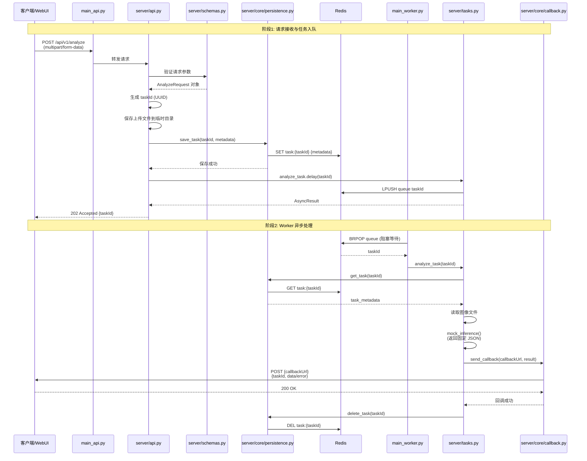

---

## 数据实体结构深化

### 实体关系图

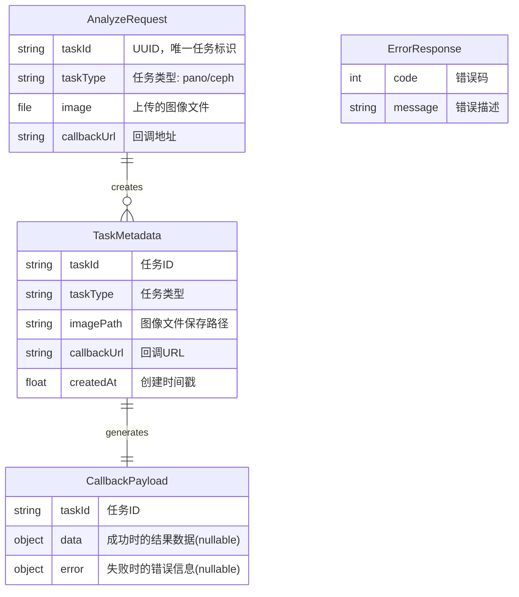

### 数据模型详细定义

#### 1. AnalyzeRequest（请求体）
```python
{
    "taskId": "550e8400-e29b-41d4-a716-446655440000",  # UUID v4
    "taskType": "pano",                                 # pano | ceph
    "callbackUrl": "http://client.com/callback"        # HTTP/HTTPS URL
}
# 附加: image 文件通过 multipart/form-data 上传
```

#### 2. TaskMetadata（Redis 存储）
```python
{
    "taskId": "550e8400-e29b-41d4-a716-446655440000",
    "taskType": "pano",
    "imagePath": "/tmp/uploads/550e8400-e29b-41d4-a716-446655440000.jpg",
    "callbackUrl": "http://client.com/callback",
    "createdAt": 1699876543.123
}
```

#### 3. CallbackPayload（回调请求体）
```python
# 成功情况
{
    "taskId": "550e8400-e29b-41d4-a716-446655440000",
    "data": {
        "teeth": [...],
        "diseases": [...]
    },
    "error": null
}

# 失败情况
{
    "taskId": "550e8400-e29b-41d4-a716-446655440000",
    "data": null,
    "error": {
        "code": 12001,
        "message": "AI inference failed"
    }
}
```

#### 4. 错误码定义（第一版核心错误码）
| 错误码 | 说明 | HTTP 状态码 |
|--------|------|-------------|
| 10001 | 请求参数验证失败 | 400 |
| 10002 | taskId 已存在 | 409 |
| 10003 | 不支持的图像格式 | 400 |
| 12001 | AI 推理执行失败 | 200 (回调) |
| 12002 | 图像文件读取失败 | 200 (回调) |

---

## 配置项

### config.yaml

```yaml
# Redis 配置
redis:
  host: "localhost"              # Redis 服务器地址
  port: 6379                     # Redis 端口
  db: 0                          # 数据库索引
  password: null                 # 密码（可选）

# Celery 配置
celery:
  broker_url: "redis://localhost:6379/0"           # 消息队列
  result_backend: "redis://localhost:6379/1"       # 结果后端

# API 配置
api:
  host: "0.0.0.0"               # 监听地址
  port: 18000                    # 监听端口
  upload_dir: "./tmp/uploads"   # 文件上传目录

# Worker 配置
worker:
  concurrency: 2                # 并发数
  loglevel: "info"              # 日志级别

# 回调配置
callback:
  timeout: 30                   # 超时时间（秒）
  
# 任务配置
task:
  result_ttl: 3600              # Redis 中任务元数据 TTL（秒）
```

---

## 涉及到的文件详解

### main_api.py

**a. 文件用途说明**

API 服务（P1）的启动入口，负责初始化 FastAPI 应用并启动 Uvicorn 服务器。

**b. 文件内类图**

无类定义（纯启动脚本）

**c. 函数/方法详解**

#### `main()`

- **用途**: 启动 API 服务
- **输入参数**: 无
- **输出数据结构**: 无返回值
- **实现流程**:

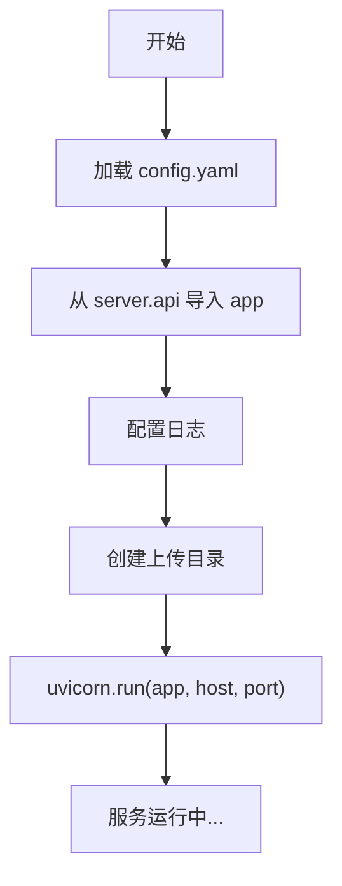

**实现要点**:
```python
# 伪代码
def main():
    config = load_config("config.yaml")
    
    # 确保上传目录存在
    os.makedirs(config.api.upload_dir, exist_ok=True)
    
    # 启动 Uvicorn
    uvicorn.run(
        "server.api:app",
        host=config.api.host,
        port=config.api.port,
        log_level="info"
    )
```

---

### main_worker.py

**a. 文件用途说明**

Worker 服务（P2）的启动入口，负责启动 Celery Worker 进程监听任务队列。

**b. 文件内类图**

无类定义（纯启动脚本）

**c. 函数/方法详解**

#### `main()`

- **用途**: 启动 Worker 服务
- **输入参数**: 无
- **输出数据结构**: 无返回值
- **实现流程**:

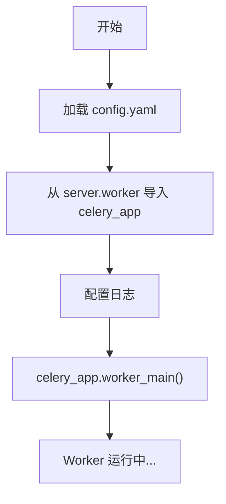

**实现要点**:
```python
# 伪代码
def main():
    config = load_config("config.yaml")
    
    # 启动 Celery Worker
    celery_app.worker_main([
        'worker',
        '--loglevel=info',
        '--concurrency=2'
    ])
```

---

### server/api.py

**a. 文件用途说明**

定义 FastAPI 应用和所有 HTTP 路由，负责请求验证、文件上传处理、任务入队。

**b. 文件内类图**

无类定义（函数式路由）

**c. 函数/方法详解**

#### `create_app() -> FastAPI`

- **用途**: 创建并配置 FastAPI 应用实例
- **输入参数**: 无
- **输出数据结构**: `FastAPI` 应用对象
- **实现流程**:

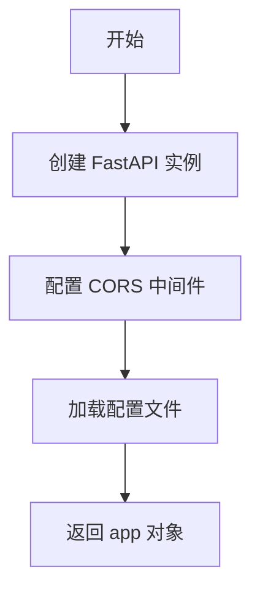

#### `POST /api/v1/analyze`

- **用途**: 接收推理请求，验证参数，将任务推入队列，立即返回 202
- **输入参数**:
  - `taskId: str` (Form) - 任务唯一标识
  - `taskType: str` (Form) - 任务类型（pano/ceph）
  - `callbackUrl: str` (Form) - 回调 URL
  - `image: UploadFile` (File) - 上传的图像文件
- **输出数据结构**:
```python
{
    "taskId": "550e8400-e29b-41d4-a716-446655440000",
    "status": "accepted",
    "message": "Task queued successfully"
}
```
- **实现流程**:

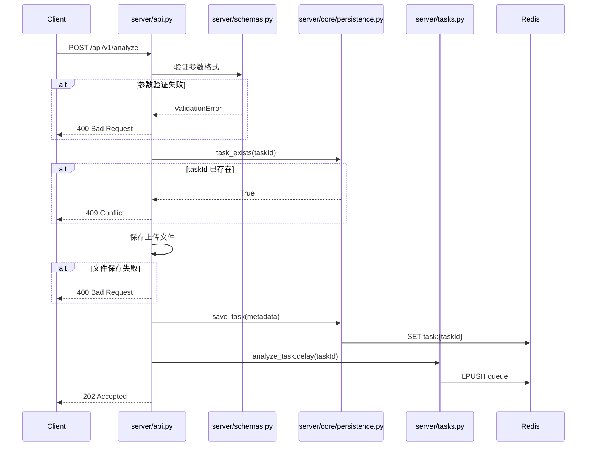

---

### server/schemas.py

**a. 文件用途说明**

定义所有 Pydantic 数据模型，用于请求验证和响应序列化。

**b. 文件内类图**

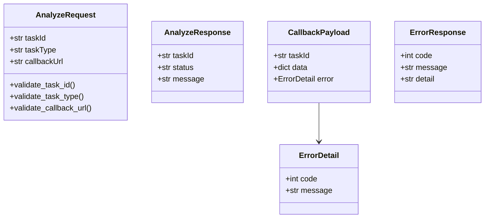

**c. 函数/方法详解**

#### `AnalyzeRequest.validate_task_id()`

- **用途**: 验证 taskId 是否为有效的 UUID v4 格式
- **输入参数**: `cls`, `v: str` - 待验证的 taskId
- **输出数据结构**: `str` - 验证通过的 taskId
- **实现流程**:

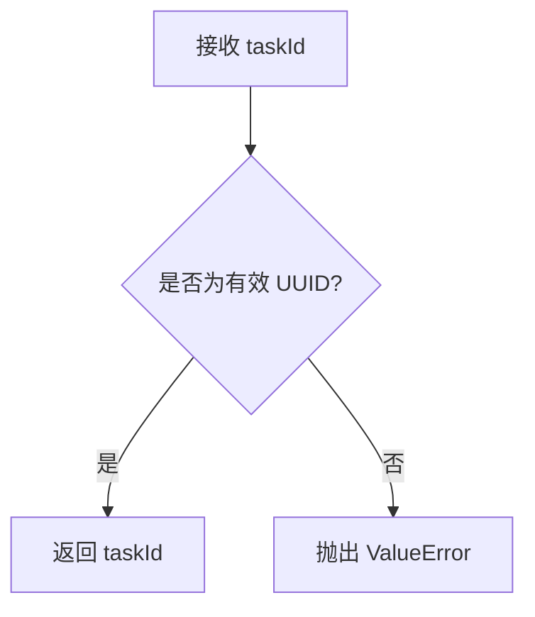

#### `AnalyzeRequest.validate_task_type()`

- **用途**: 验证 taskType 是否在允许的范围内
- **输入参数**: `cls`, `v: str` - 待验证的 taskType
- **输出数据结构**: `str` - 验证通过的 taskType
- **实现流程**:

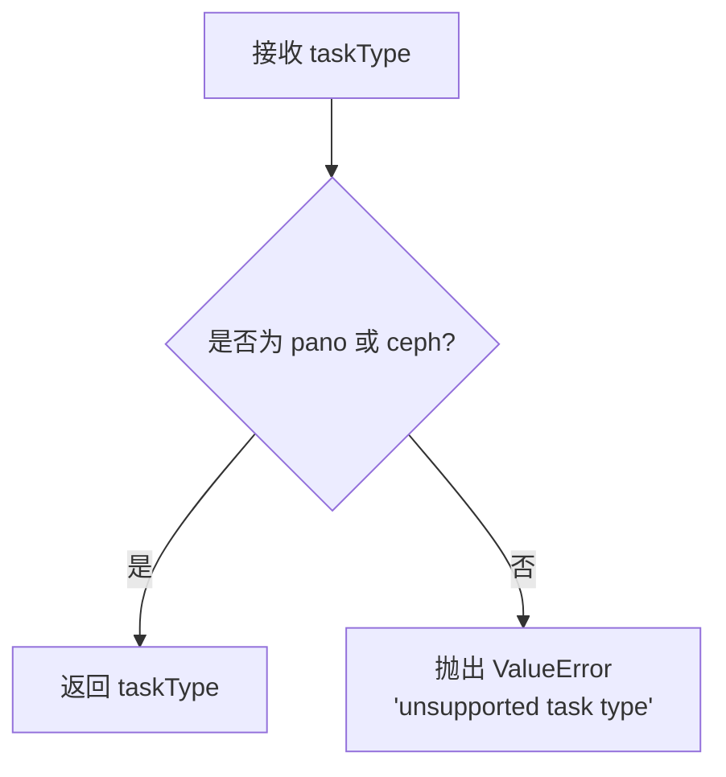

#### `AnalyzeRequest.validate_callback_url()`

- **用途**: 验证 callbackUrl 是否为有效的 HTTP/HTTPS URL
- **输入参数**: `cls`, `v: str` - 待验证的 URL
- **输出数据结构**: `str` - 验证通过的 URL
- **实现流程**:

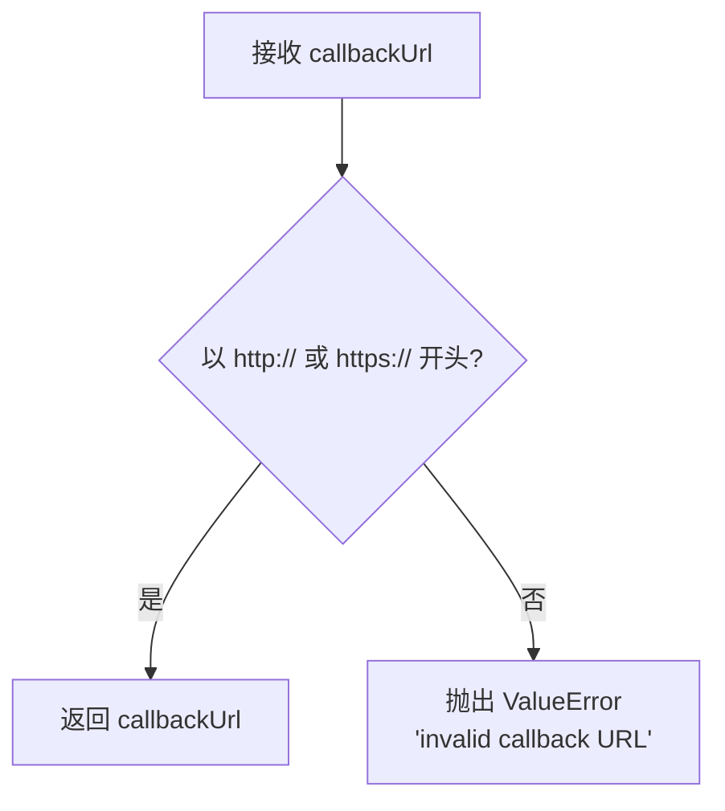

---

### server/worker.py

**a. 文件用途说明**

配置并创建 Celery 应用实例，定义消息队列和结果后端。

**b. 文件内类图**

无类定义（模块级配置）

**c. 函数/方法详解**

#### `create_celery_app() -> Celery`

- **用途**: 创建并配置 Celery 应用
- **输入参数**: 无
- **输出数据结构**: `Celery` 应用对象
- **实现流程**:

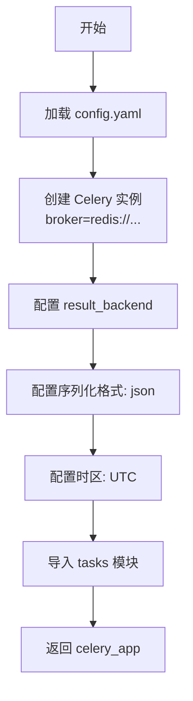

**实现要点**:
```python
# 伪代码
celery_app = Celery(
    'xray_inference',
    broker='redis://localhost:6379/0',
    backend='redis://localhost:6379/1'
)

celery_app.conf.update(
    task_serializer='json',
    result_serializer='json',
    accept_content=['json'],
    timezone='UTC',
    enable_utc=True
)
```

---

### server/tasks.py

**a. 文件用途说明**

定义 Celery 异步任务，负责从队列中获取任务、执行 AI 推理（第一版为 mock）、触发回调。

**b. 文件内类图**

无类定义（装饰器式任务函数）

**c. 函数/方法详解**

#### `@celery_app.task analyze_task(task_id: str)`

- **用途**: 异步执行推理任务的主函数
- **输入参数**: 
  - `task_id: str` - 任务 ID
- **输出数据结构**: 无返回值（通过回调发送结果）
- **实现流程**:

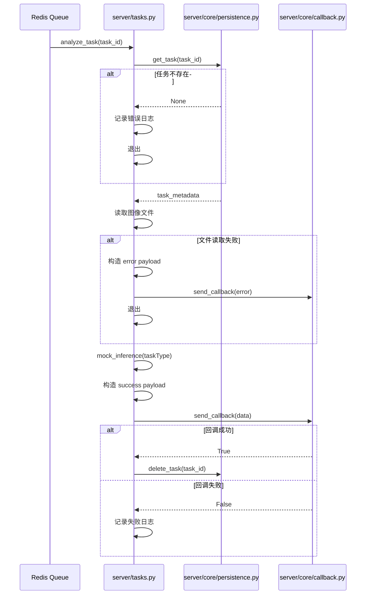

#### `mock_inference(task_type: str, image_path: str) -> dict`

- **用途**: 模拟 AI 推理，返回固定的示例 JSON（第一版实现）
- **输入参数**:
  - `task_type: str` - 任务类型（pano/ceph）
  - `image_path: str` - 图像文件路径（第一版未使用）
- **输出数据结构**:
```python
# pano 类型示例输出
{
    "teeth": [
        {"id": 11, "status": "healthy", "confidence": 0.95},
        {"id": 12, "status": "healthy", "confidence": 0.93}
    ],
    "diseases": [
        {
            "type": "caries",
            "location": "tooth_21",
            "severity": "mild",
            "confidence": 0.87
        }
    ]
}
```
- **实现流程**:

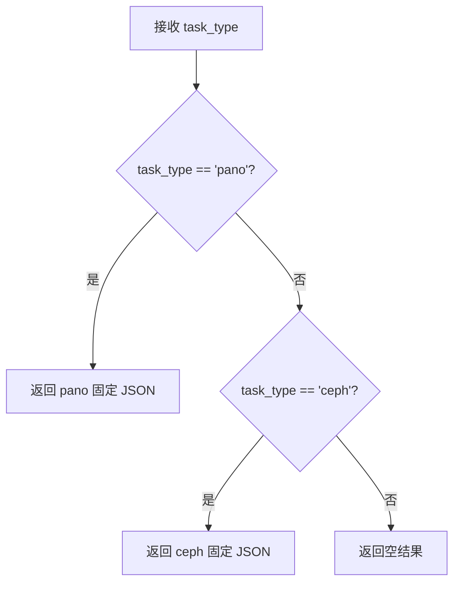

---

### server/core/persistence.py

**a. 文件用途说明**

封装 Redis 操作，负责任务元数据的增删查功能。

**b. 文件内类图**

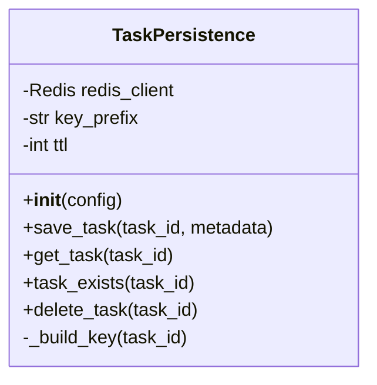

**c. 函数/方法详解**

#### `__init__(config: dict)`

- **用途**: 初始化 Redis 连接
- **输入参数**: 
  - `config: dict` - 配置字典（从 config.yaml 加载）
- **输出数据结构**: 无
- **实现流程**:

```mermaid
flowchart TD
    A[接收 config] --> B[提取 redis 配置项]
    B --> C["redis.Redis(host, port, db)"]
    C --> D[设置 key_prefix = 'task:'"]
    D --> E[设置 ttl = config.task.result_ttl]
```

#### `save_task(task_id: str, metadata: dict) -> bool`

- **用途**: 将任务元数据保存到 Redis
- **输入参数**:
  - `task_id: str` - 任务 ID
  - `metadata: dict` - 元数据字典
- **输出数据结构**: `bool` - 是否成功
- **实现流程**:

```mermaid
flowchart TD
    A[接收 task_id, metadata] --> B[构建 key: 'task:{task_id}']
    B --> C[序列化 metadata 为 JSON]
    C --> D["redis.setex(key, ttl, json_data)"]
    D --> E{操作成功?}
    E -->|是| F[返回 True]
    E -->|否| G[记录错误日志]
    G --> H[返回 False]
```

#### `get_task(task_id: str) -> dict | None`

- **用途**: 从 Redis 获取任务元数据
- **输入参数**:
  - `task_id: str` - 任务 ID
- **输出数据结构**: `dict | None` - 元数据字典或 None
- **实现流程**:

```mermaid
flowchart TD
    A[接收 task_id] --> B[构建 key: 'task:{task_id}']
    B --> C["redis.get(key)"]
    C --> D{key 存在?}
    D -->|是| E[反序列化 JSON]
    E --> F[返回 dict]
    D -->|否| G[返回 None]
```

#### `task_exists(task_id: str) -> bool`

- **用途**: 检查任务是否已存在
- **输入参数**:
  - `task_id: str` - 任务 ID
- **输出数据结构**: `bool` - 是否存在
- **实现流程**:

```mermaid
flowchart TD
    A[接收 task_id] --> B[构建 key: 'task:{task_id}']
    B --> C["redis.exists(key)"]
    C --> D[返回布尔值]
```

#### `delete_task(task_id: str) -> bool`

- **用途**: 删除任务元数据
- **输入参数**:
  - `task_id: str` - 任务 ID
- **输出数据结构**: `bool` - 是否成功
- **实现流程**:

```mermaid
flowchart TD
    A[接收 task_id] --> B[构建 key: 'task:{task_id}']
    B --> C["redis.delete(key)"]
    C --> D[返回删除数量 > 0]
```

---

### server/core/callback.py

**a. 文件用途说明**

封装 HTTP 回调逻辑，负责向客户端发送推理结果，包含超时控制（第一版不含重试）。

**b. 文件内类图**

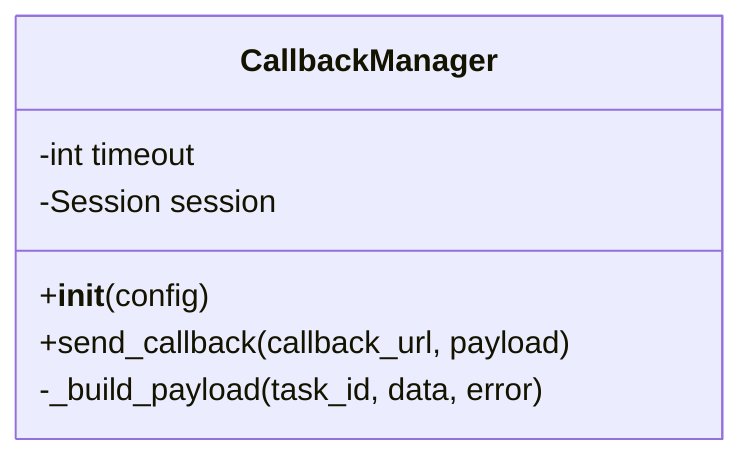

**c. 函数/方法详解**

#### `__init__(config: dict)`

- **用途**: 初始化 HTTP 客户端和配置
- **输入参数**:
  - `config: dict` - 配置字典
- **输出数据结构**: 无
- **实现流程**:

```mermaid
flowchart TD
    A[接收 config] --> B[提取 callback.timeout]
    B --> C[创建 requests.Session]
    C --> D[设置默认 headers]
```

#### `send_callback(callback_url: str, payload: dict) -> bool`

- **用途**: 向指定 URL 发送 POST 回调请求
- **输入参数**:
  - `callback_url: str` - 回调 URL
  - `payload: dict` - 回调负载（包含 taskId, data, error）
- **输出数据结构**: `bool` - 回调是否成功（HTTP 200）
- **实现流程**:

```mermaid
sequenceDiagram
    participant Task as server/tasks.py
    participant Callback as server/core/callback.py
    participant Client as 客户端

    Task->>Callback: send_callback(url, payload)
    Callback->>Callback: 序列化 payload 为 JSON
    Callback->>Client: POST url (timeout=30s)
    
    alt 响应成功 (200)
        Client-->>Callback: 200 OK
        Callback->>Callback: 记录成功日志
        Callback-->>Task: return True
    else 响应失败 (4xx/5xx)
        Client-->>Callback: 4xx/5xx
        Callback->>Callback: 记录失败日志
        Callback-->>Task: return False
    else 超时
        Client-->>Callback: Timeout
        Callback->>Callback: 记录超时日志
        Callback-->>Task: return False
    else 连接错误
        Client-->>Callback: ConnectionError
        Callback->>Callback: 记录错误日志
        Callback-->>Task: return False
    end
```

**实现要点**:
```python
# 伪代码
def send_callback(callback_url: str, payload: dict) -> bool:
    try:
        response = self.session.post(
            callback_url,
            json=payload,
            timeout=self.timeout
        )
        
        if response.status_code == 200:
            logger.info(f"Callback success: {callback_url}")
            return True
        else:
            logger.error(f"Callback failed: {response.status_code}")
            return False
            
    except requests.Timeout:
        logger.error(f"Callback timeout: {callback_url}")
        return False
    except requests.RequestException as e:
        logger.error(f"Callback error: {e}")
        return False
```

---

## 迭代演进依据

### 第一版实现范围（本文档）
1. ✅ 核心异步架构（P1 + P2 + Redis）
2. ✅ 文件上传和临时存储
3. ✅ Mock AI 推理（固定 JSON 输出）
4. ✅ 简化回调（单次尝试，30秒超时）
5. ✅ 核心错误码（5 个）

### 第二版迭代方向
1. **集成真实 AI 模型**
   - 修改点：`server/tasks.py` 的 `mock_inference()` → 调用 `pipelines.pano.PanoPipeline`
   - 新增依赖：`pipelines/` 目录下的模型加载和推理逻辑
   - 向后兼容：保持相同的输入输出接口

2. **增强回调机制**
   - 修改点：`server/core/callback.py` 添加重试逻辑
   - 新增配置：`callback.max_retries`, `callback.retry_delay`
   - 向后兼容：现有回调接口不变

3. **扩展错误码体系**
   - 修改点：`server/schemas.py` 添加更多 `ErrorDetail` 类型
   - 新增错误码：10004-10010（客户端），12003-12010（服务端）
   - 向后兼容：现有错误码保持不变

4. **任务状态追踪**
   - 修改点：`server/core/persistence.py` 扩展 `TaskMetadata` 结构
   - 新增字段：`status`, `startedAt`, `completedAt`
   - 新增接口：`update_task_status(task_id, status)`
   - 向后兼容：通过字段默认值实现

5. **添加查询接口**
   - 新增路由：`GET /api/v1/task/{taskId}` 查询任务状态
   - 修改点：`server/api.py` 添加新路由
   - 依赖：第4点的状态追踪功能

### 架构扩展点

**扩展点1: 支持 imageUrl 方式**
```python
# server/api.py 修改
@app.post("/api/v1/analyze")
async def analyze(
    taskId: str = Form(...),
    taskType: str = Form(...),
    callbackUrl: str = Form(...),
    image: Optional[UploadFile] = File(None),  # 可选
    imageUrl: Optional[str] = Form(None)       # 新增
):
    # 优先使用 image，其次使用 imageUrl
    if image:
        # 现有逻辑
    elif imageUrl:
        # 下载图像逻辑
    else:
        raise ValueError("Must provide image or imageUrl")
```

**扩展点2: 支持批量推理**
```python
# 新增路由
@app.post("/api/v1/batch")
async def batch_analyze(
    tasks: List[AnalyzeRequest]
):
    # 批量入队
    for task in tasks:
        analyze_task.delay(task.taskId)
    return {"count": len(tasks)}
```

**扩展点3: 监控和健康检查**
```python
# 新增路由
@app.get("/health")
async def health_check():
    return {
        "api": "healthy",
        "redis": redis_client.ping(),
        "worker": check_celery_worker()
    }
```

### 数据库迁移路径（未来考虑）

当任务量增大后，可考虑从 Redis 迁移到 PostgreSQL：
- **迁移点**: `server/core/persistence.py`
- **策略**: 实现 `DatabasePersistence` 类，与 `RedisPersistence` 共享相同接口
- **双写方案**: 过渡期同时写入 Redis 和 DB，确保平滑迁移

---

## 附录: 启动命令速查

```bash
# 1. 启动 Redis
redis-server

# 2. 启动 API 服务 (P1)
python main_api.py

# 3. 启动 Worker 服务 (P2)
python main_worker.py

# 4. 测试请求
curl -X POST http://localhost:8000/api/v1/analyze \
  -F "taskId=550e8400-e29b-41d4-a716-446655440000" \
  -F "taskType=pano" \
  -F "callbackUrl=http://localhost:5000/callback" \
  -F "image=@test.jpg"
```

---

**文档版本**: v1.0  
**最后更新**: 2024-11-13  
**目标读者**: Cursor AI、后端开发工程师

---
---

# X-Ray 推理服务详细设计文档 v2 - 接口协议升级

## 版本信息

- **版本**: v2.0
- **创建日期**: 2024-11-16
- **基于版本**: v1.0
- **变更类型**: 接口协议升级，符合外部接口规范
- **目标读者**: Cursor AI、后端开发工程师

---

## v2 版本变更概述

### 变更目标
1. **接口协议对齐**：使API接口符合《接口定义.md》规范
2. **请求方式调整**：从 multipart/form-data 改为 JSON 请求体
3. **参数结构调整**：移除客户端传入的 taskId，改为服务端生成
4. **响应格式完善**：回调数据包含完整的 metadata 和 requestParameters
5. **数据格式标准化**：返回 data 格式符合 example_pano_result.json 和 example_ceph_result.json

### v1 与 v2 核心差异对比

| 维度 | v1.0 | v2.0 |
|------|------|------|
| **请求格式** | multipart/form-data | application/json |
| **taskId来源** | 客户端提供 | 服务端生成（UUID v4） |
| **图像传递** | 直接上传文件 | 通过 imageUrl 下载 |
| **必需参数** | taskId, taskType, image, callbackUrl | taskType, imageUrl, callbackUrl |
| **可选参数** | 无 | metadata, patientInfo |
| **202响应字段** | taskId, status, message | taskId, status, submittedAt, metadata |
| **回调payload** | taskId, data, error | taskId, status, timestamp, metadata, requestParameters, data, error |
| **patientInfo** | 不支持 | 支持（侧位片必需 gender 和 DentalAgeStage） |

---

## 受影响的现有模块分析

### 1. server/schemas.py（重构）
**变更类型**: 重构数据模型

**变更依据**:
- 接口定义要求 taskType 使用 "panoramic" 和 "cephalometric"（v1 使用 "pano" 和 "ceph"）
- 新增 patientInfo 结构（gender, DentalAgeStage）
- 新增 metadata 字段支持客户端自定义数据
- 移除客户端传入的 taskId，改为服务端生成

**影响范围**: 
- `AnalyzeRequest` 类需要重构
- 新增 `PatientInfo` 类
- `AnalyzeResponse` 需要添加 submittedAt 字段
- `CallbackPayload` 需要添加 status、timestamp、requestParameters 字段

### 2. server/api.py（中度修改）
**变更类型**: 修改路由参数和逻辑

**变更依据**:
- 请求格式从 Form + File 改为纯 JSON
- 需要新增图像下载逻辑（从 imageUrl 下载）
- 需要服务端生成 taskId
- 需要针对 taskType="cephalometric" 验证 patientInfo

**影响范围**:
- `POST /api/v1/analyze` 路由参数签名
- 文件保存逻辑（从直接保存改为下载后保存）
- 参数验证逻辑（新增 patientInfo 验证）

### 3. server/tasks.py（轻度修改）
**变更类型**: 修改回调数据结构

**变更依据**:
- 回调 payload 需要包含完整的 metadata 和 requestParameters
- data 部分使用 example JSON 占位（从文件加载）

**影响范围**:
- `analyze_task` 函数中的回调 payload 构造逻辑
- 需要从 Redis 中获取更多元数据字段

### 4. server/core/persistence.py（轻度修改）
**变更类型**: 扩展元数据字段

**变更依据**:
- 需要存储 metadata（客户端传入）
- 需要存储 requestParameters（原始请求参数）
- 需要存储 patientInfo（侧位片需要）

**影响范围**:
- `TaskMetadata` 结构扩展（非类，只是存储的字典结构）

### 5. 新增文件: server/utils/image_downloader.py
**变更类型**: 新增模块

**变更依据**:
- 需要从 imageUrl 下载图像文件
- 需要验证图像格式和大小
- 需要处理下载超时和错误

---

## 数据实体结构深化 v2

### 实体关系图

```mermaid
erDiagram
    AnalyzeRequest ||--o| PatientInfo : "contains (optional)"
    AnalyzeRequest ||--o{ TaskMetadata : creates
    TaskMetadata ||--|| CallbackPayload : generates
    CallbackPayload ||--o| ErrorDetail : "contains (on failure)"
    
    AnalyzeRequest {
        string taskType "任务类型: panoramic/cephalometric"
        string imageUrl "图像URL"
        string callbackUrl "回调地址"
        object metadata "客户端自定义数据(optional)"
        object patientInfo "患者信息(optional, ceph必需)"
    }
    
    PatientInfo {
        string gender "性别: Male/Female"
        string DentalAgeStage "牙期: Permanent/Mixed"
    }
    
    TaskMetadata {
        string taskId "服务端生成的UUID"
        string taskType "任务类型"
        string imagePath "图像文件保存路径"
        string imageUrl "原始imageUrl"
        string callbackUrl "回调URL"
        object metadata "客户端metadata"
        object patientInfo "患者信息"
        float submittedAt "提交时间戳"
    }
    
    CallbackPayload {
        string taskId "任务ID"
        string status "状态: SUCCESS/FAILURE"
        string timestamp "完成时间ISO8601"
        object metadata "客户端metadata"
        object requestParameters "原始请求参数"
        object data "成功时的结果数据(nullable)"
        object error "失败时的错误信息(nullable)"
    }
    
    ErrorDetail {
        int code "错误码"
        string message "开发者调试信息"
        string displayMessage "用户友好提示"
    }
```

### 数据模型详细定义 v2

#### 1. AnalyzeRequest（请求体 v2）
```python
# POST /api/v1/analyze
# Content-Type: application/json
{
    "taskType": "cephalometric",                         # panoramic | cephalometric (必填)
    "imageUrl": "https://example.com/images/xray.jpg",  # HTTP/HTTPS URL (必填)
    "callbackUrl": "https://api.client.com/callback",   # HTTP/HTTPS URL (必填)
    "patientInfo": {                                     # 可选（cephalometric时必需）
        "gender": "Male",                                # Male | Female
        "DentalAgeStage": "Permanent"                    # Permanent | Mixed
    },
    "metadata": {                                        # 可选（客户端自定义）
        "patientId": "P-12345",
        "orderId": "O-67890"
    }
}
```

#### 2. AnalyzeResponse（202 响应 v2）
```python
# HTTP 202 Accepted
{
    "taskId": "550e8400-e29b-41d4-a716-446655440000",  # 服务端生成的UUID v4
    "status": "QUEUED",                                 # 固定值
    "submittedAt": "2025-11-16T14:30:00Z",             # ISO8601格式
    "metadata": {                                       # 回显客户端metadata
        "patientId": "P-12345",
        "orderId": "O-67890"
    }
}
```

#### 3. TaskMetadata（Redis 存储 v2）
```python
{
    "taskId": "550e8400-e29b-41d4-a716-446655440000",
    "taskType": "cephalometric",
    "imagePath": "/tmp/uploads/550e8400-e29b-41d4-a716-446655440000.jpg",
    "imageUrl": "https://example.com/images/xray.jpg",
    "callbackUrl": "https://api.client.com/callback",
    "metadata": {
        "patientId": "P-12345",
        "orderId": "O-67890"
    },
    "patientInfo": {
        "gender": "Male",
        "DentalAgeStage": "Permanent"
    },
    "submittedAt": 1700147400.123  # Unix时间戳
}
```

#### 4. CallbackPayload（回调请求体 v2）
```python
# 成功情况
{
    "taskId": "550e8400-e29b-41d4-a716-446655440000",
    "status": "SUCCESS",
    "timestamp": "2025-11-16T14:35:10Z",
    "metadata": {
        "patientId": "P-12345",
        "orderId": "O-67890"
    },
    "requestParameters": {
        "taskType": "cephalometric",
        "imageUrl": "https://example.com/images/xray.jpg"
    },
    "data": {
        # 从 example_ceph_result.json 或 example_pano_result.json 的 data 字段加载
    },
    "error": null
}

# 失败情况（v2暂不实现）
{
    "taskId": "550e8400-e29b-41d4-a716-446655440000",
    "status": "FAILURE",
    "timestamp": "2025-11-16T14:35:10Z",
    "metadata": { ... },
    "requestParameters": { ... },
    "data": null,
    "error": {
        "code": 12001,
        "message": "AI inference failed",
        "displayMessage": "AI分析失败"
    }
}
```

---

## 整体逻辑和交互时序图 v2

### 核心工作流程（与v1对比）

```mermaid
sequenceDiagram
    participant Client as 客户端
    participant API as server/api.py
    participant Schema as server/schemas.py
    participant Downloader as server/utils/image_downloader.py
    participant Persist as server/core/persistence.py
    participant Redis as Redis
    participant Worker as main_worker.py
    participant Task as server/tasks.py
    participant Callback as server/core/callback.py

    Note over Client,Callback: 阶段1: 请求接收与任务入队（v2变更）
    Client->>API: POST /api/v1/analyze<br/>(JSON: taskType, imageUrl, callbackUrl, ...)
    API->>API: 生成 taskId = uuid4()
    API->>Schema: 验证请求参数<br/>(包括taskType, patientInfo验证)
    Schema-->>API: AnalyzeRequest 对象
    
    alt taskType == "cephalometric"
        API->>API: 验证 patientInfo 存在
    end
    
    API->>Downloader: download_image(imageUrl)
    Downloader-->>API: 本地文件路径
    API->>API: 保存到 upload_dir/{taskId}.jpg
    
    API->>Persist: save_task(taskId, metadata_v2)
    Note right of Persist: metadata_v2 包含:<br/>metadata, patientInfo,<br/>imageUrl, requestParameters
    Persist->>Redis: SET task:{taskId} {metadata_v2}
    Persist-->>API: 保存成功
    
    API->>Task: analyze_task.delay(taskId)
    Task->>Redis: LPUSH queue taskId
    Task-->>API: AsyncResult
    
    API-->>Client: 202 Accepted<br/>{taskId, status:"QUEUED", submittedAt, metadata}

    Note over Client,Callback: 阶段2: Worker 异步处理（v2变更）
    Worker->>Redis: BRPOP queue
    Redis-->>Worker: taskId
    Worker->>Task: analyze_task(taskId)
    Task->>Persist: get_task(taskId)
    Persist->>Redis: GET task:{taskId}
    Persist-->>Task: task_metadata_v2
    
    Task->>Task: 读取图像文件
    Task->>Task: load_mock_data(taskType)<br/>(从example JSON加载)
    Task->>Task: 构造 CallbackPayload v2<br/>(包含status, timestamp,<br/>metadata, requestParameters)
    
    Task->>Callback: send_callback(callbackUrl, payload_v2)
    Callback->>Client: POST {callbackUrl}<br/>{完整的v2 payload}
    Client-->>Callback: 200 OK
    Callback-->>Task: 回调成功
    Task->>Persist: delete_task(taskId)
    Persist->>Redis: DEL task:{taskId}
```

---

## 涉及到的文件详解 v2

### server/schemas.py（重构）

**a. 文件用途说明**

定义符合接口规范 v2 的 Pydantic 数据模型，用于请求验证和响应序列化。

**b. 文件内类图**

```mermaid
classDiagram
    class PatientInfo {
        +str gender
        +str DentalAgeStage
        +validate_gender()
        +validate_dental_age_stage()
    }
    
    class AnalyzeRequest {
        +str taskType
        +str imageUrl
        +str callbackUrl
        +dict metadata
        +PatientInfo patientInfo
        +validate_task_type()
        +validate_image_url()
        +validate_callback_url()
        +validate_patient_info_required()
    }
    
    class AnalyzeResponse {
        +str taskId
        +str status
        +str submittedAt
        +dict metadata
    }
    
    class RequestParameters {
        +str taskType
        +str imageUrl
    }
    
    class CallbackPayload {
        +str taskId
        +str status
        +str timestamp
        +dict metadata
        +RequestParameters requestParameters
        +dict data
        +ErrorDetail error
    }
    
    class ErrorDetail {
        +int code
        +str message
        +str displayMessage
    }
    
    AnalyzeRequest --> PatientInfo
    CallbackPayload --> RequestParameters
    CallbackPayload --> ErrorDetail
```

**c. 函数/方法详解**

#### `PatientInfo` 类

新增类，用于验证患者信息（侧位片必需）。

##### 字段说明
- `gender: str` - 性别，可选值: "Male", "Female"
- `DentalAgeStage: str` - 牙期，可选值: "Permanent"（恒牙期）, "Mixed"（替牙期）

##### `validate_gender()` 验证器
- **用途**: 验证性别字段的合法性
- **输入参数**: `cls`, `v: Optional[str]` - 待验证的性别
- **输出数据结构**: `str` - 验证通过的性别
- **实现流程**:

```mermaid
flowchart TD
    A[接收 gender] --> B{gender in ['Male', 'Female']?}
    B -->|是| C[返回 gender]
    B -->|否| D["抛出 ValueError<br/>'gender must be Male or Female'"]
```

##### `validate_dental_age_stage()` 验证器
- **用途**: 验证牙期字段的合法性
- **输入参数**: `cls`, `v: Optional[str]` - 待验证的牙期
- **输出数据结构**: `str` - 验证通过的牙期
- **实现流程**:

```mermaid
flowchart TD
    A[接收 DentalAgeStage] --> B{DentalAgeStage in ['Permanent', 'Mixed']?}
    B -->|是| C[返回 DentalAgeStage]
    B -->|否| D["抛出 ValueError<br/>'DentalAgeStage must be Permanent or Mixed'"]
```

#### `AnalyzeRequest` 类（重构）

##### 字段说明（变更）
- `taskType: str` - 任务类型，可选值: "panoramic", "cephalometric"（v1为 "pano", "ceph"）
- `imageUrl: str` - 图像URL（新增，替代v1的文件上传）
- `callbackUrl: str` - 回调URL
- `metadata: Optional[Dict[str, Any]]` - 客户端自定义元数据（新增）
- `patientInfo: Optional[PatientInfo]` - 患者信息（新增）

##### `validate_task_type()` 验证器（修改）
- **用途**: 验证 taskType 是否在允许的范围内
- **输入参数**: `cls`, `v: str` - 待验证的 taskType
- **输出数据结构**: `str` - 验证通过的 taskType
- **实现流程**:

```mermaid
flowchart TD
    A[接收 taskType] --> B{是否为 'panoramic' 或 'cephalometric'?}
    B -->|是| C[返回 taskType]
    B -->|否| D["抛出 ValueError<br/>'taskType must be panoramic or cephalometric'"]
```

**实现要点**:
```python
@field_validator('taskType')
@classmethod
def validate_task_type(cls, v: str) -> str:
    if v not in ['panoramic', 'cephalometric']:
        raise ValueError("taskType must be either 'panoramic' or 'cephalometric'")
    return v
```

##### `validate_image_url()` 验证器（新增）
- **用途**: 验证 imageUrl 是否为有效的 HTTP/HTTPS URL
- **输入参数**: `cls`, `v: str` - 待验证的 URL
- **输出数据结构**: `str` - 验证通过的 URL
- **实现流程**:

```mermaid
flowchart TD
    A[接收 imageUrl] --> B{以 http:// 或 https:// 开头?}
    B -->|是| C[返回 imageUrl]
    B -->|否| D["抛出 ValueError<br/>'imageUrl must be a valid HTTP/HTTPS URL'"]
```

##### `model_validator(mode='after')` 跨字段验证器（新增）
- **用途**: 验证侧位片任务必须提供 patientInfo
- **输入参数**: `self` - 模型实例
- **输出数据结构**: `self` - 验证通过的模型实例
- **实现流程**:

```mermaid
flowchart TD
    A[模型验证完成后] --> B{taskType == 'cephalometric'?}
    B -->|是| C{patientInfo 存在?}
    B -->|否| G[返回 self]
    C -->|是| D{gender 和 DentalAgeStage 都存在?}
    C -->|否| E["抛出 ValueError<br/>'patientInfo is required for cephalometric'"]
    D -->|是| F[返回 self]
    D -->|否| E
```

**实现要点**:
```python
@model_validator(mode='after')
def validate_patient_info_required(self):
    if self.taskType == 'cephalometric':
        if not self.patientInfo:
            raise ValueError("patientInfo is required when taskType is 'cephalometric'")
        if not self.patientInfo.gender or not self.patientInfo.DentalAgeStage:
            raise ValueError("gender and DentalAgeStage are required in patientInfo for cephalometric tasks")
    return self
```

#### `AnalyzeResponse` 类（修改）

##### 字段说明（变更）
- `taskId: str` - 任务ID（保留）
- `status: str` - 状态，固定值 "QUEUED"（保留）
- `submittedAt: str` - 提交时间，ISO8601格式（新增）
- `metadata: Optional[Dict[str, Any]]` - 回显客户端metadata（新增）
- ~~`message: str`~~（移除）

#### `RequestParameters` 类（新增）

用于在回调中记录原始请求参数。

##### 字段说明
- `taskType: str` - 任务类型
- `imageUrl: str` - 原始图像URL

#### `CallbackPayload` 类（重构）

##### 字段说明（变更）
- `taskId: str` - 任务ID（保留）
- `status: str` - 状态，"SUCCESS" 或 "FAILURE"（新增）
- `timestamp: str` - 完成时间，ISO8601格式（新增）
- `metadata: Dict[str, Any]` - 客户端metadata（新增）
- `requestParameters: RequestParameters` - 原始请求参数（新增）
- `data: Optional[Dict[str, Any]]` - 成功时的结果数据（保留）
- `error: Optional[ErrorDetail]` - 失败时的错误信息（保留）

---

### server/utils/image_downloader.py（新增）

**a. 文件用途说明**

负责从 imageUrl 下载图像文件到本地，包含格式验证、大小限制、超时控制。

**b. 文件内类图**

```mermaid
classDiagram
    class ImageDownloader {
        -Session session
        -int timeout
        -int max_size_mb
        -list allowed_extensions
        +__init__(config)
        +download_image(image_url, save_path)
        -_validate_content_type(content_type)
        -_validate_file_size(content_length)
    }
```

**c. 函数/方法详解**

#### `__init__(config: dict)`

- **用途**: 初始化 HTTP 客户端和下载配置
- **输入参数**:
  - `config: dict` - 配置字典
- **输出数据结构**: 无
- **实现流程**:

```mermaid
flowchart TD
    A[接收 config] --> B[创建 requests.Session]
    B --> C["设置 timeout = 30秒"]
    C --> D["设置 max_size_mb = 50MB"]
    D --> E["设置 allowed_extensions<br/>['.jpg', '.jpeg', '.png', '.dcm']"]
```

#### `download_image(image_url: str, save_path: str) -> bool`

- **用途**: 从 URL 下载图像文件并保存到指定路径
- **输入参数**:
  - `image_url: str` - 图像URL
  - `save_path: str` - 保存路径
- **输出数据结构**: `bool` - 是否成功
- **实现流程**:

```mermaid
sequenceDiagram
    participant Caller as API
    participant Downloader as ImageDownloader
    participant Remote as 远程服务器
    participant FS as 文件系统

    Caller->>Downloader: download_image(url, path)
    Downloader->>Remote: GET url (timeout=30s)
    
    alt 连接失败/超时
        Remote-->>Downloader: Timeout/ConnectionError
        Downloader->>Downloader: 记录错误日志
        Downloader-->>Caller: raise DownloadError
    end
    
    Remote-->>Downloader: Response Headers
    Downloader->>Downloader: _validate_content_type()
    
    alt Content-Type 不合法
        Downloader-->>Caller: raise ValueError<br/>"Unsupported image format"
    end
    
    Downloader->>Downloader: _validate_file_size()
    
    alt 文件过大
        Downloader-->>Caller: raise ValueError<br/>"File size exceeds limit"
    end
    
    Downloader->>Remote: 下载文件内容（流式）
    Remote-->>Downloader: 文件二进制流
    Downloader->>FS: 写入 save_path
    FS-->>Downloader: 写入成功
    Downloader->>Downloader: 记录成功日志
    Downloader-->>Caller: return True
```

**实现要点**:
```python
def download_image(self, image_url: str, save_path: str) -> bool:
    """
    从URL下载图像文件
    
    Raises:
        ValueError: 图像格式不支持或文件过大
        requests.exceptions.RequestException: 网络错误
    """
    try:
        # 发送 HEAD 请求检查文件类型和大小
        head_response = self.session.head(image_url, timeout=self.timeout, allow_redirects=True)
        head_response.raise_for_status()
        
        # 验证 Content-Type
        content_type = head_response.headers.get('Content-Type', '')
        self._validate_content_type(content_type)
        
        # 验证文件大小
        content_length = head_response.headers.get('Content-Length')
        if content_length:
            self._validate_file_size(int(content_length))
        
        # 下载文件（流式）
        response = self.session.get(image_url, timeout=self.timeout, stream=True)
        response.raise_for_status()
        
        # 保存到本地
        with open(save_path, 'wb') as f:
            for chunk in response.iter_content(chunk_size=8192):
                f.write(chunk)
        
        logger.info(f"Image downloaded successfully: {image_url} -> {save_path}")
        return True
        
    except requests.Timeout:
        logger.error(f"Image download timeout: {image_url}")
        raise
    except requests.RequestException as e:
        logger.error(f"Image download failed: {image_url}, {e}")
        raise
```

#### `_validate_content_type(content_type: str) -> None`

- **用途**: 验证 HTTP Content-Type 是否为图像类型
- **输入参数**:
  - `content_type: str` - Content-Type 头
- **输出数据结构**: 无（验证失败抛出异常）
- **实现流程**:

```mermaid
flowchart TD
    A[接收 content_type] --> B{以 'image/' 开头?}
    B -->|是| C[验证通过]
    B -->|否| D["抛出 ValueError<br/>'Unsupported image format'"]
```

#### `_validate_file_size(content_length: int) -> None`

- **用途**: 验证文件大小是否在限制内
- **输入参数**:
  - `content_length: int` - Content-Length 字节数
- **输出数据结构**: 无（验证失败抛出异常）
- **实现流程**:

```mermaid
flowchart TD
    A[接收 content_length] --> B{content_length > max_size_mb * 1024 * 1024?}
    B -->|否| C[验证通过]
    B -->|是| D["抛出 ValueError<br/>'File size exceeds 50MB limit'"]
```

---

### server/api.py（修改）

**a. 文件用途说明**

定义 FastAPI 应用和所有 HTTP 路由，负责请求验证、图像下载、任务入队（v2协议）。

**b. 修改点说明**

#### `POST /api/v1/analyze` 路由（重构）

##### 变更内容
1. **请求参数**：从 Form + File 改为纯 JSON
2. **taskId生成**：由服务端生成 UUID v4
3. **图像获取**：从 imageUrl 下载而非直接上传
4. **参数验证**：新增 patientInfo 验证（针对 cephalometric）
5. **响应格式**：返回 submittedAt 和 metadata

##### 路由签名（变更）
```python
# v1.0
@app.post("/api/v1/analyze", response_model=AnalyzeResponse, status_code=202)
async def analyze(
    taskId: str = Form(...),
    taskType: str = Form(...),
    callbackUrl: str = Form(...),
    image: UploadFile = File(...)
):

# v2.0
@app.post("/api/v1/analyze", response_model=AnalyzeResponse, status_code=202)
async def analyze(request: AnalyzeRequest):
```

##### 实现流程（v2）

```mermaid
sequenceDiagram
    participant Client
    participant API as server/api.py
    participant Schema as AnalyzeRequest
    participant UUID as uuid.uuid4()
    participant Downloader as ImageDownloader
    participant Persist as TaskPersistence
    participant Task as analyze_task

    Client->>API: POST /api/v1/analyze<br/>(JSON body)
    API->>Schema: 验证请求参数
    
    alt 参数验证失败
        Schema-->>API: ValidationError
        API-->>Client: 400 Bad Request<br/>(code: 10001)
    end
    
    alt taskType == "cephalometric" && !patientInfo
        Schema-->>API: ValidationError
        API-->>Client: 400 Bad Request<br/>(code: 10001, message: "patientInfo required")
    end
    
    Schema-->>API: AnalyzeRequest 对象
    
    API->>UUID: 生成 taskId
    UUID-->>API: taskId (UUID v4)
    
    API->>API: 构建文件路径<br/>{upload_dir}/{taskId}.jpg
    
    API->>Downloader: download_image(imageUrl, file_path)
    
    alt 下载失败
        Downloader-->>API: Exception
        API-->>Client: 400 Bad Request<br/>(code: 10004, message: "Image download failed")
    end
    
    Downloader-->>API: 下载成功
    
    API->>API: 构造 metadata_v2
    Note right of API: 包含: taskType, imageUrl,<br/>callbackUrl, imagePath,<br/>metadata, patientInfo,<br/>submittedAt
    
    API->>Persist: save_task(taskId, metadata_v2)
    Persist-->>API: True
    
    API->>Task: analyze_task.delay(taskId)
    Task-->>API: AsyncResult
    
    API->>API: 构造响应
    Note right of API: taskId, status: "QUEUED",<br/>submittedAt (ISO8601),<br/>metadata
    
    API-->>Client: 202 Accepted
```

##### 实现要点（伪代码）
```python
@app.post("/api/v1/analyze", response_model=AnalyzeResponse, status_code=202)
async def analyze(request: AnalyzeRequest):
    """
    接收推理请求（v2协议）
    """
    # 1. 生成 taskId（服务端生成）
    task_id = str(uuid.uuid4())
    
    # 2. 确定文件扩展名（默认 .jpg）
    file_ext = '.jpg'
    image_filename = f"{task_id}{file_ext}"
    image_path = os.path.join(_upload_dir, image_filename)
    
    # 3. 下载图像文件
    try:
        _image_downloader.download_image(request.imageUrl, image_path)
    except Exception as e:
        logger.error(f"Image download failed: {e}")
        raise HTTPException(
            status_code=400,
            detail=ErrorResponse(
                code=10004,
                message="Image download failed",
                detail=str(e)
            ).model_dump()
        )
    
    # 4. 构造任务元数据 v2
    submitted_at = time.time()
    metadata_v2 = {
        "taskId": task_id,
        "taskType": request.taskType,
        "imageUrl": request.imageUrl,
        "imagePath": image_path,
        "callbackUrl": request.callbackUrl,
        "metadata": request.metadata or {},
        "patientInfo": request.patientInfo.model_dump() if request.patientInfo else None,
        "submittedAt": submitted_at
    }
    
    # 5. 保存到 Redis
    success = _persistence.save_task(task_id, metadata_v2)
    if not success:
        # 清理文件
        if os.path.exists(image_path):
            os.remove(image_path)
        raise HTTPException(status_code=500, detail=...)
    
    # 6. 异步任务入队
    try:
        task_result = analyze_task.delay(task_id)
        logger.info(f"Task queued: {task_id}")
    except Exception as e:
        # 清理元数据和文件
        _persistence.delete_task(task_id)
        if os.path.exists(image_path):
            os.remove(image_path)
        raise HTTPException(status_code=500, detail=...)
    
    # 7. 返回 202 响应 v2
    return AnalyzeResponse(
        taskId=task_id,
        status="QUEUED",
        submittedAt=datetime.fromtimestamp(submitted_at, tz=timezone.utc).isoformat(),
        metadata=request.metadata
    )
```

---

### server/tasks.py（修改）

**a. 修改点说明**

#### `load_mock_data(task_type: str) -> dict` 函数（新增）

- **用途**: 从 example JSON 文件加载 mock 数据
- **输入参数**:
  - `task_type: str` - 任务类型（panoramic/cephalometric）
- **输出数据结构**: `dict` - data 字段的完整 JSON
- **实现流程**:

```mermaid
flowchart TD
    A[接收 task_type] --> B{task_type == 'panoramic'?}
    B -->|是| C["读取 server/example_pano_result.json"]
    B -->|否| D{task_type == 'cephalometric'?}
    D -->|是| E["读取 server/example_ceph_result.json"]
    D -->|否| F[返回空 dict]
    C --> G["提取 JSON['data'] 字段"]
    E --> G
    G --> H[返回 data dict]
```

**实现要点**:
```python
import json
from pathlib import Path

def load_mock_data(task_type: str) -> dict:
    """
    从 example JSON 文件加载 mock 数据的 data 字段
    """
    if task_type == 'panoramic':
        example_file = Path(__file__).parent.parent / 'server' / 'example_pano_result.json'
    elif task_type == 'cephalometric':
        example_file = Path(__file__).parent.parent / 'server' / 'example_ceph_result.json'
    else:
        logger.warning(f"Unknown task type for mock data: {task_type}")
        return {}
    
    try:
        with open(example_file, 'r', encoding='utf-8') as f:
            full_json = json.load(f)
            return full_json.get('data', {})
    except Exception as e:
        logger.error(f"Failed to load mock data from {example_file}: {e}")
        return {}
```

#### `analyze_task(task_id: str)` 函数（修改）

##### 修改点
1. **获取扩展元数据**：从 Redis 获取 metadata、patientInfo、imageUrl、submittedAt
2. **调用 load_mock_data**：替代 v1 的 mock_inference
3. **构造 v2 回调 payload**：包含 status、timestamp、metadata、requestParameters

##### 实现流程（修改部分）

```mermaid
sequenceDiagram
    participant Worker
    participant Task as server/tasks.py
    participant Persist as TaskPersistence
    participant Callback as CallbackManager
    participant LoadData as load_mock_data()

    Worker->>Task: analyze_task(task_id)
    Task->>Persist: get_task(task_id)
    Persist-->>Task: metadata_v2<br/>(包含 metadata, patientInfo, etc.)
    
    Task->>Task: 提取元数据<br/>task_type, image_path,<br/>callback_url, client_metadata,<br/>image_url, patient_info
    
    Task->>Task: 检查图像文件存在性
    
    alt 文件存在
        Task->>LoadData: load_mock_data(task_type)
        LoadData-->>Task: data_dict
        
        Task->>Task: 构造 CallbackPayload v2
        Note right of Task: taskId<br/>status: "SUCCESS"<br/>timestamp: ISO8601<br/>metadata: client_metadata<br/>requestParameters: {taskType, imageUrl}<br/>data: data_dict<br/>error: null
        
        Task->>Callback: send_callback(url, payload_v2)
        Callback-->>Task: success=True
        Task->>Persist: delete_task(task_id)
    end
```

**实现要点（伪代码）**:
```python
@celery_app.task(name='server.tasks.analyze_task', bind=True)
def analyze_task(self, task_id: str):
    """
    异步推理任务（v2协议）
    """
    logger.info(f"Task started: {task_id}")
    
    config = load_config()
    persistence = TaskPersistence(config)
    callback_mgr = CallbackManager(config)
    
    try:
        # 1. 获取任务元数据 v2
        metadata_v2 = persistence.get_task(task_id)
        if not metadata_v2:
            logger.error(f"Task not found: {task_id}")
            return
        
        task_type = metadata_v2['taskType']
        image_path = metadata_v2['imagePath']
        callback_url = metadata_v2['callbackUrl']
        client_metadata = metadata_v2.get('metadata', {})
        image_url = metadata_v2.get('imageUrl', '')
        patient_info = metadata_v2.get('patientInfo')
        
        # 2. 检查图像文件
        if not os.path.exists(image_path):
            # （v2 暂不实现错误回调）
            logger.error(f"Image file not found: {image_path}")
            return
        
        # 3. 加载 Mock 数据（从 example JSON）
        try:
            data_dict = load_mock_data(task_type)
            logger.info(f"Mock data loaded for {task_type}: {task_id}")
            
            # 4. 构造 CallbackPayload v2
            from datetime import datetime, timezone
            
            payload_v2 = {
                "taskId": task_id,
                "status": "SUCCESS",
                "timestamp": datetime.now(timezone.utc).isoformat(),
                "metadata": client_metadata,
                "requestParameters": {
                    "taskType": task_type,
                    "imageUrl": image_url
                },
                "data": data_dict,
                "error": None
            }
            
        except Exception as e:
            # （v2 暂不实现错误回调）
            logger.error(f"Failed to load mock data: {task_id}, {e}")
            return
        
        # 5. 发送回调 v2
        success = callback_mgr.send_callback(callback_url, payload_v2)
        
        # 6. 清理任务元数据
        if success:
            persistence.delete_task(task_id)
            logger.info(f"Task completed and cleaned: {task_id}")
        else:
            logger.warning(f"Task completed but callback failed: {task_id}")
            
    except Exception as e:
        logger.error(f"Task execution failed: {task_id}, {e}")
```

---

### server/core/persistence.py（轻度修改）

**a. 修改点说明**

无需修改代码，只是存储的字典结构扩展了字段。`TaskMetadata` 不是类，只是存储的 JSON 字典。

**b. 扩展字段列表**

v2 版本在 Redis 中存储的 `task:{taskId}` 值包含以下字段：

```python
{
    "taskId": str,
    "taskType": str,              # "panoramic" or "cephalometric"
    "imageUrl": str,              # 新增：原始图像URL
    "imagePath": str,
    "callbackUrl": str,
    "metadata": dict,             # 新增：客户端自定义数据
    "patientInfo": dict or None,  # 新增：患者信息（侧位片）
    "submittedAt": float          # 新增：提交时间戳（用于生成 ISO8601）
}
```

---

## 配置项 v2（扩展）

### config.yaml（新增配置）

```yaml
# ... 现有配置保持不变 ...

# 图像下载配置（新增）
image_download:
  timeout: 30                    # 下载超时时间（秒）
  max_size_mb: 50                # 最大文件大小（MB）
  allowed_extensions:            # 允许的图像格式
    - .jpg
    - .jpeg
    - .png
    - .dcm
```

---

## 迭代演进依据 v2

### v2 实现范围（本文档）
1. ✅ 接口协议升级（符合接口定义.md）
2. ✅ 请求格式改为 JSON
3. ✅ 服务端生成 taskId
4. ✅ 图像下载功能（从 imageUrl）
5. ✅ patientInfo 支持和验证
6. ✅ 回调 payload 包含完整 metadata 和 requestParameters
7. ✅ data 部分使用 example JSON 占位
8. ⏸️ 错误回调（预留，v2 暂不实现）

### v3 迭代方向
1. **集成真实 AI 模型**
   - 修改点：`server/tasks.py` 的 `load_mock_data()` → 调用真实推理管道
   - 依赖：`pipelines/pano/` 和 `pipelines/ceph/` 模块

2. **完善错误处理和回调**
   - 修改点：`server/tasks.py` 中添加 FAILURE 回调逻辑
   - 新增错误码：按照接口定义.md 的错误码表实现

3. **添加回调重试机制**
   - 修改点：`server/core/callback.py` 实现指数退避重试
   - 配置项：`callback.max_retries`, `callback.retry_delays`

4. **支持任务状态查询**
   - 新增路由：`GET /api/v1/task/{taskId}`
   - 修改点：扩展 TaskMetadata 存储 status 字段

---

## 附录: v2 测试请求示例

### 全景片请求
```bash
curl -X POST http://localhost:18000/api/v1/analyze \
  -H "Content-Type: application/json" \
  -d '{
    "taskType": "panoramic",
    "imageUrl": "https://example.com/images/pano-001.jpg",
    "callbackUrl": "http://localhost:5000/callback",
    "metadata": {
      "patientId": "P-12345",
      "orderId": "O-67890"
    }
  }'
```

### 侧位片请求（包含 patientInfo）
```bash
curl -X POST http://localhost:18000/api/v1/analyze \
  -H "Content-Type: application/json" \
  -d '{
    "taskType": "cephalometric",
    "imageUrl": "https://example.com/images/ceph-001.jpg",
    "callbackUrl": "http://localhost:5000/callback",
    "patientInfo": {
      "gender": "Male",
      "DentalAgeStage": "Permanent"
    },
    "metadata": {
      "patientId": "P-12345",
      "orderId": "O-67890"
    }
  }'
```

### 预期 202 响应
```json
{
  "taskId": "550e8400-e29b-41d4-a716-446655440000",
  "status": "QUEUED",
  "submittedAt": "2025-11-16T14:30:00Z",
  "metadata": {
    "patientId": "P-12345",
    "orderId": "O-67890"
  }
}
```

### 预期回调 Payload（成功）
```json
{
  "taskId": "550e8400-e29b-41d4-a716-446655440000",
  "status": "SUCCESS",
  "timestamp": "2025-11-16T14:35:10Z",
  "metadata": {
    "patientId": "P-12345",
    "orderId": "O-67890"
  },
  "requestParameters": {
    "taskType": "panoramic",
    "imageUrl": "https://example.com/images/pano-001.jpg"
  },
  "data": {
    "Metadata": { ... },
    "AnatomyResults": [ ... ],
    "JointAndMandible": { ... },
    "MaxillarySinus": [ ... ],
    "PeriodontalCondition": { ... },
    "MissingTeeth": [ ... ],
    "ThirdMolarSummary": { ... },
    "ToothAnalysis": [ ... ]
  },
  "error": null
}
```

---

**文档版本**: v2.0  
**最后更新**: 2024-11-16  
**变更类型**: 接口协议升级  
**向后兼容性**: ❌ 不兼容 v1（API 接口签名变更）

