# X-Ray 推理服务详细设计文档 (LLD)

## 项目结构与总体设计

本系统采用**异步双进程架构**，通过 Redis 实现进程间通信和状态持久化。核心设计目标是将 HTTP 请求处理与 AI 计算彻底解耦，确保 API 服务能够在 1 秒内返回 202 响应，而将耗时的 AI 计算交由独立的 Worker 进程异步处理。

### 设计原则
1. **职责分离**：API 服务（P1）只负责请求验证和任务入队，Worker 服务（P2）只负责 AI 计算
2. **简约至上**：第一版实现核心流程，使用固定 JSON 模拟 AI 推理结果
3. **易于演进**：预留接口便于后续集成真实 AI 模型

---

## 目录结构树 (Directory Tree)

```
inference-service/
│
├── config.yaml                 # 全局配置文件
├── requirements.txt            # Python 依赖
│
├── main_api.py                # 【P1】API 服务启动入口
├── main_worker.py             # 【P2】Worker 服务启动入口
│
└── server/                    # 服务层模块
    ├── __init__.py
    ├── api.py                 # FastAPI 路由定义
    ├── schemas.py             # Pydantic 数据模型
    ├── worker.py              # Celery 应用配置
    ├── tasks.py               # Celery 异步任务
    │
    └── core/                  # 核心组件
        ├── __init__.py
        ├── persistence.py     # Redis 状态持久化
        └── callback.py        # HTTP 回调管理
```

---

## 整体逻辑和交互时序图

### 核心工作流程

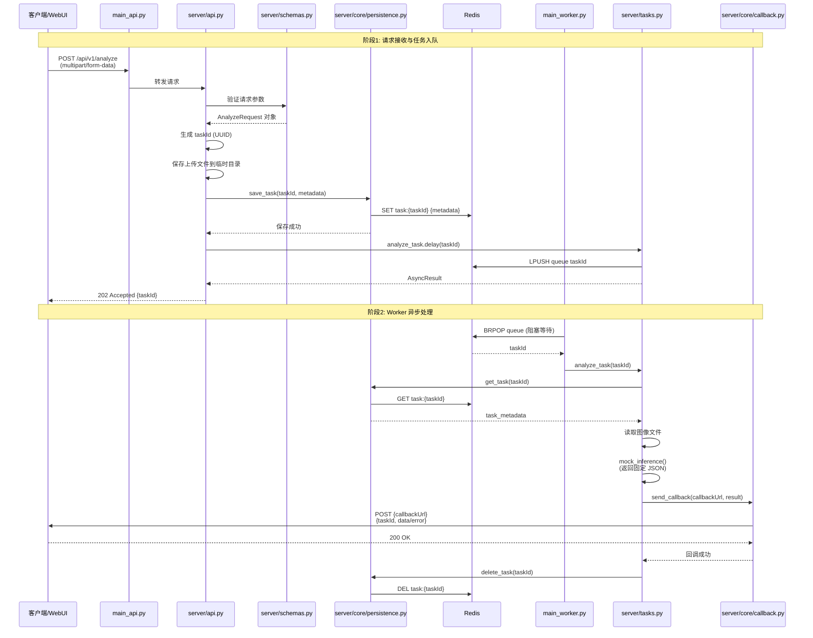

---

## 数据实体结构深化

### 实体关系图

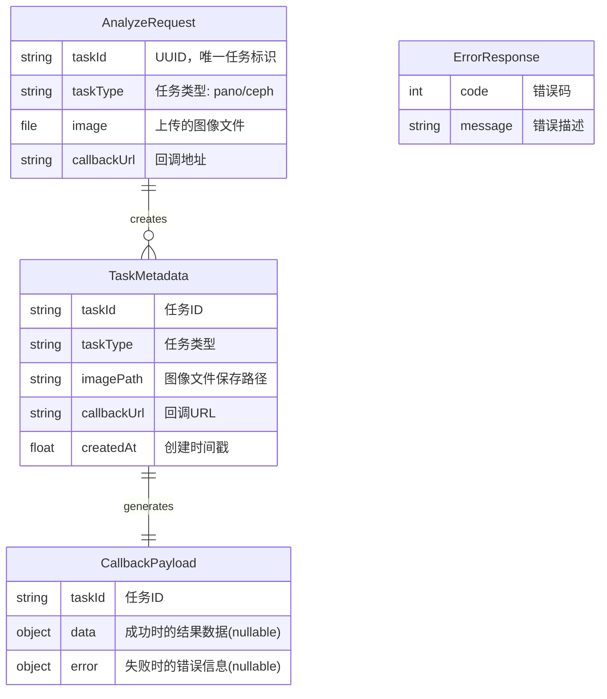

### 数据模型详细定义

#### 1. AnalyzeRequest（请求体）
```python
{
    "taskId": "550e8400-e29b-41d4-a716-446655440000",  # UUID v4
    "taskType": "pano",                                 # pano | ceph
    "callbackUrl": "http://client.com/callback"        # HTTP/HTTPS URL
}
# 附加: image 文件通过 multipart/form-data 上传
```

#### 2. TaskMetadata（Redis 存储）
```python
{
    "taskId": "550e8400-e29b-41d4-a716-446655440000",
    "taskType": "pano",
    "imagePath": "/tmp/uploads/550e8400-e29b-41d4-a716-446655440000.jpg",
    "callbackUrl": "http://client.com/callback",
    "createdAt": 1699876543.123
}
```

#### 3. CallbackPayload（回调请求体）
```python
# 成功情况
{
    "taskId": "550e8400-e29b-41d4-a716-446655440000",
    "data": {
        "teeth": [...],
        "diseases": [...]
    },
    "error": null
}

# 失败情况
{
    "taskId": "550e8400-e29b-41d4-a716-446655440000",
    "data": null,
    "error": {
        "code": 12001,
        "message": "AI inference failed"
    }
}
```

#### 4. 错误码定义（第一版核心错误码）
| 错误码 | 说明 | HTTP 状态码 |
|--------|------|-------------|
| 10001 | 请求参数验证失败 | 400 |
| 10002 | taskId 已存在 | 409 |
| 10003 | 不支持的图像格式 | 400 |
| 12001 | AI 推理执行失败 | 200 (回调) |
| 12002 | 图像文件读取失败 | 200 (回调) |

---

## 配置项

### config.yaml

```yaml
# Redis 配置
redis:
  host: "localhost"              # Redis 服务器地址
  port: 9006                     # Redis 端口
  db: 0                          # 数据库索引
  password: null                 # 密码（可选）

# Celery 配置
celery:
  broker_url: "redis://localhost:9006/0"           # 消息队列
  result_backend: "redis://localhost:9006/1"       # 结果后端

# API 配置
api:
  host: "0.0.0.0"               # 监听地址
  port: 9010                    # 监听端口
  upload_dir: "./tmp/uploads"   # 文件上传目录

# Worker 配置
worker:
  concurrency: 2                # 并发数
  loglevel: "info"              # 日志级别

# 回调配置
callback:
  timeout: 30                   # 超时时间（秒）
  
# 任务配置
task:
  result_ttl: 3600              # Redis 中任务元数据 TTL（秒）
```

---

## 涉及到的文件详解

### main_api.py

**a. 文件用途说明**

API 服务（P1）的启动入口，负责初始化 FastAPI 应用并启动 Uvicorn 服务器。

**b. 文件内类图**

无类定义（纯启动脚本）

**c. 函数/方法详解**

#### `main()`

- **用途**: 启动 API 服务
- **输入参数**: 无
- **输出数据结构**: 无返回值
- **实现流程**:

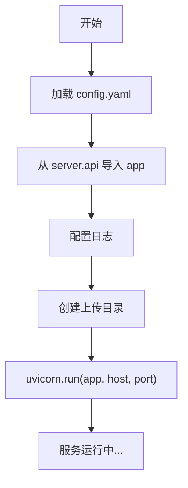

**实现要点**:
```python
# 伪代码
def main():
    config = load_config("config.yaml")
    
    # 确保上传目录存在
    os.makedirs(config.api.upload_dir, exist_ok=True)
    
    # 启动 Uvicorn
    uvicorn.run(
        "server.api:app",
        host=config.api.host,
        port=config.api.port,
        log_level="info"
    )
```

---

### main_worker.py

**a. 文件用途说明**

Worker 服务（P2）的启动入口，负责启动 Celery Worker 进程监听任务队列。

**b. 文件内类图**

无类定义（纯启动脚本）

**c. 函数/方法详解**

#### `main()`

- **用途**: 启动 Worker 服务
- **输入参数**: 无
- **输出数据结构**: 无返回值
- **实现流程**:

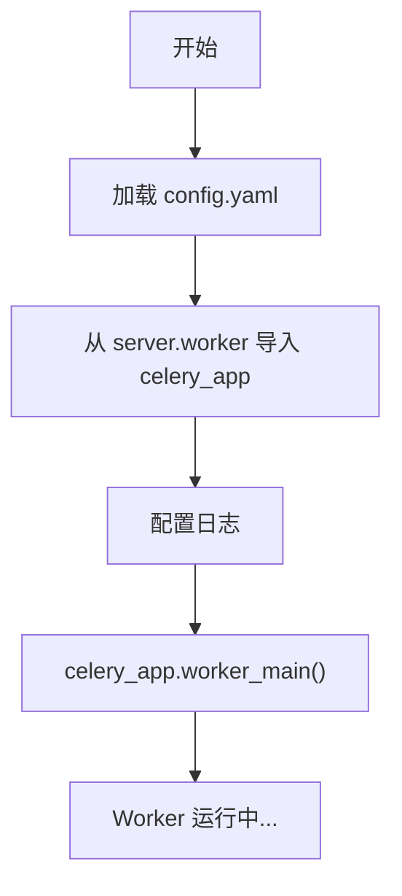

**实现要点**:
```python
# 伪代码
def main():
    config = load_config("config.yaml")
    
    # 启动 Celery Worker
    celery_app.worker_main([
        'worker',
        '--loglevel=info',
        '--concurrency=2'
    ])
```

---

### server/api.py

**a. 文件用途说明**

定义 FastAPI 应用和所有 HTTP 路由，负责请求验证、文件上传处理、任务入队。

**b. 文件内类图**

无类定义（函数式路由）

**c. 函数/方法详解**

#### `create_app() -> FastAPI`

- **用途**: 创建并配置 FastAPI 应用实例
- **输入参数**: 无
- **输出数据结构**: `FastAPI` 应用对象
- **实现流程**:

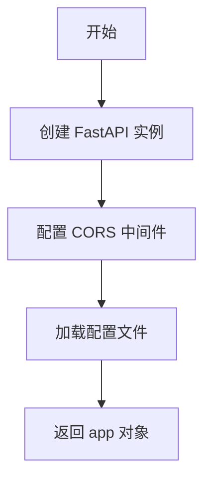

#### `POST /api/v1/analyze`

- **用途**: 接收推理请求，验证参数，将任务推入队列，立即返回 202
- **输入参数**:
  - `taskId: str` (Form) - 任务唯一标识
  - `taskType: str` (Form) - 任务类型（pano/ceph）
  - `callbackUrl: str` (Form) - 回调 URL
  - `image: UploadFile` (File) - 上传的图像文件
- **输出数据结构**:
```python
{
    "taskId": "550e8400-e29b-41d4-a716-446655440000",
    "status": "accepted",
    "message": "Task queued successfully"
}
```
- **实现流程**:

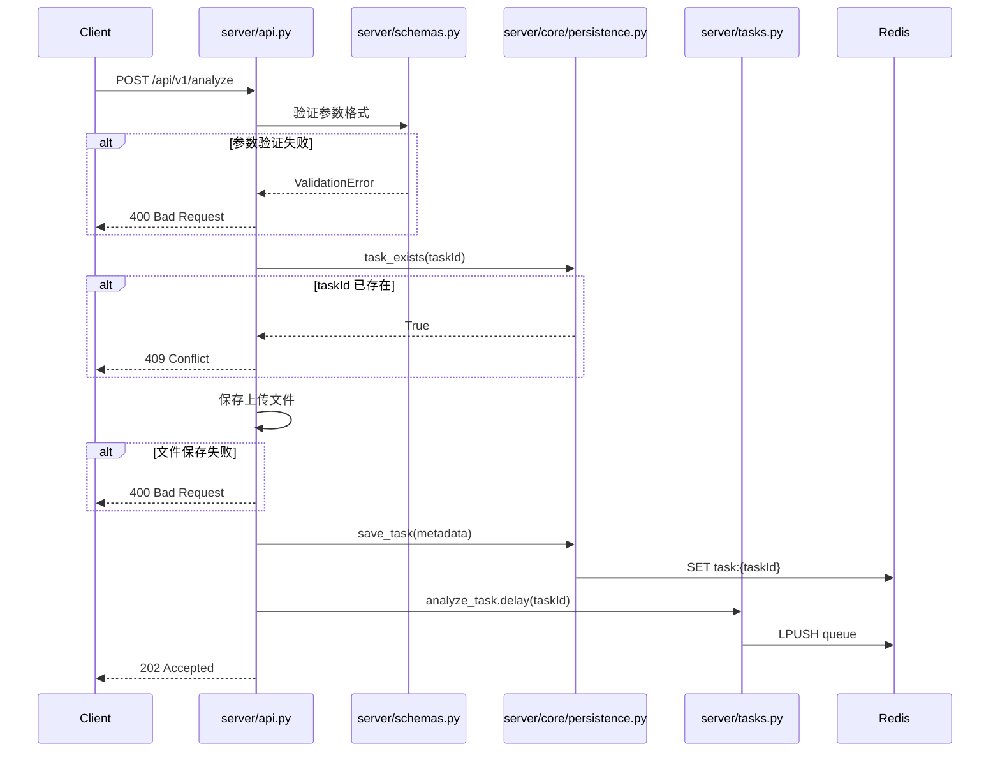

---

### server/schemas.py

**a. 文件用途说明**

定义所有 Pydantic 数据模型，用于请求验证和响应序列化。

**b. 文件内类图**

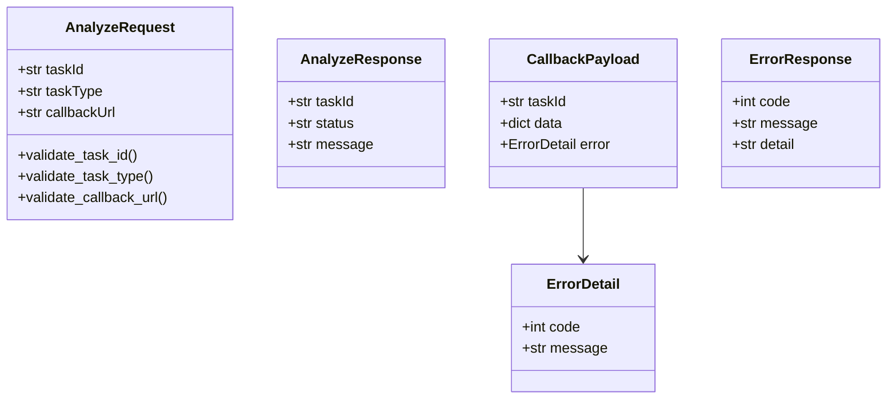

**c. 函数/方法详解**

#### `AnalyzeRequest.validate_task_id()`

- **用途**: 验证 taskId 是否为有效的 UUID v4 格式
- **输入参数**: `cls`, `v: str` - 待验证的 taskId
- **输出数据结构**: `str` - 验证通过的 taskId
- **实现流程**:

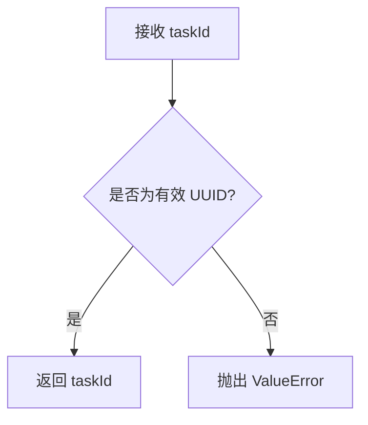

#### `AnalyzeRequest.validate_task_type()`

- **用途**: 验证 taskType 是否在允许的范围内
- **输入参数**: `cls`, `v: str` - 待验证的 taskType
- **输出数据结构**: `str` - 验证通过的 taskType
- **实现流程**:

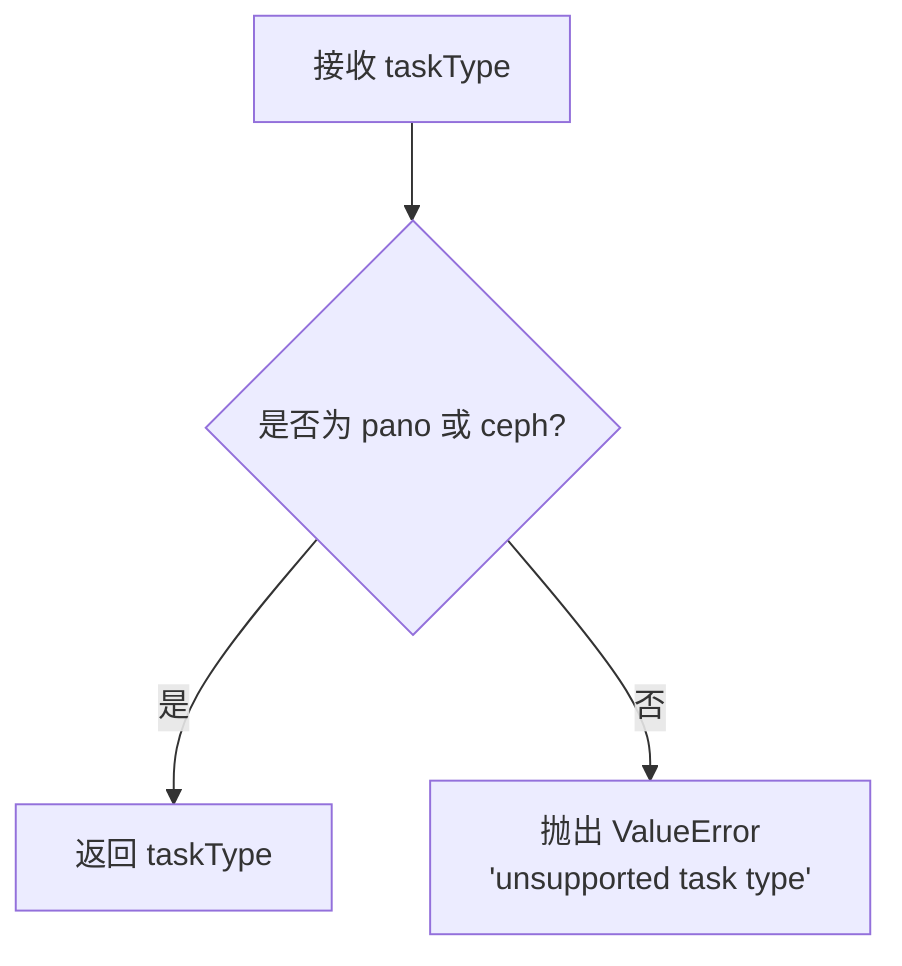

#### `AnalyzeRequest.validate_callback_url()`

- **用途**: 验证 callbackUrl 是否为有效的 HTTP/HTTPS URL
- **输入参数**: `cls`, `v: str` - 待验证的 URL
- **输出数据结构**: `str` - 验证通过的 URL
- **实现流程**:

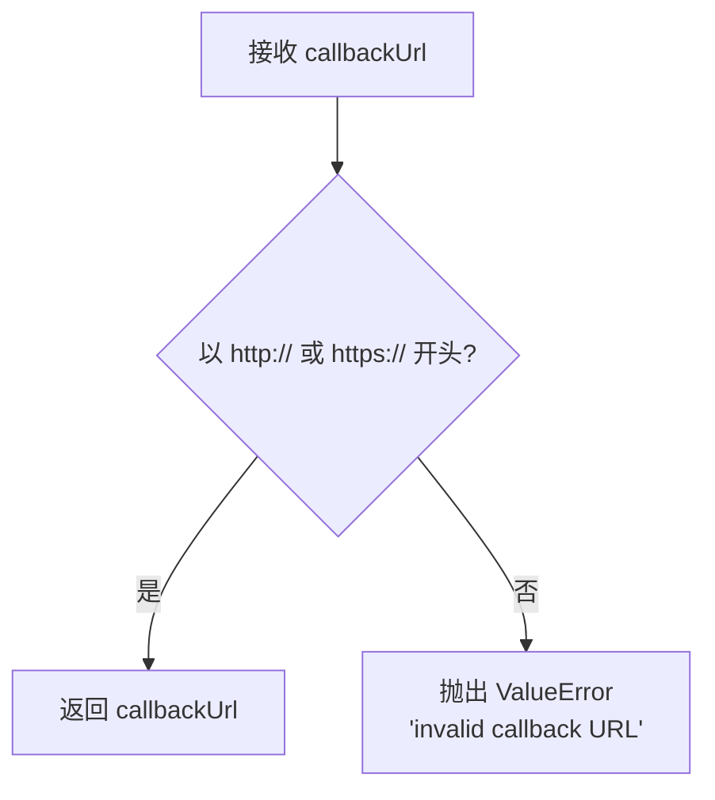

---

### server/worker.py

**a. 文件用途说明**

配置并创建 Celery 应用实例，定义消息队列和结果后端。

**b. 文件内类图**

无类定义（模块级配置）

**c. 函数/方法详解**

#### `create_celery_app() -> Celery`

- **用途**: 创建并配置 Celery 应用
- **输入参数**: 无
- **输出数据结构**: `Celery` 应用对象
- **实现流程**:

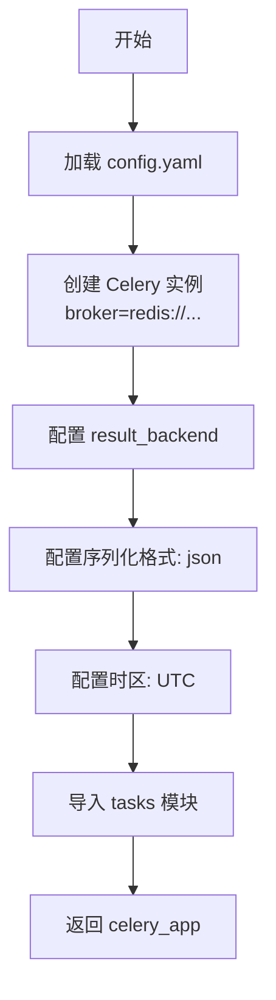

**实现要点**:
```python
# 伪代码
celery_app = Celery(
    'xray_inference',
    broker='redis://localhost:6379/0',
    backend='redis://localhost:6379/1'
)

celery_app.conf.update(
    task_serializer='json',
    result_serializer='json',
    accept_content=['json'],
    timezone='UTC',
    enable_utc=True
)
```

---

### server/tasks.py

**a. 文件用途说明**

定义 Celery 异步任务，负责从队列中获取任务、执行 AI 推理（第一版为 mock）、触发回调。

**b. 文件内类图**

无类定义（装饰器式任务函数）

**c. 函数/方法详解**

#### `@celery_app.task analyze_task(task_id: str)`

- **用途**: 异步执行推理任务的主函数
- **输入参数**: 
  - `task_id: str` - 任务 ID
- **输出数据结构**: 无返回值（通过回调发送结果）
- **实现流程**:

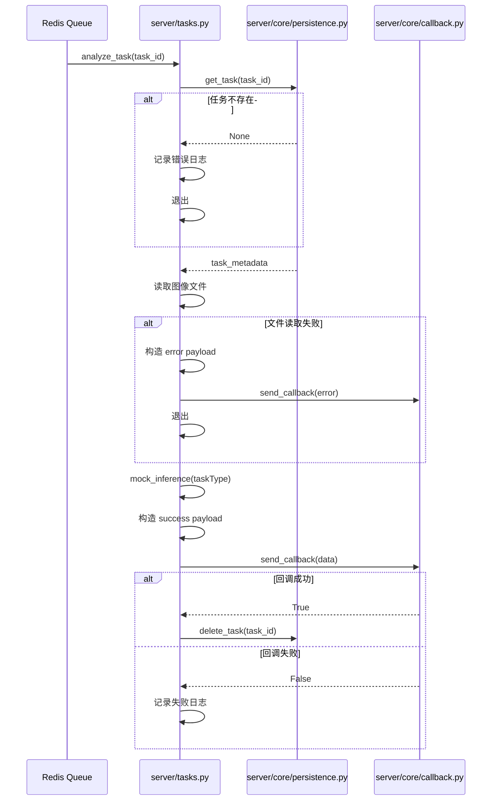

#### `mock_inference(task_type: str, image_path: str) -> dict`

- **用途**: 模拟 AI 推理，返回固定的示例 JSON（第一版实现）
- **输入参数**:
  - `task_type: str` - 任务类型（pano/ceph）
  - `image_path: str` - 图像文件路径（第一版未使用）
- **输出数据结构**:
```python
# pano 类型示例输出
{
    "teeth": [
        {"id": 11, "status": "healthy", "confidence": 0.95},
        {"id": 12, "status": "healthy", "confidence": 0.93}
    ],
    "diseases": [
        {
            "type": "caries",
            "location": "tooth_21",
            "severity": "mild",
            "confidence": 0.87
        }
    ]
}
```
- **实现流程**:

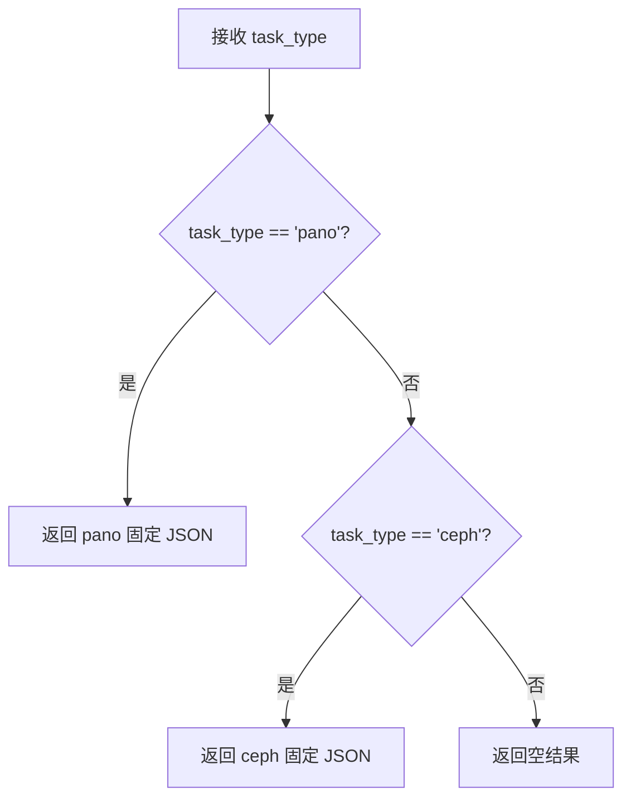

---

### server/core/persistence.py

**a. 文件用途说明**

封装 Redis 操作，负责任务元数据的增删查功能。

**b. 文件内类图**

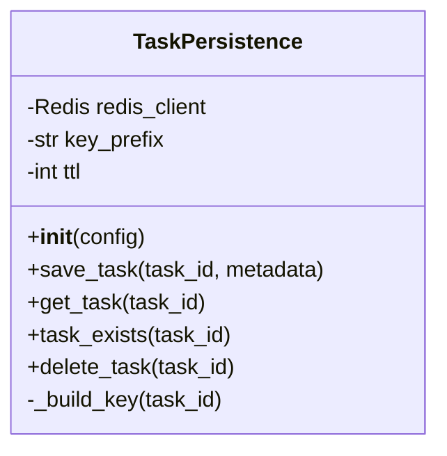

**c. 函数/方法详解**

#### `__init__(config: dict)`

- **用途**: 初始化 Redis 连接
- **输入参数**: 
  - `config: dict` - 配置字典（从 config.yaml 加载）
- **输出数据结构**: 无
- **实现流程**:

```mermaid
flowchart TD
    A[接收 config] --> B[提取 redis 配置项]
    B --> C["redis.Redis(host, port, db)"]
    C --> D[设置 key_prefix = 'task:'"]
    D --> E[设置 ttl = config.task.result_ttl]
```

#### `save_task(task_id: str, metadata: dict) -> bool`

- **用途**: 将任务元数据保存到 Redis
- **输入参数**:
  - `task_id: str` - 任务 ID
  - `metadata: dict` - 元数据字典
- **输出数据结构**: `bool` - 是否成功
- **实现流程**:

```mermaid
flowchart TD
    A[接收 task_id, metadata] --> B[构建 key: 'task:{task_id}']
    B --> C[序列化 metadata 为 JSON]
    C --> D["redis.setex(key, ttl, json_data)"]
    D --> E{操作成功?}
    E -->|是| F[返回 True]
    E -->|否| G[记录错误日志]
    G --> H[返回 False]
```

#### `get_task(task_id: str) -> dict | None`

- **用途**: 从 Redis 获取任务元数据
- **输入参数**:
  - `task_id: str` - 任务 ID
- **输出数据结构**: `dict | None` - 元数据字典或 None
- **实现流程**:

```mermaid
flowchart TD
    A[接收 task_id] --> B[构建 key: 'task:{task_id}']
    B --> C["redis.get(key)"]
    C --> D{key 存在?}
    D -->|是| E[反序列化 JSON]
    E --> F[返回 dict]
    D -->|否| G[返回 None]
```

#### `task_exists(task_id: str) -> bool`

- **用途**: 检查任务是否已存在
- **输入参数**:
  - `task_id: str` - 任务 ID
- **输出数据结构**: `bool` - 是否存在
- **实现流程**:

```mermaid
flowchart TD
    A[接收 task_id] --> B[构建 key: 'task:{task_id}']
    B --> C["redis.exists(key)"]
    C --> D[返回布尔值]
```

#### `delete_task(task_id: str) -> bool`

- **用途**: 删除任务元数据
- **输入参数**:
  - `task_id: str` - 任务 ID
- **输出数据结构**: `bool` - 是否成功
- **实现流程**:

```mermaid
flowchart TD
    A[接收 task_id] --> B[构建 key: 'task:{task_id}']
    B --> C["redis.delete(key)"]
    C --> D[返回删除数量 > 0]
```

---

### server/core/callback.py

**a. 文件用途说明**

封装 HTTP 回调逻辑，负责向客户端发送推理结果，包含超时控制（第一版不含重试）。

**b. 文件内类图**

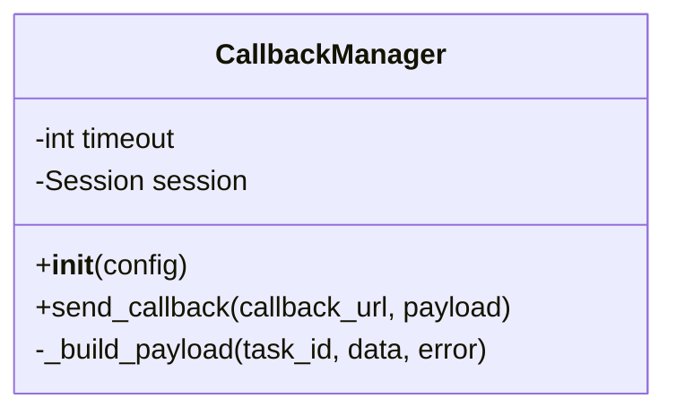

**c. 函数/方法详解**

#### `__init__(config: dict)`

- **用途**: 初始化 HTTP 客户端和配置
- **输入参数**:
  - `config: dict` - 配置字典
- **输出数据结构**: 无
- **实现流程**:

```mermaid
flowchart TD
    A[接收 config] --> B[提取 callback.timeout]
    B --> C[创建 requests.Session]
    C --> D[设置默认 headers]
```

#### `send_callback(callback_url: str, payload: dict) -> bool`

- **用途**: 向指定 URL 发送 POST 回调请求
- **输入参数**:
  - `callback_url: str` - 回调 URL
  - `payload: dict` - 回调负载（包含 taskId, data, error）
- **输出数据结构**: `bool` - 回调是否成功（HTTP 200）
- **实现流程**:

```mermaid
sequenceDiagram
    participant Task as server/tasks.py
    participant Callback as server/core/callback.py
    participant Client as 客户端

    Task->>Callback: send_callback(url, payload)
    Callback->>Callback: 序列化 payload 为 JSON
    Callback->>Client: POST url (timeout=30s)
    
    alt 响应成功 (200)
        Client-->>Callback: 200 OK
        Callback->>Callback: 记录成功日志
        Callback-->>Task: return True
    else 响应失败 (4xx/5xx)
        Client-->>Callback: 4xx/5xx
        Callback->>Callback: 记录失败日志
        Callback-->>Task: return False
    else 超时
        Client-->>Callback: Timeout
        Callback->>Callback: 记录超时日志
        Callback-->>Task: return False
    else 连接错误
        Client-->>Callback: ConnectionError
        Callback->>Callback: 记录错误日志
        Callback-->>Task: return False
    end
```

**实现要点**:
```python
# 伪代码
def send_callback(callback_url: str, payload: dict) -> bool:
    try:
        response = self.session.post(
            callback_url,
            json=payload,
            timeout=self.timeout
        )
        
        if response.status_code == 200:
            logger.info(f"Callback success: {callback_url}")
            return True
        else:
            logger.error(f"Callback failed: {response.status_code}")
            return False
            
    except requests.Timeout:
        logger.error(f"Callback timeout: {callback_url}")
        return False
    except requests.RequestException as e:
        logger.error(f"Callback error: {e}")
        return False
```

---

## 迭代演进依据

### 第一版实现范围（本文档）
1. ✅ 核心异步架构（P1 + P2 + Redis）
2. ✅ 文件上传和临时存储
3. ✅ Mock AI 推理（固定 JSON 输出）
4. ✅ 简化回调（单次尝试，30秒超时）
5. ✅ 核心错误码（5 个）

### 第二版迭代方向
1. **集成真实 AI 模型**
   - 修改点：`server/tasks.py` 的 `mock_inference()` → 调用 `pipelines.pano.PanoPipeline`
   - 新增依赖：`pipelines/` 目录下的模型加载和推理逻辑
   - 向后兼容：保持相同的输入输出接口

2. **增强回调机制**
   - 修改点：`server/core/callback.py` 添加重试逻辑
   - 新增配置：`callback.max_retries`, `callback.retry_delay`
   - 向后兼容：现有回调接口不变

3. **扩展错误码体系**
   - 修改点：`server/schemas.py` 添加更多 `ErrorDetail` 类型
   - 新增错误码：10004-10010（客户端），12003-12010（服务端）
   - 向后兼容：现有错误码保持不变

4. **任务状态追踪**
   - 修改点：`server/core/persistence.py` 扩展 `TaskMetadata` 结构
   - 新增字段：`status`, `startedAt`, `completedAt`
   - 新增接口：`update_task_status(task_id, status)`
   - 向后兼容：通过字段默认值实现

5. **添加查询接口**
   - 新增路由：`GET /api/v1/task/{taskId}` 查询任务状态
   - 修改点：`server/api.py` 添加新路由
   - 依赖：第4点的状态追踪功能

### 架构扩展点

**扩展点1: 支持 imageUrl 方式**
```python
# server/api.py 修改
@app.post("/api/v1/analyze")
async def analyze(
    taskId: str = Form(...),
    taskType: str = Form(...),
    callbackUrl: str = Form(...),
    image: Optional[UploadFile] = File(None),  # 可选
    imageUrl: Optional[str] = Form(None)       # 新增
):
    # 优先使用 image，其次使用 imageUrl
    if image:
        # 现有逻辑
    elif imageUrl:
        # 下载图像逻辑
    else:
        raise ValueError("Must provide image or imageUrl")
```

**扩展点2: 支持批量推理**
```python
# 新增路由
@app.post("/api/v1/batch")
async def batch_analyze(
    tasks: List[AnalyzeRequest]
):
    # 批量入队
    for task in tasks:
        analyze_task.delay(task.taskId)
    return {"count": len(tasks)}
```

**扩展点3: 监控和健康检查**
```python
# 新增路由
@app.get("/health")
async def health_check():
    return {
        "api": "healthy",
        "redis": redis_client.ping(),
        "worker": check_celery_worker()
    }
```

### 数据库迁移路径（未来考虑）

当任务量增大后，可考虑从 Redis 迁移到 PostgreSQL：
- **迁移点**: `server/core/persistence.py`
- **策略**: 实现 `DatabasePersistence` 类，与 `RedisPersistence` 共享相同接口
- **双写方案**: 过渡期同时写入 Redis 和 DB，确保平滑迁移

---

## 附录: 启动命令速查

```bash
# 1. 启动 Redis
redis-server

# 2. 启动 API 服务 (P1)
python main_api.py

# 3. 启动 Worker 服务 (P2)
python main_worker.py

# 4. 测试请求
curl -X POST http://localhost:8000/api/v1/analyze \
  -F "taskId=550e8400-e29b-41d4-a716-446655440000" \
  -F "taskType=pano" \
  -F "callbackUrl=http://localhost:5000/callback" \
  -F "image=@test.jpg"
```

---

**文档版本**: v1.0  
**最后更新**: 2024-11-13  
**目标读者**: Cursor AI、后端开发工程师

---
---
