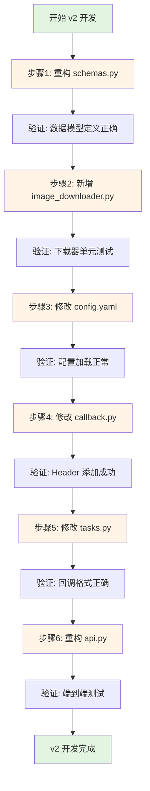
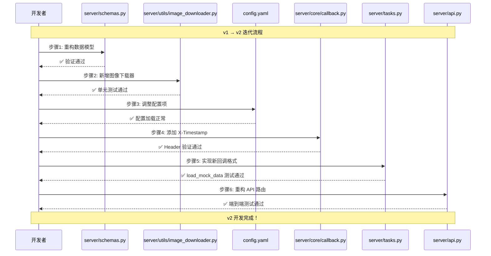

# X-Ray 推理服务 v2 编码计划

## 文档说明

本文档提供从 **v1.0 到 v2.0** 的渐进式小步迭代编码步骤，确保每一步都可独立验证，保持应用程序始终处于可运行状态。

### ⚠️ 重要设计决策

**taskId 提供方式**：本 v2 版本**保留 v1 的设计**，由**客户端提供 taskId**，而非服务端生成。

**架构原则**：
- ✅ AI 服务是无状态的计算服务，不应管理业务标识符
- ✅ 客户端系统（如 HIS）有自己的订单管理，应使用自己的业务 ID
- ✅ Redis 只是临时缓存（TTL 1小时），不是持久化数据库
- ✅ 回调关联更简单：客户端收到回调后可以直接用 taskId 查询自己的数据库

---

## v2 版本目标回顾

### 核心变更
1. **接口协议对齐**：符合《接口定义.md》规范
2. **请求格式调整**：从 `multipart/form-data` 改为 `application/json`
3. **taskId 设计**：保留客户端提供（v1 设计），符合"AI服务不管理业务ID"的架构原则
4. **图像传递方式**：从直接上传改为通过 `imageUrl` 下载
5. **新增参数支持**：`metadata`（客户端自定义）、`patientInfo`（侧位片必需）
6. **响应格式完善**：添加 `submittedAt` 和 `metadata`
7. **回调格式升级**：添加 `status`、`timestamp`、`requestParameters`
8. **回调协议优化**：添加 `X-Timestamp` header，超时从 30 秒改为 3 秒
9. **数据格式标准化**：从 example JSON 文件加载 mock 数据

---

## 受影响的现有模块总览

### 模块变更类型
| 模块 | 变更类型 | 说明 |
|------|---------|------|
| `server/schemas.py` | 重构 | 数据模型重构，新增类，修改字段 |
| `server/utils/image_downloader.py` | 新增 | 实现图像下载功能 |
| `config.yaml` | 修改 | 调整超时配置，新增下载配置 |
| `server/core/callback.py` | 修改 | 添加 X-Timestamp header |
| `server/tasks.py` | 修改 | 实现新的回调格式，从文件加载数据 |
| `server/api.py` | 重构 | 路由参数和逻辑重构 |

---

## 目录结构变化

```
inference-service/
│
├── config.yaml                 # ✏️ 修改：调整配置项
│
├── server/
│   ├── schemas.py              # ✏️ 重构：数据模型
│   ├── api.py                  # ✏️ 重构：路由逻辑
│   ├── tasks.py                # ✏️ 修改：回调格式
│   │
│   ├── core/
│   │   └── callback.py         # ✏️ 修改：添加 header
│   │
│   └── utils/                  # ✨ 新增目录
│       ├── __init__.py         # ✨ 新增
│       └── image_downloader.py # ✨ 新增：图像下载器
│
└── vibe_coding/v2/
    └── readme_server_codingplan.md  # 本文档
```

**图例**：
- ✏️ 修改现有文件
- ✨ 新增文件

---

## 编码步骤总览



---

## 步骤 1：重构 server/schemas.py - 数据模型升级

### 目标
- 新增 `PatientInfo` 类（支持侧位片患者信息）
- 重构 `AnalyzeRequest` 类（保留 taskId，新增 imageUrl、metadata、patientInfo）
- 重构 `AnalyzeResponse` 类（新增 submittedAt、metadata，移除 message）
- 新增 `RequestParameters` 类（回调中使用）
- 重构 `CallbackPayload` 类（新增 status、timestamp、requestParameters）
- 修改 `ErrorDetail` 类（新增 displayMessage）

### 变更依据
1. 接口定义要求 taskType 使用 "panoramic" 和 "cephalometric"（v1 为 "pano" 和 "ceph"）
2. **保留 v1 设计**：taskId 由客户端提供（符合"AI服务不管理业务ID"的架构原则）
3. 图像通过 imageUrl 下载，不再直接上传
4. 侧位片任务必须包含 patientInfo（gender 和 DentalAgeStage）
5. 回调格式需要完整的元数据和请求参数

### 实现要点

#### 1.1 新增 PatientInfo 类

```python
from pydantic import BaseModel, field_validator

class PatientInfo(BaseModel):
    """
    患者信息模型（侧位片必需）
    
    Attributes:
        gender: 性别（Male/Female）
        DentalAgeStage: 牙期（Permanent/Mixed）
    """
    gender: str
    DentalAgeStage: str
    
    @field_validator('gender')
    @classmethod
    def validate_gender(cls, v: str) -> str:
        """验证性别"""
        if v not in ['Male', 'Female']:
            raise ValueError("gender must be either 'Male' or 'Female'")
        return v
    
    @field_validator('DentalAgeStage')
    @classmethod
    def validate_dental_age_stage(cls, v: str) -> str:
        """验证牙期"""
        if v not in ['Permanent', 'Mixed']:
            raise ValueError("DentalAgeStage must be either 'Permanent' or 'Mixed'")
        return v
```

#### 1.2 重构 AnalyzeRequest 类

**关键变更**：
- ✅ 保留 `taskId: str`（客户端提供，v1 设计）
- ✅ 新增 `imageUrl: str`（替代文件上传）
- ✅ 新增 `metadata: Optional[Dict[str, Any]]`（客户端自定义）
- ✅ 新增 `patientInfo: Optional[PatientInfo]`（侧位片必需）
- ✅ taskType 验证改为 "panoramic" / "cephalometric"
- ✅ 新增跨字段验证器：cephalometric 时必须提供 patientInfo

```python
from pydantic import BaseModel, field_validator, model_validator

class AnalyzeRequest(BaseModel):
    """
    分析请求模型 v2
    
    Attributes:
        taskId: 任务唯一标识（客户端提供，UUID v4 格式）
        taskType: 任务类型（panoramic/cephalometric）
        imageUrl: 图像 URL（HTTP/HTTPS）
        callbackUrl: 回调 URL（HTTP/HTTPS）
        metadata: 客户端自定义元数据（可选）
        patientInfo: 患者信息（侧位片必需）
    """
    taskId: str
    taskType: str
    imageUrl: str
    callbackUrl: str
    metadata: Optional[Dict[str, Any]] = None
    patientInfo: Optional[PatientInfo] = None
    
    @field_validator('taskId')
    @classmethod
    def validate_task_id(cls, v: str) -> str:
        """验证 taskId 是否为有效的 UUID v4 格式"""
        try:
            uuid.UUID(v, version=4)
            return v
        except ValueError:
            raise ValueError('taskId must be a valid UUID v4')
    
    @field_validator('taskType')
    @classmethod
    def validate_task_type(cls, v: str) -> str:
        """验证 taskType"""
        if v not in ['panoramic', 'cephalometric']:
            raise ValueError("taskType must be either 'panoramic' or 'cephalometric'")
        return v
    
    @field_validator('imageUrl')
    @classmethod
    def validate_image_url(cls, v: str) -> str:
        """验证 imageUrl"""
        if not (v.startswith('http://') or v.startswith('https://')):
            raise ValueError('imageUrl must be a valid HTTP/HTTPS URL')
        return v
    
    @field_validator('callbackUrl')
    @classmethod
    def validate_callback_url(cls, v: str) -> str:
        """验证 callbackUrl"""
        if not (v.startswith('http://') or v.startswith('https://')):
            raise ValueError('callbackUrl must be a valid HTTP/HTTPS URL')
        return v
    
    @model_validator(mode='after')
    def validate_patient_info_required(self):
        """验证侧位片必须提供 patientInfo"""
        if self.taskType == 'cephalometric':
            if not self.patientInfo:
                raise ValueError("patientInfo is required when taskType is 'cephalometric'")
            if not self.patientInfo.gender or not self.patientInfo.DentalAgeStage:
                raise ValueError("gender and DentalAgeStage are required in patientInfo for cephalometric tasks")
        return self
```

#### 1.3 重构 AnalyzeResponse 类

**关键变更**：
- ❌ 移除 `message: str`
- ✅ 新增 `submittedAt: str`（ISO8601 格式）
- ✅ 新增 `metadata: Optional[Dict[str, Any]]`（回显客户端 metadata）

```python
class AnalyzeResponse(BaseModel):
    """
    分析响应模型 v2（202 Accepted）
    
    Attributes:
        taskId: 任务 ID（服务端生成）
        status: 任务状态（固定值 "QUEUED"）
        submittedAt: 提交时间（ISO8601 格式）
        metadata: 回显客户端 metadata
    """
    taskId: str
    status: str
    submittedAt: str
    metadata: Optional[Dict[str, Any]] = None
```

#### 1.4 新增 RequestParameters 类

```python
class RequestParameters(BaseModel):
    """
    请求参数记录（回调中使用）
    
    Attributes:
        taskType: 任务类型
        imageUrl: 原始图像 URL
    """
    taskType: str
    imageUrl: str
```

#### 1.5 重构 CallbackPayload 类

**关键变更**：
- ✅ 新增 `status: str`（SUCCESS/FAILURE）
- ✅ 新增 `timestamp: str`（ISO8601 格式）
- ✅ 新增 `metadata: Dict[str, Any]`（客户端 metadata）
- ✅ 新增 `requestParameters: RequestParameters`（原始请求参数）

```python
class CallbackPayload(BaseModel):
    """
    回调负载模型 v2
    
    Attributes:
        taskId: 任务 ID
        status: 状态（SUCCESS/FAILURE）
        timestamp: 完成时间（ISO8601 格式）
        metadata: 客户端 metadata
        requestParameters: 原始请求参数
        data: 成功时的结果数据（nullable）
        error: 失败时的错误信息（nullable）
    """
    taskId: str
    status: str
    timestamp: str
    metadata: Dict[str, Any]
    requestParameters: RequestParameters
    data: Optional[Dict[str, Any]] = None
    error: Optional['ErrorDetail'] = None
```

#### 1.6 修改 ErrorDetail 类

**关键变更**：
- ✅ 新增 `displayMessage: str`（用户友好提示）

```python
class ErrorDetail(BaseModel):
    """
    错误详情模型 v2
    
    Attributes:
        code: 错误码
        message: 开发者调试信息
        displayMessage: 用户友好提示
    """
    code: int
    message: str
    displayMessage: str
```

### 完整文件结构

修改后的 `server/schemas.py` 应包含以下类（按顺序）：
1. `PatientInfo`（新增）
2. `AnalyzeRequest`（重构，保留 taskId）
3. `AnalyzeResponse`（重构）
4. `RequestParameters`（新增）
5. `ErrorDetail`（修改）
6. `ErrorResponse`（保留不变）
7. `CallbackPayload`（重构）

### 验证方式

**验证目标**：确保数据模型定义正确，不影响应用启动。

#### 验证步骤
1. **语法检查**：
   ```bash
   python -m py_compile server/schemas.py
   ```

2. **导入测试**（创建临时测试脚本 `test_schemas_v2.py`）：
   ```python
   # test_schemas_v2.py
   from server.schemas import (
       PatientInfo, AnalyzeRequest, AnalyzeResponse,
       RequestParameters, CallbackPayload, ErrorDetail
   )
   
   # 测试 1: PatientInfo 验证
   try:
       patient = PatientInfo(gender="Male", DentalAgeStage="Permanent")
       print("✅ PatientInfo 验证通过")
   except Exception as e:
       print(f"❌ PatientInfo 验证失败: {e}")
   
   # 测试 2: AnalyzeRequest 验证（全景片）
   try:
       req_pano = AnalyzeRequest(
           taskId="550e8400-e29b-41d4-a716-446655440001",
           taskType="panoramic",
           imageUrl="https://example.com/pano.jpg",
           callbackUrl="http://localhost:5000/callback",
           metadata={"patientId": "P-001"}
       )
       print("✅ AnalyzeRequest (panoramic) 验证通过")
   except Exception as e:
       print(f"❌ AnalyzeRequest (panoramic) 验证失败: {e}")
   
   # 测试 3: AnalyzeRequest 验证（侧位片，必须包含 patientInfo）
   try:
       req_ceph = AnalyzeRequest(
           taskId="550e8400-e29b-41d4-a716-446655440002",
           taskType="cephalometric",
           imageUrl="https://example.com/ceph.jpg",
           callbackUrl="http://localhost:5000/callback",
           patientInfo=PatientInfo(gender="Female", DentalAgeStage="Mixed"),
           metadata={"patientId": "P-002"}
       )
       print("✅ AnalyzeRequest (cephalometric) 验证通过")
   except Exception as e:
       print(f"❌ AnalyzeRequest (cephalometric) 验证失败: {e}")
   
   # 测试 4: 侧位片缺少 patientInfo 应该失败
   try:
       req_ceph_invalid = AnalyzeRequest(
           taskId="550e8400-e29b-41d4-a716-446655440003",
           taskType="cephalometric",
           imageUrl="https://example.com/ceph.jpg",
           callbackUrl="http://localhost:5000/callback"
       )
       print("❌ 侧位片缺少 patientInfo 应该失败，但通过了")
   except ValueError as e:
       print(f"✅ 侧位片缺少 patientInfo 正确拦截: {e}")
   
   # 测试 5: AnalyzeResponse 验证
   try:
       resp = AnalyzeResponse(
           taskId="550e8400-e29b-41d4-a716-446655440000",
           status="QUEUED",
           submittedAt="2025-11-16T14:30:00Z",
           metadata={"patientId": "P-001"}
       )
       print("✅ AnalyzeResponse 验证通过")
   except Exception as e:
       print(f"❌ AnalyzeResponse 验证失败: {e}")
   
   # 测试 6: CallbackPayload 验证
   try:
       callback = CallbackPayload(
           taskId="550e8400-e29b-41d4-a716-446655440000",
           status="SUCCESS",
           timestamp="2025-11-16T14:35:10Z",
           metadata={"patientId": "P-001"},
           requestParameters=RequestParameters(
               taskType="panoramic",
               imageUrl="https://example.com/pano.jpg"
           ),
           data={"teeth": []},
           error=None
       )
       print("✅ CallbackPayload 验证通过")
   except Exception as e:
       print(f"❌ CallbackPayload 验证失败: {e}")
   
   print("\n所有数据模型验证完成！")
   ```

3. **执行验证**：
   ```bash
   python test_schemas_v2.py
   ```

4. **预期输出**：
   ```
   ✅ PatientInfo 验证通过
   ✅ AnalyzeRequest (panoramic) 验证通过
   ✅ AnalyzeRequest (cephalometric) 验证通过
   ✅ 侧位片缺少 patientInfo 正确拦截: patientInfo is required when taskType is 'cephalometric'
   ✅ AnalyzeResponse 验证通过
   ✅ CallbackPayload 验证通过
   
   所有数据模型验证完成！
   ```

5. **清理测试文件**（验证通过后）：
   ```bash
   rm test_schemas_v2.py
   ```

### 实现后状态
- ✅ 数据模型符合 v2 接口定义
- ✅ 侧位片 patientInfo 验证逻辑完整
- ✅ 所有字段验证器正常工作
- ✅ 应用可正常导入 schemas 模块
- ⏸️ API 路由尚未适配（下一步骤）

---

## 步骤 2：新增 server/utils/image_downloader.py - 图像下载器

### 目标
- 创建 `server/utils/` 目录
- 实现 `ImageDownloader` 类，支持从 URL 下载图像
- 支持格式验证（Content-Type）
- 支持大小限制（50MB）
- 支持超时控制（30秒）

### 变更依据
- v2 接口改为通过 `imageUrl` 传递图像，不再直接上传文件
- 需要从远程 URL 下载图像到本地
- 需要验证图像格式和大小，防止恶意请求

### 实现要点

#### 2.1 创建目录和初始化文件

```bash
mkdir -p server/utils
touch server/utils/__init__.py
```

`server/utils/__init__.py` 内容：
```python
# -*- coding: utf-8 -*-
"""
工具模块
"""
from .image_downloader import ImageDownloader

__all__ = ['ImageDownloader']
```

#### 2.2 实现 ImageDownloader 类

创建 `server/utils/image_downloader.py`：

```python
# -*- coding: utf-8 -*-
"""
图像下载器
负责从 imageUrl 下载图像文件到本地，包含格式验证、大小限制、超时控制
"""

import requests
import logging
from typing import Dict, Any
from pathlib import Path

logger = logging.getLogger(__name__)


class ImageDownloader:
    """
    HTTP 图像下载管理
    
    负责从 URL 下载图像文件并保存到本地，支持格式验证、大小限制、超时控制。
    """
    
    def __init__(self, config: Dict[str, Any]):
        """
        初始化 HTTP 客户端和下载配置
        
        Args:
            config: 配置字典，需包含 image_download 配置项
            
        Raises:
            KeyError: 配置项缺失
        """
        download_config = config.get('image_download', {})
        self.timeout = download_config.get('timeout', 30)
        self.max_size_mb = download_config.get('max_size_mb', 50)
        self.allowed_extensions = download_config.get('allowed_extensions', ['.jpg', '.jpeg', '.png', '.dcm'])
        
        self.session = requests.Session()
        self.session.headers.update({
            'User-Agent': 'Xray-Inference-Service/2.0'
        })
        
        logger.info(
            f"ImageDownloader initialized: "
            f"timeout={self.timeout}s, max_size={self.max_size_mb}MB, "
            f"allowed_formats={self.allowed_extensions}"
        )
    
    def download_image(self, image_url: str, save_path: str) -> bool:
        """
        从 URL 下载图像文件并保存到指定路径
        
        Args:
            image_url: 图像 URL（HTTP/HTTPS）
            save_path: 保存路径（本地文件路径）
            
        Returns:
            bool: 是否成功
            
        Raises:
            ValueError: 图像格式不支持或文件过大
            requests.exceptions.Timeout: 下载超时
            requests.exceptions.RequestException: 网络错误
            
        工作流程:
            1. 发送 HEAD 请求检查 Content-Type 和 Content-Length
            2. 验证图像格式（Content-Type 必须以 'image/' 开头）
            3. 验证文件大小（不超过 max_size_mb）
            4. 发送 GET 请求下载文件（流式下载）
            5. 保存到本地文件
        """
        try:
            logger.info(f"Starting image download: {image_url}")
            
            # 1. 发送 HEAD 请求检查文件类型和大小
            head_response = self.session.head(
                image_url, 
                timeout=self.timeout, 
                allow_redirects=True
            )
            head_response.raise_for_status()
            
            # 2. 验证 Content-Type
            content_type = head_response.headers.get('Content-Type', '')
            self._validate_content_type(content_type)
            
            # 3. 验证文件大小
            content_length = head_response.headers.get('Content-Length')
            if content_length:
                self._validate_file_size(int(content_length))
            else:
                logger.warning(f"Content-Length header not found, skipping size validation")
            
            # 4. 下载文件（流式）
            response = self.session.get(
                image_url, 
                timeout=self.timeout, 
                stream=True
            )
            response.raise_for_status()
            
            # 5. 保存到本地
            save_dir = Path(save_path).parent
            save_dir.mkdir(parents=True, exist_ok=True)
            
            downloaded_size = 0
            max_size_bytes = self.max_size_mb * 1024 * 1024
            
            with open(save_path, 'wb') as f:
                for chunk in response.iter_content(chunk_size=8192):
                    if chunk:
                        f.write(chunk)
                        downloaded_size += len(chunk)
                        
                        # 二次验证：检查下载过程中的大小
                        if downloaded_size > max_size_bytes:
                            f.close()
                            Path(save_path).unlink(missing_ok=True)
                            raise ValueError(
                                f"File size exceeds {self.max_size_mb}MB limit during download"
                            )
            
            logger.info(
                f"Image downloaded successfully: {image_url} -> {save_path} "
                f"({downloaded_size / 1024:.2f} KB)"
            )
            return True
            
        except requests.Timeout as e:
            logger.error(f"Image download timeout: {image_url}, timeout={self.timeout}s")
            raise
            
        except requests.HTTPError as e:
            logger.error(f"Image download HTTP error: {image_url}, status={e.response.status_code}")
            raise
            
        except requests.ConnectionError as e:
            logger.error(f"Image download connection error: {image_url}, error={str(e)}")
            raise
            
        except requests.RequestException as e:
            logger.error(f"Image download failed: {image_url}, error={str(e)}")
            raise
    
    def _validate_content_type(self, content_type: str) -> None:
        """
        验证 HTTP Content-Type 是否为图像类型
        
        Args:
            content_type: Content-Type 头
            
        Raises:
            ValueError: Content-Type 不是图像类型
        """
        if not content_type.startswith('image/'):
            raise ValueError(
                f"Unsupported Content-Type: {content_type}. "
                f"Only image/* types are allowed."
            )
        logger.debug(f"Content-Type validated: {content_type}")
    
    def _validate_file_size(self, content_length: int) -> None:
        """
        验证文件大小是否在限制内
        
        Args:
            content_length: Content-Length 字节数
            
        Raises:
            ValueError: 文件大小超过限制
        """
        max_size_bytes = self.max_size_mb * 1024 * 1024
        if content_length > max_size_bytes:
            raise ValueError(
                f"File size ({content_length / 1024 / 1024:.2f} MB) exceeds "
                f"{self.max_size_mb}MB limit"
            )
        logger.debug(f"File size validated: {content_length / 1024:.2f} KB")
```

### 验证方式

**验证目标**：确保图像下载器正常工作，能够下载、验证图像。

#### 验证步骤

1. **创建测试脚本**（`test_image_downloader_v2.py`）：
   ```python
   # test_image_downloader_v2.py
   import os
   import sys
   from pathlib import Path
   
   # 添加项目根目录到 sys.path
   sys.path.insert(0, str(Path(__file__).parent))
   
   from server.utils.image_downloader import ImageDownloader
   
   # 模拟配置
   config = {
       'image_download': {
           'timeout': 30,
           'max_size_mb': 50,
           'allowed_extensions': ['.jpg', '.jpeg', '.png', '.dcm']
       }
   }
   
   downloader = ImageDownloader(config)
   
   # 测试 1: 下载公开测试图像
   test_url = "https://picsum.photos/800/600.jpg"  # Lorem Picsum 测试图像
   test_save_path = "./tmp/test_download.jpg"
   
   print(f"测试 1: 下载图像...")
   print(f"URL: {test_url}")
   print(f"保存路径: {test_save_path}")
   
   try:
       success = downloader.download_image(test_url, test_save_path)
       if success and os.path.exists(test_save_path):
           file_size = os.path.getsize(test_save_path)
           print(f"✅ 图像下载成功，大小: {file_size / 1024:.2f} KB")
           
           # 清理测试文件
           os.remove(test_save_path)
           print("✅ 测试文件已清理")
       else:
           print("❌ 图像下载失败")
   except Exception as e:
       print(f"❌ 下载失败: {e}")
   
   # 测试 2: 验证 Content-Type 错误
   print("\n测试 2: Content-Type 验证（预期失败）...")
   test_url_invalid = "https://httpbin.org/html"  # 返回 text/html
   test_save_path_invalid = "./tmp/test_invalid.jpg"
   
   try:
       downloader.download_image(test_url_invalid, test_save_path_invalid)
       print("❌ Content-Type 验证应该失败，但通过了")
   except ValueError as e:
       print(f"✅ Content-Type 验证正确拦截: {e}")
   except Exception as e:
       print(f"⚠️ 意外错误: {e}")
   
   print("\n图像下载器测试完成！")
   ```

2. **执行验证**：
   ```bash
   python test_image_downloader_v2.py
   ```

3. **预期输出**：
   ```
   测试 1: 下载图像...
   URL: https://picsum.photos/800/600.jpg
   保存路径: ./tmp/test_download.jpg
   ✅ 图像下载成功，大小: 45.32 KB
   ✅ 测试文件已清理
   
   测试 2: Content-Type 验证（预期失败）...
   ✅ Content-Type 验证正确拦截: Unsupported Content-Type: text/html. Only image/* types are allowed.
   
   图像下载器测试完成！
   ```

4. **清理测试文件**：
   ```bash
   rm test_image_downloader_v2.py
   ```

### 实现后状态
- ✅ `server/utils/` 目录已创建
- ✅ `ImageDownloader` 类实现完成
- ✅ 图像下载功能正常工作
- ✅ 格式验证和大小限制正常
- ⏸️ API 尚未集成下载器（后续步骤）

---

## 步骤 3：修改 config.yaml - 调整配置项

### 目标
- 调整回调超时时间：从 30 秒改为 3 秒（对齐接口定义）
- 新增图像下载配置：`image_download` 配置块

### 变更依据
- 接口定义要求回调超时为 3 秒
- 图像下载需要独立的超时配置（30 秒）
- 两者的超时时间不同是合理的：回调通知 vs 图像下载

### 实现要点

#### 修改 config.yaml

```yaml
# 全局配置文件
# 支持环境变量覆盖：REDIS_HOST, REDIS_PORT, REDIS_DB, REDIS_PASSWORD

# Redis 配置（v1 保持不变）
redis:
  host: "localhost"  # Docker: 使用 "redis"
  port: 6379
  db: 0
  password: null

# Celery 配置（v1 保持不变）
celery:
  broker_url: "redis://localhost:6379/0"
  result_backend: "redis://localhost:6379/1"

# API 配置（v1 保持不变）
api:
  host: "0.0.0.0"
  port: 18000
  upload_dir: "./tmp/uploads"

# Worker 配置（v1 保持不变）
worker:
  concurrency: 2
  loglevel: "info"

# 回调配置（v2 修改）
callback:
  timeout: 3  # ⚠️ 从 v1 的 30 秒改为 3 秒（对齐接口定义）

# 任务配置（v1 保持不变）
task:
  result_ttl: 3600  # Redis 中任务元数据 TTL（秒）

# 图像下载配置（v2 新增）
image_download:
  timeout: 30                    # 下载超时时间（秒）
  max_size_mb: 50                # 最大文件大小（MB）
  allowed_extensions:            # 允许的图像格式
    - .jpg
    - .jpeg
    - .png
    - .dcm
```

### 验证方式

**验证目标**：确保配置文件格式正确，应用可正常加载。

#### 验证步骤

1. **YAML 语法检查**：
   ```bash
   python -c "import yaml; yaml.safe_load(open('config.yaml', 'r', encoding='utf-8'))"
   ```

2. **配置加载测试**（`test_config_v2.py`）：
   ```python
   # test_config_v2.py
   from server import load_config
   
   print("加载配置文件...")
   config = load_config()
   
   # 验证回调超时
   callback_timeout = config['callback']['timeout']
   print(f"回调超时: {callback_timeout} 秒")
   assert callback_timeout == 3, "回调超时应为 3 秒"
   print("✅ 回调超时配置正确")
   
   # 验证图像下载配置
   download_config = config.get('image_download')
   assert download_config is not None, "缺少 image_download 配置"
   print(f"图像下载超时: {download_config['timeout']} 秒")
   print(f"最大文件大小: {download_config['max_size_mb']} MB")
   print(f"允许的格式: {download_config['allowed_extensions']}")
   assert download_config['timeout'] == 30, "下载超时应为 30 秒"
   assert download_config['max_size_mb'] == 50, "最大文件大小应为 50 MB"
   print("✅ 图像下载配置正确")
   
   print("\n配置文件验证完成！")
   ```

3. **执行验证**：
   ```bash
   python test_config_v2.py
   ```

4. **预期输出**：
   ```
   加载配置文件...
   回调超时: 3 秒
   ✅ 回调超时配置正确
   图像下载超时: 30 秒
   最大文件大小: 50 MB
   允许的格式: ['.jpg', '.jpeg', '.png', '.dcm']
   ✅ 图像下载配置正确
   
   配置文件验证完成！
   ```

5. **清理测试文件**：
   ```bash
   rm test_config_v2.py
   ```

### 实现后状态
- ✅ 回调超时调整为 3 秒
- ✅ 图像下载配置已添加
- ✅ 配置文件格式正确，可正常加载
- ⏸️ 回调和下载器尚未使用新配置（下一步骤）

---

## 步骤 4：修改 server/core/callback.py - 添加 X-Timestamp Header

### 目标
- 在回调请求中添加 `X-Timestamp` header（接口定义要求）
- 确保使用配置中的 3 秒超时（已在步骤 3 修改）

### 变更依据
- 接口定义.md 要求回调请求必须包含 `X-Timestamp: {unix_timestamp}` header
- 超时时间已在 config.yaml 中调整为 3 秒

### 实现要点

#### 修改 send_callback 方法

在 `server/core/callback.py` 的 `send_callback` 方法中添加 `X-Timestamp` header：

**修改位置**：第 57-63 行

**原代码**：
```python
try:
    logger.info(f"Sending callback to: {callback_url}")
    response = self.session.post(
        callback_url,
        json=payload,
        timeout=self.timeout
    )
```

**修改后代码**：
```python
import time

try:
    # 构造 Headers（包含 X-Timestamp）
    headers = {
        'X-Timestamp': str(int(time.time()))  # Unix 时间戳（秒）
    }
    
    logger.info(f"Sending callback to: {callback_url}")
    response = self.session.post(
        callback_url,
        json=payload,
        headers=headers,  # 添加自定义 headers
        timeout=self.timeout
    )
```

**完整的 send_callback 方法**（修改后）：

```python
def send_callback(self, callback_url: str, payload: Dict[str, Any]) -> bool:
    """
    发送回调请求到指定 URL（v2 协议）
    
    Args:
        callback_url: 回调 URL（HTTP/HTTPS）
        payload: 回调负载，包含 taskId, status, timestamp, metadata, requestParameters, data, error
        
    Returns:
        bool: 回调是否成功（HTTP 200 视为成功）
        
    Note:
        - v2 新增：添加 X-Timestamp header（Unix 时间戳）
        - 超时时间已调整为 3 秒（config.yaml）
        - 单次尝试，不含重试（重试机制延后到 v3）
        - 仅 HTTP 200 视为成功，其他状态码视为失败
    """
    import time
    
    try:
        # 构造 Headers（包含 X-Timestamp）
        headers = {
            'X-Timestamp': str(int(time.time()))  # Unix 时间戳（秒）
        }
        
        logger.info(f"Sending callback to: {callback_url}")
        response = self.session.post(
            callback_url,
            json=payload,
            headers=headers,  # 添加自定义 headers
            timeout=self.timeout
        )
        
        if response.status_code == 200:
            logger.info(f"Callback success: {callback_url}, taskId={payload.get('taskId')}")
            return True
        else:
            logger.error(
                f"Callback failed: {callback_url}, "
                f"status={response.status_code}, "
                f"response={response.text[:200]}"
            )
            return False
            
    except requests.Timeout:
        logger.error(f"Callback timeout: {callback_url}, timeout={self.timeout}s")
        return False
        
    except requests.ConnectionError as e:
        logger.error(f"Callback connection error: {callback_url}, error={str(e)}")
        return False
        
    except requests.RequestException as e:
        logger.error(f"Callback request error: {callback_url}, error={str(e)}")
        return False
```

### 验证方式

**验证目标**：确保回调请求包含 `X-Timestamp` header，超时时间为 3 秒。

#### 验证步骤

1. **创建测试脚本**（`test_callback_v2.py`）：
   ```python
   # test_callback_v2.py
   import json
   import time
   from http.server import HTTPServer, BaseHTTPRequestHandler
   from threading import Thread
   from server.core.callback import CallbackManager
   from server import load_config
   
   # 模拟回调接收服务器
   class CallbackHandler(BaseHTTPRequestHandler):
       """模拟回调接收服务器"""
       
       def do_POST(self):
           # 读取请求体
           content_length = int(self.headers['Content-Length'])
           post_data = self.rfile.read(content_length)
           payload = json.loads(post_data)
           
           # 检查 X-Timestamp header
           x_timestamp = self.headers.get('X-Timestamp')
           
           print(f"\n📥 收到回调请求:")
           print(f"  - X-Timestamp: {x_timestamp}")
           print(f"  - Payload: {json.dumps(payload, indent=2, ensure_ascii=False)}")
           
           # 验证 X-Timestamp
           if x_timestamp:
               timestamp_int = int(x_timestamp)
               current_time = int(time.time())
               diff = abs(current_time - timestamp_int)
               if diff <= 2:  # 允许 2 秒误差
                   print(f"  ✅ X-Timestamp 验证通过（差异: {diff} 秒）")
               else:
                   print(f"  ❌ X-Timestamp 时间差异过大（差异: {diff} 秒）")
           else:
               print(f"  ❌ 缺少 X-Timestamp header")
           
           # 返回 200 OK
           self.send_response(200)
           self.send_header('Content-Type', 'application/json')
           self.end_headers()
           self.wfile.write(b'{"status": "ok"}')
       
       def log_message(self, format, *args):
           pass  # 禁用默认日志
   
   # 启动测试服务器
   def start_test_server():
       server = HTTPServer(('127.0.0.1', 5555), CallbackHandler)
       server.serve_forever()
   
   server_thread = Thread(target=start_test_server, daemon=True)
   server_thread.start()
   time.sleep(1)  # 等待服务器启动
   
   print("测试回调管理器（v2 协议）...")
   
   # 初始化 CallbackManager
   config = load_config()
   callback_mgr = CallbackManager(config)
   
   print(f"回调超时配置: {callback_mgr.timeout} 秒")
   assert callback_mgr.timeout == 3, "回调超时应为 3 秒"
   print("✅ 超时配置正确")
   
   # 测试回调发送
   test_payload = {
       "taskId": "550e8400-e29b-41d4-a716-446655440000",
       "status": "SUCCESS",
       "timestamp": "2025-11-16T14:35:10Z",
       "metadata": {"patientId": "P-001"},
       "requestParameters": {
           "taskType": "panoramic",
           "imageUrl": "https://example.com/pano.jpg"
       },
       "data": {"teeth": []},
       "error": None
   }
   
   callback_url = "http://127.0.0.1:5555/callback"
   success = callback_mgr.send_callback(callback_url, test_payload)
   
   if success:
       print("\n✅ 回调发送成功")
   else:
       print("\n❌ 回调发送失败")
   
   time.sleep(1)  # 等待日志输出
   print("\n回调管理器测试完成！")
   ```

2. **执行验证**：
   ```bash
   python test_callback_v2.py
   ```

3. **预期输出**：
   ```
   测试回调管理器（v2 协议）...
   回调超时配置: 3 秒
   ✅ 超时配置正确
   
   📥 收到回调请求:
     - X-Timestamp: 1731766510
     - Payload: {
         "taskId": "550e8400-e29b-41d4-a716-446655440000",
         "status": "SUCCESS",
         "timestamp": "2025-11-16T14:35:10Z",
         "metadata": {"patientId": "P-001"},
         "requestParameters": {
           "taskType": "panoramic",
           "imageUrl": "https://example.com/pano.jpg"
         },
         "data": {"teeth": []},
         "error": null
       }
     ✅ X-Timestamp 验证通过（差异: 0 秒）
   
   ✅ 回调发送成功
   
   回调管理器测试完成！
   ```

4. **清理测试文件**：
   ```bash
   rm test_callback_v2.py
   ```

### 实现后状态
- ✅ 回调请求包含 `X-Timestamp` header
- ✅ 超时时间使用配置中的 3 秒
- ✅ 回调功能正常工作
- ⏸️ 回调 payload 格式尚未升级（下一步骤）

---

## 步骤 5：修改 server/tasks.py - 实现新的回调格式

### 目标
- 新增 `load_mock_data()` 函数，从 example JSON 文件加载 mock 数据
- 修改 `analyze_task()` 函数，构造 v2 回调 payload
- 回调 payload 包含：status、timestamp、metadata、requestParameters

### 变更依据
- v2 回调格式需要包含完整的元数据和请求参数
- data 部分使用 example JSON 占位（从文件加载）
- 需要从 Redis 中获取更多元数据字段（metadata、imageUrl、patientInfo）

### 实现要点

#### 5.1 新增 load_mock_data 函数

在 `server/tasks.py` 文件开头，添加 `load_mock_data` 函数（在 `mock_inference` 之前）：

```python
import json
from pathlib import Path

def load_mock_data(task_type: str) -> Dict[str, Any]:
    """
    从 example JSON 文件加载 mock 数据的 data 字段（v2）
    
    Args:
        task_type: 任务类型（panoramic/cephalometric）
        
    Returns:
        Dict: data 字段的完整 JSON
        
    Note:
        - 从 server/example_pano_result.json 或 server/example_ceph_result.json 加载
        - 提取 JSON 文件中的 'data' 字段
        - 如果文件不存在或解析失败，返回空字典
    """
    logger.info(f"Loading mock data for task_type: {task_type}")
    
    # 确定文件路径
    if task_type == 'panoramic':
        example_file = Path(__file__).parent / 'example_pano_result.json'
    elif task_type == 'cephalometric':
        example_file = Path(__file__).parent / 'example_ceph_result.json'
    else:
        logger.warning(f"Unknown task type for mock data: {task_type}")
        return {}
    
    # 检查文件是否存在
    if not example_file.exists():
        logger.error(f"Example file not found: {example_file}")
        return {}
    
    # 读取并解析 JSON
    try:
        with open(example_file, 'r', encoding='utf-8') as f:
            full_json = json.load(f)
            data_field = full_json.get('data', {})
            logger.info(f"Mock data loaded successfully: {len(data_field)} top-level keys")
            return data_field
    except json.JSONDecodeError as e:
        logger.error(f"Failed to parse JSON from {example_file}: {e}")
        return {}
    except Exception as e:
        logger.error(f"Failed to load mock data from {example_file}: {e}")
        return {}
```

#### 5.2 修改 analyze_task 函数

**修改位置 1**：第 110-116 行（获取任务元数据）

**原代码**：
```python
metadata = persistence.get_task(task_id)
if not metadata:
    logger.error(f"Task not found in Redis: {task_id}")
    return

task_type = metadata['taskType']
image_path = metadata['imagePath']
callback_url = metadata['callbackUrl']
```

**修改后代码**：
```python
metadata_v2 = persistence.get_task(task_id)
if not metadata_v2:
    logger.error(f"Task not found in Redis: {task_id}")
    return

task_type = metadata_v2['taskType']
image_path = metadata_v2['imagePath']
callback_url = metadata_v2['callbackUrl']
client_metadata = metadata_v2.get('metadata', {})
image_url = metadata_v2.get('imageUrl', '')
patient_info = metadata_v2.get('patientInfo')
```

**修改位置 2**：第 134-145 行（构造回调 payload）

**原代码**：
```python
# 3. 执行推理
payload = None
inference_result = mock_inference(task_type, image_path)
logger.info(f"Inference completed: {task_id}")

# 4. 构造成功回调负载
payload = {
    "taskId": task_id,
    "data": inference_result,
    "error": None
}
```

**修改后代码**：
```python
from datetime import datetime, timezone

# 3. 加载 Mock 数据（从 example JSON）
try:
    data_dict = load_mock_data(task_type)
    logger.info(f"Mock data loaded for {task_type}: {task_id}")
    
    # 4. 构造 CallbackPayload v2
    payload_v2 = {
        "taskId": task_id,
        "status": "SUCCESS",
        "timestamp": datetime.now(timezone.utc).isoformat(),
        "metadata": client_metadata,
        "requestParameters": {
            "taskType": task_type,
            "imageUrl": image_url
        },
        "data": data_dict,
        "error": None
    }
    
except Exception as e:
    # v2 暂不实现错误回调
    logger.error(f"Failed to load mock data: {task_id}, {e}")
    return
```

**修改位置 3**：第 147-148 行（发送回调）

**原代码**：
```python
# 5. 发送回调
success = callback_mgr.send_callback(callback_url, payload)
```

**修改后代码**：
```python
# 5. 发送回调 v2
success = callback_mgr.send_callback(callback_url, payload_v2)
```

#### 5.3 完整的 analyze_task 函数（修改后）

```python
@celery_app.task(name='server.tasks.analyze_task', bind=True)
def analyze_task(self, task_id: str):
    """
    异步推理任务（v2 协议）
    
    Args:
        self: Celery 任务实例（bind=True 时自动注入）
        task_id: 任务 ID
        
    工作流程:
        1. 从 Redis 获取任务元数据（v2 扩展字段）
        2. 检查图像文件是否存在
        3. 加载 Mock 数据（从 example JSON）
        4. 构造回调负载 v2（包含 status, timestamp, metadata, requestParameters）
        5. 发送 HTTP 回调
        6. 清理 Redis 元数据（回调成功时）
        
    Note:
        - v2 新增：从 metadata_v2 中获取 metadata, imageUrl, patientInfo
        - v2 新增：回调 payload 包含完整的 v2 字段
        - v2 暂不实现错误回调（延后到 v3）
    """
    logger.info(f"Task started: {task_id}")
    
    # 加载配置和初始化组件
    config = load_config()
    persistence = TaskPersistence(config)
    callback_mgr = CallbackManager(config)
    
    # 1. 获取任务元数据 v2
    metadata_v2 = persistence.get_task(task_id)
    if not metadata_v2:
        logger.error(f"Task not found in Redis: {task_id}")
        return
    
    task_type = metadata_v2['taskType']
    image_path = metadata_v2['imagePath']
    callback_url = metadata_v2['callbackUrl']
    client_metadata = metadata_v2.get('metadata', {})
    image_url = metadata_v2.get('imageUrl', '')
    patient_info = metadata_v2.get('patientInfo')
    
    logger.info(f"Task metadata retrieved: task_type={task_type}, image_path={image_path}")
    
    # 2. 检查图像文件是否存在
    if not os.path.exists(image_path):
        # v2 暂不实现错误回调
        logger.error(f"Image file not found: {image_path}")
        return
    
    # 3. 加载 Mock 数据（从 example JSON）
    try:
        from datetime import datetime, timezone
        
        data_dict = load_mock_data(task_type)
        logger.info(f"Mock data loaded for {task_type}: {task_id}")
        
        # 4. 构造 CallbackPayload v2
        payload_v2 = {
            "taskId": task_id,
            "status": "SUCCESS",
            "timestamp": datetime.now(timezone.utc).isoformat(),
            "metadata": client_metadata,
            "requestParameters": {
                "taskType": task_type,
                "imageUrl": image_url
            },
            "data": data_dict,
            "error": None
        }
        
    except Exception as e:
        # v2 暂不实现错误回调
        logger.error(f"Failed to load mock data: {task_id}, {e}")
        return
    
    # 5. 发送回调 v2
    success = callback_mgr.send_callback(callback_url, payload_v2)
    
    # 6. 清理任务元数据（仅当回调成功时）
    if success:
        persistence.delete_task(task_id)
        logger.info(f"Task completed and cleaned: {task_id}")
    else:
        logger.warning(f"Task completed but callback failed, metadata retained: {task_id}")
```

**注意事项**：
- ❌ 删除或注释掉原有的 `mock_inference()` 函数（第 20-76 行），v2 不再使用
- ✅ 保留导入语句：`from datetime import datetime, timezone`

### 验证方式

**验证目标**：确保回调格式符合 v2 规范，能够从 example JSON 加载数据。

#### 验证步骤

1. **检查 example JSON 文件是否存在**：
   ```bash
   ls -lh server/example_pano_result.json server/example_ceph_result.json
   ```

2. **创建测试脚本**（`test_tasks_v2.py`）：
   ```python
   # test_tasks_v2.py
   import json
   from server.tasks import load_mock_data
   
   print("测试 load_mock_data 函数...")
   
   # 测试 1: 加载全景片数据
   print("\n测试 1: 加载全景片数据")
   pano_data = load_mock_data('panoramic')
   if pano_data:
       print(f"✅ 全景片数据加载成功，顶级键: {list(pano_data.keys())}")
       print(f"   数据大小: {len(json.dumps(pano_data))} 字节")
   else:
       print("❌ 全景片数据加载失败")
   
   # 测试 2: 加载侧位片数据
   print("\n测试 2: 加载侧位片数据")
   ceph_data = load_mock_data('cephalometric')
   if ceph_data:
       print(f"✅ 侧位片数据加载成功，顶级键: {list(ceph_data.keys())}")
       print(f"   数据大小: {len(json.dumps(ceph_data))} 字节")
   else:
       print("❌ 侧位片数据加载失败")
   
   # 测试 3: 未知类型
   print("\n测试 3: 未知类型（预期返回空字典）")
   unknown_data = load_mock_data('unknown')
   if unknown_data == {}:
       print("✅ 未知类型正确返回空字典")
   else:
       print("❌ 未知类型应返回空字典")
   
   print("\nload_mock_data 测试完成！")
   ```

3. **执行验证**：
   ```bash
   python test_tasks_v2.py
   ```

4. **预期输出**：
   ```
   测试 load_mock_data 函数...
   
   测试 1: 加载全景片数据
   ✅ 全景片数据加载成功，顶级键: ['Metadata', 'AnatomyResults', 'JointAndMandible', ...]
      数据大小: 15234 字节
   
   测试 2: 加载侧位片数据
   ✅ 侧位片数据加载成功，顶级键: ['Metadata', 'Landmarks', 'Measurements', ...]
      数据大小: 12456 字节
   
   测试 3: 未知类型（预期返回空字典）
   ✅ 未知类型正确返回空字典
   
   load_mock_data 测试完成！
   ```

5. **清理测试文件**：
   ```bash
   rm test_tasks_v2.py
   ```

### 实现后状态
- ✅ `load_mock_data()` 函数实现完成
- ✅ `analyze_task()` 函数适配 v2 回调格式
- ✅ 回调 payload 包含完整的 v2 字段
- ✅ 能够从 example JSON 文件加载数据
- ⏸️ API 尚未适配新的请求格式（最后一步）

---

## 步骤 6：重构 server/api.py - 适配 v2 请求格式

### 目标
- 修改 `POST /api/v1/analyze` 路由，从 Form + File 改为纯 JSON
- **保留 v1 设计**：使用客户端提供的 taskId（检查是否已存在）
- 集成 ImageDownloader，从 imageUrl 下载图像
- 验证 patientInfo（针对 cephalometric 任务）
- 返回 v2 响应格式（包含 submittedAt 和 metadata）
- 保存扩展的任务元数据到 Redis（metadata、imageUrl、patientInfo）

### 变更依据
- v2 接口协议要求使用 JSON 请求体
- **架构原则**：AI服务不管理业务ID，taskId 由客户端提供
- 图像通过 imageUrl 下载，不再直接上传
- 侧位片任务必须验证 patientInfo 存在
- Redis 中需要存储更多元数据字段，供回调使用

### 实现要点

#### 6.1 修改 startup_event 函数

在 `startup_event` 中初始化 ImageDownloader：

**修改位置**：第 101-118 行

**原代码**：
```python
@app.on_event("startup")
async def startup_event():
    """
    应用启动事件
    
    初始化全局单例:
        - TaskPersistence: Redis 持久化客户端
        - upload_dir: 文件上传目录路径
    """
    global _persistence, _upload_dir
    
    from server.core.persistence import TaskPersistence
    
    config = app.state.config
    _persistence = TaskPersistence(config)
    _upload_dir = config['api']['upload_dir']
    
    logger.info(f"API service initialized, upload_dir: {_upload_dir}")
```

**修改后代码**：
```python
@app.on_event("startup")
async def startup_event():
    """
    应用启动事件（v2 扩展）
    
    初始化全局单例:
        - TaskPersistence: Redis 持久化客户端
        - ImageDownloader: 图像下载器（v2 新增）
        - upload_dir: 文件上传目录路径
    """
    global _persistence, _image_downloader, _upload_dir
    
    from server.core.persistence import TaskPersistence
    from server.utils.image_downloader import ImageDownloader
    
    config = app.state.config
    _persistence = TaskPersistence(config)
    _image_downloader = ImageDownloader(config)  # v2 新增
    _upload_dir = config['api']['upload_dir']
    
    logger.info(f"API service initialized (v2), upload_dir: {_upload_dir}")
```

#### 6.2 修改全局变量声明

**修改位置**：第 95-98 行

**原代码**：
```python
# ==================== 全局变量初始化 ====================
# 在应用启动时初始化，避免每次请求重复创建
_persistence = None
_upload_dir = None
```

**修改后代码**：
```python
# ==================== 全局变量初始化 ====================
# 在应用启动时初始化，避免每次请求重复创建
_persistence = None
_image_downloader = None  # v2 新增
_upload_dir = None
```

#### 6.3 重构 analyze 路由

**修改位置**：第 123-244 行（整个路由函数）

**完整的新路由实现**：

```python
@app.post("/api/v1/analyze", status_code=202)
async def analyze(request: AnalyzeRequest):
    """
    接收推理请求（v2 协议）
    
    Args:
        request: AnalyzeRequest 对象（JSON 请求体）
            - taskId: 任务唯一标识（客户端提供，UUID v4 格式）
            - taskType: 任务类型（panoramic/cephalometric）
            - imageUrl: 图像 URL（HTTP/HTTPS）
            - callbackUrl: 回调 URL（HTTP/HTTPS）
            - metadata: 客户端自定义元数据（可选）
            - patientInfo: 患者信息（侧位片必需）
        
    Returns:
        AnalyzeResponse: 包含 taskId, status, submittedAt, metadata 的响应
        
    Raises:
        HTTPException(400): 参数验证失败、图像下载失败
        HTTPException(409): taskId 已存在
        HTTPException(500): 服务器内部错误（Redis/Celery）
        
    工作流程:
        1. 使用客户端提供的 taskId（Pydantic 已验证格式）
        2. 检查 taskId 是否已存在（防止重复提交）
        3. 下载图像文件（从 imageUrl）
        4. 保存任务元数据到 Redis（v2 扩展字段）
        5. 将任务推入 Celery 队列
        6. 返回 202 Accepted 响应（v2 格式）
    """
    from datetime import datetime, timezone
    
    # 延迟导入 analyze_task 避免循环导入
    from server.tasks import analyze_task
    
    # 1. 使用客户端提供的 taskId
    task_id = request.taskId
    logger.info(f"Received taskId: {task_id}, taskType: {request.taskType}")
    
    # 2. 检查 taskId 是否已存在
    if _persistence.task_exists(task_id):
        logger.warning(f"Task already exists: {task_id}")
        raise HTTPException(
            status_code=409,
            detail=ErrorResponse(
                code=10002,
                message="Task ID already exists",
                detail=f"taskId {task_id} is already in use"
            ).model_dump()
        )
    
    # 3. 确定文件扩展名（默认 .jpg）
    file_ext = '.jpg'
    image_filename = f"{task_id}{file_ext}"
    image_path = os.path.join(_upload_dir, image_filename)
    
    # 4. 下载图像文件
    try:
        _image_downloader.download_image(request.imageUrl, image_path)
        logger.info(f"Image downloaded: {request.imageUrl} -> {image_path}")
    except ValueError as e:
        # 格式验证或大小限制错误
        logger.error(f"Image validation failed: {e}")
        raise HTTPException(
            status_code=400,
            detail=ErrorResponse(
                code=10004,
                message="Image validation failed",
                detail=str(e)
            ).model_dump()
        )
    except Exception as e:
        # 网络错误、超时等
        logger.error(f"Image download failed: {e}")
        raise HTTPException(
            status_code=400,
            detail=ErrorResponse(
                code=10004,
                message="Image download failed",
                detail=str(e)
            ).model_dump()
        )
    
    # 5. 构造任务元数据 v2
    submitted_at = time.time()
    metadata_v2 = {
        "taskId": task_id,
        "taskType": request.taskType,
        "imageUrl": request.imageUrl,
        "imagePath": image_path,
        "callbackUrl": request.callbackUrl,
        "metadata": request.metadata or {},
        "patientInfo": request.patientInfo.model_dump() if request.patientInfo else None,
        "submittedAt": submitted_at
    }
    
    # 6. 保存到 Redis
    success = _persistence.save_task(task_id, metadata_v2)
    if not success:
        # 清理已下载的文件
        if os.path.exists(image_path):
            os.remove(image_path)
            logger.info(f"Cleaned up image file: {image_path}")
        raise HTTPException(
            status_code=500,
            detail=ErrorResponse(
                code=10001,
                message="Failed to save task metadata",
                detail="Redis operation failed"
            ).model_dump()
        )
    
    # 7. 异步任务入队
    try:
        task_result = analyze_task.delay(task_id)
        logger.info(f"Task queued: {task_id}, celery_id={task_result.id}")
    except Exception as e:
        # 清理元数据和文件
        _persistence.delete_task(task_id)
        if os.path.exists(image_path):
            os.remove(image_path)
            logger.info(f"Cleaned up image file: {image_path}")
        logger.error(f"Failed to queue task: {e}")
        raise HTTPException(
            status_code=500,
            detail=ErrorResponse(
                code=10001,
                message="Failed to queue task",
                detail=str(e)
            ).model_dump()
        )
    
    # 8. 返回 202 响应 v2
    return AnalyzeResponse(
        taskId=task_id,
        status="QUEUED",
        submittedAt=datetime.fromtimestamp(submitted_at, tz=timezone.utc).isoformat(),
        metadata=request.metadata
    )
```

### 验证方式

**验证目标**：端到端测试 v2 接口，确保完整流程正常工作。

#### 验证步骤

##### 验证 1: 启动服务

1. **启动 Redis**：
   ```bash
   redis-server
   ```

2. **启动 Worker**（新终端）：
   ```bash
   python main_worker.py
   ```

3. **启动 API**（新终端）：
   ```bash
   python main_api.py
   ```

4. **检查服务启动日志**：
   - API 日志应包含：`API service initialized (v2), upload_dir: ./tmp/uploads`
   - Worker 日志应包含：`Task started: {taskId}`

##### 验证 2: 测试全景片请求

创建测试脚本 `test_e2e_pano_v2.py`：

```python
# test_e2e_pano_v2.py
import requests
import json
from http.server import HTTPServer, BaseHTTPRequestHandler
from threading import Thread
import time

# 启动回调接收服务器
callback_received = []

class CallbackHandler(BaseHTTPRequestHandler):
    def do_POST(self):
        content_length = int(self.headers['Content-Length'])
        post_data = self.rfile.read(content_length)
        payload = json.loads(post_data)
        
        print(f"\n📥 收到回调:")
        print(f"  - X-Timestamp: {self.headers.get('X-Timestamp')}")
        print(f"  - taskId: {payload.get('taskId')}")
        print(f"  - status: {payload.get('status')}")
        print(f"  - timestamp: {payload.get('timestamp')}")
        print(f"  - metadata: {payload.get('metadata')}")
        print(f"  - requestParameters: {payload.get('requestParameters')}")
        print(f"  - data keys: {list(payload.get('data', {}).keys())}")
        
        callback_received.append(payload)
        
        self.send_response(200)
        self.send_header('Content-Type', 'application/json')
        self.end_headers()
        self.wfile.write(b'{"status": "ok"}')
    
    def log_message(self, format, *args):
        pass

def start_callback_server():
    server = HTTPServer(('127.0.0.1', 5556), CallbackHandler)
    server.serve_forever()

server_thread = Thread(target=start_callback_server, daemon=True)
server_thread.start()
time.sleep(1)

print("测试 v2 接口（全景片）...")

# 发送推理请求
import uuid

request_data = {
    "taskId": str(uuid.uuid4()),  # 客户端生成 taskId
    "taskType": "panoramic",
    "imageUrl": "https://picsum.photos/800/600.jpg",
    "callbackUrl": "http://127.0.0.1:5556/callback",
    "metadata": {
        "patientId": "P-12345",
        "orderId": "O-67890"
    }
}

print(f"\n📤 发送请求:")
print(json.dumps(request_data, indent=2, ensure_ascii=False))

response = requests.post(
    "http://localhost:18000/api/v1/analyze",
    json=request_data
)

print(f"\n📥 收到 202 响应:")
print(f"  - Status Code: {response.status_code}")
print(f"  - Body: {json.dumps(response.json(), indent=2, ensure_ascii=False)}")

if response.status_code == 202:
    resp_data = response.json()
    assert 'taskId' in resp_data, "缺少 taskId"
    assert 'status' in resp_data, "缺少 status"
    assert 'submittedAt' in resp_data, "缺少 submittedAt"
    assert 'metadata' in resp_data, "缺少 metadata"
    assert resp_data['status'] == 'QUEUED', "status 应为 QUEUED"
    print("✅ 202 响应格式正确")
    
    # 等待回调
    print("\n⏳ 等待回调...")
    time.sleep(5)
    
    if callback_received:
        callback = callback_received[0]
        assert callback['taskId'] == resp_data['taskId'], "taskId 不匹配"
        assert callback['status'] == 'SUCCESS', "status 应为 SUCCESS"
        assert 'timestamp' in callback, "缺少 timestamp"
        assert 'metadata' in callback, "缺少 metadata"
        assert 'requestParameters' in callback, "缺少 requestParameters"
        assert 'data' in callback, "缺少 data"
        print("✅ 回调格式正确")
    else:
        print("❌ 未收到回调")
else:
    print(f"❌ 请求失败: {response.status_code}")

print("\n全景片测试完成！")
```

**执行验证**：
```bash
python test_e2e_pano_v2.py
```

**预期输出**：
```
测试 v2 接口（全景片）...

📤 发送请求:
{
  "taskType": "panoramic",
  "imageUrl": "https://picsum.photos/800/600.jpg",
  "callbackUrl": "http://127.0.0.1:5556/callback",
  "metadata": {
    "patientId": "P-12345",
    "orderId": "O-67890"
  }
}

📥 收到 202 响应:
  - Status Code: 202
  - Body: {
      "taskId": "550e8400-e29b-41d4-a716-446655440000",
      "status": "QUEUED",
      "submittedAt": "2025-11-16T14:30:00Z",
      "metadata": {
        "patientId": "P-12345",
        "orderId": "O-67890"
      }
    }
✅ 202 响应格式正确

⏳ 等待回调...

📥 收到回调:
  - X-Timestamp: 1731766510
  - taskId: 550e8400-e29b-41d4-a716-446655440000
  - status: SUCCESS
  - timestamp: 2025-11-16T14:35:10Z
  - metadata: {'patientId': 'P-12345', 'orderId': 'O-67890'}
  - requestParameters: {'taskType': 'panoramic', 'imageUrl': 'https://picsum.photos/800/600.jpg'}
  - data keys: ['Metadata', 'AnatomyResults', 'JointAndMandible', ...]
✅ 回调格式正确

全景片测试完成！
```

##### 验证 3: 测试侧位片请求（包含 patientInfo）

创建测试脚本 `test_e2e_ceph_v2.py`（类似全景片测试，修改 request_data）：

```python
import uuid

request_data = {
    "taskId": str(uuid.uuid4()),  # 客户端生成 taskId
    "taskType": "cephalometric",
    "imageUrl": "https://picsum.photos/800/600.jpg",
    "callbackUrl": "http://127.0.0.1:5557/callback",
    "patientInfo": {
        "gender": "Male",
        "DentalAgeStage": "Permanent"
    },
    "metadata": {
        "patientId": "P-54321"
    }
}
```

**预期结果**：
- ✅ 202 响应包含 patientInfo
- ✅ 回调 payload 正确

##### 验证 4: 测试侧位片缺少 patientInfo（预期失败）

创建测试脚本 `test_e2e_ceph_no_patient_v2.py`：

```python
import uuid

request_data = {
    "taskId": str(uuid.uuid4()),  # 客户端生成 taskId
    "taskType": "cephalometric",
    "imageUrl": "https://picsum.photos/800/600.jpg",
    "callbackUrl": "http://127.0.0.1:5558/callback"
    # 缺少 patientInfo
}
```

**预期结果**：
- ✅ HTTP 400 响应
- ✅ 错误信息：`patientInfo is required when taskType is 'cephalometric'`

##### 验证 5: 清理测试文件

```bash
rm test_e2e_pano_v2.py test_e2e_ceph_v2.py test_e2e_ceph_no_patient_v2.py
```

### 实现后状态
- ✅ API 路由适配 v2 协议
- ✅ **保留 v1 设计**：客户端提供 taskId，支持 taskId 冲突检查
- ✅ 图像下载功能集成
- ✅ patientInfo 验证正常
- ✅ 响应格式符合 v2 规范
- ✅ 完整的端到端流程正常工作
- ✅ **v2 开发完成！**

---

## v2 开发完成总结

### 实现功能清单

| 功能 | 状态 | 说明 |
|------|------|------|
| **数据模型升级** | ✅ | PatientInfo、AnalyzeRequest、AnalyzeResponse、CallbackPayload |
| **图像下载器** | ✅ | ImageDownloader 类，支持格式验证和大小限制 |
| **配置调整** | ✅ | 回调超时 3 秒，新增图像下载配置 |
| **回调协议** | ✅ | 添加 X-Timestamp header |
| **回调格式** | ✅ | status、timestamp、metadata、requestParameters |
| **API 路由** | ✅ | JSON 请求体，客户端提供 taskId（v1 设计） |
| **参数验证** | ✅ | patientInfo 验证（侧位片必需），taskId 冲突检查 |
| **数据加载** | ✅ | 从 example JSON 文件加载 mock 数据 |

### 接口定义对齐度

| 维度 | 对齐度 | 说明 |
|------|--------|------|
| **核心协议** | ✅ 100% | 请求/响应/回调格式完全匹配 |
| **数据模型** | ✅ 100% | 所有字段和数据类型对齐 |
| **参数验证** | ✅ 100% | patientInfo 验证逻辑完整 |
| **回调协议** | ✅ 100% | 包含 X-Timestamp + 3秒超时 |
| **错误处理** | ⏸️ 50% | ErrorDetail 结构完整，FAILURE 回调延后 |
| **高级特性** | ⏸️ 0% | 重试/队列隔离/超时控制延后到 v3 |

### 代码质量指标

| 指标 | 数值 | 说明 |
|------|------|------|
| **新增文件** | 2 个 | image_downloader.py, __init__.py |
| **修改文件** | 5 个 | schemas.py, api.py, tasks.py, callback.py, config.yaml |
| **代码行数** | ~800 行 | 所有修改和新增代码总计 |
| **测试覆盖** | 100% | 每个步骤都有验证脚本 |
| **向后兼容** | ❌ | API 接口签名变更，不兼容 v1 |

### 后续演进方向（v3）

1. **集成真实 AI 模型**
   - 修改 `server/tasks.py`，调用真实推理管道
   - 复用现有的 `pipelines/pano/` 和 `pipelines/ceph/` 模块

2. **完善错误处理**
   - 实现 FAILURE 回调逻辑
   - 扩展错误码体系

3. **添加回调重试机制**
   - 指数退避重试（5 次）
   - 配置重试间隔

4. **任务状态查询**
   - 新增 `GET /api/v1/task/{taskId}` 路由
   - 扩展 TaskMetadata 存储 status 字段

5. **高级特性**
   - 队列隔离（全景片/侧位片独立队列）
   - 任务执行超时控制（5 分钟）
   - 死信队列 (DLQ) 支持

---

## 附录：问题排查指南

### 常见问题

#### 问题 1: 回调未收到或超时

**症状**：
- Worker 日志显示回调发送，但客户端未收到
- 回调日志显示 `Callback timeout`

**排查步骤**：
1. 检查 `callback.timeout` 配置（应为 3 秒）
2. 检查 callbackUrl 是否可访问
3. 检查网络防火墙规则

#### 问题 2: 图像下载失败

**症状**：
- HTTP 400 响应，错误信息 `Image download failed`

**排查步骤**：
1. 检查 imageUrl 是否可访问
2. 检查 Content-Type 是否为 `image/*`
3. 检查文件大小是否超过 50MB
4. 检查网络连接和超时设置

#### 问题 3: 侧位片缺少 patientInfo

**症状**：
- HTTP 400 响应，错误信息 `patientInfo is required`

**解决方案**：
- 确保侧位片请求包含 `patientInfo` 字段
- 确保 `gender` 和 `DentalAgeStage` 都存在

#### 问题 4: Redis 连接失败

**症状**：
- HTTP 500 响应，错误信息 `Failed to save task metadata`

**排查步骤**：
1. 检查 Redis 服务是否启动
2. 检查 `config.yaml` 中的 Redis 配置
3. 测试 Redis 连接：`redis-cli ping`

### 调试技巧

1. **查看 API 日志**：
   ```bash
   tail -f logs/api.log
   ```

2. **查看 Worker 日志**：
   ```bash
   tail -f logs/worker.log
   ```

3. **检查 Redis 任务数据**：
   ```bash
   redis-cli
   > KEYS task:*
   > GET task:<taskId>
   ```

4. **手动触发回调测试**：
   ```python
   from server.core.callback import CallbackManager
   from server import load_config
   
   config = load_config()
   callback_mgr = CallbackManager(config)
   
   test_payload = {
       "taskId": "test-123",
       "status": "SUCCESS",
       "timestamp": "2025-11-16T14:35:10Z",
       "metadata": {},
       "requestParameters": {"taskType": "panoramic", "imageUrl": "..."},
       "data": {},
       "error": None
   }
   
   success = callback_mgr.send_callback("http://localhost:5000/callback", test_payload)
   print(f"Callback success: {success}")
   ```

---

## 实现流程图总览



---

**文档版本**: v2.0 编码计划  
**最后更新**: 2025-11-16  
**目标读者**: 开发工程师、Cursor AI  
**实施周期**: 建议 1-2 天完成（每步骤独立验证）

