# X-Ray æ¨ç†æœåŠ¡è¯¦ç»†è®¾è®¡æ–‡æ¡£ v2 - æ¥å£åè®®å‡çº§

## v2 版本å˜æ›´æ¦‚è¿°

### å˜æ›´ç›®æ ‡
1. **æ¥å£å议对é½**：使APIæ¥å£ç¬¦åˆã€Šæ¥å£å®šä¹‰.md》规范
2. **请求方å¼è°ƒæ•´**ï¼šä» multipart/form-data 改为 JSON 请求体
3. **taskId 设计**：ä¿ç•™å®¢æˆ·ç«¯æ供（符åˆ"AIæœåŠ¡ä¸ç®¡ç†ä¸šåŠ¡ID"çš„æ¶æ„åŸåˆ™ï¼‰
4. **å“应格å¼å®Œå–„**：å›è°ƒæ•°æ®åŒ…å«å®Œæ•´çš„ metadata å’Œ requestParameters
5. **æ•°æ®æ ¼å¼æ ‡å‡†åŒ–**ï¼šè¿”å› data æ ¼å¼ç¬¦åˆ example_pano_result.json å’Œ example_ceph_result.json

### v1 ä¸ v2 核心差异对比

| 维度 | v1.0 | v2.0 |
|------|------|------|
| **请求格å¼** | multipart/form-data | application/json |
| **taskIdæ¥æº** | 客户端æä¾› | 客户端æ供（ä¿æŒä¸€è‡´ï¼‰ |
| **图åƒä¼ é€’** | ç›´æ¥ä¸Šä¼ æ–‡ä»¶ | 通过 imageUrl 下载 |
| **必需å‚æ•°** | taskId, taskType, image, callbackUrl | taskId, taskType, imageUrl, callbackUrl |
| **å¯é€‰å‚æ•°** | æ—  | metadata, patientInfo |
| **202å“应字段** | taskId, status, message | taskId, status, submittedAt, metadata |
| **å›è°ƒpayload** | taskId, data, error | taskId, status, timestamp, metadata, requestParameters, data, error |
| **patientInfo** | ä¸æ”¯æŒ | 支æŒï¼ˆä¾§ä½ç‰‡å¿…需 gender å’Œ DentalAgeStage） |

---

## å—å½±å“çš„ç°æœ‰æ¨¡å—分æ

### 1. server/schemas.py（é‡æ„）
**å˜æ›´ç±»å‹**: é‡æ„æ•°æ®æ¨¡å‹

**å˜æ›´ä¾æ®**:
- æ¥å£å®šä¹‰è¦æ±‚ taskType 使用 "panoramic" å’Œ "cephalometric"（v1 使用 "pano" å’Œ "ceph"）
- æ–°å¢ patientInfo 结æ„（gender, DentalAgeStage）
- æ–°å¢ metadata 字段支æŒå®¢æˆ·ç«¯è‡ªå®šä¹‰æ•°æ®
- **ä¿ç•™ v1 设计**：taskId 由客户端æ供（符åˆæ¶æ„åŸåˆ™ï¼‰

**å½±å“范围**: 
- `AnalyzeRequest` 类需è¦é‡æ„（ä¿ç•™ taskId 字段）
- æ–°å¢ `PatientInfo` ç±»
- `AnalyzeResponse` 需è¦æ·»åŠ  submittedAt 字段
- `CallbackPayload` 需è¦æ·»åŠ  statusã€timestampã€requestParameters 字段

### 2. server/api.py（中度修改）
**å˜æ›´ç±»å‹**: 修改路由å‚数和逻辑

**å˜æ›´ä¾æ®**:
- 请求格å¼ä» Form + File 改为纯 JSON
- 需è¦æ–°å¢å›¾åƒä¸‹è½½é€»è¾‘ï¼ˆä» imageUrl 下载）
- **ä¿ç•™ taskId 冲çªæ£€æŸ¥**：检查客户端æ供的 taskId 是å¦å·²å­˜åœ¨
- 需è¦é’ˆå¯¹ taskType="cephalometric" éªŒè¯ patientInfo

**å½±å“范围**:
- `POST /api/v1/analyze` 路由å‚æ•°ç­¾å
- 文件ä¿å­˜é€»è¾‘（ä»ç›´æ¥ä¿å­˜æ”¹ä¸ºä¸‹è½½åä¿å­˜ï¼‰
- å‚数验è¯é€»è¾‘ï¼ˆæ–°å¢ patientInfo 验è¯ï¼Œä¿ç•™ taskId 冲çªæ£€æŸ¥ï¼‰

### 3. server/tasks.py（轻度修改）
**å˜æ›´ç±»å‹**: 修改å›è°ƒæ•°æ®ç»“æ„

**å˜æ›´ä¾æ®**:
- å›è°ƒ payload 需è¦åŒ…å«å®Œæ•´çš„ metadata å’Œ requestParameters
- data 部分使用 example JSON å ä½ï¼ˆä»æ–‡ä»¶åŠ è½½ï¼‰

**å½±å“范围**:
- `analyze_task` 函数中的å›è°ƒ payload æ„造逻辑
- 需è¦ä» Redis 中è·å–更多元数æ®å­—段

### 4. server/core/persistence.py（轻度修改）
**å˜æ›´ç±»å‹**: 扩展元数æ®å­—段

**å˜æ›´ä¾æ®**:
- 需è¦å­˜å‚¨ metadata（客户端传入）
- 需è¦å­˜å‚¨ requestParameters（åŸå§‹è¯·æ±‚å‚数）
- 需è¦å­˜å‚¨ patientInfo（侧ä½ç‰‡éœ€è¦ï¼‰

**å½±å“范围**:
- `TaskMetadata` 结æ„扩展（é类，åªæ˜¯å­˜å‚¨çš„字典结æ„）

### 5. server/core/callback.py（中度修改）
**å˜æ›´ç±»å‹**: 修改å›è°ƒé€»è¾‘

**å˜æ›´ä¾æ®**:
- æ¥å£å®šä¹‰è¦æ±‚å›è°ƒè¯·æ±‚å¿…é¡»åŒ…å« `X-Timestamp` header
- æ¥å£å®šä¹‰è¦æ±‚å›è°ƒè¶…时时间为 3 秒（v1 为 30 秒）

**å½±å“范围**:
- `send_callback()` 方法添加 X-Timestamp header
- è¶…æ—¶æ—¶é—´ä» 30 秒调整为 3 秒

### 6. æ–°å¢æ–‡ä»¶: server/utils/image_downloader.py
**å˜æ›´ç±»å‹**: æ–°å¢æ¨¡å—

**å˜æ›´ä¾æ®**:
- 需è¦ä» imageUrl 下载图åƒæ–‡ä»¶
- 需è¦éªŒè¯å›¾åƒæ ¼å¼å’Œå¤§å°
- 需è¦å¤„ç†ä¸‹è½½è¶…时和错误

---

## æ•°æ®å®ä½“结æ„深化 v2

### å®ä½“关系图

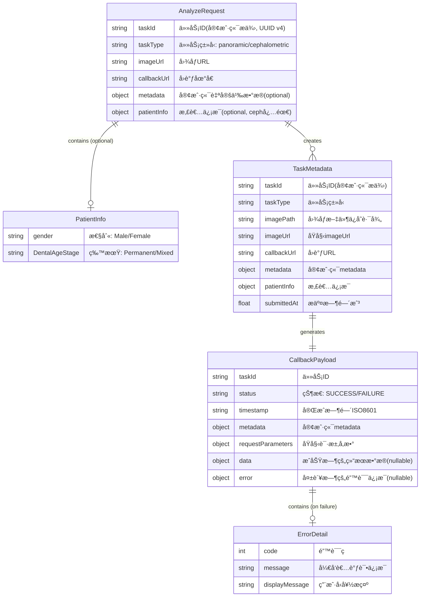
```mermaid
erDiagram
    AnalyzeRequest ||--o| PatientInfo : "contains (optional)"
    AnalyzeRequest ||--o{ TaskMetadata : creates
    TaskMetadata ||--|| CallbackPayload : generates
    CallbackPayload ||--o| ErrorDetail : "contains (on failure)"
    
    AnalyzeRequest {
        string taskId "任务ID(客户端æä¾›, UUID v4)"
        string taskType "任务类å‹: panoramic/cephalometric"
        string imageUrl "图åƒURL"
        string callbackUrl "å›è°ƒåœ°å€"
        object metadata "客户端自定义数æ®(optional)"
        object patientInfo "患者信æ¯(optional, ceph必需)"
    }
    
    PatientInfo {
        string gender "性别: Male/Female"
        string DentalAgeStage "牙期: Permanent/Mixed"
    }
    
    TaskMetadata {
        string taskId "任务ID(客户端æä¾›)"
        string taskType "任务类å‹"
        string imagePath "图åƒæ–‡ä»¶ä¿å­˜è·¯å¾„"
        string imageUrl "åŸå§‹imageUrl"
        string callbackUrl "å›è°ƒURL"
        object metadata "客户端metadata"
        object patientInfo "患者信æ¯"
        float submittedAt "æ交时间戳"
    }
    
    CallbackPayload {
        string taskId "任务ID"
        string status "状æ€: SUCCESS/FAILURE"
        string timestamp "完æˆæ—¶é—´ISO8601"
        object metadata "客户端metadata"
        object requestParameters "åŸå§‹è¯·æ±‚å‚æ•°"
        object data "æˆåŠŸæ—¶çš„结æœæ•°æ®(nullable)"
        object error "失败时的错误信æ¯(nullable)"
    }
    
    ErrorDetail {
        int code "错误ç "
        string message "å¼€å‘者调试信æ¯"
        string displayMessage "用户å‹å¥½æ示"
    }
```

### æ•°æ®æ¨¡å‹è¯¦ç»†å®šä¹‰ v2

#### 1. AnalyzeRequest（请求体 v2）
```python
# POST /api/v1/analyze
# Content-Type: application/json
{
    "taskId": "550e8400-e29b-41d4-a716-446655440000",   # 客户端æ供的UUID v4 (å¿…å¡«)
    "taskType": "cephalometric",                         # panoramic | cephalometric (å¿…å¡«)
    "imageUrl": "https://example.com/images/xray.jpg",  # HTTP/HTTPS URL (å¿…å¡«)
    "callbackUrl": "https://api.client.com/callback",   # HTTP/HTTPS URL (å¿…å¡«)
    "patientInfo": {                                     # å¯é€‰ï¼ˆcephalometric时必需）
        "gender": "Male",                                # Male | Female
        "DentalAgeStage": "Permanent"                    # Permanent | Mixed
    },
    "metadata": {                                        # å¯é€‰ï¼ˆå®¢æˆ·ç«¯è‡ªå®šä¹‰ï¼‰
        "patientId": "P-12345",
        "orderId": "O-67890"
    }
}
```

#### 2. AnalyzeResponse（202 å“应 v2）
```python
# HTTP 202 Accepted
{
    "taskId": "550e8400-e29b-41d4-a716-446655440000",  # å›æ˜¾å®¢æˆ·ç«¯æ供的taskId
    "status": "QUEUED",                                 # 固定值
    "submittedAt": "2025-11-16T14:30:00Z",             # ISO8601æ ¼å¼
    "metadata": {                                       # å›æ˜¾å®¢æˆ·ç«¯metadata
        "patientId": "P-12345",
        "orderId": "O-67890"
    }
}
```

#### 3. TaskMetadata（Redis 存储 v2）
```python
{
    "taskId": "550e8400-e29b-41d4-a716-446655440000",
    "taskType": "cephalometric",
    "imagePath": "/tmp/uploads/550e8400-e29b-41d4-a716-446655440000.jpg",
    "imageUrl": "https://example.com/images/xray.jpg",
    "callbackUrl": "https://api.client.com/callback",
    "metadata": {
        "patientId": "P-12345",
        "orderId": "O-67890"
    },
    "patientInfo": {
        "gender": "Male",
        "DentalAgeStage": "Permanent"
    },
    "submittedAt": 1700147400.123  # Unix时间戳
}
```

#### 4. CallbackPayload（å›è°ƒè¯·æ±‚体 v2）
```python
# æˆåŠŸæƒ…况
{
    "taskId": "550e8400-e29b-41d4-a716-446655440000",
    "status": "SUCCESS",
    "timestamp": "2025-11-16T14:35:10Z",
    "metadata": {
        "patientId": "P-12345",
        "orderId": "O-67890"
    },
    "requestParameters": {
        "taskType": "cephalometric",
        "imageUrl": "https://example.com/images/xray.jpg"
    },
    "data": {
        # ä» example_ceph_result.json 或 example_pano_result.json çš„ data 字段加载
    },
    "error": null
}

# 失败情况（v2æš‚ä¸å®ç°ï¼‰
{
    "taskId": "550e8400-e29b-41d4-a716-446655440000",
    "status": "FAILURE",
    "timestamp": "2025-11-16T14:35:10Z",
    "metadata": { ... },
    "requestParameters": { ... },
    "data": null,
    "error": {
        "code": 12001,
        "message": "AI inference failed",
        "displayMessage": "AI分æ失败"
    }
}
```

---

## 整体逻辑和交互时åºå›¾ v2

### 核心工作æµç¨‹ï¼ˆä¸v1对比）

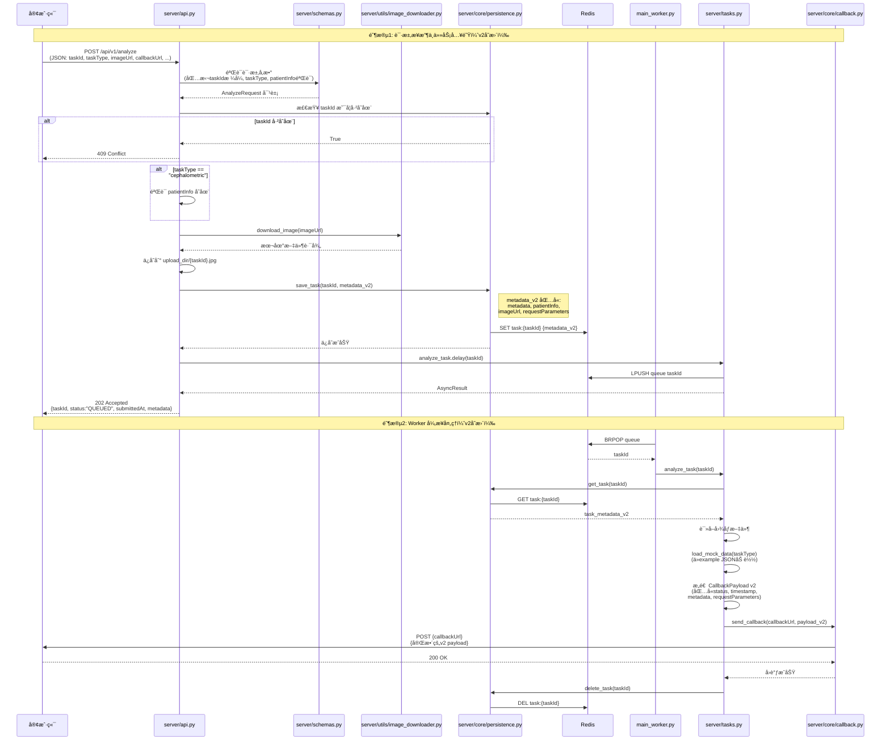
```mermaid
sequenceDiagram
    participant Client as 客户端
    participant API as server/api.py
    participant Schema as server/schemas.py
    participant Downloader as server/utils/image_downloader.py
    participant Persist as server/core/persistence.py
    participant Redis as Redis
    participant Worker as main_worker.py
    participant Task as server/tasks.py
    participant Callback as server/core/callback.py

    Note over Client,Callback: 阶段1: 请求æ¥æ”¶ä¸ä»»åŠ¡å…¥é˜Ÿï¼ˆv2å˜æ›´ï¼‰
    Client->>API: POST /api/v1/analyze<br/>(JSON: taskId, taskType, imageUrl, callbackUrl, ...)
    API->>Schema: 验è¯è¯·æ±‚å‚æ•°<br/>(包括taskIdæ ¼å¼, taskType, patientInfo验è¯)
    Schema-->>API: AnalyzeRequest 对象
    API->>Persist: 检查 taskId 是å¦å·²å­˜åœ¨
    
    alt taskId 已存在
        Persist-->>API: True
        API-->>Client: 409 Conflict
    end
    
    alt taskType == "cephalometric"
        API->>API: éªŒè¯ patientInfo 存在
    end
    
    API->>Downloader: download_image(imageUrl)
    Downloader-->>API: 本地文件路径
    API->>API: ä¿å­˜åˆ° upload_dir/{taskId}.jpg
    
    API->>Persist: save_task(taskId, metadata_v2)
    Note right of Persist: metadata_v2 包å«:<br/>metadata, patientInfo,<br/>imageUrl, requestParameters
    Persist->>Redis: SET task:{taskId} {metadata_v2}
    Persist-->>API: ä¿å­˜æˆåŠŸ
    
    API->>Task: analyze_task.delay(taskId)
    Task->>Redis: LPUSH queue taskId
    Task-->>API: AsyncResult
    
    API-->>Client: 202 Accepted<br/>{taskId, status:"QUEUED", submittedAt, metadata}

    Note over Client,Callback: 阶段2: Worker 异步处ç†ï¼ˆv2å˜æ›´ï¼‰
    Worker->>Redis: BRPOP queue
    Redis-->>Worker: taskId
    Worker->>Task: analyze_task(taskId)
    Task->>Persist: get_task(taskId)
    Persist->>Redis: GET task:{taskId}
    Persist-->>Task: task_metadata_v2
    
    Task->>Task: 读å–图åƒæ–‡ä»¶
    Task->>Task: load_mock_data(taskType)<br/>(ä»example JSON加载)
    Task->>Task: æ„造 CallbackPayload v2<br/>(包å«status, timestamp,<br/>metadata, requestParameters)
    
    Task->>Callback: send_callback(callbackUrl, payload_v2)
    Callback->>Client: POST {callbackUrl}<br/>{完整的v2 payload}
    Client-->>Callback: 200 OK
    Callback-->>Task: å›è°ƒæˆåŠŸ
    Task->>Persist: delete_task(taskId)
    Persist->>Redis: DEL task:{taskId}
```

---

## 涉åŠåˆ°çš„文件详解 v2

### server/schemas.py（é‡æ„）

**a. 文件用途说æ˜**

定义符åˆæ¥å£è§„范 v2 çš„ Pydantic æ•°æ®æ¨¡å‹ï¼Œç”¨äºè¯·æ±‚验è¯å’Œå“应åºåˆ—化。

**b. 文件内类图**

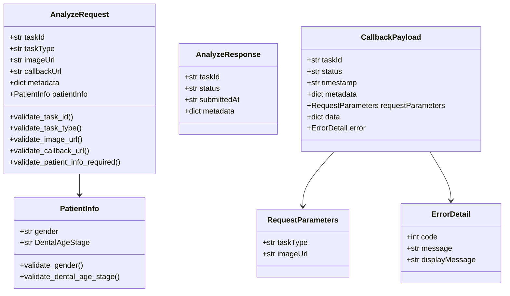
```mermaid
classDiagram
    class PatientInfo {
        +str gender
        +str DentalAgeStage
        +validate_gender()
        +validate_dental_age_stage()
    }
    
    class AnalyzeRequest {
        +str taskId
        +str taskType
        +str imageUrl
        +str callbackUrl
        +dict metadata
        +PatientInfo patientInfo
        +validate_task_id()
        +validate_task_type()
        +validate_image_url()
        +validate_callback_url()
        +validate_patient_info_required()
    }
    
    class AnalyzeResponse {
        +str taskId
        +str status
        +str submittedAt
        +dict metadata
    }
    
    class RequestParameters {
        +str taskType
        +str imageUrl
    }
    
    class CallbackPayload {
        +str taskId
        +str status
        +str timestamp
        +dict metadata
        +RequestParameters requestParameters
        +dict data
        +ErrorDetail error
    }
    
    class ErrorDetail {
        +int code
        +str message
        +str displayMessage
    }
    
    AnalyzeRequest --> PatientInfo
    CallbackPayload --> RequestParameters
    CallbackPayload --> ErrorDetail
```

**c. 函数/方法详解**

#### `PatientInfo` ç±»

æ–°å¢ç±»ï¼Œç”¨äºéªŒè¯æ‚£è€…ä¿¡æ¯ï¼ˆä¾§ä½ç‰‡å¿…需）。

##### 字段说æ˜
- `gender: str` - 性别，å¯é€‰å€¼: "Male", "Female"
- `DentalAgeStage: str` - 牙期，å¯é€‰å€¼: "Permanent"（æ’牙期）, "Mixed"（替牙期）

##### `validate_gender()` 验è¯å™¨
- **用途**: 验è¯æ€§åˆ«å­—段的åˆæ³•æ€§
- **输入å‚æ•°**: `cls`, `v: Optional[str]` - 待验è¯çš„性别
- **输出数æ®ç»“æ„**: `str` - 验è¯é€šè¿‡çš„性别
- **å®ç°æµç¨‹**:

```mermaid
flowchart TD
    A[æ¥æ”¶ gender] --> B{gender in ['Male', 'Female']?}
    B -->|是| C[è¿”å› gender]
    B -->|å¦| D["抛出 ValueError<br/>'gender must be Male or Female'"]
```

##### `validate_dental_age_stage()` 验è¯å™¨
- **用途**: 验è¯ç‰™æœŸå­—段的åˆæ³•æ€§
- **输入å‚æ•°**: `cls`, `v: Optional[str]` - 待验è¯çš„牙期
- **输出数æ®ç»“æ„**: `str` - 验è¯é€šè¿‡çš„牙期
- **å®ç°æµç¨‹**:

```mermaid
flowchart TD
    A[æ¥æ”¶ DentalAgeStage] --> B{DentalAgeStage in ['Permanent', 'Mixed']?}
    B -->|是| C[è¿”å› DentalAgeStage]
    B -->|å¦| D["抛出 ValueError<br/>'DentalAgeStage must be Permanent or Mixed'"]
```

#### `AnalyzeRequest` 类（é‡æ„）

##### 字段说æ˜ï¼ˆå˜æ›´ï¼‰
- `taskId: str` - 任务唯一标识，客户端æ供，UUID v4 æ ¼å¼ï¼ˆä¿ç•™ v1 设计）
- `taskType: str` - 任务类å‹ï¼Œå¯é€‰å€¼: "panoramic", "cephalometric"（v1为 "pano", "ceph"）
- `imageUrl: str` - 图åƒURL（新å¢ï¼Œæ›¿ä»£v1的文件上传）
- `callbackUrl: str` - å›è°ƒURL
- `metadata: Optional[Dict[str, Any]]` - 客户端自定义元数æ®ï¼ˆæ–°å¢ï¼‰
- `patientInfo: Optional[PatientInfo]` - 患者信æ¯ï¼ˆæ–°å¢ï¼‰

##### `validate_task_id()` 验è¯å™¨ï¼ˆä¿ç•™ï¼‰
- **用途**: éªŒè¯ taskId 是å¦ä¸ºæœ‰æ•ˆçš„ UUID v4 æ ¼å¼
- **输入å‚æ•°**: `cls`, `v: str` - 待验è¯çš„ taskId
- **输出数æ®ç»“æ„**: `str` - 验è¯é€šè¿‡çš„ taskId
- **å®ç°æµç¨‹**:

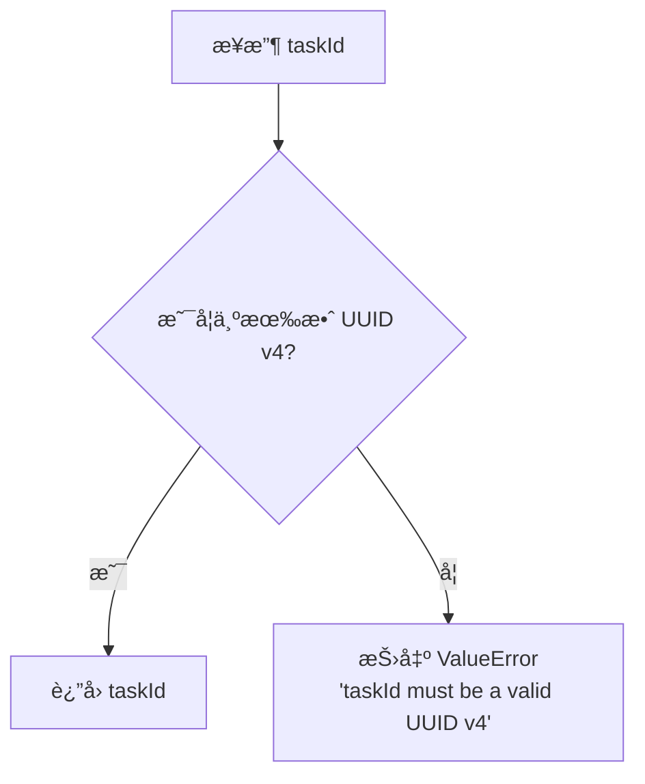
```mermaid
flowchart TD
    A[æ¥æ”¶ taskId] --> B{是å¦ä¸ºæœ‰æ•ˆ UUID v4?}
    B -->|是| C[è¿”å› taskId]
    B -->|å¦| D["抛出 ValueError<br/>'taskId must be a valid UUID v4'"]
```

##### `validate_task_type()` 验è¯å™¨ï¼ˆä¿®æ”¹ï¼‰
- **用途**: éªŒè¯ taskType 是å¦åœ¨å…许的范围内
- **输入å‚æ•°**: `cls`, `v: str` - 待验è¯çš„ taskType
- **输出数æ®ç»“æ„**: `str` - 验è¯é€šè¿‡çš„ taskType
- **å®ç°æµç¨‹**:

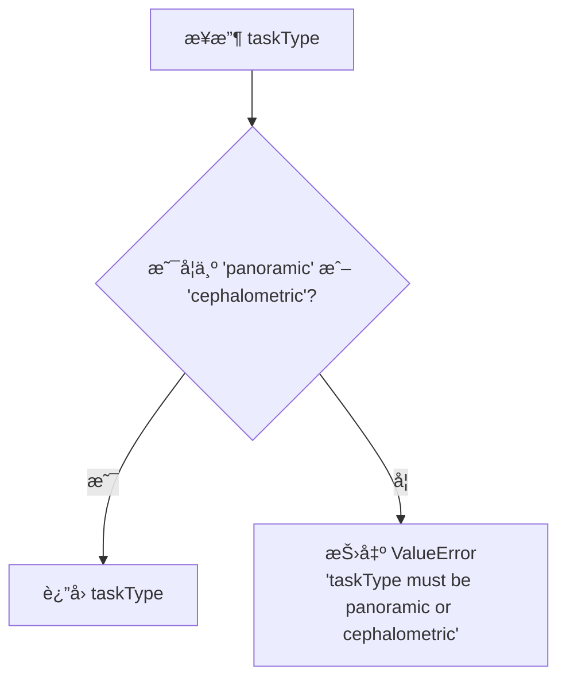
```mermaid
flowchart TD
    A[æ¥æ”¶ taskType] --> B{是å¦ä¸º 'panoramic' 或 'cephalometric'?}
    B -->|是| C[è¿”å› taskType]
    B -->|å¦| D["抛出 ValueError<br/>'taskType must be panoramic or cephalometric'"]
```

**å®ç°è¦ç‚¹**:
```python
@field_validator('taskType')
@classmethod
def validate_task_type(cls, v: str) -> str:
    if v not in ['panoramic', 'cephalometric']:
        raise ValueError("taskType must be either 'panoramic' or 'cephalometric'")
    return v
```

##### `validate_image_url()` 验è¯å™¨ï¼ˆæ–°å¢ï¼‰
- **用途**: éªŒè¯ imageUrl 是å¦ä¸ºæœ‰æ•ˆçš„ HTTP/HTTPS URL
- **输入å‚æ•°**: `cls`, `v: str` - 待验è¯çš„ URL
- **输出数æ®ç»“æ„**: `str` - 验è¯é€šè¿‡çš„ URL
- **å®ç°æµç¨‹**:

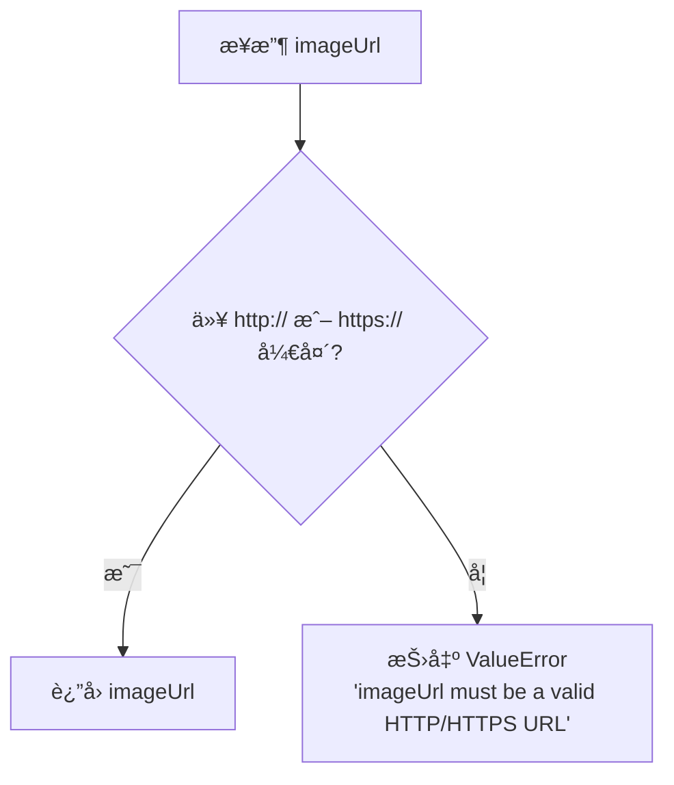
```mermaid
flowchart TD
    A[æ¥æ”¶ imageUrl] --> B{以 http:// 或 https:// 开头?}
    B -->|是| C[è¿”å› imageUrl]
    B -->|å¦| D["抛出 ValueError<br/>'imageUrl must be a valid HTTP/HTTPS URL'"]
```

##### `model_validator(mode='after')` 跨字段验è¯å™¨ï¼ˆæ–°å¢ï¼‰
- **用途**: 验è¯ä¾§ä½ç‰‡ä»»åŠ¡å¿…é¡»æä¾› patientInfo
- **输入å‚æ•°**: `self` - 模å‹å®ä¾‹
- **输出数æ®ç»“æ„**: `self` - 验è¯é€šè¿‡çš„模å‹å®ä¾‹
- **å®ç°æµç¨‹**:

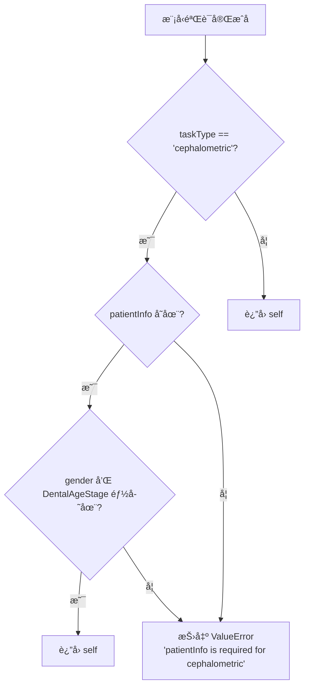
```mermaid
flowchart TD
    A[模å‹éªŒè¯å®Œæˆå] --> B{taskType == 'cephalometric'?}
    B -->|是| C{patientInfo 存在?}
    B -->|å¦| G[è¿”å› self]
    C -->|是| D{gender 和 DentalAgeStage 都存在?}
    C -->|å¦| E["抛出 ValueError<br/>'patientInfo is required for cephalometric'"]
    D -->|是| F[è¿”å› self]
    D -->|å¦| E
```

**å®ç°è¦ç‚¹**:
```python
@model_validator(mode='after')
def validate_patient_info_required(self):
    if self.taskType == 'cephalometric':
        if not self.patientInfo:
            raise ValueError("patientInfo is required when taskType is 'cephalometric'")
        if not self.patientInfo.gender or not self.patientInfo.DentalAgeStage:
            raise ValueError("gender and DentalAgeStage are required in patientInfo for cephalometric tasks")
    return self
```

#### `AnalyzeResponse` 类（修改）

##### 字段说æ˜ï¼ˆå˜æ›´ï¼‰
- `taskId: str` - 任务ID（ä¿ç•™ï¼‰
- `status: str` - 状æ€ï¼Œå›ºå®šå€¼ "QUEUED"（ä¿ç•™ï¼‰
- `submittedAt: str` - æ交时间，ISO8601æ ¼å¼ï¼ˆæ–°å¢ï¼‰
- `metadata: Optional[Dict[str, Any]]` - å›æ˜¾å®¢æˆ·ç«¯metadata（新å¢ï¼‰
- ~~`message: str`~~（移除）

#### `RequestParameters` 类（新å¢ï¼‰

用äºåœ¨å›è°ƒä¸­è®°å½•åŸå§‹è¯·æ±‚å‚数。

##### 字段说æ˜
- `taskType: str` - 任务类å‹
- `imageUrl: str` - åŸå§‹å›¾åƒURL

#### `CallbackPayload` 类（é‡æ„）

##### 字段说æ˜ï¼ˆå˜æ›´ï¼‰
- `taskId: str` - 任务ID（ä¿ç•™ï¼‰
- `status: str` - 状æ€ï¼Œ"SUCCESS" 或 "FAILURE"（新å¢ï¼‰
- `timestamp: str` - 完æˆæ—¶é—´ï¼ŒISO8601æ ¼å¼ï¼ˆæ–°å¢ï¼‰
- `metadata: Dict[str, Any]` - 客户端metadata（新å¢ï¼‰
- `requestParameters: RequestParameters` - åŸå§‹è¯·æ±‚å‚数（新å¢ï¼‰
- `data: Optional[Dict[str, Any]]` - æˆåŠŸæ—¶çš„结æœæ•°æ®ï¼ˆä¿ç•™ï¼‰
- `error: Optional[ErrorDetail]` - 失败时的错误信æ¯ï¼ˆä¿ç•™ï¼‰

---

### server/utils/image_downloader.py（新å¢ï¼‰

**a. 文件用途说æ˜**

è´Ÿè´£ä» imageUrl 下载图åƒæ–‡ä»¶åˆ°æœ¬åœ°ï¼ŒåŒ…å«æ ¼å¼éªŒè¯ã€å¤§å°é™åˆ¶ã€è¶…æ—¶æ§åˆ¶ã€‚

**b. 文件内类图**

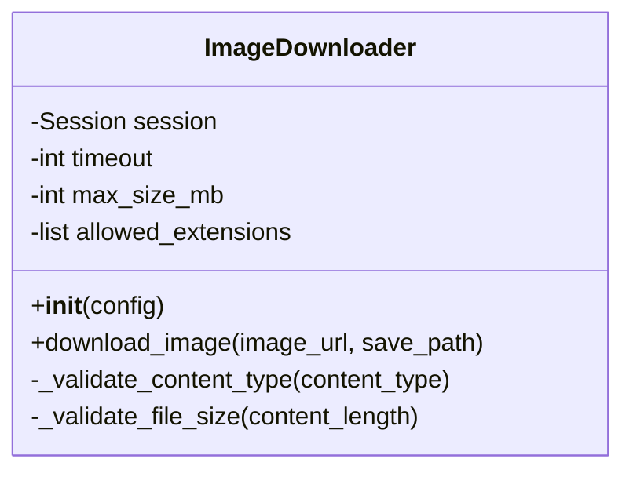
```mermaid
classDiagram
    class ImageDownloader {
        -Session session
        -int timeout
        -int max_size_mb
        -list allowed_extensions
        +__init__(config)
        +download_image(image_url, save_path)
        -_validate_content_type(content_type)
        -_validate_file_size(content_length)
    }
```

**c. 函数/方法详解**

#### `__init__(config: dict)`

- **用途**: åˆå§‹åŒ– HTTP 客户端和下载é…ç½®
- **输入å‚æ•°**:
  - `config: dict` - é…置字典
- **输出数æ®ç»“æ„**: æ— 
- **å®ç°æµç¨‹**:

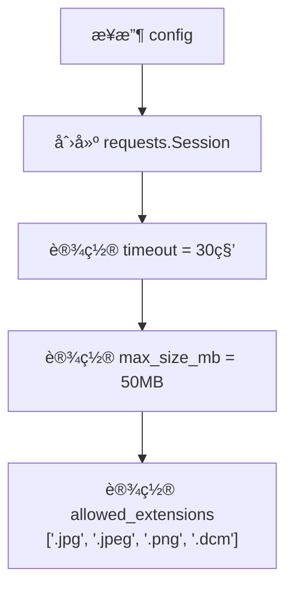
```mermaid
flowchart TD
    A[æ¥æ”¶ config] --> B[创建 requests.Session]
    B --> C["设置 timeout = 30秒"]
    C --> D["设置 max_size_mb = 50MB"]
    D --> E["设置 allowed_extensions<br/>['.jpg', '.jpeg', '.png', '.dcm']"]
```

#### `download_image(image_url: str, save_path: str) -> bool`

- **用途**: ä» URL 下载图åƒæ–‡ä»¶å¹¶ä¿å­˜åˆ°æŒ‡å®šè·¯å¾„
- **输入å‚æ•°**:
  - `image_url: str` - 图åƒURL
  - `save_path: str` - ä¿å­˜è·¯å¾„
- **输出数æ®ç»“æ„**: `bool` - 是å¦æˆåŠŸ
- **å®ç°æµç¨‹**:

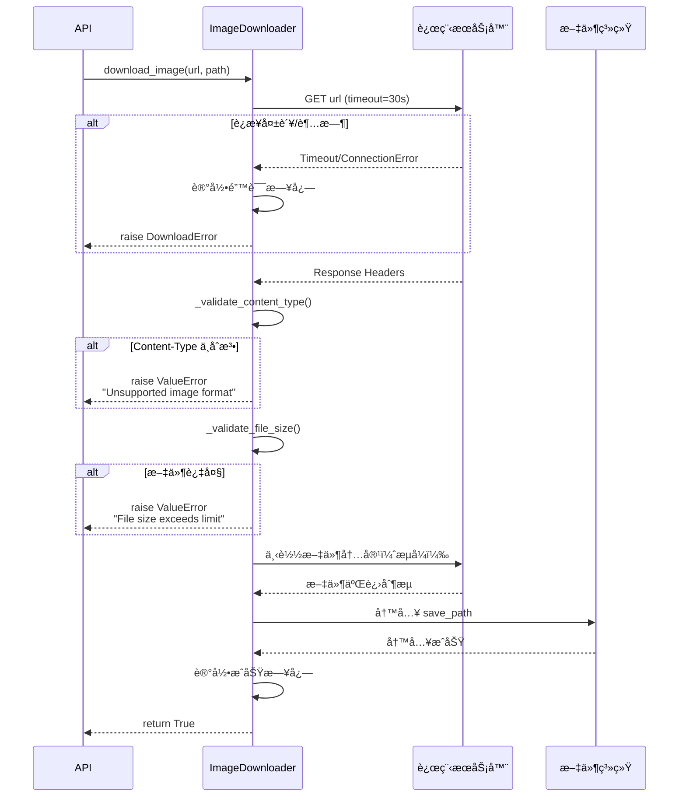
```mermaid
sequenceDiagram
    participant Caller as API
    participant Downloader as ImageDownloader
    participant Remote as 远程æœåŠ¡å™¨
    participant FS as 文件系统

    Caller->>Downloader: download_image(url, path)
    Downloader->>Remote: GET url (timeout=30s)
    
    alt è¿æ¥å¤±è´¥/超时
        Remote-->>Downloader: Timeout/ConnectionError
        Downloader->>Downloader: 记录错误日志
        Downloader-->>Caller: raise DownloadError
    end
    
    Remote-->>Downloader: Response Headers
    Downloader->>Downloader: _validate_content_type()
    
    alt Content-Type ä¸åˆæ³•
        Downloader-->>Caller: raise ValueError<br/>"Unsupported image format"
    end
    
    Downloader->>Downloader: _validate_file_size()
    
    alt 文件过大
        Downloader-->>Caller: raise ValueError<br/>"File size exceeds limit"
    end
    
    Downloader->>Remote: 下载文件内容（æµå¼ï¼‰
    Remote-->>Downloader: 文件二进制æµ
    Downloader->>FS: 写入 save_path
    FS-->>Downloader: 写入æˆåŠŸ
    Downloader->>Downloader: 记录æˆåŠŸæ—¥å¿—
    Downloader-->>Caller: return True
```

**å®ç°è¦ç‚¹**:
```python
def download_image(self, image_url: str, save_path: str) -> bool:
    """
    ä»URL下载图åƒæ–‡ä»¶
    
    Raises:
        ValueError: 图åƒæ ¼å¼ä¸æ”¯æŒæˆ–文件过大
        requests.exceptions.RequestException: 网络错误
    """
    try:
        # å‘é€ HEAD 请求检查文件类å‹å’Œå¤§å°
        head_response = self.session.head(image_url, timeout=self.timeout, allow_redirects=True)
        head_response.raise_for_status()
        
        # éªŒè¯ Content-Type
        content_type = head_response.headers.get('Content-Type', '')
        self._validate_content_type(content_type)
        
        # 验è¯æ–‡ä»¶å¤§å°
        content_length = head_response.headers.get('Content-Length')
        if content_length:
            self._validate_file_size(int(content_length))
        
        # 下载文件（æµå¼ï¼‰
        response = self.session.get(image_url, timeout=self.timeout, stream=True)
        response.raise_for_status()
        
        # ä¿å­˜åˆ°æœ¬åœ°
        with open(save_path, 'wb') as f:
            for chunk in response.iter_content(chunk_size=8192):
                f.write(chunk)
        
        logger.info(f"Image downloaded successfully: {image_url} -> {save_path}")
        return True
        
    except requests.Timeout:
        logger.error(f"Image download timeout: {image_url}")
        raise
    except requests.RequestException as e:
        logger.error(f"Image download failed: {image_url}, {e}")
        raise
```

#### `_validate_content_type(content_type: str) -> None`

- **用途**: éªŒè¯ HTTP Content-Type 是å¦ä¸ºå›¾åƒç±»å‹
- **输入å‚æ•°**:
  - `content_type: str` - Content-Type 头
- **输出数æ®ç»“æ„**: 无（验è¯å¤±è´¥æŠ›å‡ºå¼‚常）
- **å®ç°æµç¨‹**:

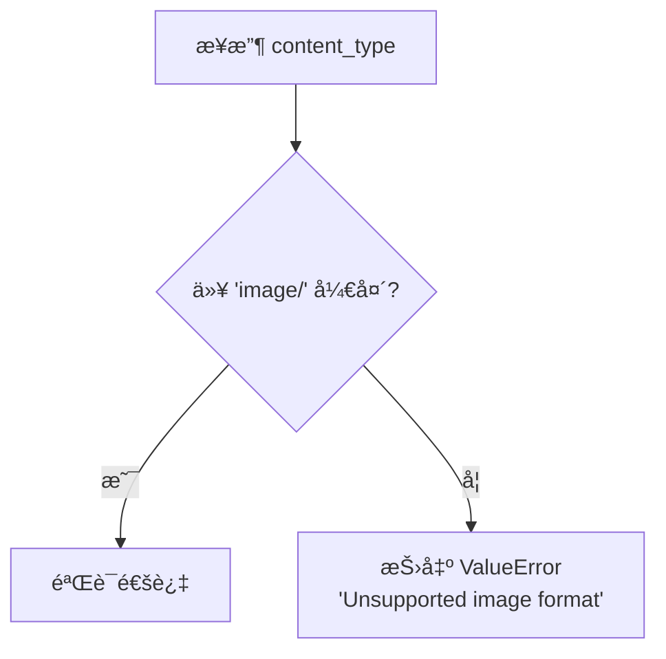
```mermaid
flowchart TD
    A[æ¥æ”¶ content_type] --> B{以 'image/' 开头?}
    B -->|是| C[验è¯é€šè¿‡]
    B -->|å¦| D["抛出 ValueError<br/>'Unsupported image format'"]
```

#### `_validate_file_size(content_length: int) -> None`

- **用途**: 验è¯æ–‡ä»¶å¤§å°æ˜¯å¦åœ¨é™åˆ¶å†…
- **输入å‚æ•°**:
  - `content_length: int` - Content-Length 字节数
- **输出数æ®ç»“æ„**: 无（验è¯å¤±è´¥æŠ›å‡ºå¼‚常）
- **å®ç°æµç¨‹**:

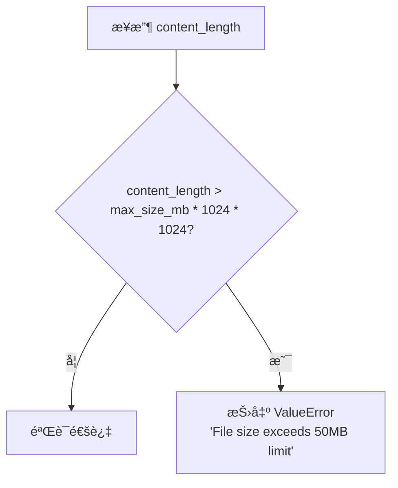
```mermaid
flowchart TD
    A[æ¥æ”¶ content_length] --> B{content_length > max_size_mb * 1024 * 1024?}
    B -->|å¦| C[验è¯é€šè¿‡]
    B -->|是| D["抛出 ValueError<br/>'File size exceeds 50MB limit'"]
```

---

### server/api.py（修改）

**a. 文件用途说æ˜**

定义 FastAPI 应用和所有 HTTP 路由，负责请求验è¯ã€å›¾åƒä¸‹è½½ã€ä»»åŠ¡å…¥é˜Ÿï¼ˆv2å议）。

**b. 修改点说æ˜**

#### `POST /api/v1/analyze` 路由（é‡æ„）

##### å˜æ›´å†…容
1. **请求å‚æ•°**ï¼šä» Form + File 改为纯 JSON
2. **taskId生æˆ**：由æœåŠ¡ç«¯ç”Ÿæˆ UUID v4
3. **图åƒè·å–**ï¼šä» imageUrl 下载而éç›´æ¥ä¸Šä¼ 
4. **å‚数验è¯**ï¼šæ–°å¢ patientInfo 验è¯ï¼ˆé’ˆå¯¹ cephalometric）
5. **å“应格å¼**ï¼šè¿”å› submittedAt å’Œ metadata

##### 路由签å（å˜æ›´ï¼‰
```python
# v1.0
@app.post("/api/v1/analyze", response_model=AnalyzeResponse, status_code=202)
async def analyze(
    taskId: str = Form(...),
    taskType: str = Form(...),
    callbackUrl: str = Form(...),
    image: UploadFile = File(...)
):

# v2.0
@app.post("/api/v1/analyze", response_model=AnalyzeResponse, status_code=202)
async def analyze(request: AnalyzeRequest):
```

##### å®ç°æµç¨‹ï¼ˆv2）

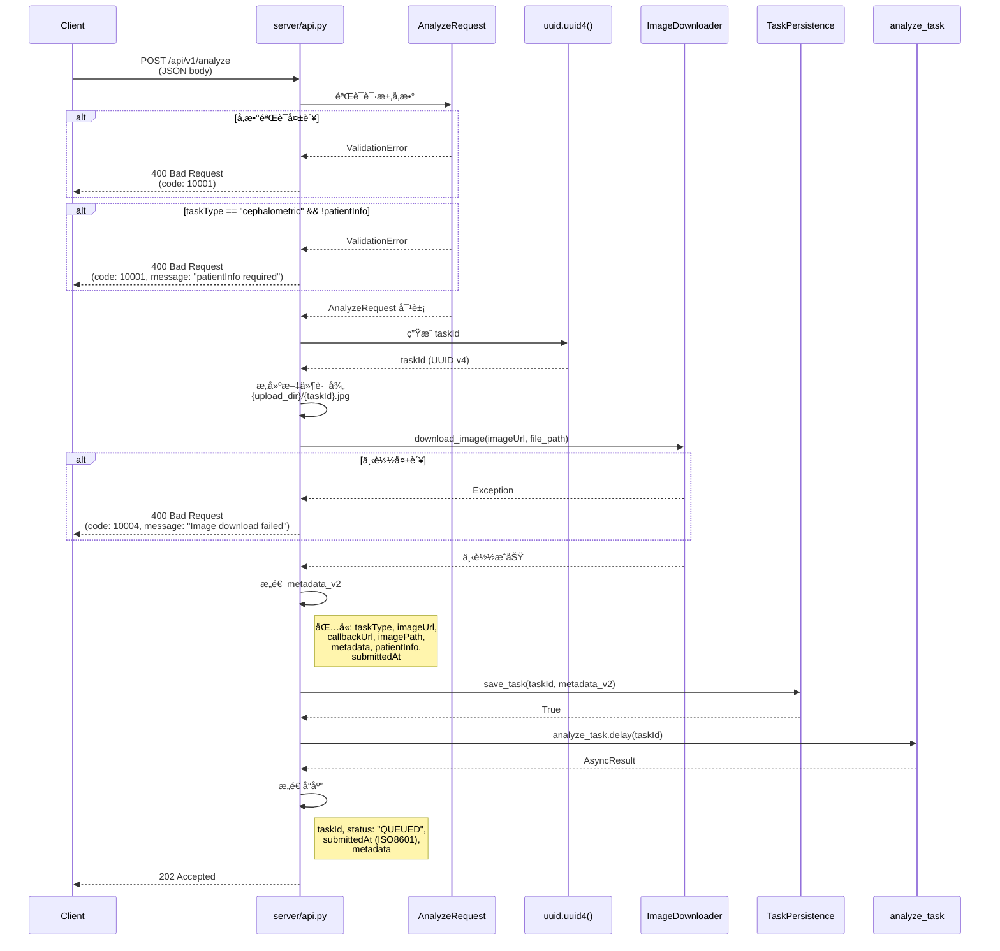
```mermaid
sequenceDiagram
    participant Client
    participant API as server/api.py
    participant Schema as AnalyzeRequest
    participant UUID as uuid.uuid4()
    participant Downloader as ImageDownloader
    participant Persist as TaskPersistence
    participant Task as analyze_task

    Client->>API: POST /api/v1/analyze<br/>(JSON body)
    API->>Schema: 验è¯è¯·æ±‚å‚æ•°
    
    alt å‚数验è¯å¤±è´¥
        Schema-->>API: ValidationError
        API-->>Client: 400 Bad Request<br/>(code: 10001)
    end
    
    alt taskType == "cephalometric" && !patientInfo
        Schema-->>API: ValidationError
        API-->>Client: 400 Bad Request<br/>(code: 10001, message: "patientInfo required")
    end
    
    Schema-->>API: AnalyzeRequest 对象
    
    API->>UUID: ç”Ÿæˆ taskId
    UUID-->>API: taskId (UUID v4)
    
    API->>API: æ„建文件路径<br/>{upload_dir}/{taskId}.jpg
    
    API->>Downloader: download_image(imageUrl, file_path)
    
    alt 下载失败
        Downloader-->>API: Exception
        API-->>Client: 400 Bad Request<br/>(code: 10004, message: "Image download failed")
    end
    
    Downloader-->>API: 下载æˆåŠŸ
    
    API->>API: æ„造 metadata_v2
    Note right of API: 包å«: taskType, imageUrl,<br/>callbackUrl, imagePath,<br/>metadata, patientInfo,<br/>submittedAt
    
    API->>Persist: save_task(taskId, metadata_v2)
    Persist-->>API: True
    
    API->>Task: analyze_task.delay(taskId)
    Task-->>API: AsyncResult
    
    API->>API: æ„造å“应
    Note right of API: taskId, status: "QUEUED",<br/>submittedAt (ISO8601),<br/>metadata
    
    API-->>Client: 202 Accepted
```

##### å®ç°è¦ç‚¹ï¼ˆä¼ªä»£ç ï¼‰
```python
@app.post("/api/v1/analyze", response_model=AnalyzeResponse, status_code=202)
async def analyze(request: AnalyzeRequest):
    """
    æ¥æ”¶æ¨ç†è¯·æ±‚（v2å议）
    """
    # 1. ç”Ÿæˆ taskId（æœåŠ¡ç«¯ç”Ÿæˆï¼‰
    task_id = str(uuid.uuid4())
    
    # 2. 确定文件扩展å（默认 .jpg）
    file_ext = '.jpg'
    image_filename = f"{task_id}{file_ext}"
    image_path = os.path.join(_upload_dir, image_filename)
    
    # 3. 下载图åƒæ–‡ä»¶
    try:
        _image_downloader.download_image(request.imageUrl, image_path)
    except Exception as e:
        logger.error(f"Image download failed: {e}")
        raise HTTPException(
            status_code=400,
            detail=ErrorResponse(
                code=10004,
                message="Image download failed",
                detail=str(e)
            ).model_dump()
        )
    
    # 4. æ„é€ ä»»åŠ¡å…ƒæ•°æ® v2
    submitted_at = time.time()
    metadata_v2 = {
        "taskId": task_id,
        "taskType": request.taskType,
        "imageUrl": request.imageUrl,
        "imagePath": image_path,
        "callbackUrl": request.callbackUrl,
        "metadata": request.metadata or {},
        "patientInfo": request.patientInfo.model_dump() if request.patientInfo else None,
        "submittedAt": submitted_at
    }
    
    # 5. ä¿å­˜åˆ° Redis
    success = _persistence.save_task(task_id, metadata_v2)
    if not success:
        # 清ç†æ–‡ä»¶
        if os.path.exists(image_path):
            os.remove(image_path)
        raise HTTPException(status_code=500, detail=...)
    
    # 6. 异步任务入队
    try:
        task_result = analyze_task.delay(task_id)
        logger.info(f"Task queued: {task_id}")
    except Exception as e:
        # 清ç†å…ƒæ•°æ®å’Œæ–‡ä»¶
        _persistence.delete_task(task_id)
        if os.path.exists(image_path):
            os.remove(image_path)
        raise HTTPException(status_code=500, detail=...)
    
    # 7. è¿”å› 202 å“应 v2
    return AnalyzeResponse(
        taskId=task_id,
        status="QUEUED",
        submittedAt=datetime.fromtimestamp(submitted_at, tz=timezone.utc).isoformat(),
        metadata=request.metadata
    )
```

---

### server/tasks.py（修改）

**a. 修改点说æ˜**

#### `load_mock_data(task_type: str) -> dict` 函数（新å¢ï¼‰

- **用途**: ä» example JSON 文件加载 mock æ•°æ®
- **输入å‚æ•°**:
  - `task_type: str` - 任务类å‹ï¼ˆpanoramic/cephalometric）
- **输出数æ®ç»“æ„**: `dict` - data 字段的完整 JSON
- **å®ç°æµç¨‹**:

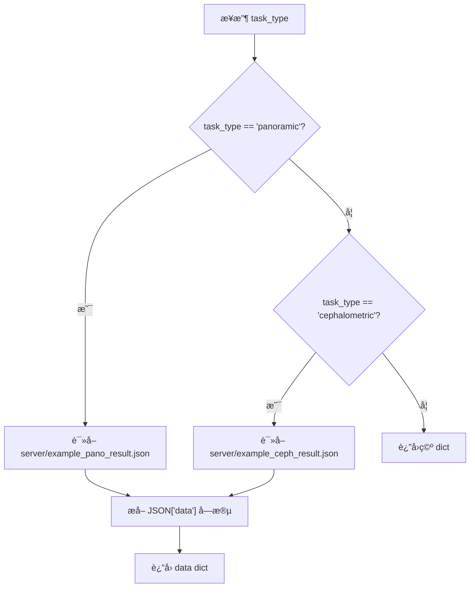
```mermaid
flowchart TD
    A[æ¥æ”¶ task_type] --> B{task_type == 'panoramic'?}
    B -->|是| C["è¯»å– server/example_pano_result.json"]
    B -->|å¦| D{task_type == 'cephalometric'?}
    D -->|是| E["è¯»å– server/example_ceph_result.json"]
    D -->|å¦| F[è¿”å›ç©º dict]
    C --> G["æå– JSON['data'] 字段"]
    E --> G
    G --> H[è¿”å› data dict]
```

**å®ç°è¦ç‚¹**:
```python
import json
from pathlib import Path

def load_mock_data(task_type: str) -> dict:
    """
    ä» example JSON 文件加载 mock æ•°æ®çš„ data 字段
    """
    if task_type == 'panoramic':
        example_file = Path(__file__).parent.parent / 'server' / 'example_pano_result.json'
    elif task_type == 'cephalometric':
        example_file = Path(__file__).parent.parent / 'server' / 'example_ceph_result.json'
    else:
        logger.warning(f"Unknown task type for mock data: {task_type}")
        return {}
    
    try:
        with open(example_file, 'r', encoding='utf-8') as f:
            full_json = json.load(f)
            return full_json.get('data', {})
    except Exception as e:
        logger.error(f"Failed to load mock data from {example_file}: {e}")
        return {}
```

#### `analyze_task(task_id: str)` 函数（修改）

##### 修改点
1. **è·å–扩展元数æ®**ï¼šä» Redis è·å– metadataã€patientInfoã€imageUrlã€submittedAt
2. **调用 load_mock_data**：替代 v1 的 mock_inference
3. **æ„造 v2 å›è°ƒ payload**ï¼šåŒ…å« statusã€timestampã€metadataã€requestParameters

##### å®ç°æµç¨‹ï¼ˆä¿®æ”¹éƒ¨åˆ†ï¼‰

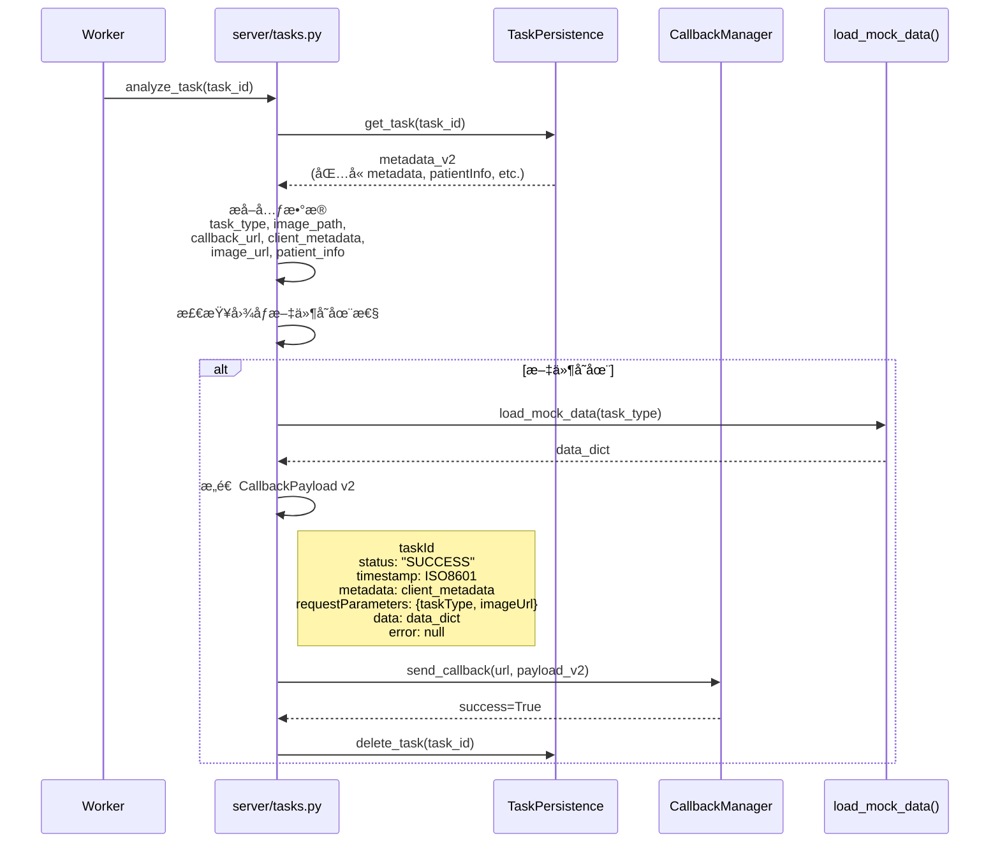
```mermaid
sequenceDiagram
    participant Worker
    participant Task as server/tasks.py
    participant Persist as TaskPersistence
    participant Callback as CallbackManager
    participant LoadData as load_mock_data()

    Worker->>Task: analyze_task(task_id)
    Task->>Persist: get_task(task_id)
    Persist-->>Task: metadata_v2<br/>(åŒ…å« metadata, patientInfo, etc.)
    
    Task->>Task: æå–元数æ®<br/>task_type, image_path,<br/>callback_url, client_metadata,<br/>image_url, patient_info
    
    Task->>Task: 检查图åƒæ–‡ä»¶å­˜åœ¨æ€§
    
    alt 文件存在
        Task->>LoadData: load_mock_data(task_type)
        LoadData-->>Task: data_dict
        
        Task->>Task: æ„造 CallbackPayload v2
        Note right of Task: taskId<br/>status: "SUCCESS"<br/>timestamp: ISO8601<br/>metadata: client_metadata<br/>requestParameters: {taskType, imageUrl}<br/>data: data_dict<br/>error: null
        
        Task->>Callback: send_callback(url, payload_v2)
        Callback-->>Task: success=True
        Task->>Persist: delete_task(task_id)
    end
```

**å®ç°è¦ç‚¹ï¼ˆä¼ªä»£ç ï¼‰**:
```python
@celery_app.task(name='server.tasks.analyze_task', bind=True)
def analyze_task(self, task_id: str):
    """
    异步æ¨ç†ä»»åŠ¡ï¼ˆv2å议）
    """
    logger.info(f"Task started: {task_id}")
    
    config = load_config()
    persistence = TaskPersistence(config)
    callback_mgr = CallbackManager(config)
    
    try:
        # 1. è·å–ä»»åŠ¡å…ƒæ•°æ® v2
        metadata_v2 = persistence.get_task(task_id)
        if not metadata_v2:
            logger.error(f"Task not found: {task_id}")
            return
        
        task_type = metadata_v2['taskType']
        image_path = metadata_v2['imagePath']
        callback_url = metadata_v2['callbackUrl']
        client_metadata = metadata_v2.get('metadata', {})
        image_url = metadata_v2.get('imageUrl', '')
        patient_info = metadata_v2.get('patientInfo')
        
        # 2. 检查图åƒæ–‡ä»¶
        if not os.path.exists(image_path):
            # （v2 æš‚ä¸å®ç°é”™è¯¯å›è°ƒï¼‰
            logger.error(f"Image file not found: {image_path}")
            return
        
        # 3. 加载 Mock æ•°æ®ï¼ˆä» example JSON）
        try:
            data_dict = load_mock_data(task_type)
            logger.info(f"Mock data loaded for {task_type}: {task_id}")
            
            # 4. æ„造 CallbackPayload v2
            from datetime import datetime, timezone
            
            payload_v2 = {
                "taskId": task_id,
                "status": "SUCCESS",
                "timestamp": datetime.now(timezone.utc).isoformat(),
                "metadata": client_metadata,
                "requestParameters": {
                    "taskType": task_type,
                    "imageUrl": image_url
                },
                "data": data_dict,
                "error": None
            }
            
        except Exception as e:
            # （v2 æš‚ä¸å®ç°é”™è¯¯å›è°ƒï¼‰
            logger.error(f"Failed to load mock data: {task_id}, {e}")
            return
        
        # 5. å‘é€å›è°ƒ v2
        success = callback_mgr.send_callback(callback_url, payload_v2)
        
        # 6. 清ç†ä»»åŠ¡å…ƒæ•°æ®
        if success:
            persistence.delete_task(task_id)
            logger.info(f"Task completed and cleaned: {task_id}")
        else:
            logger.warning(f"Task completed but callback failed: {task_id}")
            
    except Exception as e:
        logger.error(f"Task execution failed: {task_id}, {e}")
```

---

### server/core/callback.py（修改）

**a. 文件用途说æ˜**

å°è£… HTTP å›è°ƒé€»è¾‘，负责å‘客户端å‘é€æ¨ç†ç»“æœï¼ŒåŒ…å«è¶…æ—¶æ§åˆ¶ï¼ˆv2 ä¸å«é‡è¯•ï¼‰ã€‚

**b. 修改点说æ˜**

#### 1. æ–°å¢ `X-Timestamp` Header（对é½æ¥å£è§„范）

æ ¹æ®æ¥å£å®šä¹‰.md è¦æ±‚，å›è°ƒè¯·æ±‚必须包å«ï¼š
- `Content-Type: application/json`
- `X-Timestamp: {unix_timestamp}` - å›è°ƒå‘出的 Unix 时间戳（秒）

#### 2. 调整超时时间

- ä» v1 çš„ 30 秒调整为 **3 秒**（符åˆæ¥å£å®šä¹‰è¦æ±‚）

**c. 文件内类图**

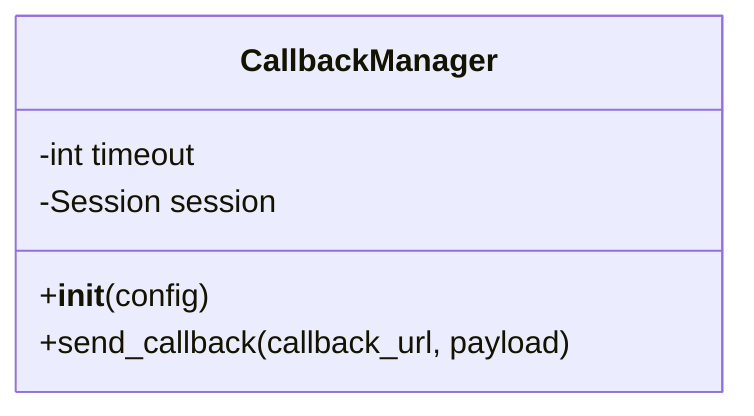
```mermaid
classDiagram
    class CallbackManager {
        -int timeout
        -Session session
        +__init__(config)
        +send_callback(callback_url, payload)
    }
```

**d. 函数/方法详解**

#### `__init__(config: dict)`

- **用途**: åˆå§‹åŒ– HTTP 客户端和é…ç½®
- **输入å‚æ•°**:
  - `config: dict` - é…置字典
- **输出数æ®ç»“æ„**: æ— 
- **å®ç°æµç¨‹**:

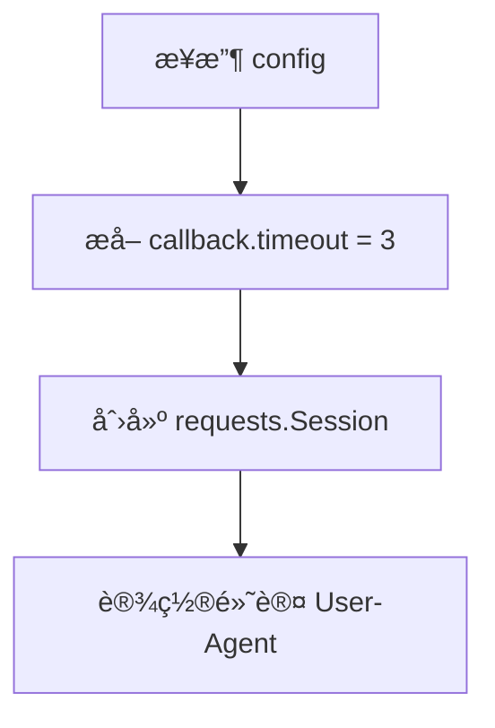
```mermaid
flowchart TD
    A[æ¥æ”¶ config] --> B["æå– callback.timeout = 3"]
    B --> C[创建 requests.Session]
    C --> D[设置默认 User-Agent]
```

#### `send_callback(callback_url: str, payload: dict) -> bool`

- **用途**: å‘指定 URL å‘é€ POST å›è°ƒè¯·æ±‚（v2 å议）
- **输入å‚æ•°**:
  - `callback_url: str` - å›è°ƒ URL
  - `payload: dict` - å›è°ƒè´Ÿè½½ï¼ˆåŒ…å« taskId, status, timestamp, metadata, requestParameters, data, error）
- **输出数æ®ç»“æ„**: `bool` - å›è°ƒæ˜¯å¦æˆåŠŸï¼ˆHTTP 200）
- **å®ç°æµç¨‹**:

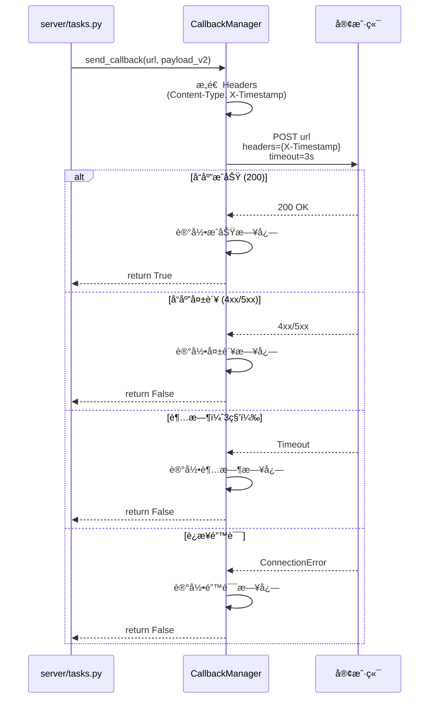
```mermaid
sequenceDiagram
    participant Task as server/tasks.py
    participant Callback as CallbackManager
    participant Client as 客户端

    Task->>Callback: send_callback(url, payload_v2)
    Callback->>Callback: æ„造 Headers<br/>(Content-Type, X-Timestamp)
    Callback->>Client: POST url<br/>headers={X-Timestamp}<br/>timeout=3s
    
    alt å“应æˆåŠŸ (200)
        Client-->>Callback: 200 OK
        Callback->>Callback: 记录æˆåŠŸæ—¥å¿—
        Callback-->>Task: return True
    else å“应失败 (4xx/5xx)
        Client-->>Callback: 4xx/5xx
        Callback->>Callback: 记录失败日志
        Callback-->>Task: return False
    else 超时（3秒）
        Client-->>Callback: Timeout
        Callback->>Callback: 记录超时日志
        Callback-->>Task: return False
    else è¿æ¥é”™è¯¯
        Client-->>Callback: ConnectionError
        Callback->>Callback: 记录错误日志
        Callback-->>Task: return False
    end
```

**å®ç°è¦ç‚¹ï¼ˆä¼ªä»£ç ï¼‰**:
```python
import time
import requests

def send_callback(self, callback_url: str, payload: dict) -> bool:
    """
    å‘指定 URL å‘é€ POST å›è°ƒè¯·æ±‚（v2 å议）
    
    Args:
        callback_url: å›è°ƒ URL
        payload: å›è°ƒè´Ÿè½½ï¼ˆåŒ…å« taskId, status, timestamp, metadata, requestParameters, data, error）
    
    Returns:
        bool: å›è°ƒæ˜¯å¦æˆåŠŸï¼ˆHTTP 200）
    """
    try:
        # æ„造 Headersï¼ˆåŒ…å« X-Timestamp）
        headers = {
            'Content-Type': 'application/json',
            'X-Timestamp': str(int(time.time()))  # Unix 时间戳（秒）
        }
        
        # å‘é€ POST 请求（超时 3 秒）
        response = self.session.post(
            callback_url,
            json=payload,
            headers=headers,
            timeout=self.timeout  # config.callback.timeout = 3
        )
        
        if response.status_code == 200:
            logger.info(f"Callback success: {callback_url}")
            return True
        else:
            logger.error(f"Callback failed: status={response.status_code}, url={callback_url}")
            return False
            
    except requests.Timeout:
        logger.error(f"Callback timeout (3s): {callback_url}")
        return False
    except requests.ConnectionError as e:
        logger.error(f"Callback connection error: {callback_url}, {e}")
        return False
    except requests.RequestException as e:
        logger.error(f"Callback error: {callback_url}, {e}")
        return False
```

**关键å˜æ›´ç‚¹ï¼ˆv1 → v2）**：
1. ✅ 添加 `X-Timestamp` header（新å¢ï¼‰
2. ✅ è¶…æ—¶æ—¶é—´ä» 30 秒改为 3 秒（修改）
3. â¸ï¸ é‡è¯•æœºåˆ¶å»¶å到 v3 å®ç°

---

### server/core/persistence.py（轻度修改）

**a. 修改点说æ˜**

无需修改代ç ï¼Œåªæ˜¯å­˜å‚¨çš„字典结æ„扩展了字段。`TaskMetadata` ä¸æ˜¯ç±»ï¼Œåªæ˜¯å­˜å‚¨çš„ JSON 字典。

**b. 扩展字段列表**

v2 版本在 Redis 中存储的 `task:{taskId}` 值包å«ä»¥ä¸‹å­—段：

```python
{
    "taskId": str,
    "taskType": str,              # "panoramic" or "cephalometric"
    "imageUrl": str,              # æ–°å¢ï¼šåŸå§‹å›¾åƒURL
    "imagePath": str,
    "callbackUrl": str,
    "metadata": dict,             # æ–°å¢ï¼šå®¢æˆ·ç«¯è‡ªå®šä¹‰æ•°æ®
    "patientInfo": dict or None,  # æ–°å¢ï¼šæ‚£è€…ä¿¡æ¯ï¼ˆä¾§ä½ç‰‡ï¼‰
    "submittedAt": float          # æ–°å¢ï¼šæ交时间戳（用äºç”Ÿæˆ ISO8601）
}
```

---

## é…置项 v2（扩展）

### config.yaml（修改é…置）

```yaml
# Redis é…置（v1 ä¿æŒä¸å˜ï¼‰
redis:
  host: "localhost"
  port: 6379
  db: 0
  password: null

# Celery é…置（v1 ä¿æŒä¸å˜ï¼‰
celery:
  broker_url: "redis://localhost:6379/0"
  result_backend: "redis://localhost:6379/1"

# API é…置（v1 ä¿æŒä¸å˜ï¼‰
api:
  host: "0.0.0.0"
  port: 18000
  upload_dir: "./tmp/uploads"

# Worker é…置（v1 ä¿æŒä¸å˜ï¼‰
worker:
  concurrency: 2
  loglevel: "info"

# å›è°ƒé…置（v2 修改）
callback:
  timeout: 3                     # âš ï¸ ä» v1 çš„ 30 秒改为 3 秒（对é½æ¥å£å®šä¹‰ï¼‰
  
# 任务é…置（v1 ä¿æŒä¸å˜ï¼‰
task:
  result_ttl: 3600               # Redis ä¸­ä»»åŠ¡å…ƒæ•°æ® TTL（秒）

# 图åƒä¸‹è½½é…置（v2 æ–°å¢ï¼‰
image_download:
  timeout: 30                    # 下载超时时间（秒）
  max_size_mb: 50                # 最大文件大å°ï¼ˆMB）
  allowed_extensions:            # å…许的图åƒæ ¼å¼
    - .jpg
    - .jpeg
    - .png
    - .dcm
```

**é…置说æ˜**：
- `callback.timeout`: ä» 30 秒改为 **3 秒**，符åˆæ¥å£å®šä¹‰è¦æ±‚
- `image_download.timeout`: ä¿æŒ 30 秒（下载图åƒéœ€è¦æ›´é•¿æ—¶é—´ï¼‰
- 两者的超时时间ä¸åŒæ˜¯åˆç†çš„ï¼šä¸‹è½½å›¾åƒ vs å›è°ƒé€šçŸ¥

---

## 迭代演进ä¾æ® v2

### v2 å®ç°èŒƒå›´ï¼ˆæœ¬æ–‡æ¡£ï¼‰
1. ✅ æ¥å£åè®®å‡çº§ï¼ˆç¬¦åˆæ¥å£å®šä¹‰.md）
2. ✅ 请求格å¼æ”¹ä¸º JSON
3. ✅ **ä¿ç•™ v1 设计**：taskId 由客户端æ供，支æŒå†²çªæ£€æŸ¥
4. ✅ 图åƒä¸‹è½½åŠŸèƒ½ï¼ˆä» imageUrl）
5. ✅ patientInfo 支æŒå’ŒéªŒè¯
6. ✅ å›è°ƒ payload 包å«å®Œæ•´ metadata å’Œ requestParameters
7. ✅ data 部分使用 example JSON å ä½
8. ✅ **å›è°ƒ Header 添加 X-Timestamp**（对é½æ¥å£å®šä¹‰ï¼‰
9. ✅ **å›è°ƒè¶…时调整为 3 秒**（对é½æ¥å£å®šä¹‰ï¼‰
10. â¸ï¸ 错误å›è°ƒï¼ˆé¢„留，v2 æš‚ä¸å®ç°ï¼‰
11. â¸ï¸ å›è°ƒé‡è¯•æœºåˆ¶ï¼ˆæŒ‡æ•°é€€é¿ï¼Œå»¶å到 v3）

### v3 迭代方å‘
1. **集æˆçœŸå® AI 模å‹**
   - 修改点：`server/tasks.py` çš„ `load_mock_data()` → 调用真å®æ¨ç†ç®¡é“
   - ä¾èµ–：`pipelines/pano/` å’Œ `pipelines/ceph/` 模å—

2. **完善错误处ç†å’Œå›è°ƒ**
   - 修改点：`server/tasks.py` 中添加 FAILURE å›è°ƒé€»è¾‘
   - æ–°å¢é”™è¯¯ç ï¼šæŒ‰ç…§æ¥å£å®šä¹‰.md 的错误ç è¡¨å®ç°

3. **添加å›è°ƒé‡è¯•æœºåˆ¶**
   - 修改点：`server/core/callback.py` å®ç°æŒ‡æ•°é€€é¿é‡è¯•
   - é…置项：`callback.max_retries`, `callback.retry_delays`

4. **支æŒä»»åŠ¡çŠ¶æ€æŸ¥è¯¢**
   - æ–°å¢è·¯ç”±ï¼š`GET /api/v1/task/{taskId}`
   - 修改点：扩展 TaskMetadata 存储 status 字段

---

## 附录: v2 测试请求示例

### 全景片请求
```bash
curl -X POST http://localhost:18000/api/v1/analyze \
  -H "Content-Type: application/json" \
  -d '{
    "taskId": "550e8400-e29b-41d4-a716-446655440001",
    "taskType": "panoramic",
    "imageUrl": "https://example.com/images/pano-001.jpg",
    "callbackUrl": "http://localhost:5000/callback",
    "metadata": {
      "patientId": "P-12345",
      "orderId": "O-67890"
    }
  }'
```

### 侧ä½ç‰‡è¯·æ±‚ï¼ˆåŒ…å« patientInfo）
```bash
curl -X POST http://localhost:18000/api/v1/analyze \
  -H "Content-Type: application/json" \
  -d '{
    "taskId": "550e8400-e29b-41d4-a716-446655440002",
    "taskType": "cephalometric",
    "imageUrl": "https://example.com/images/ceph-001.jpg",
    "callbackUrl": "http://localhost:5000/callback",
    "patientInfo": {
      "gender": "Male",
      "DentalAgeStage": "Permanent"
    },
    "metadata": {
      "patientId": "P-12345",
      "orderId": "O-67890"
    }
  }'
```

### 预期 202 å“应
```json
{
  "taskId": "550e8400-e29b-41d4-a716-446655440000",
  "status": "QUEUED",
  "submittedAt": "2025-11-16T14:30:00Z",
  "metadata": {
    "patientId": "P-12345",
    "orderId": "O-67890"
  }
}
```

### 预期å›è°ƒ Payload（æˆåŠŸï¼‰
```json
{
  "taskId": "550e8400-e29b-41d4-a716-446655440000",
  "status": "SUCCESS",
  "timestamp": "2025-11-16T14:35:10Z",
  "metadata": {
    "patientId": "P-12345",
    "orderId": "O-67890"
  },
  "requestParameters": {
    "taskType": "panoramic",
    "imageUrl": "https://example.com/images/pano-001.jpg"
  },
  "data": {
    "Metadata": { ... },
    "AnatomyResults": [ ... ],
    "JointAndMandible": { ... },
    "MaxillarySinus": [ ... ],
    "PeriodontalCondition": { ... },
    "MissingTeeth": [ ... ],
    "ThirdMolarSummary": { ... },
    "ToothAnalysis": [ ... ]
  },
  "error": null
}
```

---

## 附录: æ¥å£å®šä¹‰å¯¹é½æ¸…å•

### ✅ 完全对é½é¡¹ï¼ˆv2 å·²å®ç°ï¼‰

#### 1. 请求格å¼
- ✅ taskId: 客户端æ供的UUID v4（ä¿ç•™ v1 设计）
- ✅ taskType: "panoramic" / "cephalometric"
- ✅ imageUrl: HTTP/HTTPS URL
- ✅ callbackUrl: å›è°ƒåœ°å€
- ✅ patientInfo（侧ä½ç‰‡å¿…需）:
  - ✅ gender: "Male" / "Female"
  - ✅ DentalAgeStage: "Permanent" / "Mixed"
- ✅ metadata: 客户端自定义字段

#### 2. 202 å“应格å¼
```json
{
  "taskId": "...",            // ✅ å›æ˜¾å®¢æˆ·ç«¯æ供的 taskId
  "status": "QUEUED",         // ✅ 固定值
  "submittedAt": "...",       // ✅ ISO8601 æ ¼å¼
  "metadata": { ... }         // ✅ å›æ˜¾å®¢æˆ·ç«¯ metadata
}
```

#### 3. å›è°ƒ Payload æ ¼å¼
```json
{
  "taskId": "...",                     // ✅
  "status": "SUCCESS",                 // ✅
  "timestamp": "...",                  // ✅ ISO8601
  "metadata": { ... },                 // ✅ å›æ˜¾
  "requestParameters": {               // ✅
    "taskType": "...",
    "imageUrl": "..."
  },
  "data": { ... },                     // ✅ ä» example JSON 加载
  "error": null                        // ✅
}
```

#### 4. å›è°ƒ HTTP åè®®
- ✅ Method: POST
- ✅ Header: Content-Type: application/json
- ✅ Header: **X-Timestamp: {unix_timestamp}**（v2 æ–°å¢ï¼‰
- ✅ 超时时间: **3 秒**（v2 调整）

#### 5. 错误å“应体
```json
{
  "code": 10001,              // ✅ 数字错误ç 
  "message": "...",           // ✅ å¼€å‘者调试信æ¯
  "displayMessage": "..."     // ✅ 用户å‹å¥½æ示
}
```

#### 6. å‚数验è¯
- ✅ taskId 必须为有效的 UUID v4 æ ¼å¼
- ✅ taskId 冲çªæ£€æŸ¥ï¼ˆè¿”å› HTTP 409）
- ✅ cephalometric ä»»åŠ¡å¿…é¡»éªŒè¯ patientInfo 存在
- ✅ patientInfo.gender 和 DentalAgeStage 必填
- ✅ 验è¯å¤±è´¥è¿”å› HTTP 400 + é”™è¯¯ç  10001

---

### â¸ï¸ 延å到 v3 的高级特性

以下功能在æ¥å£å®šä¹‰ä¸­æœ‰è¦æ±‚，但åˆç†åœ°å»¶å到 v3 å®ç°ï¼š

#### 1. å›è°ƒé‡è¯•æœºåˆ¶ï¼ˆ1.4.3）
- 指数退é¿é‡è¯•ï¼ˆ5 次）
- é‡è¯•é—´éš”：10s → 30s → 2m → 10m → 30m
- å¤„ç† 5xxã€429ã€è¶…时等场景

#### 2. 任务队列隔离（1.4.1）
- 全景片和侧ä½ç‰‡ç‹¬ç«‹é˜Ÿåˆ—
- 死信队列 (DLQ) 支æŒ

#### 3. 任务执行超时（1.4.2）
- 5 分钟执行超时é™åˆ¶
- è¶…æ—¶è§¦å‘ FAILURE å›è°ƒï¼ˆé”™è¯¯ç  12002）

#### 4. 错误å›è°ƒï¼ˆ1.3.3 B）
- FAILURE 状æ€å›è°ƒ
- 完整的错误ç ä½“系（11xxx / 12xxx）

---

### 📊 对é½åº¦æ€»ç»“

| 维度 | 对é½åº¦ | è¯´æ˜ |
|------|--------|------|
| **核心åè®®** | ✅ 100% | 请求/å“应/å›è°ƒæ ¼å¼å®Œå…¨åŒ¹é… |
| **æ•°æ®æ¨¡å‹** | ✅ 100% | 所有字段和数æ®ç±»å‹å¯¹é½ |
| **å‚数验è¯** | ✅ 100% | patientInfo 验è¯é€»è¾‘完整 |
| **å›è°ƒåè®®** | ✅ 100% | åŒ…å« X-Timestamp + 3秒超时 |
| **错误处ç†** | â¸ï¸ 50% | ErrorDetail 结æ„完整，FAILURE å›è°ƒå»¶å |
| **高级特性** | â¸ï¸ 0% | é‡è¯•/队列隔离/超时æ§åˆ¶å»¶å到 v3 |

**v2 版本核心功能对é½åº¦ï¼š100%**  
**v3 计划补充高级特性，达到完整的生产级标准**

---

**文档版本**: v2.0  
**最åæ›´æ–°**: 2024-11-16  
**å˜æ›´ç±»å‹**: æ¥å£åè®®å‡çº§  
**å‘å兼容性**: ⌠ä¸å…¼å®¹ v1（API æ¥å£ç­¾åå˜æ›´ï¼‰  
**æ¥å£å®šä¹‰å¯¹é½åº¦**: ✅ 核心åè®® 100%

