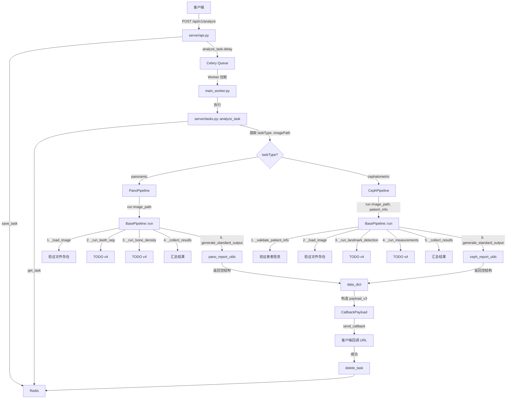
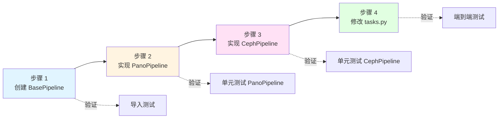
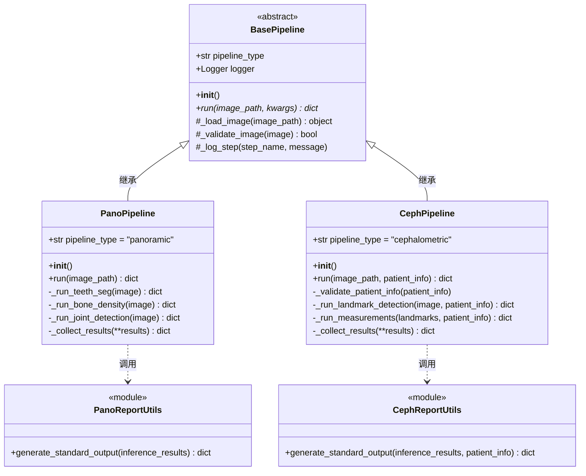
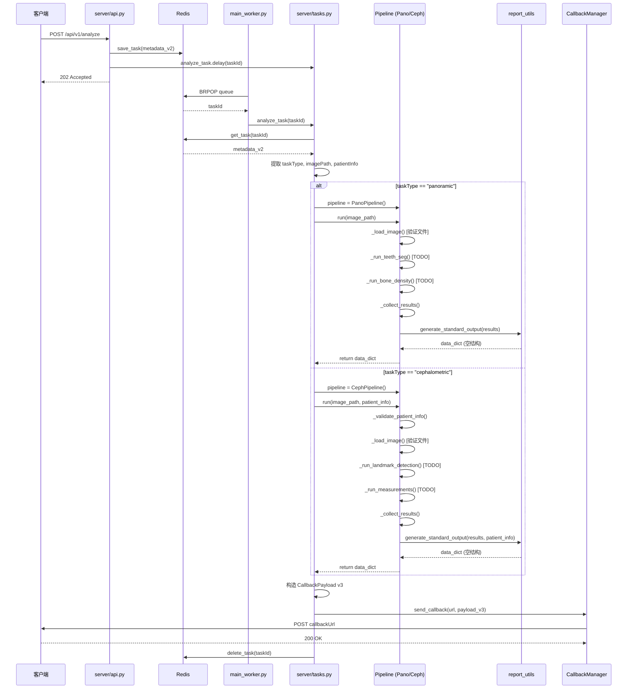

# X-Ray 推理服务编码计划 v3 - Pipeline 架构接口设计

## 文档说明

**版本**: v3.0  
**目标**: 从 Mock 数据过渡到真实 Pipeline 架构，设计统一的推理管道接口  
**原则**: 渐进式小步迭代，每步独立完成、可验证、可运行  
**依据**: `vibe_coding/v3/readme_server_lld.md`（详细设计文档）

---

## 一、目标概述

### v3 核心变更

从 v2 的 Mock 数据加载模式，升级为真实的 Pipeline 架构：

1. **设计 BasePipeline 基类**：提供统一接口和共享功能
2. **实现 PanoPipeline 接口**：全景片推理管道（内部子模块用 TODO 占位）
3. **实现 CephPipeline 接口**：侧位片推理管道（需要患者信息，内部子模块用 TODO 占位）
4. **修改 tasks.py**：从调用 `load_mock_data()` 改为调用 `Pipeline.run()`
5. **明确 report_utils 接口**：定义输入输出契约，为 v4 实现做准备

### v3 vs v2 关键差异

| 维度 | v2 实现 | v3 实现 |
|------|---------|---------|
| **数据来源** | 从 example JSON 文件加载 | 调用真实 Pipeline（虽然内部暂时返回空结构） |
| **tasks.py** | 调用 `load_mock_data()` | 调用 `PanoPipeline.run()` / `CephPipeline.run()` |
| **Pipeline 结构** | 空文件（TODO 占位） | 完整的类接口定义 + 内部 TODO |
| **患者信息** | 仅存储，未使用 | 传递给 CephPipeline.run() |
| **可扩展性** | 低（硬编码） | 高（统一接口，易于扩展） |

---

## 二、受影响的现有模块分析

### 1. 新增模块

#### pipelines/base_pipeline.py（新增）
**目的**: 定义所有推理管道的基础抽象类

**依据**:
- 需要为 PanoPipeline 和 CephPipeline 提供统一的接口规范
- 共享的功能（日志记录、图像加载、验证）需要抽象到基类
- 符合 DRY 原则，避免重复代码

**设计要点**:
- 抽象方法 `run(image_path, **kwargs)` 强制子类实现
- 共享方法 `_load_image()`, `_validate_image()`, `_log_step()`
- 使用 ABC 模块确保接口契约

### 2. 重构模块

#### pipelines/pano/pano_pipeline.py（从空文件重构为完整接口）
**目的**: 全景片推理管道，协调各个子模块完成推理

**依据**:
- 全景片推理需要协调多个子模块（teeth_seg, bone_density, joint_detection 等）
- 需要调用 `pano_report_utils.generate_standard_output()` 生成规范 JSON
- 作为 tasks.py 的推理入口，必须提供稳定的接口

**设计要点**:
- 继承 BasePipeline
- 实现 `run(image_path)` 方法
- 内部子模块调用用 TODO 占位，但结构完整

#### pipelines/ceph/ceph_pipeline.py（从空文件重构为完整接口）
**目的**: 侧位片推理管道，需要患者信息作为必需输入

**依据**:
- 侧位片推理需要患者信息（gender, DentalAgeStage）作为必需输入
- 需要调用 `ceph_report_utils.generate_standard_output()` 生成规范 JSON
- 作为 tasks.py 的推理入口，必须提供稳定的接口

**设计要点**:
- 继承 BasePipeline
- 实现 `run(image_path, patient_info)` 方法
- 包含 `_validate_patient_info()` 验证方法
- 内部子模块调用用 TODO 占位，但结构完整

### 3. 修改模块

#### server/tasks.py（中度修改）
**修改范围**: 
- 移除 `load_mock_data()` 函数（约 50 行）
- 修改 `analyze_task()` 函数中的推理调用部分（约 20 行）

**依据**:
- 需要根据 taskType 实例化对应的 Pipeline
- 调用 `pipeline.run()` 获取真实推理结果（虽然 v3 返回空结构）
- 保持回调逻辑不变（v2 已完善）

**影响分析**:
- ✅ 回调流程无影响
- ✅ 任务元数据结构无影响
- ✅ API 层无影响

### 4. 接口明确模块

#### pipelines/pano/utils/pano_report_utils.py（接口明确）
**目的**: 明确函数签名和接口契约

**依据**:
- Pipeline 需要调用 `generate_standard_output()` 生成规范 JSON
- 需要明确输入参数（inference_results）和输出格式（data 字段）

**设计要点**:
- 定义 `generate_standard_output(inference_results: dict) -> dict`
- 添加详细的文档字符串（参数说明、返回值说明）
- v3 内部实现返回空结构，v4 实现真实格式化逻辑

#### pipelines/ceph/utils/ceph_report_utils.py（接口明确）
**目的**: 明确函数签名和接口契约

**依据**:
- Pipeline 需要调用 `generate_standard_output()` 生成规范 JSON
- 需要明确输入参数（inference_results, patient_info）和输出格式（data 字段）

**设计要点**:
- 定义 `generate_standard_output(inference_results: dict, patient_info: dict) -> dict`
- 添加详细的文档字符串（参数说明、返回值说明）
- v3 内部实现返回空结构，v4 实现真实格式化逻辑

---

## 三、代码目录结构

### 变更前后对比

```
Xray-inference/
├── pipelines/
│   ├── __init__.py
│   ├── base_pipeline.py                      # ✅ v3 新增（约 150 行）
│   │
│   ├── pano/
│   │   ├── __init__.py
│   │   ├── pano_pipeline.py                  # ✅ v3 重构（v2: 0行 → v3: 200行）
│   │   ├── modules/                          # ⏸️ v4 实现
│   │   │   ├── teeth_seg/
│   │   │   └── bone_density/
│   │   └── utils/
│   │       ├── __init__.py
│   │       └── pano_report_utils.py          # ✅ v3 接口明确（v2: 16行 → v3: 60行）
│   │
│   └── ceph/
│       ├── __init__.py
│       ├── ceph_pipeline.py                  # ✅ v3 重构（v2: 0行 → v3: 250行）
│       ├── modules/                          # ⏸️ v4 实现
│       └── utils/
│           ├── __init__.py
│           └── ceph_report_utils.py          # ✅ v3 接口明确（v2: 16行 → v3: 60行）
│
└── server/
    ├── tasks.py                              # ✅ v3 修改（移除 load_mock_data，新增 Pipeline 调用）
    ├── api.py                                # 🔒 v3 不变
    ├── worker.py                             # 🔒 v3 不变
    └── core/
        ├── persistence.py                    # 🔒 v3 不变
        └── callback.py                       # 🔒 v3 不变
```

### 代码行数估算

| 文件 | v2 行数 | v3 行数 | 变更量 | 变更类型 |
|------|---------|---------|--------|---------|
| `base_pipeline.py` | 0 | 150 | +150 | 新增设计 |
| `pano_pipeline.py` | 0 | 200 | +200 | 新增接口 |
| `ceph_pipeline.py` | 0 | 250 | +250 | 新增接口 |
| `pano_report_utils.py` | 16 | 60 | +44 | 接口明确 |
| `ceph_report_utils.py` | 16 | 60 | +44 | 接口明确 |
| `tasks.py` | 212 | 220 | +8 | 修改推理逻辑 |
| **总计** | **244** | **940** | **+696** | - |

**注**: 行数包含注释、文档字符串、空行。实际逻辑代码约占 50-60%。

---

## 四、渐进式小步迭代开发步骤

### 步骤设计原则

1. **每步独立完整**：每步完成后，程序能成功启动并运行
2. **可验证性**：每步都有明确的验证方法
3. **增量演进**：每步在前一步基础上增加新功能
4. **模块化**：每个文件不超过 500 行

---

### 步骤 1：创建 BasePipeline 基类

**目标**: 建立推理管道的统一接口规范

**实现内容**:
1. 创建 `pipelines/base_pipeline.py`
2. 定义抽象基类 `BasePipeline`
3. 实现抽象方法 `run(image_path, **kwargs)`
4. 实现共享方法 `_load_image()`, `_validate_image()`, `_log_step()`

**涉及文件**:
- ✅ 新增: `pipelines/base_pipeline.py`

**代码要点**:
```python
# pipelines/base_pipeline.py

from abc import ABC, abstractmethod
import logging
import os

class BasePipeline(ABC):
    """
    推理管道基类
    
    所有具体的 Pipeline（PanoPipeline, CephPipeline）必须继承此类并实现 run() 方法。
    """
    
    def __init__(self):
        """初始化 Pipeline"""
        self.logger = logging.getLogger(self.__class__.__name__)
        self.pipeline_type = "base"  # 子类需覆盖
        self.logger.info(f"{self.__class__.__name__} initialized")
    
    @abstractmethod
    def run(self, image_path: str, **kwargs) -> dict:
        """
        执行推理流程（抽象方法，子类必须实现）
        
        Args:
            image_path: 图像文件路径
            **kwargs: 额外参数（如 patient_info）
            
        Returns:
            dict: 完整的 data 字段，符合《接口定义.md》规范
        """
        raise NotImplementedError("Subclass must implement run() method")
    
    def _load_image(self, image_path: str):
        """
        加载图像文件
        
        Args:
            image_path: 图像文件路径
            
        Returns:
            图像对象（v3 暂返回 None，v4 实现真实加载）
            
        Note:
            - v3: 仅验证文件存在性
            - v4: 实现真实的图像加载逻辑（JPG/PNG/DICOM）
        """
        if not os.path.exists(image_path):
            self.logger.error(f"Image file not found: {image_path}")
            raise FileNotFoundError(f"Image file not found: {image_path}")
        
        self.logger.info(f"Image file validated: {image_path}")
        # v3 占位：返回 None
        return None
    
    def _validate_image(self, image) -> bool:
        """
        验证图像是否有效
        
        Args:
            image: 图像对象
            
        Returns:
            bool: 图像是否有效
            
        Note:
            - v3: 简单的 None 检查
            - v4: 实现真实的验证逻辑（尺寸、格式等）
        """
        # v3 占位：仅检查是否为 None（在 v3 中始终为 None，所以跳过检查）
        return True
    
    def _log_step(self, step_name: str, message: str = ""):
        """
        统一的步骤日志记录
        
        Args:
            step_name: 步骤名称
            message: 附加信息
        """
        log_msg = f"[{self.pipeline_type}] {step_name}"
        if message:
            log_msg += f": {message}"
        self.logger.info(log_msg)
```

**验证方法**:
```bash
# 在 Python 交互环境中测试
cd D:\硕士文档\项目\口腔\code\Xray-inference
python -c "from pipelines.base_pipeline import BasePipeline; print('BasePipeline loaded successfully')"
```

**预期结果**:
- ✅ 文件创建成功
- ✅ 导入无错误
- ✅ 抽象类定义正确

**完成标志**:
- [ ] `pipelines/base_pipeline.py` 文件创建
- [ ] 包含完整的文档字符串
- [ ] 导入测试通过
- [ ] 程序可正常启动（不影响现有功能）

---

### 步骤 2：实现 PanoPipeline 接口

**目标**: 实现全景片推理管道的完整接口（内部子模块用 TODO 占位）

**实现内容**:
1. 重构 `pipelines/pano/pano_pipeline.py`
2. 继承 `BasePipeline`，实现 `run(image_path)` 方法
3. 定义内部方法 `_run_teeth_seg()`, `_run_bone_density()`, `_run_joint_detection()`, `_collect_results()`
4. 调用 `pano_report_utils.generate_standard_output()` 生成规范 JSON

**涉及文件**:
- ✅ 修改: `pipelines/pano/pano_pipeline.py`
- ✅ 修改: `pipelines/pano/utils/pano_report_utils.py`

**代码要点**:

```python
# pipelines/pano/pano_pipeline.py

from pipelines.base_pipeline import BasePipeline
from pipelines.pano.utils import pano_report_utils
import logging

logger = logging.getLogger(__name__)


class PanoPipeline(BasePipeline):
    """
    全景片推理管道
    
    负责协调各个子模块完成全景片的完整分析流程，并生成符合规范的 JSON 输出。
    """
    
    def __init__(self):
        """初始化全景片 Pipeline"""
        super().__init__()
        self.pipeline_type = "panoramic"
        
        # TODO: v4 初始化子模块
        # self.teeth_seg_module = TeethSegModule()
        # self.bone_density_module = BoneDensityModule()
        
        logger.info("PanoPipeline initialized")
    
    def run(self, image_path: str) -> dict:
        """
        执行全景片推理流程
        
        Args:
            image_path: 图像文件路径
            
        Returns:
            dict: 完整的 data 字段，符合《规范：全景片 JSON》
            
        工作流程:
            1. 加载并验证图像
            2. 依次调用各个子模块（v3: TODO 占位）
            3. 收集所有推理结果
            4. 调用 report_utils 生成规范 JSON
            5. 返回完整的 data 字段
        """
        self._log_step("开始全景片推理", f"image_path={image_path}")
        
        # 1. 加载图像
        try:
            image = self._load_image(image_path)
        except Exception as e:
            logger.error(f"Failed to load image: {e}")
            raise
        
        # 2. 验证图像
        if not self._validate_image(image):
            raise ValueError(f"Invalid image: {image_path}")
        
        # 3. 依次调用各个子模块（v3: TODO 占位）
        try:
            teeth_results = self._run_teeth_seg(image)
            bone_results = self._run_bone_density(image)
            joint_results = self._run_joint_detection(image)
            
        except Exception as e:
            logger.error(f"Inference failed: {e}")
            raise
        
        # 4. 收集所有结果
        inference_results = self._collect_results(
            teeth=teeth_results,
            bone=bone_results,
            joint=joint_results
        )
        
        # 5. 生成符合规范的 JSON
        data_dict = pano_report_utils.generate_standard_output(inference_results)
        
        self._log_step("全景片推理完成", f"data keys: {list(data_dict.keys())}")
        
        return data_dict
    
    def _run_teeth_seg(self, image) -> dict:
        """
        执行牙齿分割
        
        Args:
            image: 图像对象
            
        Returns:
            dict: 牙齿分割结果
            
        Note:
            - v3: 返回空字典（TODO 占位）
            - v4: 实现真实的牙齿分割逻辑
        """
        self._log_step("牙齿分割", "TODO")
        return {}
    
    def _run_bone_density(self, image) -> dict:
        """
        执行骨密度分析
        
        Args:
            image: 图像对象
            
        Returns:
            dict: 骨密度分析结果
            
        Note:
            - v3: 返回空字典（TODO 占位）
            - v4: 实现真实的骨密度分析逻辑
        """
        self._log_step("骨密度分析", "TODO")
        return {}
    
    def _run_joint_detection(self, image) -> dict:
        """
        执行关节检测
        
        Args:
            image: 图像对象
            
        Returns:
            dict: 关节检测结果
            
        Note:
            - v3: 返回空字典（TODO 占位）
            - v4: 实现真实的关节检测逻辑
        """
        self._log_step("关节检测", "TODO")
        return {}
    
    def _collect_results(self, **module_results) -> dict:
        """
        收集所有子模块的推理结果
        
        Args:
            **module_results: 各子模块结果
            
        Returns:
            dict: 汇总的推理结果
        """
        self._log_step("收集结果", f"{len(module_results)} modules")
        
        inference_results = {
            "teeth": module_results.get("teeth", {}),
            "bone": module_results.get("bone", {}),
            "joint": module_results.get("joint", {}),
        }
        
        return inference_results
```

```python
# pipelines/pano/utils/pano_report_utils.py

"""
全景片报告生成工具
负责生成符合规范的 JSON 输出
"""

import logging
from typing import Dict, Any

logger = logging.getLogger(__name__)


def generate_standard_output(inference_results: Dict[str, Any]) -> Dict[str, Any]:
    """
    生成符合《规范：全景片 JSON》的完整 data 字段
    
    Args:
        inference_results: Pipeline 收集的所有模块推理结果
            - teeth: 牙齿分割结果
            - bone: 骨密度分析结果
            - joint: 关节检测结果
            
    Returns:
        dict: 符合《规范：全景片 JSON》的完整 data 字段
        
    示例输出:
        {
            "Metadata": {...},
            "AnatomyResults": [...],
            "JointAndMandible": {...},
            "MaxillarySinus": [...],
            "PeriodontalCondition": {...},
            "MissingTeeth": [...],
            "ThirdMolarSummary": {...},
            "ToothAnalysis": [...]
        }
        
    Note:
        - v3: 接口定义，返回空结构
        - v4: 完整实现（格式化逻辑）
    """
    logger.info("Generating standard output for panoramic analysis")
    
    # v3 占位：返回空结构（符合规范的字段名）
    data_dict = {
        "Metadata": {},
        "AnatomyResults": [],
        "JointAndMandible": {},
        "MaxillarySinus": [],
        "PeriodontalCondition": {},
        "MissingTeeth": [],
        "ThirdMolarSummary": {},
        "ToothAnalysis": []
    }
    
    logger.warning("generate_standard_output not fully implemented (TODO)")
    return data_dict
```

**验证方法**:
```bash
# 测试 PanoPipeline 实例化和调用
cd D:\硕士文档\项目\口腔\code\Xray-inference
python -c "
from pipelines.pano.pano_pipeline import PanoPipeline
import os

# 使用一个存在的测试图像（或创建一个空文件）
test_image = 'tmp/test_pano.jpg'
os.makedirs('tmp', exist_ok=True)
open(test_image, 'a').close()

pipeline = PanoPipeline()
result = pipeline.run(test_image)
print('PanoPipeline run success!')
print('Result keys:', list(result.keys()))
"
```

**预期结果**:
- ✅ PanoPipeline 实例化成功
- ✅ `run()` 方法执行成功
- ✅ 返回包含 8 个顶级字段的字典
- ✅ 日志输出显示各步骤执行

**完成标志**:
- [ ] `pipelines/pano/pano_pipeline.py` 重构完成
- [ ] `pipelines/pano/utils/pano_report_utils.py` 接口明确
- [ ] 单元测试通过
- [ ] 程序可正常启动（不影响现有功能）

---

### 步骤 3：实现 CephPipeline 接口

**目标**: 实现侧位片推理管道的完整接口（需要患者信息，内部子模块用 TODO 占位）

**实现内容**:
1. 重构 `pipelines/ceph/ceph_pipeline.py`
2. 继承 `BasePipeline`，实现 `run(image_path, patient_info)` 方法
3. 实现 `_validate_patient_info()` 验证患者信息
4. 定义内部方法 `_run_landmark_detection()`, `_run_measurements()`, `_collect_results()`
5. 调用 `ceph_report_utils.generate_standard_output()` 生成规范 JSON

**涉及文件**:
- ✅ 修改: `pipelines/ceph/ceph_pipeline.py`
- ✅ 修改: `pipelines/ceph/utils/ceph_report_utils.py`

**代码要点**:

```python
# pipelines/ceph/ceph_pipeline.py

from pipelines.base_pipeline import BasePipeline
from pipelines.ceph.utils import ceph_report_json
import logging

logger = logging.getLogger(__name__)


class CephPipeline(BasePipeline):
   """
   侧位片推理管道
   
   负责协调各个子模块完成侧位片的完整分析流程，并生成符合规范的 JSON 输出。
   需要患者信息（gender, DentalAgeStage）作为必需输入。
   """

   def __init__(self):
      """初始化侧位片 Pipeline"""
      super().__init__()
      self.pipeline_type = "cephalometric"

      # TODO: v4 初始化子模块
      # self.landmark_module = LandmarkDetectionModule()
      # self.measurement_module = MeasurementModule()

      logger.info("CephPipeline initialized")

   def run(self, image_path: str, patient_info: dict) -> dict:
      """
      执行侧位片推理流程
      
      Args:
          image_path: 图像文件路径
          patient_info: 患者信息（必需）
              - gender: "Male" | "Female"
              - DentalAgeStage: "Permanent" | "Mixed"
          
      Returns:
          dict: 完整的 data 字段，符合《规范：侧位片 JSON》
          
      工作流程:
          1. 验证 patient_info
          2. 加载并验证图像
          3. 依次调用各个子模块（传递 patient_info）
          4. 收集所有推理结果
          5. 调用 report_utils 生成规范 JSON（传递 patient_info）
          6. 返回完整的 data 字段
      """
      # 0. 验证 patient_info
      self._validate_patient_info(patient_info)

      self._log_step("开始侧位片推理", f"image_path={image_path}, patient_info={patient_info}")

      # 1. 加载图像
      try:
         image = self._load_image(image_path)
      except Exception as e:
         logger.error(f"Failed to load image: {e}")
         raise

      # 2. 验证图像
      if not self._validate_image(image):
         raise ValueError(f"Invalid image: {image_path}")

      # 3. 依次调用各个子模块（传递 patient_info）
      try:
         landmark_results = self._run_landmark_detection(image, patient_info)
         measurement_results = self._run_measurements(landmark_results, patient_info)

      except Exception as e:
         logger.error(f"Inference failed: {e}")
         raise

      # 4. 收集所有结果
      inference_results = self._collect_results(
         landmarks=landmark_results,
         measurements=measurement_results
      )

      # 5. 生成符合规范的 JSON（传递 patient_info）
      data_dict = ceph_report_json.generate_standard_output(inference_results, patient_info)

      self._log_step("侧位片推理完成", f"data keys: {list(data_dict.keys())}")

      return data_dict

   def _validate_patient_info(self, patient_info: dict):
      """
      验证患者信息的有效性
      
      Args:
          patient_info: 患者信息字典
          
      Raises:
          ValueError: patient_info 无效
          
      Note:
          - gender 必须为 "Male" 或 "Female"
          - DentalAgeStage 必须为 "Permanent" 或 "Mixed"
      """
      if not patient_info:
         raise ValueError("patient_info is required for cephalometric analysis")

      gender = patient_info.get("gender")
      dental_age_stage = patient_info.get("DentalAgeStage")

      if gender not in ["Male", "Female"]:
         raise ValueError(f"Invalid gender: {gender}, must be 'Male' or 'Female'")

      if dental_age_stage not in ["Permanent", "Mixed"]:
         raise ValueError(f"Invalid DentalAgeStage: {dental_age_stage}, must be 'Permanent' or 'Mixed'")

      logger.info(f"patient_info validated: gender={gender}, DentalAgeStage={dental_age_stage}")

   def _run_landmark_detection(self, image, patient_info: dict) -> dict:
      """
      执行关键点检测
      
      Args:
          image: 图像对象
          patient_info: 患者信息
          
      Returns:
          dict: 关键点检测结果
          
      Note:
          - v3: 返回空字典（TODO 占位）
          - v4: 实现真实的关键点检测逻辑
      """
      self._log_step("关键点检测", f"patient_info={patient_info}, TODO")
      return {}

   def _run_measurements(self, landmark_results: dict, patient_info: dict) -> dict:
      """
      基于关键点计算测量值
      
      Args:
          landmark_results: 关键点检测结果
          patient_info: 患者信息
          
      Returns:
          dict: 测量结果
          
      Note:
          - v3: 返回空字典（TODO 占位）
          - v4: 实现真实的测量逻辑
      """
      self._log_step("头影测量", f"patient_info={patient_info}, TODO")
      return {}

   def _collect_results(self, **module_results) -> dict:
      """
      收集所有子模块的推理结果
      
      Args:
          **module_results: 各子模块结果
          
      Returns:
          dict: 汇总的推理结果
      """
      self._log_step("收集结果", f"{len(module_results)} modules")

      inference_results = {
         "landmarks": module_results.get("landmarks", {}),
         "measurements": module_results.get("measurements", {}),
      }

      return inference_results
```

```python
# pipelines/ceph/utils/ceph_report_json.py

"""
侧位片报告生成工具
负责生成符合规范的 JSON 输出
"""

import logging
from typing import Dict, Any

logger = logging.getLogger(__name__)


def generate_standard_output(
    inference_results: Dict[str, Any],
    patient_info: Dict[str, str]
) -> Dict[str, Any]:
    """
    生成符合《规范：侧位片 JSON》的完整 data 字段
    
    Args:
        inference_results: Pipeline 收集的所有模块推理结果
            - landmarks: 关键点检测结果
            - measurements: 头影测量结果
        patient_info: 患者信息
            - gender: "Male" | "Female"
            - DentalAgeStage: "Permanent" | "Mixed"
            
    Returns:
        dict: 符合《规范：侧位片 JSON》的完整 data 字段
        
    示例输出:
        {
            "ImageSpacing": {...},
            "VisibilityMetrics": {...},
            "CephalometricMeasurements": {...},
            "KeyPoints": [...],
            "Measurements": [...]
        }
        
    Note:
        - v3: 接口定义，返回空结构
        - v4: 完整实现（格式化逻辑）
        - patient_info 可能影响测量值的解释和正常范围判断
    """
    logger.info(f"Generating standard output for cephalometric analysis: patient_info={patient_info}")
    
    # v3 占位：返回空结构（符合规范的字段名）
    data_dict = {
        "ImageSpacing": {},
        "VisibilityMetrics": {},
        "CephalometricMeasurements": {},
        "KeyPoints": [],
        "Measurements": []
    }
    
    logger.warning("generate_standard_output not fully implemented (TODO)")
    return data_dict
```

**验证方法**:
```bash
# 测试 CephPipeline 实例化和调用
cd D:\硕士文档\项目\口腔\code\Xray-inference
python -c "
from pipelines.ceph.ceph_pipeline import CephPipeline
import os

# 使用一个存在的测试图像
test_image = 'tmp/test_ceph.jpg'
os.makedirs('tmp', exist_ok=True)
open(test_image, 'a').close()

# 测试患者信息
patient_info = {
    'gender': 'Male',
    'DentalAgeStage': 'Permanent'
}

pipeline = CephPipeline()
result = pipeline.run(test_image, patient_info)
print('CephPipeline run success!')
print('Result keys:', list(result.keys()))
"
```

**预期结果**:
- ✅ CephPipeline 实例化成功
- ✅ `run()` 方法执行成功
- ✅ patient_info 验证通过
- ✅ 返回包含 5 个顶级字段的字典
- ✅ 日志输出显示各步骤执行

**完成标志**:
- [ ] `pipelines/ceph/ceph_pipeline.py` 重构完成
- [ ] `pipelines/ceph/utils/ceph_report_utils.py` 接口明确
- [ ] patient_info 验证逻辑正确
- [ ] 单元测试通过
- [ ] 程序可正常启动（不影响现有功能）

---

### 步骤 4：修改 tasks.py 调用 Pipeline

**目标**: 将 tasks.py 从调用 `load_mock_data()` 改为调用真实的 Pipeline

**实现内容**:
1. 移除 `load_mock_data()` 函数
2. 修改 `analyze_task()` 函数：
   - 导入 PanoPipeline 和 CephPipeline
   - 根据 taskType 实例化对应的 Pipeline
   - 调用 `pipeline.run()` 获取推理结果
   - 保持回调逻辑不变

**涉及文件**:
- ✅ 修改: `server/tasks.py`

**代码要点**:

```python
# server/tasks.py（修改部分）

# v3 新增：导入 Pipeline
from pipelines.pano.pano_pipeline import PanoPipeline
from pipelines.ceph.ceph_pipeline import CephPipeline

# ❌ 移除 load_mock_data() 函数（第 24-67 行）

@celery_app.task(name='server.tasks.analyze_task', bind=True)
def analyze_task(self, task_id: str):
    """
    异步推理任务（v3 协议：真实 Pipeline）
    
    工作流程:
        1. 从 Redis 获取任务元数据（v2 扩展字段）
        2. 检查图像文件是否存在
        3. 根据 taskType 实例化对应的 Pipeline（v3 新增）
        4. 调用 pipeline.run() 获取真实推理结果（v3 新增）
        5. 构造回调负载 v3（data 来自 Pipeline）
        6. 发送 HTTP 回调
        7. 清理 Redis 元数据（回调成功时）
        
    变更点（v2 → v3）:
        - ❌ 移除 load_mock_data() 调用
        - ✅ 新增 Pipeline 实例化和调用
        - ✅ 传递 patient_info 给 CephPipeline
    """
    logger.info(f"Task started: {task_id}")
    
    # ... 前面的代码保持不变 ...
    
    # 2. 检查图像文件是否存在
    if not os.path.exists(image_path):
        logger.error(f"Image file not found: {image_path}")
        return
    
    # 3. 根据 taskType 实例化 Pipeline 并执行推理（v3 新增）
    try:
        if task_type == 'panoramic':
            # 全景片推理
            logger.info(f"Instantiating PanoPipeline for {task_id}")
            pipeline = PanoPipeline()
            data_dict = pipeline.run(image_path=image_path)
            
        elif task_type == 'cephalometric':
            # 侧位片推理（需要 patient_info）
            logger.info(f"Instantiating CephPipeline for {task_id}")
            pipeline = CephPipeline()
            data_dict = pipeline.run(image_path=image_path, patient_info=patient_info)
            
        else:
            logger.error(f"Unknown task_type: {task_type}")
            return
        
        logger.info(f"Pipeline execution completed for {task_id}")
    
    except Exception as e:
        # v3 暂不实现错误回调（延后到 v4）
        logger.error(f"Pipeline execution failed: {task_id}, {e}", exc_info=True)
        return
    
    # 4. 构造 CallbackPayload v3（data 来自 Pipeline）
    payload_v3 = {
        "taskId": task_id,
        "status": "SUCCESS",
        "timestamp": datetime.now(timezone.utc).isoformat(),
        "metadata": client_metadata,
        "requestParameters": {
            "taskType": task_type,
            "imageUrl": image_url
        },
        "data": data_dict,  # v3: 来自 Pipeline 真实推理
        "error": None
    }
    
    # 5. 发送回调 v3
    success = callback_mgr.send_callback(callback_url, payload_v3)
    
    # 6. 清理任务元数据（仅当回调成功时）
    if success:
        persistence.delete_task(task_id)
        logger.info(f"Task completed and cleaned: {task_id}")
    else:
        logger.warning(f"Task completed but callback failed, metadata retained: {task_id}")
```

**关键变更总结**:

| 代码块 | v2 实现 | v3 实现 |
|--------|---------|---------|
| **import** | 无 Pipeline 导入 | ✅ `from pipelines.pano.pano_pipeline import PanoPipeline`<br/>✅ `from pipelines.ceph.ceph_pipeline import CephPipeline` |
| **推理调用** | `data_dict = load_mock_data(task_type)` | ✅ `pipeline = PanoPipeline()` / `CephPipeline()`<br/>✅ `data_dict = pipeline.run(...)` |
| **参数传递** | 无参数 | ✅ 全景片：`run(image_path)`<br/>✅ 侧位片：`run(image_path, patient_info)` |
| **数据来源** | 静态 JSON 文件 | ✅ Pipeline 真实推理结果（v3 返回空结构） |

**验证方法**:
```bash
# 1. 启动 Redis
# 2. 启动 Worker
cd D:\硕士文档\项目\口腔\code\Xray-inference
python main_worker.py

# 3. 启动 API 服务（另一个终端）
python main_api.py

# 4. 发送测试请求（另一个终端）
python send_request_test.py
```

**预期结果**:
- ✅ API 服务正常启动
- ✅ Worker 正常启动
- ✅ 发送全景片请求，Pipeline 执行成功
- ✅ 发送侧位片请求（带 patient_info），Pipeline 执行成功
- ✅ 回调 payload 包含空结构的 data 字段
- ✅ 日志显示 Pipeline 各步骤执行

**完成标志**:
- [ ] `server/tasks.py` 修改完成
- [ ] `load_mock_data()` 函数已移除
- [ ] Pipeline 调用逻辑正确
- [ ] 端到端测试通过
- [ ] 回调数据格式正确（虽然是空结构）

---

## 五、实现流程图

### 整体架构流程（v3）



### 步骤执行流程



### 类继承关系



### 时序图（v3 Pipeline 调用）



---

## 六、验证与测试

### 步骤 1 验证：BasePipeline

```bash
# 测试导入
python -c "from pipelines.base_pipeline import BasePipeline; print('OK')"

# 测试抽象类
python -c "
from pipelines.base_pipeline import BasePipeline

# 尝试实例化抽象类（应该失败）
try:
    pipeline = BasePipeline()
    print('FAIL: Should not be able to instantiate abstract class')
except TypeError as e:
    print('OK: Cannot instantiate abstract class')
"
```

### 步骤 2 验证：PanoPipeline

```bash
# 测试 PanoPipeline 实例化和运行
python -c "
import os
from pipelines.pano.pano_pipeline import PanoPipeline

# 创建测试图像
os.makedirs('tmp', exist_ok=True)
test_image = 'tmp/test_pano.jpg'
with open(test_image, 'w') as f:
    f.write('dummy')

# 测试 Pipeline
pipeline = PanoPipeline()
result = pipeline.run(test_image)

# 验证结果
assert isinstance(result, dict), 'Result should be dict'
assert 'Metadata' in result, 'Should have Metadata'
assert 'AnatomyResults' in result, 'Should have AnatomyResults'
print('OK: PanoPipeline test passed')
"
```

### 步骤 3 验证：CephPipeline

```bash
# 测试 CephPipeline 实例化和运行
python -c "
import os
from pipelines.ceph.ceph_pipeline import CephPipeline

# 创建测试图像
os.makedirs('tmp', exist_ok=True)
test_image = 'tmp/test_ceph.jpg'
with open(test_image, 'w') as f:
    f.write('dummy')

# 测试 Pipeline（有效 patient_info）
patient_info = {'gender': 'Male', 'DentalAgeStage': 'Permanent'}
pipeline = CephPipeline()
result = pipeline.run(test_image, patient_info)

# 验证结果
assert isinstance(result, dict), 'Result should be dict'
assert 'ImageSpacing' in result, 'Should have ImageSpacing'
assert 'KeyPoints' in result, 'Should have KeyPoints'
print('OK: CephPipeline test passed')

# 测试无效 patient_info（应该失败）
try:
    pipeline.run(test_image, {'gender': 'Invalid'})
    print('FAIL: Should reject invalid patient_info')
except ValueError as e:
    print('OK: Invalid patient_info rejected')
"
```

### 步骤 4 验证：端到端测试

```bash
# 1. 启动 Redis（确保运行中）

# 2. 启动 Worker（终端 1）
cd D:\硕士文档\项目\口腔\code\Xray-inference
python main_worker.py

# 3. 启动 API 服务（终端 2）
python main_api.py

# 4. 发送测试请求（终端 3）
python send_request_test.py
```

**检查点**:
- ✅ API 服务启动无错误
- ✅ Worker 启动无错误
- ✅ 请求返回 202 Accepted
- ✅ Worker 日志显示 Pipeline 执行
- ✅ 回调成功（检查回调服务器日志）
- ✅ 回调 payload 包含正确的字段结构

---

## 七、风险与注意事项

### 1. 文件路径问题

**风险**: Windows 路径分隔符可能导致问题

**应对**:
- 统一使用 `os.path.join()` 或 `pathlib.Path`
- 测试时使用相对路径

### 2. 导入错误

**风险**: Python 模块导入路径问题

**应对**:
- 确保从项目根目录运行
- 使用绝对导入（`from pipelines.xxx import yyy`）
- 确保 `__init__.py` 文件存在

### 3. 抽象类实例化

**风险**: 直接实例化 BasePipeline 会报错

**应对**:
- 在测试中明确捕获 TypeError
- 文档中说明 BasePipeline 是抽象类

### 4. 患者信息验证

**风险**: CephPipeline 缺少 patient_info 会导致错误

**应对**:
- 在 `_validate_patient_info()` 中提供明确的错误信息
- 在 API 层做初步验证（v2 已实现）

### 5. 空结构返回

**风险**: v3 返回空结构可能误导用户

**应对**:
- 在日志中明确标注 "TODO" 和 "not fully implemented"
- 文档中说明 v3 仅为接口设计，v4 实现真实逻辑

---

## 八、v3 → v4 演进路径

### v3 完成后的状态

- ✅ 架构清晰：BasePipeline → PanoPipeline/CephPipeline
- ✅ 接口稳定：`run()` 方法签名确定
- ✅ 职责分离：Pipeline（推理） + report_utils（格式化）
- ✅ 可运行可验证：端到端流程打通（虽然返回空结构）

### v4 需要实现的内容

1. **填充 BasePipeline 的共享方法**
   - `_load_image()`: 真实的图像加载（JPG/PNG，DICOM 延后）
   - `_validate_image()`: 真实的图像验证（尺寸、格式等）

2. **填充 PanoPipeline 的子模块调用**
   - `_run_teeth_seg()`: 加载模型、推理、后处理
   - `_run_bone_density()`: 实现骨密度分析
   - `_run_joint_detection()`: 实现关节检测

3. **填充 CephPipeline 的子模块调用**
   - `_run_landmark_detection()`: 加载模型、推理关键点
   - `_run_measurements()`: 基于关键点计算测量值

4. **实现 report_utils 的格式化逻辑**
   - `pano_report_utils.generate_standard_output()`: 将推理结果映射到规范 JSON
   - `ceph_report_utils.generate_standard_output()`: 将推理结果映射到规范 JSON

5. **添加错误处理**
   - 在 tasks.py 中实现 FAILURE 回调
   - 在 Pipeline 中添加异常处理

### v4 的好处

- ✅ 无需修改 tasks.py（接口已稳定）
- ✅ 无需修改 API 层（回调格式已确定）
- ✅ 可以逐个子模块实现和测试
- ✅ 易于并行开发（不同子模块）

---

## 九、总结

### v3 架构优势

1. **职责清晰**
   - `server/tasks.py` → 调度层（选择 Pipeline、传递参数）
   - `pipelines/*_pipeline` → 推理层（协调子模块）
   - `pipelines/*/utils/*` → 格式化层（生成规范 JSON）

2. **易于测试**
   - 可以独立测试 Pipeline（不依赖 Celery）
   - 可以独立测试 report_utils（不依赖推理）

3. **易于演进**
   - v3 → v4：填充 TODO，无需修改接口
   - v4 → v5：添加新子模块，只修改 Pipeline
   - v5 → v6：支持 DICOM，只修改 `base_pipeline._load_image()`

4. **符合 SOLID 原则**
   - **单一职责**：每个类只负责一件事
   - **开闭原则**：对扩展开放，对修改封闭
   - **依赖倒置**：tasks.py 依赖抽象接口，不依赖具体实现

### 开发顺序重要性

**为什么必须按照 步骤1 → 步骤2 → 步骤3 → 步骤4 的顺序？**

- **步骤1（BasePipeline）** 是基础，步骤2和3依赖它
- **步骤2（PanoPipeline）** 和 **步骤3（CephPipeline）** 可以并行，但都需要步骤1完成
- **步骤4（tasks.py）** 需要步骤2和3完成后才能调用

### 验证的重要性

每个步骤完成后都必须验证：
- ✅ 导入无错误
- ✅ 单元测试通过
- ✅ 程序可正常启动
- ✅ 不影响现有功能

---

## 附录

### A. 完整文件列表

**v3 需要修改/新增的文件**:

```
v3 变更文件:
├── pipelines/
│   ├── base_pipeline.py              ✅ 新增（约 150 行）
│   ├── pano/
│   │   ├── pano_pipeline.py          ✅ 重构（约 200 行）
│   │   └── utils/
│   │       └── pano_report_utils.py  ✅ 接口明确（约 60 行）
│   └── ceph/
│       ├── ceph_pipeline.py          ✅ 重构（约 250 行）
│       └── utils/
│           └── ceph_report_utils.py  ✅ 接口明确（约 60 行）
└── server/
    └── tasks.py                      ✅ 修改（约 220 行，移除 load_mock_data）
```

### B. 关键接口签名

```python
# BasePipeline
class BasePipeline(ABC):
    def run(self, image_path: str, **kwargs) -> dict: ...

# PanoPipeline
class PanoPipeline(BasePipeline):
    def run(self, image_path: str) -> dict: ...

# CephPipeline
class CephPipeline(BasePipeline):
    def run(self, image_path: str, patient_info: dict) -> dict: ...

# pano_report_utils
def generate_standard_output(inference_results: dict) -> dict: ...

# ceph_report_utils
def generate_standard_output(inference_results: dict, patient_info: dict) -> dict: ...
```

### C. 日志输出示例

```
[INFO] PanoPipeline initialized
[INFO] [panoramic] 开始全景片推理: image_path=tmp/test.jpg
[INFO] Image file validated: tmp/test.jpg
[INFO] [panoramic] 牙齿分割: TODO
[INFO] [panoramic] 骨密度分析: TODO
[INFO] [panoramic] 关节检测: TODO
[INFO] [panoramic] 收集结果: 3 modules
[INFO] Generating standard output for panoramic analysis
[WARNING] generate_standard_output not fully implemented (TODO)
[INFO] [panoramic] 全景片推理完成: data keys: ['Metadata', 'AnatomyResults', ...]
```

---

**文档版本**: v3.0  
**最后更新**: 2024-11-17  
**编码原则**: 渐进式小步迭代，每步独立完成、可验证、可运行  
**下一步**: 执行步骤1，创建 BasePipeline 基类

---

**准备开始编码！** 🚀

