# X-Ray 推理服务详细设计文档 v3 - Pipeline 架构接口设计

## v3 版本变更概述

### 变更目标
1. **从 Mock 数据过渡到真实 Pipeline 架构**：移除 `load_mock_data()`，使用真实的推理管道
2. **设计 BasePipeline 基类**：定义所有推理管道的统一接口和共享功能
3. **实现 PanoPipeline 和 CephPipeline 接口**：继承基类，定义完整的推理流程（内部实现用 TODO 占位）
4. **修改 tasks.py 调用逻辑**：正确调用两个 Pipeline，传递必要参数
5. **职责分离**：Pipeline 负责推理和调用 report_utils，report_utils 负责生成符合规范的 JSON

### v2 与 v3 核心差异对比

| 维度 | v2.0 | v3.0 |
|------|------|------|
| **数据来源** | 从 example JSON 文件加载 | 调用真实 Pipeline 推理 |
| **tasks.py** | 调用 `load_mock_data()` | 调用 `PanoPipeline.run()` / `CephPipeline.run()` |
| **Pipeline 结构** | 空文件（TODO 占位） | 完整的类接口定义 + 内部 TODO |
| **患者信息传递** | 仅存储，未使用 | 传递给 CephPipeline.run() |
| **输出格式** | 静态 JSON | Pipeline 动态生成（通过 report_utils） |
| **错误处理** | 暂未实现 | 延后到 v4（v3 只定义接口） |

---

## 受影响的现有模块分析

### 1. pipelines/base_pipeline.py（新增设计）
**变更类型**: 新增基础类

**变更依据**:
- 需要为 PanoPipeline 和 CephPipeline 提供统一的接口规范
- 共享的功能（日志记录、配置加载、异常处理）需要抽象到基类
- 符合 DRY 原则，避免重复代码

**设计要点**:
- 定义抽象方法 `run(image_path, **kwargs)` 强制子类实现
- 提供共享工具方法：`_load_image()`, `_validate_image()`
- 实现统一的日志记录机制

### 2. pipelines/pano/pano_pipeline.py（重构）
**变更类型**: 从空文件变为完整接口定义

**变更依据**:
- 全景片推理需要协调多个子模块（teeth_seg, bone_density 等）
- 需要调用 `pano_report_utils.generate_standard_output()` 生成规范 JSON
- 作为 tasks.py 的推理入口，必须提供稳定的接口

**接口设计**:
```python
def run(self, image_path: str) -> dict:
    """
    Args:
        image_path: 图像文件路径
    Returns:
        dict: 完整的 data 字段（符合《接口定义.md》规范）
    """
```

### 3. pipelines/ceph/ceph_pipeline.py（重构）
**变更类型**: 从空文件变为完整接口定义

**变更依据**:
- 侧位片推理需要患者信息（gender, DentalAgeStage）作为必需输入
- 需要调用 `ceph_report_utils.generate_standard_output()` 生成规范 JSON
- 作为 tasks.py 的推理入口，必须提供稳定的接口

**接口设计**:
```python
def run(self, image_path: str, patient_info: dict) -> dict:
    """
    Args:
        image_path: 图像文件路径
        patient_info: 患者信息（必需）
            - gender: "Male" | "Female"
            - DentalAgeStage: "Permanent" | "Mixed"
    Returns:
        dict: 完整的 data 字段（符合《接口定义.md》规范）
    """
```

### 4. server/tasks.py（中度修改）
**变更类型**: 修改推理调用逻辑

**变更依据**:
- 移除 `load_mock_data()` 函数
- 根据 `taskType` 实例化对应的 Pipeline
- 调用 `pipeline.run()` 获取真实推理结果
- 保持回调逻辑不变（v2 已完善）

**影响范围**:
- `analyze_task()` 函数中的推理调用部分（约 20 行）
- 新增 Pipeline 实例化逻辑

### 5. pipelines/pano/utils/pano_report_utils.py（接口明确）
**变更类型**: 明确接口契约（内部实现仍为 TODO）

**变更依据**:
- Pipeline 需要调用 `generate_standard_output()` 生成规范 JSON
- 需要明确输入参数和输出格式

**接口设计**:
```python
def generate_standard_output(inference_results: dict) -> dict:
    """
    Args:
        inference_results: Pipeline 收集的所有模块推理结果
    Returns:
        dict: 符合《规范：全景片 JSON》的完整 data 字段
    """
```

### 6. pipelines/ceph/utils/ceph_report_utils.py（接口明确）
**变更类型**: 明确接口契约（内部实现仍为 TODO）

**变更依据**:
- Pipeline 需要调用 `generate_standard_output()` 生成规范 JSON
- 需要明确输入参数和输出格式

**接口设计**:
```python
def generate_standard_output(inference_results: dict, patient_info: dict) -> dict:
    """
    Args:
        inference_results: Pipeline 收集的所有模块推理结果
        patient_info: 患者信息（gender, DentalAgeStage）
    Returns:
        dict: 符合《规范：侧位片 JSON》的完整 data 字段
    """
```

---

## 数据实体结构深化 v3

### 实体关系图

```mermaid
erDiagram
    TaskMetadata ||--|| PipelineInput : "provides"
    PipelineInput ||--|| BasePipeline : "processed by"
    BasePipeline ||--o| PanoPipeline : "implements"
    BasePipeline ||--o| CephPipeline : "implements"
    PanoPipeline ||--|| PanoReportUtils : "calls"
    CephPipeline ||--|| CephReportUtils : "calls"
    PanoReportUtils ||--|| DataField : "generates"
    CephReportUtils ||--|| DataField : "generates"
    DataField ||--|| CallbackPayload : "included in"
    
    TaskMetadata {
        string taskId
        string taskType
        string imagePath
        string imageUrl
        string callbackUrl
        dict metadata
        dict patientInfo "ceph only"
        float submittedAt
    }
    
    PipelineInput {
        string image_path
        dict patient_info "optional, ceph required"
    }
    
    BasePipeline {
        string pipeline_type
        method run(image_path, kwargs)
        method _load_image(image_path)
        method _validate_image(image)
    }
    
    PanoPipeline {
        method run(image_path)
        method _run_teeth_seg()
        method _run_bone_density()
        method _collect_results()
    }
    
    CephPipeline {
        method run(image_path, patient_info)
        method _run_landmark_detection()
        method _run_measurements()
        method _collect_results()
    }
    
    DataField {
        dict Metadata
        list AnatomyResults
        dict JointAndMandible
        list ToothAnalysis
    }
    
    CallbackPayload {
        string taskId
        string status
        string timestamp
        dict metadata
        dict requestParameters
        dict data "from Pipeline"
        dict error
    }
```

---

## 整体逻辑和交互时序图 v3

### 核心工作流程（v2 → v3 变更）

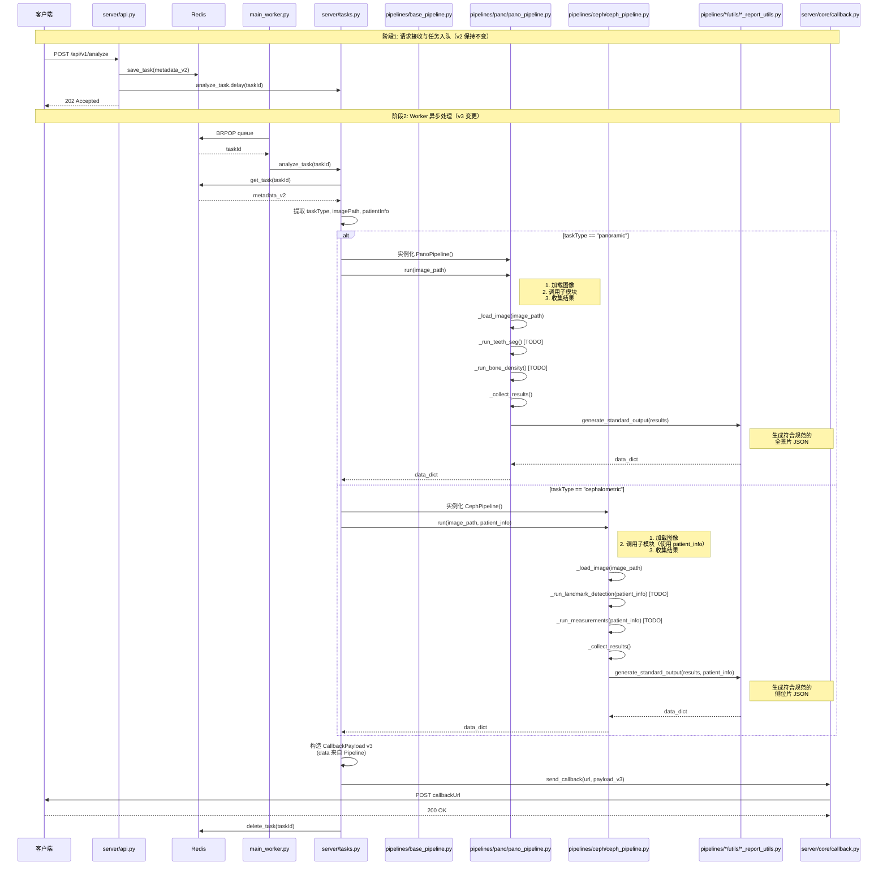

**关键变更点（v2 → v3）**：
1. ❌ 移除 `load_mock_data()` 调用
2. ✅ 新增 Pipeline 实例化逻辑
3. ✅ 调用 `pipeline.run()` 获取真实数据
4. ✅ Pipeline 内部调用 `report_utils` 生成规范 JSON

---

## 涉及到的文件详解 v3

### pipelines/base_pipeline.py（新增）

**a. 文件用途说明**

定义所有推理管道的基础类，提供统一接口和共享功能，强制子类实现 `run()` 方法。

**b. 文件内类图**

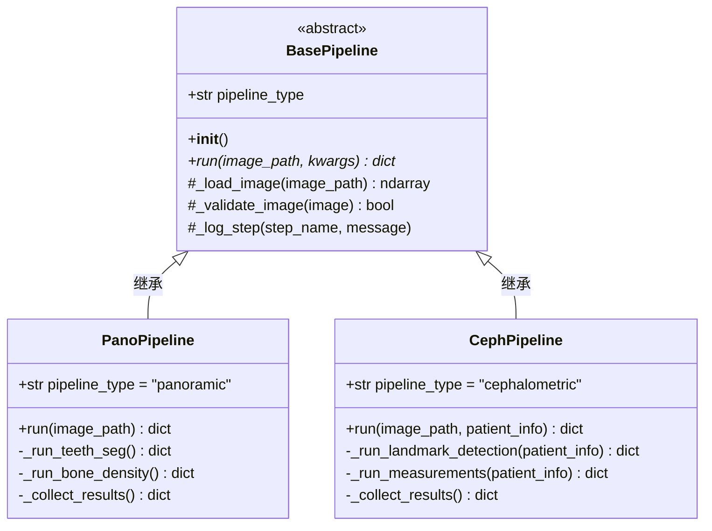

**c. 函数/方法详解**

#### `__init__(self)`

- **用途**: 初始化 Pipeline 实例，设置日志记录器
- **输入参数**: 无
- **输出数据结构**: 无
- **实现流程**:

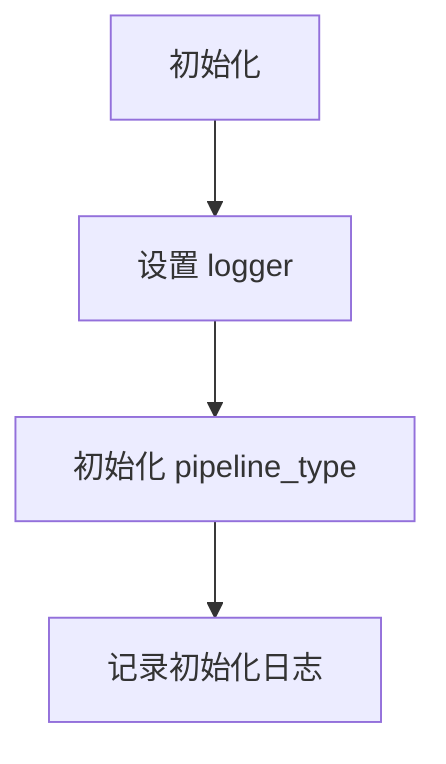

**实现要点**:
```python
import logging
from abc import ABC, abstractmethod

class BasePipeline(ABC):
    """
    推理管道基类
    
    所有具体的 Pipeline（PanoPipeline, CephPipeline）必须继承此类并实现 run() 方法。
    """
    
    def __init__(self):
        """初始化 Pipeline"""
        self.logger = logging.getLogger(self.__class__.__name__)
        self.pipeline_type = "base"  # 子类需覆盖
        self.logger.info(f"{self.__class__.__name__} initialized")
```

#### `run(self, image_path: str, **kwargs) -> dict`（抽象方法）

- **用途**: 执行完整的推理流程，返回符合规范的 data 字段
- **输入参数**:
  - `image_path: str` - 图像文件路径
  - `**kwargs` - 额外参数（如 patient_info）
- **输出数据结构**: `dict` - 符合《接口定义.md》的完整 data 字段
- **实现流程**:

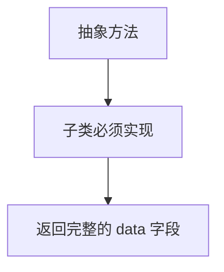

**实现要点**:
```python
@abstractmethod
def run(self, image_path: str, **kwargs) -> dict:
    """
    执行推理流程（抽象方法，子类必须实现）
    
    Args:
        image_path: 图像文件路径
        **kwargs: 额外参数（如 patient_info）
        
    Returns:
        dict: 完整的 data 字段，符合《接口定义.md》规范
        
    Raises:
        NotImplementedError: 子类未实现此方法
    """
    raise NotImplementedError("Subclass must implement run() method")
```

#### `_load_image(self, image_path: str) -> Any`（保护方法）

- **用途**: 加载图像文件为 numpy 数组（或其他格式）
- **输入参数**:
  - `image_path: str` - 图像文件路径
- **输出数据结构**: `np.ndarray` - 图像数组
- **实现流程**:

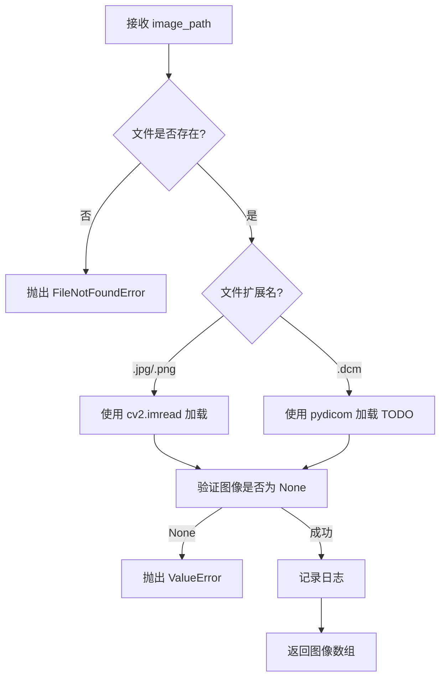

**实现要点**:
```python
def _load_image(self, image_path: str):
    """
    加载图像文件
    
    Args:
        image_path: 图像文件路径
        
    Returns:
        图像数组（格式待定，可能是 np.ndarray）
        
    Raises:
        FileNotFoundError: 文件不存在
        ValueError: 图像加载失败
        
    Note:
        - v3 实现基础的 JPG/PNG 加载
        - DICOM 支持延后到 v4
    """
    import os
    
    if not os.path.exists(image_path):
        self.logger.error(f"Image file not found: {image_path}")
        raise FileNotFoundError(f"Image file not found: {image_path}")
    
    # TODO: 实现图像加载逻辑
    # - 支持 JPG/PNG（使用 cv2 或 PIL）
    # - 支持 DICOM（延后到 v4）
    
    self.logger.info(f"Image loaded: {image_path}")
    # return image_array  # TODO
    raise NotImplementedError("Image loading not implemented yet")
```

#### `_validate_image(self, image: Any) -> bool`（保护方法）

- **用途**: 验证图像是否有效（尺寸、格式等）
- **输入参数**:
  - `image: Any` - 图像对象
- **输出数据结构**: `bool` - 是否有效
- **实现流程**:

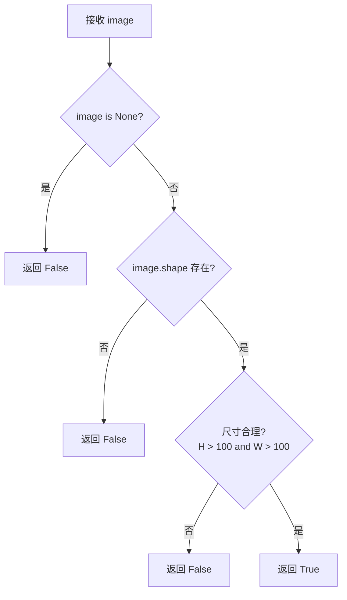

**实现要点**:
```python
def _validate_image(self, image) -> bool:
    """
    验证图像是否有效
    
    Args:
        image: 图像对象
        
    Returns:
        bool: 图像是否有效
        
    Note:
        - 检查图像是否为空
        - 检查图像尺寸是否合理
        - 具体规则待定（TODO）
    """
    if image is None:
        self.logger.error("Image is None")
        return False
    
    # TODO: 实现验证逻辑
    # - 检查尺寸
    # - 检查通道数
    # - 检查数据类型
    
    return True
```

#### `_log_step(self, step_name: str, message: str = "")`（保护方法）

- **用途**: 统一的步骤日志记录
- **输入参数**:
  - `step_name: str` - 步骤名称
  - `message: str` - 附加信息（可选）
- **输出数据结构**: 无
- **实现流程**:

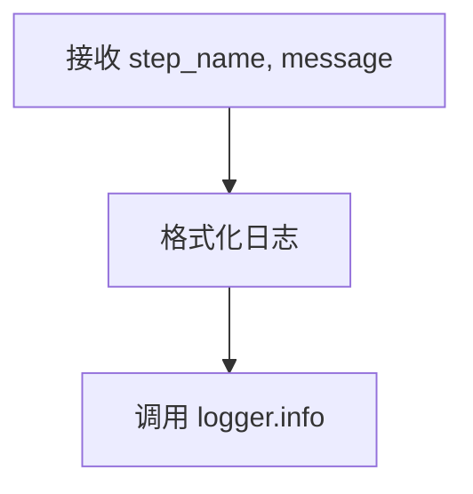

**实现要点**:
```python
def _log_step(self, step_name: str, message: str = ""):
    """
    统一的步骤日志记录
    
    Args:
        step_name: 步骤名称
        message: 附加信息
    """
    log_msg = f"[{self.pipeline_type}] {step_name}"
    if message:
        log_msg += f": {message}"
    self.logger.info(log_msg)
```

---

### pipelines/pano/pano_pipeline.py（重构）

**a. 文件用途说明**

全景片推理管道，负责协调各个子模块（teeth_seg, bone_density 等）完成完整的推理流程，并生成符合规范的 JSON 输出。

**b. 文件内类图**

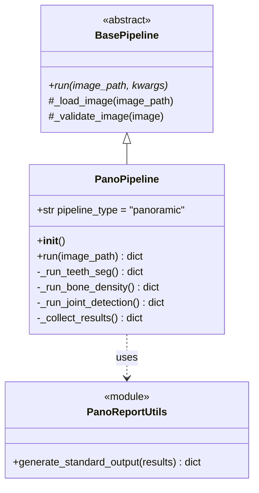

**c. 函数/方法详解**

#### `__init__(self)`

- **用途**: 初始化全景片 Pipeline
- **输入参数**: 无
- **输出数据结构**: 无
- **实现流程**:

```mermaid
flowchart TD
    A[调用 super().__init__] --> B[设置 pipeline_type = "panoramic"]
    B --> C[初始化子模块 TODO]
    C --> D[记录初始化日志]
```

**实现要点**:
```python
from pipelines.base_pipeline import BasePipeline
from pipelines.pano.utils import pano_report_utils
import logging

logger = logging.getLogger(__name__)


class PanoPipeline(BasePipeline):
    """
    全景片推理管道
    
    负责协调各个子模块完成全景片的完整分析流程，并生成符合规范的 JSON 输出。
    """
    
    def __init__(self):
        """初始化全景片 Pipeline"""
        super().__init__()
        self.pipeline_type = "panoramic"
        
        # TODO: 初始化子模块
        # self.teeth_seg_module = TeethSegModule()
        # self.bone_density_module = BoneDensityModule()
        # ...
        
        logger.info("PanoPipeline initialized")
```

#### `run(self, image_path: str) -> dict`

- **用途**: 执行全景片完整推理流程
- **输入参数**:
  - `image_path: str` - 图像文件路径
- **输出数据结构**: `dict` - 符合《规范：全景片 JSON》的完整 data 字段
- **实现流程**:

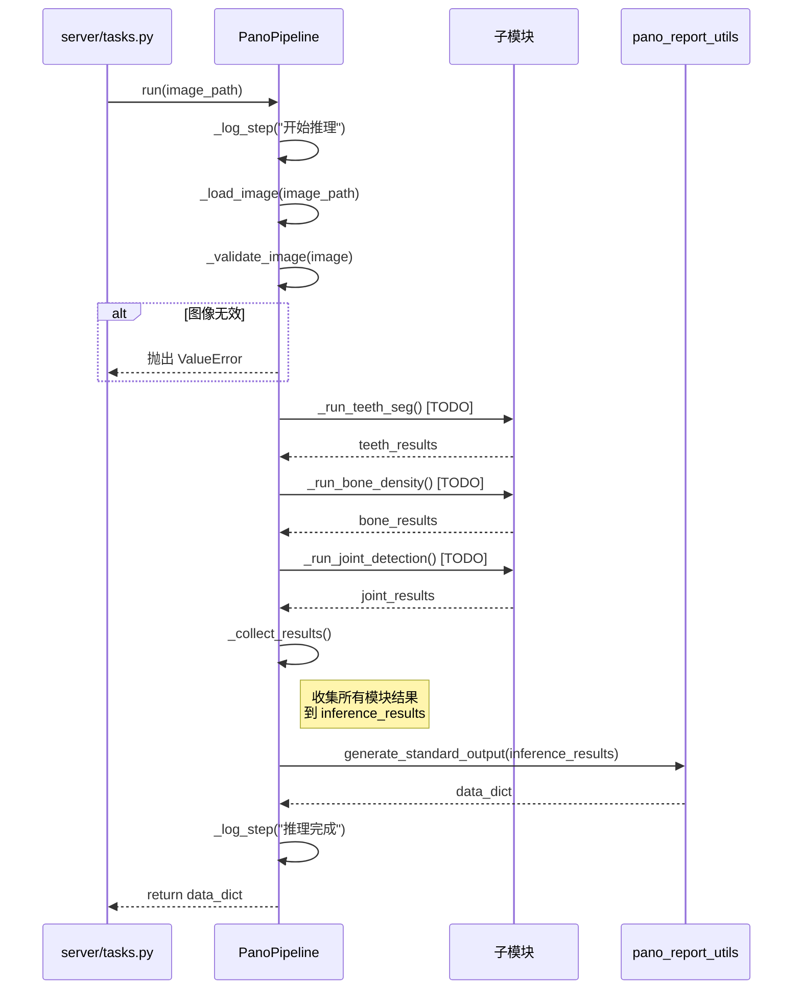

**实现要点**:
```python
def run(self, image_path: str) -> dict:
    """
    执行全景片推理流程
    
    Args:
        image_path: 图像文件路径
        
    Returns:
        dict: 完整的 data 字段，符合《规范：全景片 JSON》
        
    Raises:
        FileNotFoundError: 图像文件不存在
        ValueError: 图像验证失败
        
    工作流程:
        1. 加载并验证图像
        2. 依次调用各个子模块
        3. 收集所有推理结果
        4. 调用 report_utils 生成规范 JSON
        5. 返回完整的 data 字段
    """
    self._log_step("开始全景片推理", f"image_path={image_path}")
    
    # 1. 加载图像
    try:
        image = self._load_image(image_path)
    except Exception as e:
        logger.error(f"Failed to load image: {e}")
        raise
    
    # 2. 验证图像
    if not self._validate_image(image):
        raise ValueError(f"Invalid image: {image_path}")
    
    # 3. 依次调用各个子模块（TODO）
    try:
        teeth_results = self._run_teeth_seg(image)
        bone_results = self._run_bone_density(image)
        joint_results = self._run_joint_detection(image)
        # ... 其他子模块
        
    except Exception as e:
        logger.error(f"Inference failed: {e}")
        raise
    
    # 4. 收集所有结果
    inference_results = self._collect_results(
        teeth=teeth_results,
        bone=bone_results,
        joint=joint_results
    )
    
    # 5. 生成符合规范的 JSON
    data_dict = pano_report_utils.generate_standard_output(inference_results)
    
    self._log_step("全景片推理完成", f"data keys: {list(data_dict.keys())}")
    
    return data_dict
```

#### `_run_teeth_seg(self, image) -> dict`（私有方法）

- **用途**: 调用牙齿分割子模块
- **输入参数**:
  - `image` - 图像数组
- **输出数据结构**: `dict` - 牙齿分割结果
- **实现流程**:

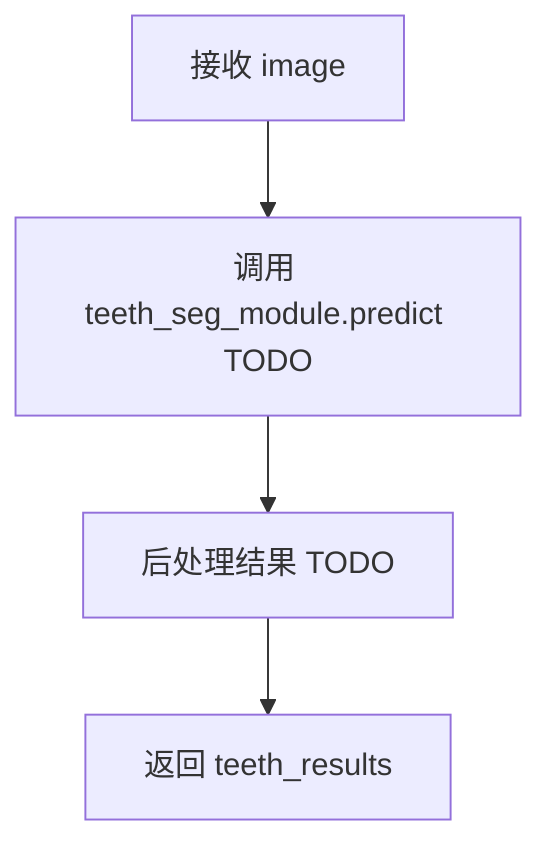

**实现要点**:
```python
def _run_teeth_seg(self, image) -> dict:
    """
    执行牙齿分割
    
    Args:
        image: 图像数组
        
    Returns:
        dict: 牙齿分割结果
        
    Note:
        - TODO: 调用实际的 teeth_seg 模块
        - TODO: 后处理分割结果
    """
    self._log_step("牙齿分割", "开始")
    
    # TODO: 实现牙齿分割逻辑
    # results = self.teeth_seg_module.predict(image)
    # processed_results = self._postprocess_teeth_seg(results)
    
    # 临时返回空字典（v3 占位）
    return {}
```

#### `_run_bone_density(self, image) -> dict`（私有方法）

- **用途**: 调用骨密度分析子模块
- **输入参数**:
  - `image` - 图像数组
- **输出数据结构**: `dict` - 骨密度分析结果
- **实现流程**:

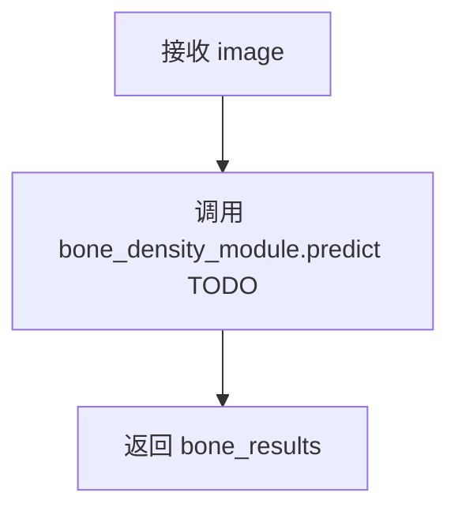

**实现要点**:
```python
def _run_bone_density(self, image) -> dict:
    """
    执行骨密度分析
    
    Args:
        image: 图像数组
        
    Returns:
        dict: 骨密度分析结果
        
    Note:
        - TODO: 调用实际的 bone_density 模块
    """
    self._log_step("骨密度分析", "开始")
    
    # TODO: 实现骨密度分析逻辑
    
    return {}
```

#### `_run_joint_detection(self, image) -> dict`（私有方法）

- **用途**: 调用关节检测子模块
- **输入参数**:
  - `image` - 图像数组
- **输出数据结构**: `dict` - 关节检测结果
- **实现流程**:

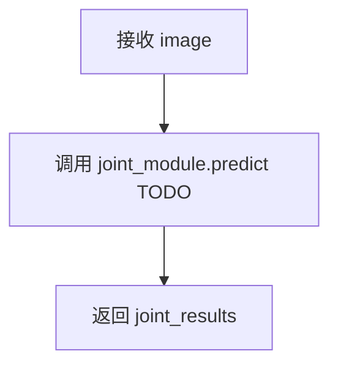

**实现要点**:
```python
def _run_joint_detection(self, image) -> dict:
    """
    执行关节检测
    
    Args:
        image: 图像数组
        
    Returns:
        dict: 关节检测结果
        
    Note:
        - TODO: 调用实际的 joint_detection 模块
    """
    self._log_step("关节检测", "开始")
    
    # TODO: 实现关节检测逻辑
    
    return {}
```

#### `_collect_results(self, **module_results) -> dict`（私有方法）

- **用途**: 收集所有子模块的推理结果
- **输入参数**:
  - `**module_results` - 各子模块结果（teeth, bone, joint 等）
- **输出数据结构**: `dict` - 汇总的推理结果
- **实现流程**:

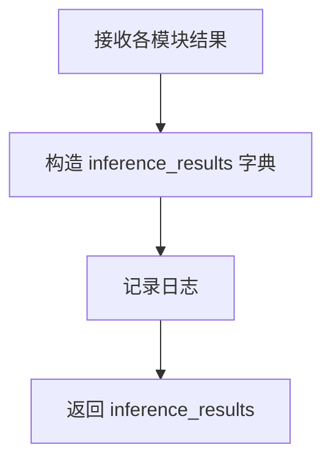

**实现要点**:
```python
def _collect_results(self, **module_results) -> dict:
    """
    收集所有子模块的推理结果
    
    Args:
        **module_results: 各子模块结果
        
    Returns:
        dict: 汇总的推理结果
        
    Example:
        inference_results = {
            "teeth": {...},
            "bone": {...},
            "joint": {...}
        }
    """
    self._log_step("收集结果", f"{len(module_results)} modules")
    
    inference_results = {
        "teeth": module_results.get("teeth", {}),
        "bone": module_results.get("bone", {}),
        "joint": module_results.get("joint", {}),
        # ... 其他模块
    }
    
    return inference_results
```

---

### pipelines/ceph/ceph_pipeline.py（重构）

**a. 文件用途说明**

侧位片推理管道，负责协调各个子模块（landmark detection, measurements 等）完成完整的推理流程，并生成符合规范的 JSON 输出。**需要患者信息作为必需输入**。

**b. 文件内类图**

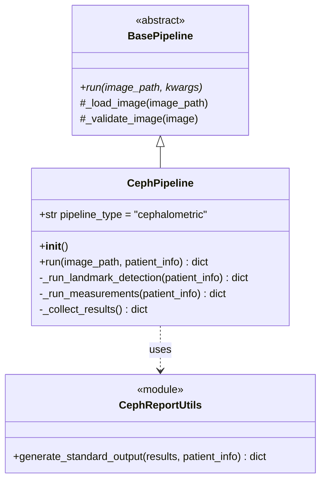

**c. 函数/方法详解**

#### `__init__(self)`

- **用途**: 初始化侧位片 Pipeline
- **输入参数**: 无
- **输出数据结构**: 无
- **实现流程**:

```mermaid
flowchart TD
    A[调用 super().__init__] --> B[设置 pipeline_type = "cephalometric"]
    B --> C[初始化子模块 TODO]
    C --> D[记录初始化日志]
```

**实现要点**:

```python
from pipelines.base_pipeline import BasePipeline
from pipelines.ceph.utils import ceph_report_json
import logging

logger = logging.getLogger(__name__)


class CephPipeline(BasePipeline):
  """
  侧位片推理管道
  
  负责协调各个子模块完成侧位片的完整分析流程，并生成符合规范的 JSON 输出。
  需要患者信息（gender, DentalAgeStage）作为必需输入。
  """

  def __init__(self):
    """初始化侧位片 Pipeline"""
    super().__init__()
    self.pipeline_type = "cephalometric"

    # TODO: 初始化子模块
    # self.landmark_module = LandmarkDetectionModule()
    # self.measurement_module = MeasurementModule()
    # ...

    logger.info("CephPipeline initialized")
```

#### `run(self, image_path: str, patient_info: dict) -> dict`

- **用途**: 执行侧位片完整推理流程
- **输入参数**:
  - `image_path: str` - 图像文件路径
  - `patient_info: dict` - 患者信息（必需）
    - `gender: str` - "Male" | "Female"
    - `DentalAgeStage: str` - "Permanent" | "Mixed"
- **输出数据结构**: `dict` - 符合《规范：侧位片 JSON》的完整 data 字段
- **实现流程**:

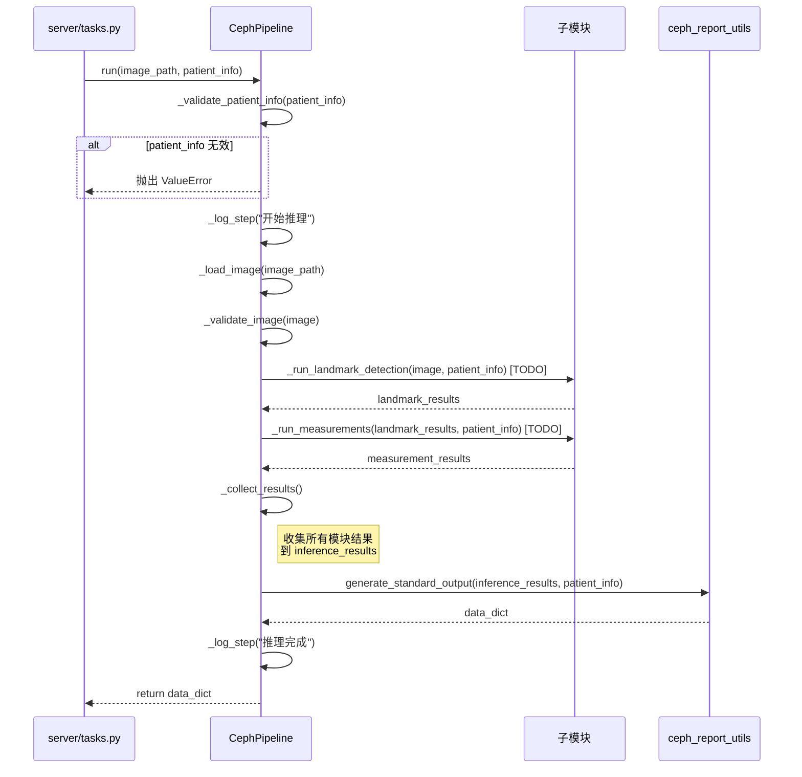

**实现要点**:
```python
def run(self, image_path: str, patient_info: dict) -> dict:
    """
    执行侧位片推理流程
    
    Args:
        image_path: 图像文件路径
        patient_info: 患者信息（必需）
            - gender: "Male" | "Female"
            - DentalAgeStage: "Permanent" | "Mixed"
        
    Returns:
        dict: 完整的 data 字段，符合《规范：侧位片 JSON》
        
    Raises:
        FileNotFoundError: 图像文件不存在
        ValueError: 图像验证失败或 patient_info 无效
        
    工作流程:
        1. 验证 patient_info
        2. 加载并验证图像
        3. 依次调用各个子模块（传递 patient_info）
        4. 收集所有推理结果
        5. 调用 report_utils 生成规范 JSON（传递 patient_info）
        6. 返回完整的 data 字段
    """
    # 0. 验证 patient_info
    self._validate_patient_info(patient_info)
    
    self._log_step("开始侧位片推理", f"image_path={image_path}, patient_info={patient_info}")
    
    # 1. 加载图像
    try:
        image = self._load_image(image_path)
    except Exception as e:
        logger.error(f"Failed to load image: {e}")
        raise
    
    # 2. 验证图像
    if not self._validate_image(image):
        raise ValueError(f"Invalid image: {image_path}")
    
    # 3. 依次调用各个子模块（传递 patient_info）
    try:
        landmark_results = self._run_landmark_detection(image, patient_info)
        measurement_results = self._run_measurements(landmark_results, patient_info)
        # ... 其他子模块
        
    except Exception as e:
        logger.error(f"Inference failed: {e}")
        raise
    
    # 4. 收集所有结果
    inference_results = self._collect_results(
        landmarks=landmark_results,
        measurements=measurement_results
    )
    
    # 5. 生成符合规范的 JSON（传递 patient_info）
    data_dict = ceph_report_utils.generate_standard_output(inference_results, patient_info)
    
    self._log_step("侧位片推理完成", f"data keys: {list(data_dict.keys())}")
    
    return data_dict
```

#### `_validate_patient_info(self, patient_info: dict)`（私有方法）

- **用途**: 验证 patient_info 的有效性
- **输入参数**:
  - `patient_info: dict` - 患者信息
- **输出数据结构**: 无（验证失败抛出异常）
- **实现流程**:

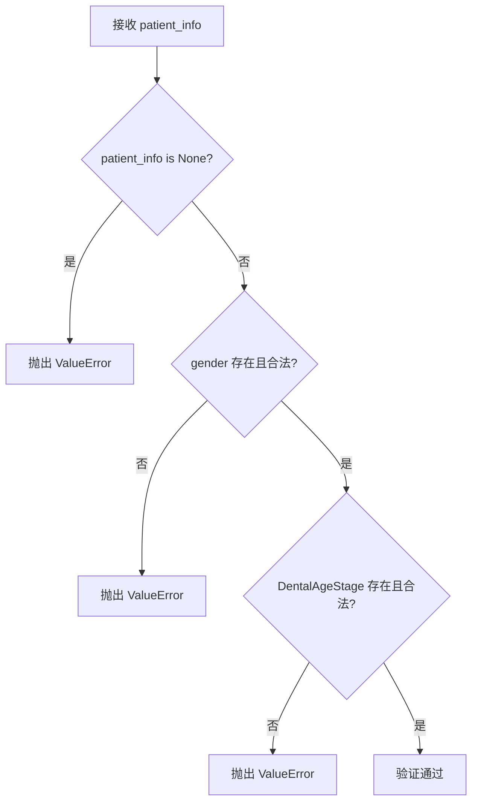

**实现要点**:
```python
def _validate_patient_info(self, patient_info: dict):
    """
    验证患者信息的有效性
    
    Args:
        patient_info: 患者信息字典
        
    Raises:
        ValueError: patient_info 无效
        
    Note:
        - 侧位片推理必须提供 patient_info
        - gender 必须为 "Male" 或 "Female"
        - DentalAgeStage 必须为 "Permanent" 或 "Mixed"
    """
    if not patient_info:
        raise ValueError("patient_info is required for cephalometric analysis")
    
    gender = patient_info.get("gender")
    dental_age_stage = patient_info.get("DentalAgeStage")
    
    if gender not in ["Male", "Female"]:
        raise ValueError(f"Invalid gender: {gender}, must be 'Male' or 'Female'")
    
    if dental_age_stage not in ["Permanent", "Mixed"]:
        raise ValueError(f"Invalid DentalAgeStage: {dental_age_stage}, must be 'Permanent' or 'Mixed'")
    
    logger.info(f"patient_info validated: gender={gender}, DentalAgeStage={dental_age_stage}")
```

#### `_run_landmark_detection(self, image, patient_info: dict) -> dict`（私有方法）

- **用途**: 调用关键点检测子模块
- **输入参数**:
  - `image` - 图像数组
  - `patient_info: dict` - 患者信息（可能影响关键点检测）
- **输出数据结构**: `dict` - 关键点检测结果
- **实现流程**:

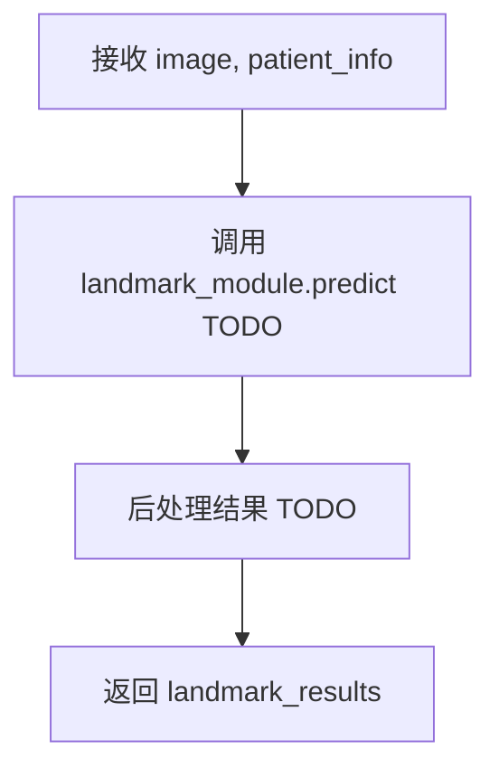

**实现要点**:
```python
def _run_landmark_detection(self, image, patient_info: dict) -> dict:
    """
    执行关键点检测
    
    Args:
        image: 图像数组
        patient_info: 患者信息
        
    Returns:
        dict: 关键点检测结果
        
    Note:
        - TODO: 调用实际的 landmark_detection 模块
        - TODO: 根据 patient_info 调整检测策略
    """
    self._log_step("关键点检测", f"patient_info={patient_info}")
    
    # TODO: 实现关键点检测逻辑
    # results = self.landmark_module.predict(image, patient_info)
    
    return {}
```

#### `_run_measurements(self, landmark_results: dict, patient_info: dict) -> dict`（私有方法）

- **用途**: 基于关键点计算测量值
- **输入参数**:
  - `landmark_results: dict` - 关键点检测结果
  - `patient_info: dict` - 患者信息（可能影响测量标准）
- **输出数据结构**: `dict` - 测量结果
- **实现流程**:

```mermaid
flowchart TD
    A[接收 landmark_results, patient_info] --> B[调用 measurement_module.calculate TODO]
    B --> C[返回 measurement_results]
```

**实现要点**:
```python
def _run_measurements(self, landmark_results: dict, patient_info: dict) -> dict:
    """
    基于关键点计算测量值
    
    Args:
        landmark_results: 关键点检测结果
        patient_info: 患者信息
        
    Returns:
        dict: 测量结果
        
    Note:
        - TODO: 调用实际的 measurement 模块
        - TODO: 根据 patient_info 调整测量标准
    """
    self._log_step("头影测量", f"patient_info={patient_info}")
    
    # TODO: 实现测量逻辑
    # results = self.measurement_module.calculate(landmark_results, patient_info)
    
    return {}
```

#### `_collect_results(self, **module_results) -> dict`（私有方法）

- **用途**: 收集所有子模块的推理结果
- **输入参数**:
  - `**module_results` - 各子模块结果（landmarks, measurements 等）
- **输出数据结构**: `dict` - 汇总的推理结果
- **实现流程**:

```mermaid
flowchart TD
    A[接收各模块结果] --> B[构造 inference_results 字典]
    B --> C[记录日志]
    C --> D[返回 inference_results]
```

**实现要点**:
```python
def _collect_results(self, **module_results) -> dict:
    """
    收集所有子模块的推理结果
    
    Args:
        **module_results: 各子模块结果
        
    Returns:
        dict: 汇总的推理结果
        
    Example:
        inference_results = {
            "landmarks": {...},
            "measurements": {...}
        }
    """
    self._log_step("收集结果", f"{len(module_results)} modules")
    
    inference_results = {
        "landmarks": module_results.get("landmarks", {}),
        "measurements": module_results.get("measurements", {}),
        # ... 其他模块
    }
    
    return inference_results
```

---

### server/tasks.py（修改）

**a. 文件用途说明**

定义异步推理任务，根据 taskType 实例化对应的 Pipeline 并调用 run() 方法获取推理结果（v3：真实推理，非 mock 数据）。

**b. 修改点说明**

#### 变更 1：移除 `load_mock_data()` 函数

- ❌ 删除整个函数（70 行代码）
- 不再从 example JSON 文件加载数据

#### 变更 2：修改 `analyze_task()` 函数

- ✅ 新增 Pipeline 实例化逻辑
- ✅ 根据 taskType 调用不同的 Pipeline
- ✅ 传递必要参数（image_path, patient_info）
- ✅ 获取真实推理结果

**c. 函数详解**

#### `analyze_task(self, task_id: str)`（修改）

**修改的实现流程**:

```mermaid
sequenceDiagram
    participant Worker
    participant Task as server/tasks.py
    participant Persist as TaskPersistence
    participant PanoPipe as PanoPipeline
    participant CephPipe as CephPipeline
    participant Callback as CallbackManager

    Worker->>Task: analyze_task(task_id)
    Task->>Persist: get_task(task_id)
    Persist-->>Task: metadata_v2
    
    Task->>Task: 提取 taskType, imagePath, patientInfo
    
    alt taskType == "panoramic"
        Task->>PanoPipe: 实例化 PanoPipeline()
        Task->>PanoPipe: run(image_path)
        PanoPipe-->>Task: data_dict (真实推理结果)
        
    else taskType == "cephalometric"
        Task->>CephPipe: 实例化 CephPipeline()
        Task->>CephPipe: run(image_path, patient_info)
        CephPipe-->>Task: data_dict (真实推理结果)
    end
    
    Task->>Task: 构造 CallbackPayload v3
    Task->>Callback: send_callback(url, payload_v3)
    Callback-->>Task: success
    
    Task->>Persist: delete_task(task_id)
```

**修改后的实现要点**:

```python
# -*- coding: utf-8 -*-
"""
AI 任务定义
根据 taskType 调用对应的 pipeline 执行推理
v3: 使用真实 Pipeline，移除 mock 数据
"""

import logging
import os
from datetime import datetime, timezone
from server.worker import celery_app
from server.core.persistence import TaskPersistence
from server.core.callback import CallbackManager
from server import load_config

# v3 新增：导入 Pipeline
from pipelines.pano.pano_pipeline import PanoPipeline
from pipelines.ceph.ceph_pipeline import CephPipeline

logger = logging.getLogger(__name__)


@celery_app.task(name='server.tasks.analyze_task', bind=True)
def analyze_task(self, task_id: str):
    """
    异步推理任务（v3 协议：真实 Pipeline）
    
    Args:
        self: Celery 任务实例（bind=True 时自动注入）
        task_id: 任务 ID
        
    工作流程:
        1. 从 Redis 获取任务元数据（v2 扩展字段）
        2. 检查图像文件是否存在
        3. 根据 taskType 实例化对应的 Pipeline
        4. 调用 pipeline.run() 获取真实推理结果
        5. 构造回调负载 v3（data 来自 Pipeline）
        6. 发送 HTTP 回调
        7. 清理 Redis 元数据（回调成功时）
        
    变更点（v2 → v3）:
        - ❌ 移除 load_mock_data() 调用
        - ✅ 新增 Pipeline 实例化和调用
        - ✅ 传递 patient_info 给 CephPipeline
    """
    logger.info(f"Task started: {task_id}")
    
    # 加载配置和初始化组件
    config = load_config()
    persistence = TaskPersistence(config)
    callback_mgr = CallbackManager(config)
    
    try:
        # 1. 获取任务元数据 v2
        metadata_v2 = persistence.get_task(task_id)
        if not metadata_v2:
            logger.error(f"Task not found in Redis: {task_id}")
            return
        
        task_type = metadata_v2['taskType']
        image_path = metadata_v2['imagePath']
        callback_url = metadata_v2['callbackUrl']
        client_metadata = metadata_v2.get('metadata', {})
        image_url = metadata_v2.get('imageUrl', '')
        patient_info = metadata_v2.get('patientInfo')
        
        logger.info(f"Task metadata retrieved: task_type={task_type}, image_path={image_path}")
        
        # 2. 检查图像文件是否存在
        if not os.path.exists(image_path):
            # v3 暂不实现错误回调（延后到 v4）
            logger.error(f"Image file not found: {image_path}")
            return
        
        # 3. 根据 taskType 实例化 Pipeline 并执行推理（v3 新增）
        try:
            if task_type == 'panoramic':
                # 全景片推理
                logger.info(f"Instantiating PanoPipeline for {task_id}")
                pipeline = PanoPipeline()
                data_dict = pipeline.run(image_path=image_path)
                
            elif task_type == 'cephalometric':
                # 侧位片推理（需要 patient_info）
                logger.info(f"Instantiating CephPipeline for {task_id}")
                pipeline = CephPipeline()
                data_dict = pipeline.run(image_path=image_path, patient_info=patient_info)
                
            else:
                logger.error(f"Unknown task_type: {task_type}")
                return
            
            logger.info(f"Pipeline execution completed for {task_id}")
        
        except Exception as e:
            # v3 暂不实现错误回调（延后到 v4）
            logger.error(f"Pipeline execution failed: {task_id}, {e}", exc_info=True)
            return
        
        # 4. 构造 CallbackPayload v3（data 来自 Pipeline）
        payload_v3 = {
            "taskId": task_id,
            "status": "SUCCESS",
            "timestamp": datetime.now(timezone.utc).isoformat(),
            "metadata": client_metadata,
            "requestParameters": {
                "taskType": task_type,
                "imageUrl": image_url
            },
            "data": data_dict,  # v3: 来自 Pipeline 真实推理
            "error": None
        }
        
        # 5. 发送回调 v3
        success = callback_mgr.send_callback(callback_url, payload_v3)
        
        # 6. 清理任务元数据（仅当回调成功时）
        if success:
            persistence.delete_task(task_id)
            logger.info(f"Task completed and cleaned: {task_id}")
        else:
            logger.warning(f"Task completed but callback failed, metadata retained: {task_id}")
    
    except Exception as e:
        logger.error(f"Task execution failed: {task_id}, {e}", exc_info=True)
```

**关键变更总结（v2 → v3）**:

| 代码块 | v2 实现 | v3 实现 |
|-------|---------|---------|
| **import** | 无 Pipeline 导入 | ✅ `from pipelines.pano.pano_pipeline import PanoPipeline`<br/>✅ `from pipelines.ceph.ceph_pipeline import CephPipeline` |
| **推理调用** | `data_dict = load_mock_data(task_type)` | ✅ `pipeline = PanoPipeline()` / `CephPipeline()`<br/>✅ `data_dict = pipeline.run(...)` |
| **参数传递** | 无参数 | ✅ 全景片：`run(image_path)`<br/>✅ 侧位片：`run(image_path, patient_info)` |
| **数据来源** | 静态 JSON 文件 | ✅ Pipeline 真实推理结果 |

---

### pipelines/pano/utils/pano_report_utils.py（接口明确）

**a. 文件用途说明**

负责将全景片的推理结果格式化为符合《接口定义.md》规范的 JSON 输出。

**b. 接口定义**

#### `generate_standard_output(inference_results: dict) -> dict`

- **用途**: 生成符合《规范：全景片 JSON》的完整 data 字段
- **输入参数**:
  - `inference_results: dict` - Pipeline 收集的所有模块推理结果
    - 示例: `{"teeth": {...}, "bone": {...}, "joint": {...}}`
- **输出数据结构**: `dict` - 符合《规范：全景片 JSON》的完整 data 字段
- **实现流程**:

```mermaid
flowchart TD
    A[接收 inference_results] --> B[提取各模块结果]
    B --> C[格式化 Metadata]
    C --> D[格式化 AnatomyResults]
    D --> E[格式化 JointAndMandible]
    E --> F[格式化 ToothAnalysis]
    F --> G[构造完整 data 字段]
    G --> H[返回 data_dict]
```

**接口契约（v3）**:
```python
"""
全景片报告生成工具
负责生成符合规范的 JSON 输出
"""

import logging
from typing import Dict, Any

logger = logging.getLogger(__name__)


def generate_standard_output(inference_results: Dict[str, Any]) -> Dict[str, Any]:
    """
    生成符合《规范：全景片 JSON》的完整 data 字段
    
    Args:
        inference_results: Pipeline 收集的所有模块推理结果
            - teeth: 牙齿分割结果
            - bone: 骨密度分析结果
            - joint: 关节检测结果
            - ... 其他模块
            
    Returns:
        dict: 符合《规范：全景片 JSON》的完整 data 字段
        
    示例输出:
        {
            "Metadata": { ... },
            "AnatomyResults": [ ... ],
            "JointAndMandible": { ... },
            "MaxillarySinus": [ ... ],
            "PeriodontalCondition": { ... },
            "MissingTeeth": [ ... ],
            "ThirdMolarSummary": { ... },
            "ToothAnalysis": [ ... ]
        }
        
    Note:
        - v3: 接口定义（内部实现 TODO）
        - v4: 完整实现（格式化逻辑）
    """
    logger.info("Generating standard output for panoramic analysis")
    
    # TODO: 实现格式化逻辑
    # - 提取 inference_results 中的各模块结果
    # - 按照《规范：全景片 JSON》格式化
    # - 确保所有必需字段存在
    
    # v3 占位：返回空结构
    data_dict = {
        "Metadata": {},
        "AnatomyResults": [],
        "JointAndMandible": {},
        "MaxillarySinus": [],
        "PeriodontalCondition": {},
        "MissingTeeth": [],
        "ThirdMolarSummary": {},
        "ToothAnalysis": []
    }
    
    logger.warning("generate_standard_output not fully implemented (TODO)")
    return data_dict
```

---

### pipelines/ceph/utils/ceph_report_utils.py（接口明确）

**a. 文件用途说明**

负责将侧位片的推理结果格式化为符合《接口定义.md》规范的 JSON 输出，**需要患者信息参与格式化**。

**b. 接口定义**

#### `generate_standard_output(inference_results: dict, patient_info: dict) -> dict`

- **用途**: 生成符合《规范：侧位片 JSON》的完整 data 字段
- **输入参数**:
  - `inference_results: dict` - Pipeline 收集的所有模块推理结果
    - 示例: `{"landmarks": {...}, "measurements": {...}}`
  - `patient_info: dict` - 患者信息（可能影响输出格式）
    - `gender: str` - "Male" | "Female"
    - `DentalAgeStage: str` - "Permanent" | "Mixed"
- **输出数据结构**: `dict` - 符合《规范：侧位片 JSON》的完整 data 字段
- **实现流程**:

```mermaid
flowchart TD
    A[接收 inference_results, patient_info] --> B[提取各模块结果]
    B --> C[格式化 ImageSpacing]
    C --> D[格式化 VisibilityMetrics]
    D --> E[格式化 CephalometricMeasurements]
    E --> F[格式化 KeyPoints]
    F --> G[构造完整 data 字段]
    G --> H[返回 data_dict]
```

**接口契约（v3）**:
```python
"""
侧位片报告生成工具
负责生成符合规范的 JSON 输出
"""

import logging
from typing import Dict, Any

logger = logging.getLogger(__name__)


def generate_standard_output(
    inference_results: Dict[str, Any],
    patient_info: Dict[str, str]
) -> Dict[str, Any]:
    """
    生成符合《规范：侧位片 JSON》的完整 data 字段
    
    Args:
        inference_results: Pipeline 收集的所有模块推理结果
            - landmarks: 关键点检测结果
            - measurements: 头影测量结果
            - ... 其他模块
        patient_info: 患者信息
            - gender: "Male" | "Female"
            - DentalAgeStage: "Permanent" | "Mixed"
            
    Returns:
        dict: 符合《规范：侧位片 JSON》的完整 data 字段
        
    示例输出:
        {
            "ImageSpacing": { ... },
            "VisibilityMetrics": { ... },
            "CephalometricMeasurements": { ... },
            "KeyPoints": [ ... ],
            "Measurements": [ ... ]
        }
        
    Note:
        - v3: 接口定义（内部实现 TODO）
        - v4: 完整实现（格式化逻辑）
        - patient_info 可能影响测量值的解释和正常范围判断
    """
    logger.info(f"Generating standard output for cephalometric analysis: patient_info={patient_info}")
    
    # TODO: 实现格式化逻辑
    # - 提取 inference_results 中的各模块结果
    # - 按照《规范：侧位片 JSON》格式化
    # - 根据 patient_info 调整输出（如性别和牙期相关的参考值）
    
    # v3 占位：返回空结构
    data_dict = {
        "ImageSpacing": {},
        "VisibilityMetrics": {},
        "CephalometricMeasurements": {},
        "KeyPoints": [],
        "Measurements": []
    }
    
    logger.warning("generate_standard_output not fully implemented (TODO)")
    return data_dict
```

---

## 配置项 v3

### config.yaml（无变更）

v3 不需要新增配置项，复用 v2 配置。Pipeline 内部暂不需要全局配置，子模块的配置在各自的 `config.yaml` 中管理（如 `pipelines/pano/modules/teeth_seg/config.yaml`）。

---

## 迭代演进依据 v3

### v3 实现范围（本文档）

#### ✅ 架构设计
1. ✅ 设计 `BasePipeline` 基类（统一接口 + 共享功能）
2. ✅ 设计 `PanoPipeline` 接口（继承基类，内部 TODO）
3. ✅ 设计 `CephPipeline` 接口（继承基类，需要 patient_info，内部 TODO）
4. ✅ 明确 `report_utils` 接口契约（输入输出格式）

#### ✅ 代码实现
1. ✅ `tasks.py` 修改：移除 `load_mock_data()`，调用真实 Pipeline
2. ✅ Pipeline 实例化逻辑（根据 taskType）
3. ✅ 参数传递逻辑（全景片无需 patient_info，侧位片必需）
4. ✅ 回调 payload 构造（data 来自 Pipeline）

#### ⏸️ 延后到 v4
1. ⏸️ Pipeline 内部实现（子模块调用、模型加载等）
2. ⏸️ `report_utils` 内部实现（格式化逻辑）
3. ⏸️ 错误处理和 FAILURE 回调
4. ⏸️ DICOM 支持

### v3 → v4 迭代路径

**从 v3 到 v4 的演进非常清晰**：

#### 1. 填充 Pipeline 内部实现
- 修改点：`pano_pipeline.py` 和 `ceph_pipeline.py` 的 TODO 部分
- 实现：
  - `_load_image()` 真实的图像加载逻辑
  - `_run_teeth_seg()` 等子模块调用
  - 加载模型权重、预处理、推理、后处理

#### 2. 填充 report_utils 实现
- 修改点：`pano_report_utils.py` 和 `ceph_report_utils.py`
- 实现：
  - `generate_standard_output()` 的格式化逻辑
  - 将模型输出映射到规范 JSON 字段

#### 3. 添加错误处理
- 修改点：`tasks.py` 中的异常捕获
- 实现：
  - 捕获 Pipeline 异常
  - 生成 FAILURE 回调 payload
  - 调用 callback_mgr 发送错误回调

#### 4. 支持 DICOM
- 修改点：`base_pipeline.py` 的 `_load_image()`
- 实现：
  - 使用 `pydicom` 加载 DICOM 文件
  - 提取患者信息（如果 patient_info 未提供）
  - 转换为标准图像格式

---

## v3 架构优势总结

### 1. 职责清晰
```
server/tasks.py       →  调度层（选择 Pipeline、传递参数）
pipelines/*_pipeline  →  推理层（协调子模块）
pipelines/*/utils/*   →  格式化层（生成规范 JSON）
```

### 2. 易于测试
```python
# 单元测试 Pipeline
pipeline = PanoPipeline()
data = pipeline.run("test.jpg")
assert "Metadata" in data

# 单元测试 report_utils
results = {"teeth": [...]}
data = pano_report_utils.generate_standard_output(results)
assert "ToothAnalysis" in data
```

### 3. 易于演进
- **v3 → v4**：填充 Pipeline 内部 TODO，无需修改 tasks.py
- **v4 → v5**：添加新子模块，只修改 Pipeline，无需修改 tasks.py
- **v5 → v6**：支持 DICOM，只修改 `base_pipeline._load_image()`

### 4. 符合 SOLID 原则
- **单一职责**：每个类只负责一件事
- **开闭原则**：对扩展开放（新增子模块），对修改封闭（tasks.py 稳定）
- **依赖倒置**：tasks.py 依赖抽象接口（`run()`），不依赖具体实现

---

## 附录: v3 关键代码文件结构

### 新增/修改文件列表

```
v3 变更文件:
├── pipelines/
│   ├── base_pipeline.py              ✅ 新增（约 150 行）
│   ├── pano/
│   │   ├── pano_pipeline.py          ✅ 重构（约 200 行，内部 TODO）
│   │   └── utils/
│   │       └── pano_report_utils.py  ✅ 接口明确（约 50 行，内部 TODO）
│   └── ceph/
│       ├── ceph_pipeline.py          ✅ 重构（约 250 行，内部 TODO）
│       └── utils/
│           └── ceph_report_utils.py  ✅ 接口明确（约 50 行，内部 TODO）
└── server/
    └── tasks.py                      ✅ 修改（移除 load_mock_data，新增 Pipeline 调用）
```

### 代码行数估算

| 文件 | v2 行数 | v3 行数 | 变更类型 |
|------|---------|---------|---------|
| `base_pipeline.py` | 0（空文件） | 150 | 新增设计 |
| `pano_pipeline.py` | 0（空文件） | 200 | 新增接口 |
| `ceph_pipeline.py` | 0（空文件） | 250 | 新增接口 |
| `pano_report_utils.py` | 16（TODO） | 50 | 接口明确 |
| `ceph_report_utils.py` | 16（TODO） | 50 | 接口明确 |
| `tasks.py` | 212 | 220 | 修改推理逻辑 |
| **总计** | **244** | **920** | **+676 行** |

**注**: 行数包含注释、文档字符串、空行。实际逻辑代码约占 50-60%。

---

**文档版本**: v3.0  
**最后更新**: 2024-11-17  
**变更类型**: Pipeline 架构接口设计  
**向后兼容性**: ✅ 兼容 v2（仅内部实现变更，API 接口不变）  
**实现完成度**: 🔶 接口设计 100%，内部实现 0%（按计划）

