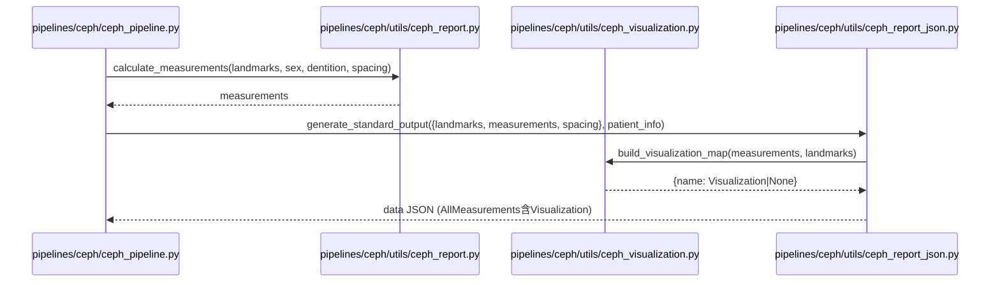
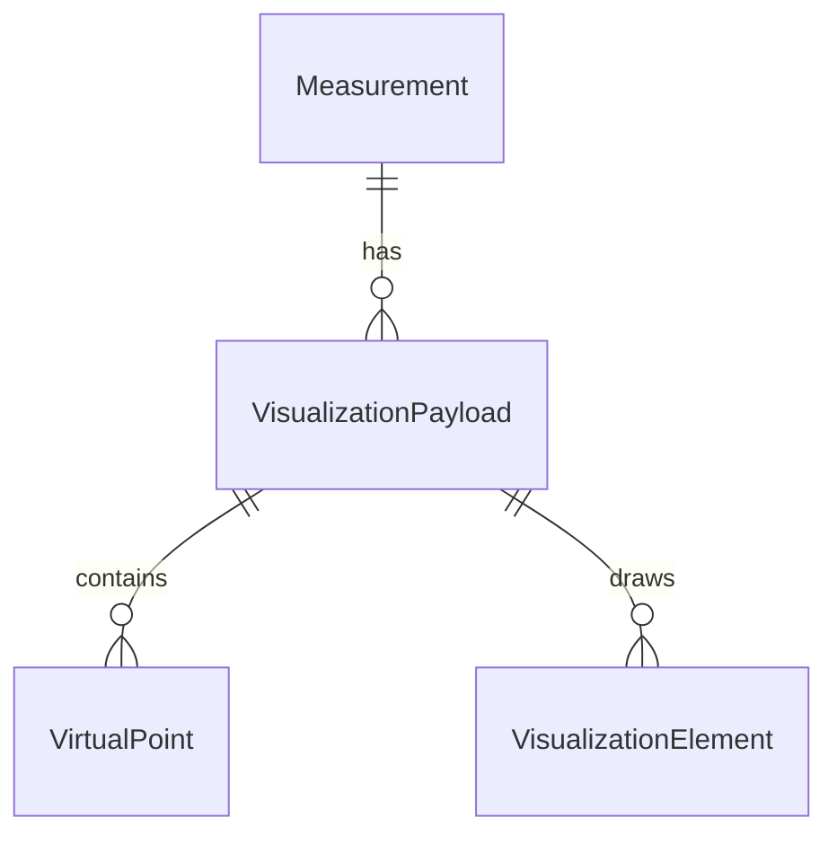
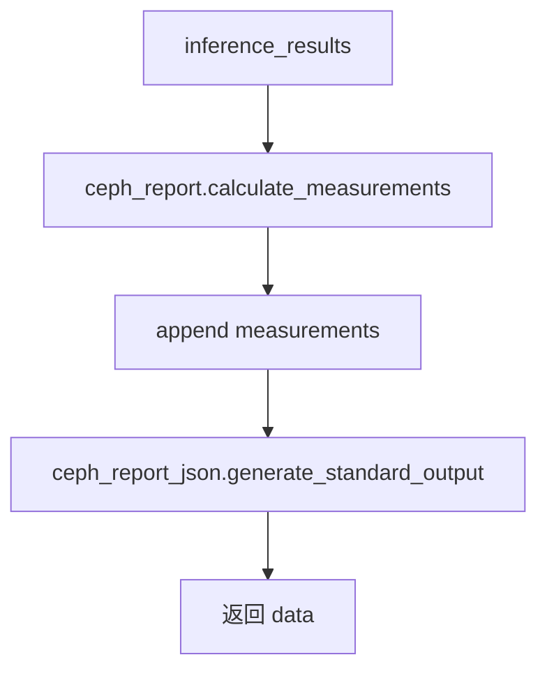
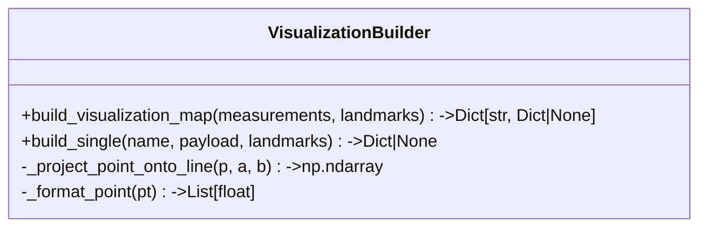
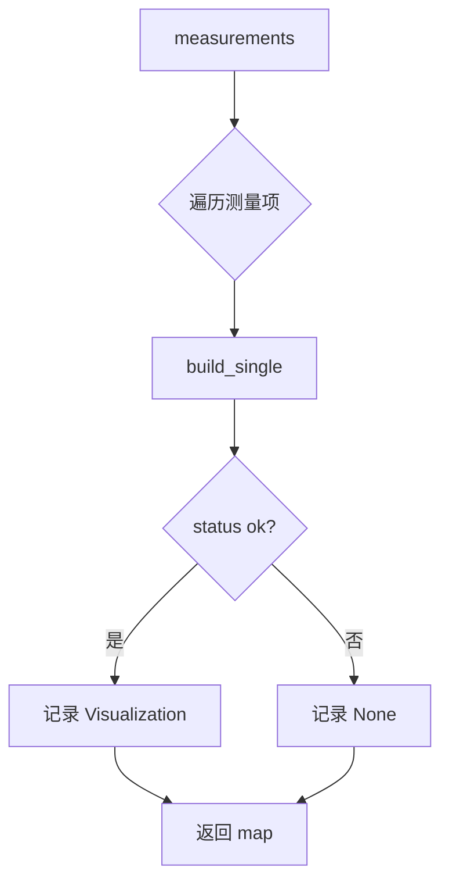
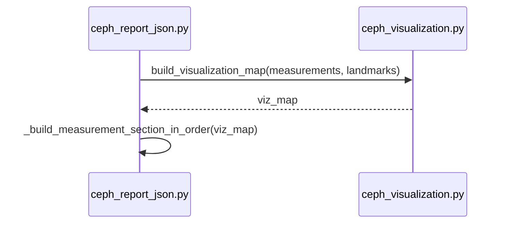
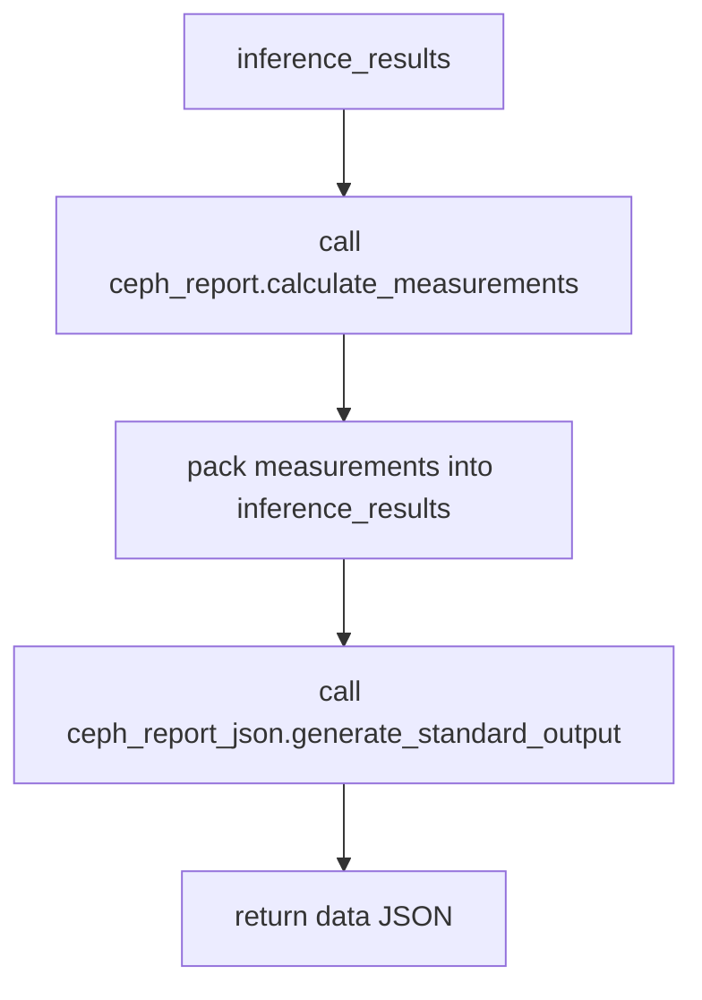
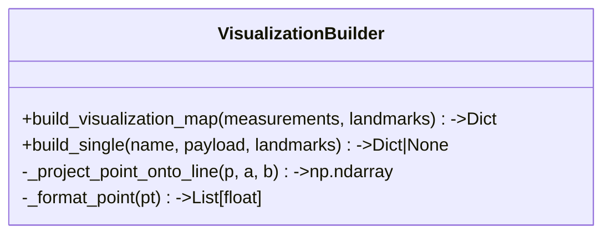
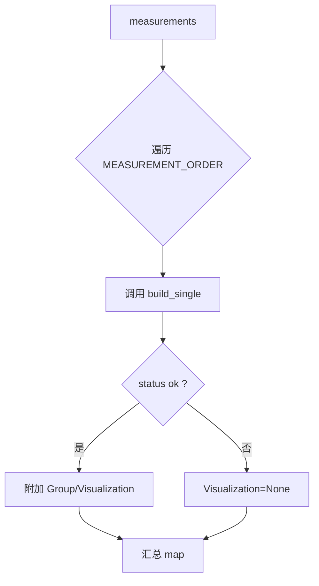

## 项目结构与总体设计
- 目标：在不破坏既有 JSON 输出的前提下，为每个测量项提供极简的绘图指令 `Visualization`，前端仅遍历线段绘制。
- 设计原则：保持原有测量值逻辑不改动；新增独立可视化模块；`ceph_report_json.py` 挂接可视化字段；后续迭代未实现项统一返回固定占位 `{"Visualization": None}`。
- 迭代策略：目录与接口一次规划；迭代1实现 PRD 列出的核心测量可视化；后续测量按同一接口补齐。

## 目录结构树 (Directory Tree)
```
pipelines/ceph/
├─ ceph_pipeline.py
├─ utils/
│  ├─ ceph_report.py               # 现有测量计算（保持不改）
│  ├─ ceph_report_json.py          # JSON 组装，新增挂接 Visualization
│  ├─ ceph_visualization.py        # 新增：可视化构建与几何辅助
│  └─ ceph_recalculate.py
└─ modules/…                       # 模型与前后处理（不改）
```

## 整体逻辑和交互时序图


## 数据实体结构深化
- MeasurementEntry
  - Label: str
  - Angle | Length_mm | Ratio | Type | Level | Confidence …（原字段保持）
  - Visualization: VisualizationPayload | None
- VisualizationPayload
  - VirtualPoints: {key: [float, float]} | None
  - Elements: [VisualizationElement]
- VisualizationElement
  - Type: "Line"
  - From: str (Landmarks key 或 VirtualPoints key)
  - To: str
  - Style: "Solid" | "Dashed"
  - Role: "Reference" | "Measurement"

关系图：


## 配置项
- 无新增环境变量。
- 坐标系：原图像素坐标，左上(0,0)，x→右，y→下；坐标保留2位小数，类型 float。

## 模块化文件详解 (File-by-File Breakdown)

### pipelines/ceph/ceph_pipeline.py
a. 用途：串联推理结果与报告生成。  
b. 类图：无。  
c. 函数/方法详解  

#### generate_report(...)
- 用途：驱动测量计算与 JSON 组装。  
- 入参：inference_results(dict)，patient_info(dict)。  
- 出参：data(dict)。  
- 流程：


### pipelines/ceph/utils/ceph_report.py
a. 用途：计算测量结果，保持不改；供可视化读取 landmarks 与测量值。  
b. 类图：无。  
c. 函数/方法详解  
- _compute_* 系列：现有测量值计算，签名不变。  
- 若需复用垂足，可新增 `_project_point_onto_line(point, line_start, line_end)`（np.ndarray→np.ndarray），零向量返回 line_start；供可视化内部调用，避免污染现有输出。

### pipelines/ceph/utils/ceph_visualization.py  （新增）
a. 用途：根据 landmarks 与 measurements 生成 VisualizationPayload，不修改原测量值。  
b. 类图：

c. 函数/方法详解  

#### build_visualization_map(measurements, landmarks)
- 用途：为每个测量项生成 Visualization 或 None。  
- 入参：measurements(dict)，landmarks(dict)。  
- 出参：dict[name] = VisualizationPayload | None。  
- 流程：


#### build_single(name, payload, landmarks)
- 用途：按测量名生成线段/虚拟点；缺点或 status!=ok 返回 None。  
- 入参：name(str)，payload(dict)，landmarks(dict)。  
- 出参：VisualizationPayload | None。  
- 迭代1覆盖的测量项与要点：
  - ANB/SNA/SNB：Elements S-N、N-A、N-B（Solid/Reference）。
  - PoNB_Length：VirtualPoints.v_pog_on_nb；Elements N-B (Reference, Solid)，Pog→v_pog_on_nb (Measurement, Dashed)。
  - GoPo_Length：v_pog_on_mp；Elements Go-Me (Reference, Solid)，Pog→v_pog_on_mp (Measurement, Dashed)。
  - Distance_Witsmm：v_a_on_fh、v_b_on_fh；Elements Po-Or (Reference, Dashed)，A→v_a_on_fh (Measurement, Dashed)，B→v_b_on_fh (Measurement, Dashed)。
  - FH_MP_Angle：Po-Or (Reference, Dashed)，Go-Me (Reference, Solid)。
  - U1_SN_Angle：S-N (Reference, Solid)，U1-U1A (Measurement, Solid)。
  - IMPA_Angle：Go-Me (Reference, Solid)，L1-L1A (Measurement, Solid)。
- 迭代占位：未覆盖的测量项返回 None（固定占位实现）。

#### _project_point_onto_line(p, a, b)
- 用途：垂足计算；零向量时返回 a。  
- 入参：np.ndarray p/a/b。  
- 出参：np.ndarray 垂足。  
- 用于投影点生成（PoNB、GoPo、Wits 等）。

#### _format_point(pt)
- 用途：输出 `[float, float]`，保留2位小数；输入无效返回 None 供上层判空。

### pipelines/ceph/utils/ceph_report_json.py
a. 用途：生成最终 JSON；新增对 Visualization 的注入。  
b. 类图：无。  
c. 函数/方法详解  

#### generate_standard_output(inference_results, patient_info, visualization_enabled=True)
- 用途：组装 data；可选择开启可视化。  
- 入参：inference_results(dict: landmarks/measurements/spacing)，patient_info(dict)，visualization_enabled(bool)。  
- 出参：data(dict)。  
- 流程：


#### _build_measurement_entry(name, payload, viz_map=None)
- 用途：构造单条测量输出。  
- 入参：name(str)，payload(dict)，viz_map(dict|None)。  
- 出参：dict（含原字段+Visualization）。  
- 逻辑：原字段保持；从 viz_map 取 Visualization；若缺失或 status!=ok → Visualization=None；坐标格式化为两位小数 float。

## 迭代演进依据
- 接口稳定：新增 `Visualization` 单一字段，后续测量按同接口补齐；未实现项统一 None 占位，前端健壮性不受影响。
- 模块解耦：可视化独立文件，便于增量完善；文件长度 <500 行。
- 前后端职责清晰：后端仅提供几何与角色语义（Reference/Measurement），前端自定样式。

## 如何迁移 xxx
- 迁移路径：保持 `ceph_report.py` 计算结果不改；新增 `ceph_visualization.py` 生成指令；`ceph_report_json.py` 注入 Visualization。
- 对照关系：
  - 原测量计算 → `ceph_report.py`（复用）。
  - 新可视化生成 → `ceph_visualization.py`（新增）。
  - JSON 输出挂接 → `ceph_report_json.py`（轻量改造）。
## 项目结构与总体设计
- 目标：在不破坏既有 JSON 输出的前提下，为测量项追加 Group 与 Visualization 字段，所有可视化几何计算由后端完成，前端仅消费语义与坐标。
- 设计原则：最小入侵（沿用原计算输出），新增独立可视化模块，`ceph_report.py` 计算逻辑保持原状；`ceph_report_json.py` 仅在构建测量项时挂接分组与可视化字段。
- 迭代策略：目录与接口一次规划；迭代1实现核心指标（PRD列出的可视化项）；后续指标以固定返回值占位 `{"Group":"Other","Visualization":None}`，待后续迭代补全。

## 目录结构树 (Directory Tree)
```
pipelines/ceph/
├─ ceph_pipeline.py
├─ utils/
│  ├─ ceph_report.py               # 现有测量计算（保持不改或仅最小暴露接口）
│  ├─ ceph_report_json.py          # 现有 JSON 组装，新增分组/可视化挂接
│  ├─ ceph_visualization.py        # 新增：可视化构建与几何辅助
│  └─ ceph_recalculate.py
└─ modules/…                       # 模型与前后处理（保持不动）
```

## 整体逻辑和交互时序图
典型请求：推理完成后生成带可视化的测量 JSON。


## 数据实体结构深化
- MeasurementEntry
  - Label: str
  - Angle | Length_mm | Ratio | Coordinates | Type | Level | Confidence …（原字段保持）
  - Group: str (默认"Other")
  - Visualization: VisualizationPayload | None
- VisualizationPayload
  - VirtualPoints: {key: [float, float]}
  - Elements: [VisualizationElement]
- VisualizationElement
  - Type: "Line"
  - From: str (landmark key 或 virtual point key)
  - To: str
  - Style: "Solid" | "Dashed"
  - Role: "Reference" | "Measurement"

关系图：


## 配置项
- 无新增环境变量。可视化精度固定保留2位小数，坐标系沿用原图像像素（左上(0,0)，x→右，y→下）。

## 模块化文件详解 (File-by-File Breakdown)

### pipelines/ceph/ceph_pipeline.py
**用途说明**：负责加载模型、运行推理并调用报告生成。

#### 函数/方法详解
- generate_report(flow)
  - 用途：串联推理输出与 JSON 组装。
  - 入参：inference_results(dict)，patient_info(dict)。
  - 输出：data(dict)。
  - 流程：


### pipelines/ceph/utils/ceph_report.py
**用途说明**：现有测量计算核心，保持现状，仅提供几何结果（值、结论、状态）。

#### 新增/复用函数
- （复用）_compute_* 系列：保持现状，供可视化读取原始点与结果。
- （新增）_project_point_onto_line(point, line_start, line_end) *若需复用*: 计算垂足坐标，返回 np.ndarray，供虚拟点投影使用（位于本文件或由 `ceph_visualization.py` 内部实现，不破坏现有签名）。

### pipelines/ceph/utils/ceph_visualization.py
**用途说明**：新增模块，负责基于 landmarks 与测量结果构建 VisualizationPayload，不改变原测量值。

**类图**：


#### 函数/方法详解
- build_visualization_map(measurements, landmarks)
  - 用途：批量为测量项生成 {Group, Visualization}。
  - 入参：measurements(dict)，landmarks(dict)。
  - 输出：dict[name] = {"Group": str, "Visualization": payload|None}。
  - 流程：


- build_single(name, payload, landmarks)
  - 用途：为单个测量项生成可视化指令；支持缺点返回 None。
  - 入参：name(str)，payload(dict)，landmarks(dict)。
  - 输出：VisualizationPayload | None。
  - 核心要点（迭代1实现项）：
    - `_compute_anb` 系列：Elements 包含 S-N、N-A、N-B（Solid, Reference）。
    - `_compute_ponb_length`: VirtualPoints.v_pog_on_nb，Elements N-B（Reference, Solid）、Pog->v_pog_on_nb（Measurement, Dashed）。
    - `_compute_gopo_length`: v_pog_on_mp，Elements Go-Me（Reference, Solid）、Pog->v_pog_on_mp（Measurement, Dashed）。
    - `_compute_wits`: v_a_on_fh, v_b_on_fh，Elements Po-Or（Reference, Dashed）、A/B ->投影（Measurement, Dashed）。
    - `_compute_fh_mp`: Elements Po-Or（Dashed, Reference）、Go-Me（Solid, Reference）。
    - `_compute_u1_sn`: Elements S-N（Solid, Reference）、U1-U1A（Solid, Measurement）。
    - `_compute_impa`: Elements Go-Me（Solid, Reference）、L1-L1A（Solid, Measurement）。
  - 失败兜底：payload.status != "ok" 或缺 landmark 时返回 None。

- _project_point_onto_line(point, line_start, line_end)
  - 用途：计算垂足；输入 np.ndarray；输出 np.ndarray。
  - 处理：零向量时返回 line_start。

- _format_point(pt)
  - 用途：输出 [x, y]，float 保留2位小数。

### pipelines/ceph/utils/ceph_report_json.py
**用途说明**：组装最终 JSON。新增分组与可视化挂接，保持原字段不变。

#### 新增内容
- MEASUREMENT_GROUPS：按用户提供清单；未命中默认 "Other"。
- 在 `_build_measurement_entry` 内：
  - 接收 `visualization_map` 参数（外层生成后传入）。
  - entry 增加 `Group`（查表或默认）与 `Visualization`（来自 map，否则 None）。
  - 计算失败时 Visualization 置 None。

#### 函数/方法详解
- generate_standard_output(inference_results, patient_info, visualization_enabled=True)
  - 用途：生成 data JSON。
  - 入参：inference_results 包含 landmarks/measurements/spacing，patient_info，visualization_enabled(bool)。
  - 输出：data dict。
  - 时序：


## 迭代演进依据
- 架构预留：`build_single` 按 name 分派，未实现的测量项返回 `{"Group":"Other","Visualization":None}`，便于后续补全。
- 文件粒度：新增模块独立且<500行，可增量迭代。
- 与前端解耦：后端仅提供语义与坐标，样式交由前端，降低耦合。

## 如何迁移 xxx
- 迁移现有 ceph 侧位片可视化：原测量函数保持不变；在 `ceph_visualization.py` 中为已存在的测量项补充可视化逻辑；`ceph_report_json.py` 增加 `MEASUREMENT_GROUPS` 与 `Visualization` 注入；其余调用链保持。
- 对照关系：
  - 原测量计算：`ceph_report.py` → 复用。
  - 新可视化组装：`ceph_visualization.py` → 新增。
  - JSON 输出：`ceph_report_json.py` → 挂接分组与可视化。

