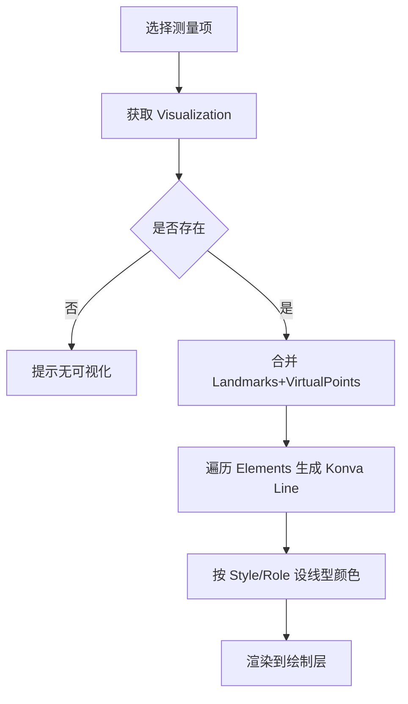

# 前端可视化渐进式小步迭代计划（Xray_web）

## 范围与依赖
- 目标：在 `web/Xray_web` 前端消费后端 JSON（含 `Visualization`），完成测量项点击即画线的可视化。
- 主要文件：`static/index.html`, `static/app.js`, `static/style.css`（如需轻量子模块可在 `static` 内新增，不超过 500 行）。
- 依赖：Konva 已内置（`lib/konva.min.js`）；后端已确保除颈椎外的测量项均返回 `Visualization`。

## 步骤列表（每步可运行、可验证）
1. **数据接入与测量列表**
   - 动作：在 `app.js` 读取后端 JSON，构造 `landmarks`（全局点位）与 `measurementMap`（Label→Payload），渲染测量项列表/下拉。
   - 校验：页面加载后能看到测量项列表，点击项能够拿到对应 `Visualization`。

2. **Konva 场景检查与坐标缩放**
   - 动作：确认/初始化舞台与图层（背景图层、绘制层）；若有缩放/平移，封装 world→screen 转换，保证使用原图坐标绘制。
   - 校验：背景图正常显示，打印当前缩放/偏移参数，确保线段按原像素坐标绘制不会偏移。

3. **绘制管线封装**
   - 动作：新增 `renderMeasurement(label)` 与 `createLine(pointA, pointB, role, style)`；支持 `VirtualPoints` 合并到点集；按 `Style`/`Role` 设定颜色/粗细/虚线。
   - 校验：点击任意有 `Visualization` 的测量项，绘制层出现对应线段；再次点击会清理旧线重绘。

4. **空值与错误兜底**
   - 动作：若 `Visualization` 为 `null` 或缺点位，UI 提示“不含可视化”；不抛异常。
   - 校验：点击 `Cervical_Vertebral_Maturity_Stage`（无可视化）只出现提示，不报错。

5. **图例与样式完善**
   - 动作：在侧栏/底部增加图例：Reference（细/灰，实或虚）、Measurement（粗/高亮，实或虚）；样式集中在 `style.css`。
   - 校验：图例可见且与实际线型一致。

6. **交互增强（可选小步）**
   - 动作：增加上一条/下一条切换；当前选中项高亮；支持清空绘制。
   - 校验：切换按钮可循环遍历测量项，绘制同步更新。

7. **测试与回归**
   - 动作：用 `example/ceph_output.json` 驱动前端，逐项点击验证；若有简单单测脚本（如 `test_frontend_json.js`），补充对渲染函数的健壮性检查。
   - 校验：除颈椎项外均可正常绘制，控制台无错误。

## 流程图（渲染时序）

