# AI 异步分析前端 MVP v4 - 详细设计文档 (LLD)

## 项目结构与总体设计

本项目是一个轻量级的前端测试应用，用于验证 AI 异步分析接口的完整流程。系统由两个核心组件构成：
1. **Flask 微型回调服务器**：同时提供静态文件服务和回调接收功能
2. **原生 JavaScript 前端页面**：实现任务提交、轮询和结果展示

**核心设计原则：**
- 简约至上：采用最简单的技术栈（原生JS + Flask），无额外依赖
- 单任务处理：同一时刻只能处理一个分析任务
- 内存存储：任务结果仅保存在内存中，服务重启后丢失
- 无状态恢复：页面刷新后直接重置，不恢复之前的任务

---

## 目录结构树

```
web/vibe_coding/
├── app.py                      # Flask 服务器主程序
├── static/
│   ├── index.html              # 前端主页面
│   ├── app.js                  # 前端核心逻辑
│   └── style.css               # 基础样式
└── readme_frontend_mvp_lld.md  # 本文档
```

---

## 整体逻辑和交互时序图

以下是一个完整的成功任务提交到结果展示的典型流程：

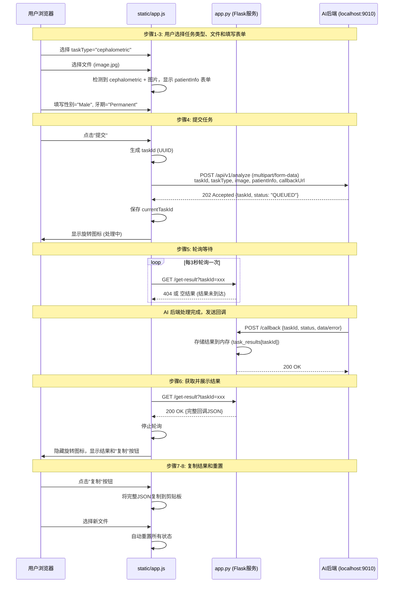

---

## 数据实体结构

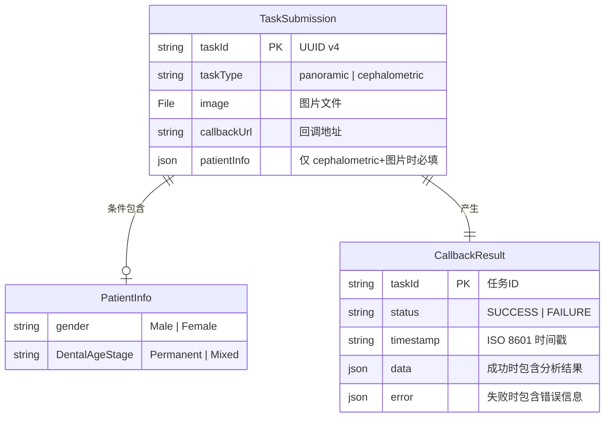

---

## 配置项

由于系统设计为"一切从简"，配置项已硬编码在代码中，无需额外配置文件。

### Flask 服务配置
- **端口**: `5000`
- **绑定地址**: `0.0.0.0`（允许内网访问）
- **调试模式**: `False`（生产环境）

### 前端配置
- **AI 后端接口地址**: `http://192.168.1.17:9010/api/v1/analyze`
- **回调服务器地址**: `http://192.168.1.17:5000/callback`
- **轮询间隔**: `3000` 毫秒（3秒）
- **超时时间**: `360000` 毫秒（6分钟）

**注意**: 如需修改这些配置，需要直接编辑代码中的常量定义。

---

## 模块化文件详解

---

### app.py

**a. 文件用途说明**

Flask 微型回调服务器的主程序。提供三个核心功能：
1. 静态文件服务：为前端页面提供 HTTP 访问
2. 回调接收接口：接收 AI 后端的异步回调
3. 结果查询接口：供前端轮询查询任务结果

**b. 文件内类图**

本文件不包含类，仅包含函数和全局变量。

**c. 函数详解**

#### 函数 1: `index()`

- **用途**: 提供前端主页面的静态文件服务
- **输入参数**: 无（Flask 路由函数）
- **输出数据结构**: HTML 文件内容（`static/index.html`）
- **路由**: `GET /`

**实现流程**:

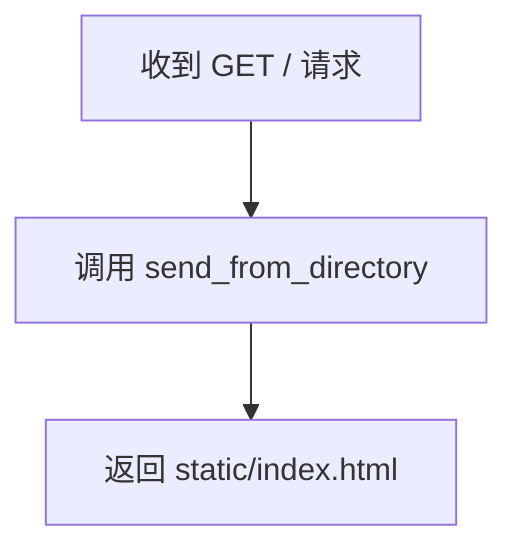

---

#### 函数 2: `callback()`

- **用途**: 接收 AI 后端的异步回调请求，并将结果存储到内存
- **输入参数**: 
  - Request Body (JSON):
    ```json
    {
      "taskId": "string",
      "status": "SUCCESS | FAILURE",
      "timestamp": "ISO 8601 时间戳",
      "data": {...} | null,
      "error": {...} | null
    }
    ```
- **输出数据结构**: 
  - 成功: `{"status": "received"}` (HTTP 200)
  - 失败: `{"error": "Missing taskId"}` (HTTP 400)
- **路由**: `POST /callback`

**实现流程**:

```mermaid
flowchart TD
    A[收到 POST /callback 请求] --> B{解析 JSON Body}
    B -->|成功| C{检查 taskId 字段}
    B -->|失败| D[返回 400 Bad Request]
    C -->|存在| E[存储到 task_results[taskId]]
    C -->|不存在| D
    E --> F[返回 200 OK]
```

**要点说明**:
- **立即响应**: 必须在接收到回调后立即返回 200 OK，符合接口规范的 3 秒响应要求
- **幂等性**: 如果同一 taskId 被多次回调，直接覆盖存储（对前端无影响）
- **内存存储**: 使用全局字典 `task_results = {}` 存储结果

---

#### 函数 3: `get_result()`

- **用途**: 供前端轮询查询任务结果
- **输入参数**: 
  - Query String: `taskId` (string, 必填)
- **输出数据结构**: 
  - 结果存在: 完整的回调 JSON (HTTP 200)
  - 结果不存在: `{"status": "pending"}` (HTTP 404)
  - 缺少参数: `{"error": "taskId is required"}` (HTTP 400)
- **路由**: `GET /get-result`

**实现流程**:

```mermaid
flowchart TD
    A[收到 GET /get-result 请求] --> B{检查 taskId 参数}
    B -->|不存在| C[返回 400 Bad Request]
    B -->|存在| D{查询 task_results[taskId]}
    D -->|找到| E[返回完整 JSON, HTTP 200]
    D -->|未找到| F[返回 pending 状态, HTTP 404]
```

**要点说明**:
- **轮询友好**: 返回 404 表示结果未到达，前端继续轮询
- **一次性读取**: 前端获取结果后停止轮询，但结果仍保留在内存中（方便调试）

---

#### 函数 4: `main()`

- **用途**: 启动 Flask 服务器
- **输入参数**: 无
- **输出数据结构**: 无（启动服务）
- **实现要点**:
  - 绑定地址: `0.0.0.0` (允许内网其他机器访问)
  - 端口: `5000`
  - 调试模式: `False`

---

### static/index.html

**a. 文件用途说明**

前端主页面，提供用户交互界面。包含任务类型选择、文件上传、动态表单、结果展示等所有 UI 元素。

**b. 页面结构**

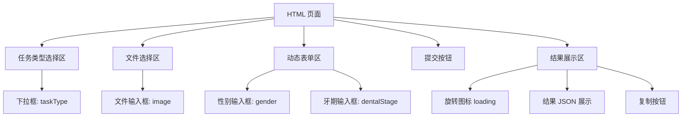

**c. 核心 DOM 元素**

| 元素 ID | 类型 | 用途 |
|---------|------|------|
| `taskType` | `<select>` | 任务类型选择 (panoramic/cephalometric) |
| `imageFile` | `<input type="file">` | 文件选择器 |
| `patientInfoSection` | `<div>` | patientInfo 表单容器（动态显示/隐藏）|
| `gender` | `<select>` | 性别选择 (Male/Female) |
| `dentalStage` | `<select>` | 牙期选择 (Permanent/Mixed) |
| `submitBtn` | `<button>` | 提交按钮 |
| `loadingIndicator` | `<div>` | 旋转图标（处理中） |
| `resultContainer` | `<div>` | 结果展示容器 |
| `resultJson` | `<pre>` | JSON 结果展示 |
| `copyBtn` | `<button>` | 复制按钮 |

**d. 实现要点**

- **文件类型限制**: `<input type="file" accept=".jpg,.jpeg,.png,.dcm">`
- **语义化 HTML**: 使用 `<form>` 但阻止默认提交，改用 JS 处理
- **无障碍性**: 所有输入框提供 `<label>` 标签

---

### static/app.js

**a. 文件用途说明**

前端核心业务逻辑，实现任务提交、轮询、结果展示和状态管理。

**b. 全局状态管理**

```javascript
// 全局状态对象
const appState = {
    currentTaskId: null,       // 当前任务ID
    pollingTimer: null,        // 轮询定时器
    pollingStartTime: null,    // 轮询开始时间
    cachedResult: null         // 缓存的结果JSON
};

// 全局配置常量
const CONFIG = {
    AI_BACKEND_URL: 'http://localhost:9010/api/v1/analyze',
    CALLBACK_URL: 'http://192.168.1.17:5000/callback',
    POLL_INTERVAL: 3000,       // 3秒
    POLL_TIMEOUT: 360000       // 6分钟
};
```

**c. 函数详解**

---

#### 函数 1: `init()`

- **用途**: 页面加载时的初始化函数，绑定所有事件监听器
- **输入参数**: 无
- **输出数据结构**: 无（副作用：绑定事件）

**实现流程**:

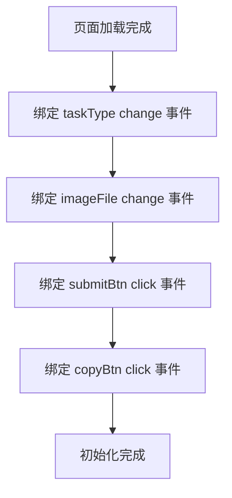

---

#### 函数 2: `onTaskTypeOrFileChange()`

- **用途**: 监听任务类型或文件变化，动态显示/隐藏 patientInfo 表单
- **输入参数**: 无（读取 DOM 状态）
- **输出数据结构**: 无（副作用：修改 DOM）

**实现流程**:

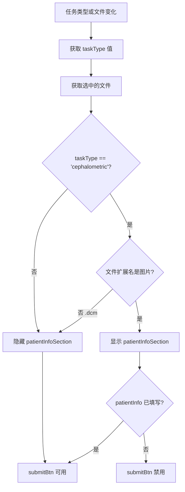

**要点说明**:
- **文件类型检测**: 通过 `file.name` 检查扩展名（`.jpg`, `.png`, `.jpeg`）
- **按钮状态管理**: patientInfo 表单未完整填写时，禁用提交按钮

---

#### 函数 3: `onSubmit()`

- **用途**: 处理任务提交，构建 FormData 并发送到 AI 后端
- **输入参数**: 无（读取表单数据）
- **输出数据结构**: 无（副作用：发起异步请求）

**实现流程**:

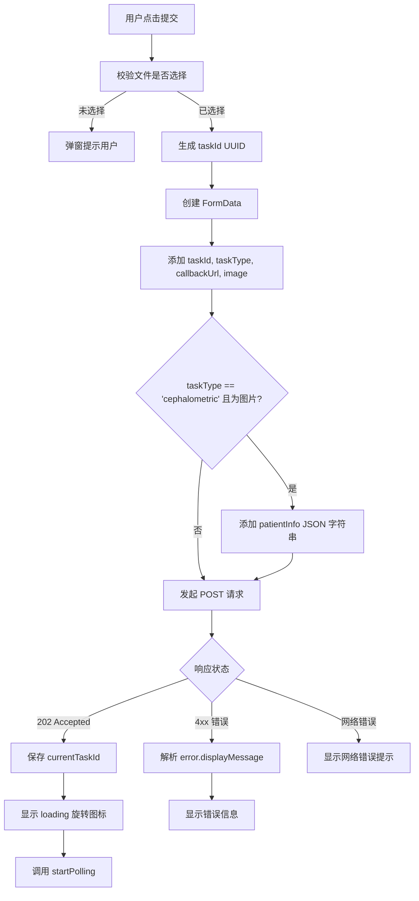

**要点说明**:
- **UUID 生成**: 使用 `crypto.randomUUID()` (现代浏览器原生支持)
- **patientInfo 序列化**: 使用 `JSON.stringify()` 转为字符串后添加到 FormData
- **错误处理**: 区分同步验证失败（4xx）和网络异常

---

#### 函数 4: `startPolling(taskId)`

- **用途**: 启动轮询机制，定期查询任务结果
- **输入参数**: 
  - `taskId` (string): 要查询的任务 ID
- **输出数据结构**: 无（副作用：启动定时器）

**实现流程**:

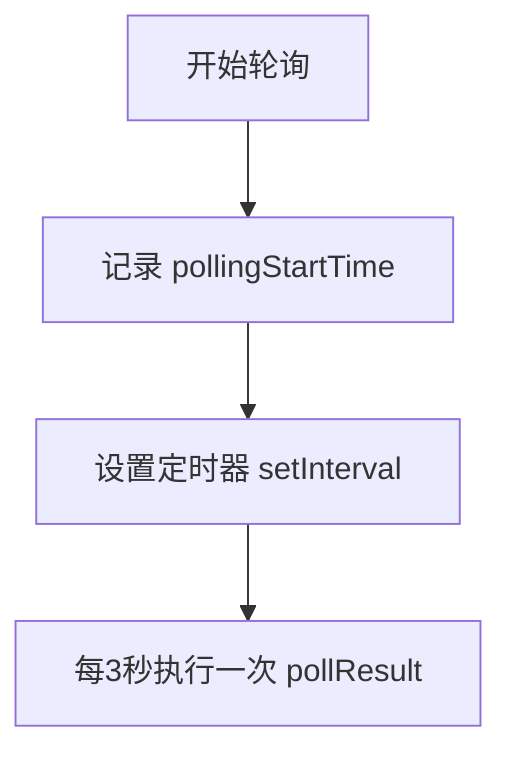

---

#### 函数 5: `pollResult(taskId)`

- **用途**: 单次轮询查询，向 Flask 服务器查询结果
- **输入参数**: 
  - `taskId` (string): 要查询的任务 ID
- **输出数据结构**: 无（副作用：更新 UI）

**实现流程**:

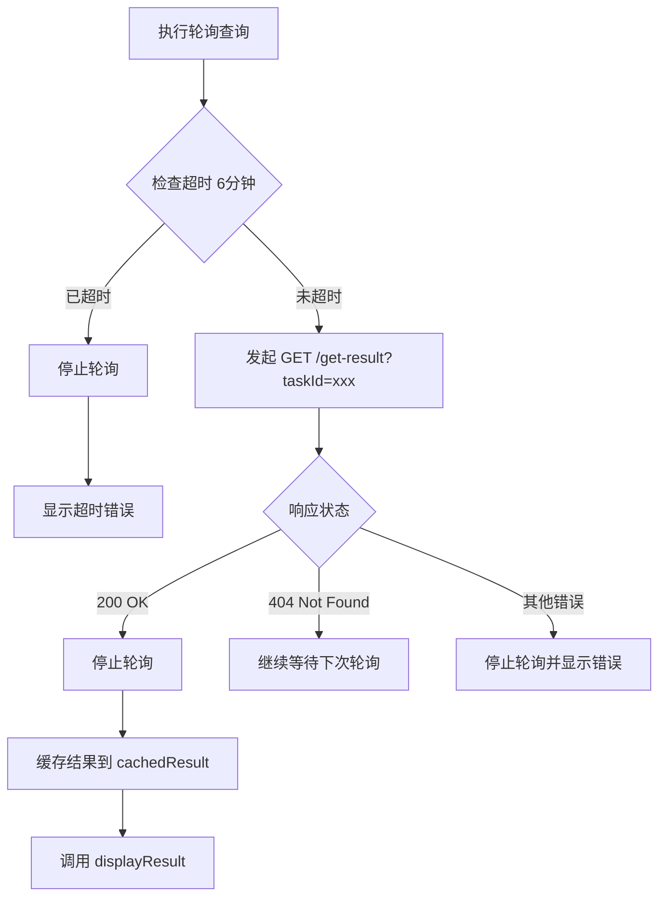

**要点说明**:
- **超时计算**: `Date.now() - appState.pollingStartTime > CONFIG.POLL_TIMEOUT`
- **停止轮询**: 使用 `clearInterval(appState.pollingTimer)` 清除定时器

---

#### 函数 6: `stopPolling()`

- **用途**: 停止轮询定时器并清理状态
- **输入参数**: 无
- **输出数据结构**: 无（副作用：清理定时器）

**实现流程**:

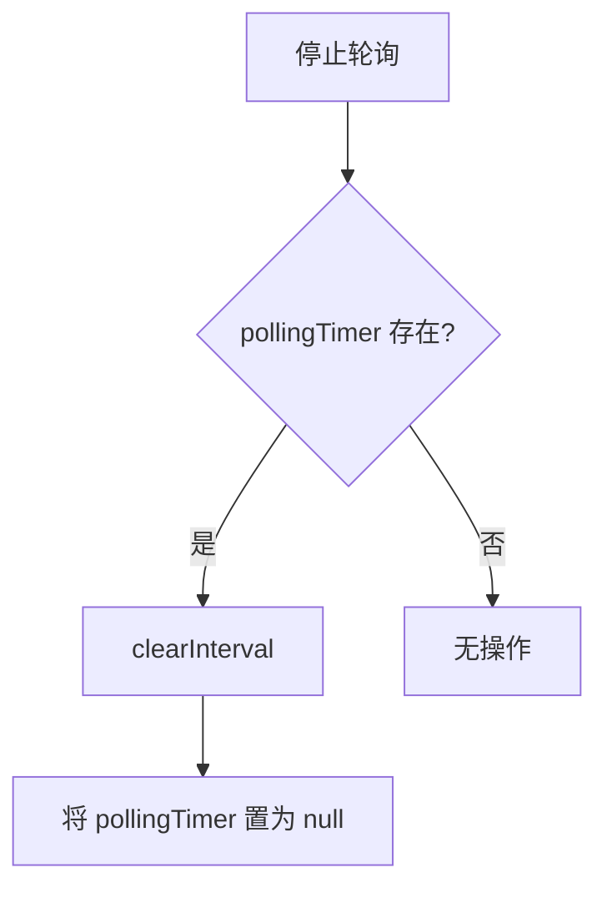

---

#### 函数 7: `displayResult(resultJson)`

- **用途**: 在页面上展示分析结果或错误信息
- **输入参数**: 
  - `resultJson` (object): 完整的回调 JSON 对象
- **输出数据结构**: 无（副作用：修改 DOM）

**实现流程**:

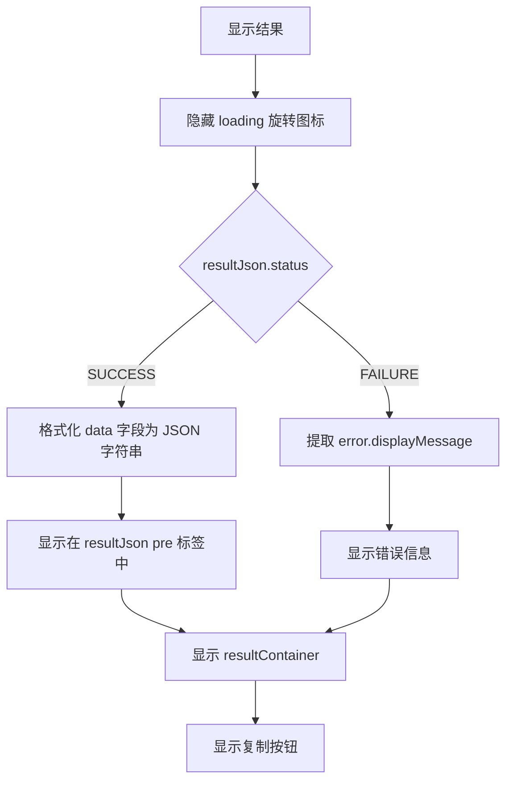

**要点说明**:
- **JSON 格式化**: 使用 `JSON.stringify(data, null, 2)` 缩进2空格
- **语义化展示**: 成功和失败使用不同的样式（CSS 类名）

---

#### 函数 8: `onCopy()`

- **用途**: 将完整的回调 JSON 复制到剪贴板
- **输入参数**: 无（读取 `appState.cachedResult`）
- **输出数据结构**: 无（副作用：写入剪贴板）

**实现流程**:

```mermaid
flowchart TD
    A[用户点击复制] --> B{cachedResult 存在?}
    B -->|否| C[无操作]
    B -->|是| D[序列化为 JSON 字符串]
    D --> E[调用 navigator.clipboard.writeText]
    E --> F{是否成功?}
    F -->|是| G[提示"已复制"]
    F -->|否| H[提示"复制失败"]
```

**要点说明**:
- **剪贴板 API**: 使用现代浏览器的 `navigator.clipboard.writeText()`
- **用户反馈**: 复制成功后短暂显示提示信息（例如按钮文本变为"已复制"）

---

#### 函数 9: `resetUI()`

- **用途**: 重置所有 UI 状态，清空表单和结果
- **输入参数**: 无
- **输出数据结构**: 无（副作用：清理状态和 DOM）

**实现流程**:

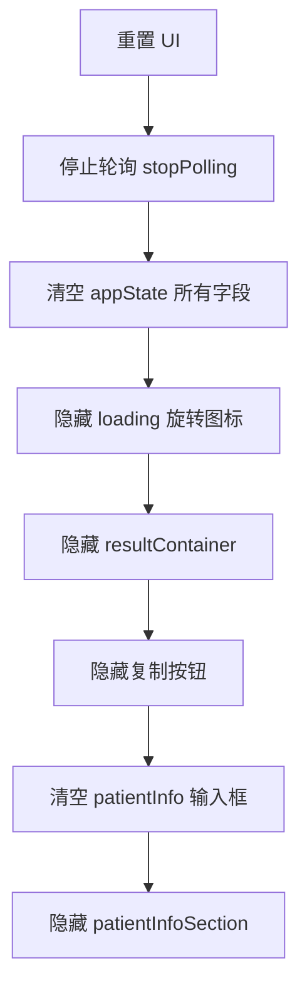

**要点说明**:
- **触发时机**: 用户在任何状态下重新选择文件时自动调用
- **彻底清理**: 确保所有定时器、缓存和 DOM 状态都被重置

---

### static/style.css

**a. 文件用途说明**

提供基础样式，确保界面简洁实用。包含表单样式、按钮样式、加载动画和响应式布局。

**b. 核心样式组件**

| 组件 | 说明 |
|------|------|
| `.container` | 主容器，最大宽度 800px，居中显示 |
| `.form-group` | 表单项容器，统一间距 |
| `.loading-spinner` | 旋转图标动画（CSS `@keyframes`） |
| `.result-success` | 成功结果样式（绿色边框） |
| `.result-error` | 失败结果样式（红色边框） |
| `.hidden` | 隐藏元素的工具类 |

**c. 实现要点**

- **简洁设计**: 使用系统默认字体，无花哨装饰
- **加载动画**: 纯 CSS 实现旋转动画（无需图片）
- **响应式**: 在小屏幕上自动调整布局

---

## 迭代演进

### 当前 MVP 的设计决策

本 MVP 采用了一系列简化设计，这些决策是基于"最小可行产品"的原则做出的：

1. **内存存储 vs 持久化存储**
   - **当前**: 任务结果存储在 Flask 进程的内存字典中
   - **为什么足够**: 这是内部测试工具，服务重启频率低，且历史结果查询需求不强
   - **未来演进**: 如需生产使用，可引入 Redis 或 SQLite 进行持久化存储

2. **单任务 vs 并发任务**
   - **当前**: 前端同一时刻只能提交一个任务
   - **为什么足够**: MVP 用于功能验证，单用户测试场景无并发需求
   - **未来演进**: 可在前端添加任务队列 UI，支持多任务并行提交和管理

3. **轮询 vs WebSocket**
   - **当前**: 采用定时轮询（每3秒）
   - **为什么足够**: 实现简单，对于内网测试场景，轮询开销可接受
   - **未来演进**: 对于生产环境或高并发场景，可升级为 WebSocket 推送，减少延迟和服务器负载

4. **硬编码配置 vs 配置文件**
   - **当前**: 所有配置（端口、URL、超时时间）硬编码在代码中
   - **为什么足够**: 测试环境相对固定，避免配置文件增加复杂度
   - **未来演进**: 可引入 `.env` 文件或 `config.json` 进行环境配置管理

5. **原生 JS vs 框架**
   - **当前**: 使用原生 JavaScript 和 DOM 操作
   - **为什么足够**: 页面逻辑简单，引入 React/Vue 等框架会增加不必要的复杂度
   - **未来演进**: 如需构建复杂的生产前端（多页面、用户管理等），可迁移到现代框架

### 清晰的扩展路径

以下是几个典型的演进场景：

#### 场景 1: 支持历史任务查询
- **需求**: 用户希望查看过去提交的所有任务结果
- **改动**:
  1. 将 `task_results` 从字典改为 SQLite 数据库
  2. 新增 Flask 接口 `GET /history` 返回任务列表
  3. 前端新增"历史记录"页面，展示所有任务

#### 场景 2: 支持多用户
- **需求**: 多个用户同时使用，需要隔离各自的任务
- **改动**:
  1. 引入用户认证机制（如 JWT Token）
  2. 数据库添加 `user_id` 字段
  3. 前端添加登录页面

#### 场景 3: 部署到生产环境
- **需求**: 替换测试服务器为生产后端
- **改动**:
  1. 修改 `CONFIG.AI_BACKEND_URL` 为生产地址
  2. 修改 `CONFIG.CALLBACK_URL` 为公网可访问地址（需配置防火墙和域名）
  3. Flask 前面添加 Nginx 反向代理
  4. 启用 HTTPS

---

## 附录：错误处理矩阵

| 错误场景 | 发生阶段 | 前端行为 | 用户提示 |
|----------|----------|----------|----------|
| 未选择文件就提交 | 提交前 | 弹窗警告 | "请先选择文件" |
| 文件类型不符 | 文件选择 | 浏览器原生过滤 | 无（文件选择器自动限制） |
| patientInfo 未填写 | 提交前 | 禁用提交按钮 | 无（按钮灰色不可点击） |
| 同步验证失败（400） | 提交时 | 显示 `error.displayMessage` | 例: "请求参数错误：必须提供患者性别" |
| 网络连接失败 | 提交时 | 显示通用错误 | "网络连接失败，请检查后重试" |
| 轮询超时（6分钟） | 轮询阶段 | 停止轮询，显示错误 | "任务超时，请重试或联系管理员" |
| 回调返回 FAILURE | 结果展示 | 显示 `error.displayMessage` | 例: "图像质量过低，无法进行分析" |
| Flask 服务器未启动 | 轮询阶段 | 轮询失败，显示错误 | "无法连接到服务器" |

---

## 附录：关键技术选型理由

### 为什么选择 Flask？
- **轻量级**: 无需安装数据库、ORM 等复杂依赖
- **快速启动**: 适合内部测试工具的快速搭建
- **Python 生态**: 与项目现有后端技术栈（Python）一致

### 为什么选择原生 JS？
- **无构建步骤**: 无需 npm、webpack 等工具链，直接在浏览器运行
- **学习成本低**: 团队成员无需学习框架特定语法
- **足够简单**: 本项目 UI 逻辑不复杂，框架带来的收益有限

### 为什么不使用数据库？
- **内存存储即可**: MVP 仅验证流程，无需持久化历史数据
- **避免依赖**: 减少部署复杂度（无需安装 MySQL/PostgreSQL）
- **易于演进**: 未来需要时，可一次性迁移到 SQLite（无需修改架构）

---

**文档版本**: v1.0  
**最后更新**: 2025-11-17  
**审核状态**: 待审核

