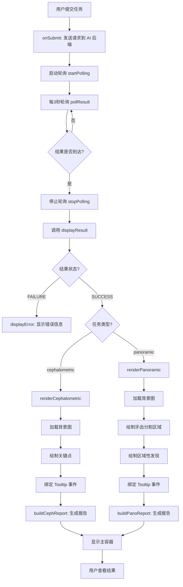
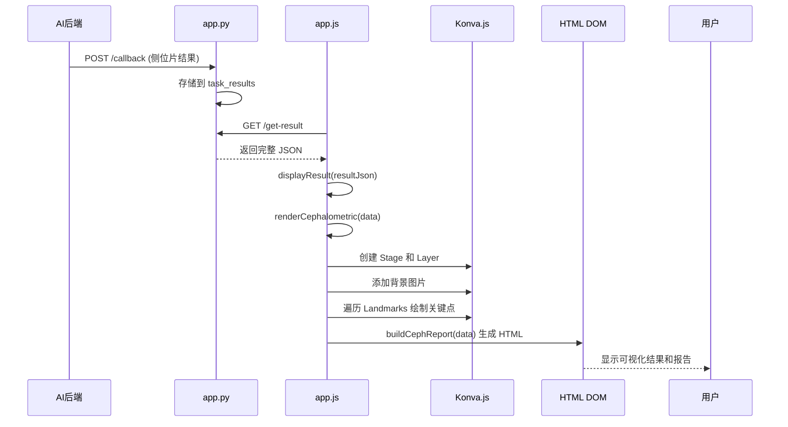
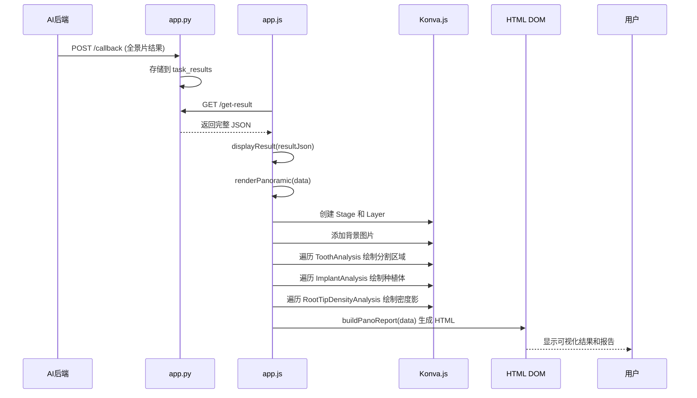

# X-Ray AI分析可视化页面 - 渐进式开发步骤文档

> **版本:** 1.0  
> **日期:** 2025-11-22  
> **负责人:** Cascade  
> **基于:** PRD v1.0, LLD v2.0, MVP v4

---

## 1. 项目概述

### 1.1. 开发目标

将现有的 MVP v4 前端从简单的 JSON 查看器升级为专业的 AI 推理结果可视化分析工具，支持：
- 在全景片和侧位片上精确渲染 AI 标记（关键点、分割区域、异常发现）
- 以结构化的方式展示诊断报告
- 提供交互式 Tooltip 展示详细信息

### 1.2. 技术栈

- **后端:** Flask (保持不变，复用 MVP 代码)
- **前端:** 原生 JavaScript (ES6+)
- **Canvas 渲染:** Konva.js (新增)
- **样式:** CSS3

### 1.3. 设计原则

- **渐进式迭代:** 每个步骤独立完成、可验证、程序可运行
- **适度模块化:** 每个代码文件不超过 500 行
- **优先复用:** 最大化复用 MVP v4 的现有代码和架构
- **稳定优先:** 每步完成后确保程序可启动并展示新功能效果

---

## 2. 目录结构

```
web/vibe_coding/web_2/
├── app.py                      # Flask 服务器 (复用 MVP，保持不变)
├── static/
│   ├── index.html              # 前端主页面 (需重构为双栏布局)
│   ├── app.js                  # 前端核心逻辑 (需重构，新增渲染函数)
│   ├── style.css               # 样式表 (需重构为双栏布局样式)
│   └── lib/
│       └── konva.min.js        # 新增: Konva.js 库文件
├── readme_xx_lld.md            # 详细设计文档
├── prd.md                      # 产品需求文档
└── readme_xx_codingplan.md     # 本文档
```

**说明:**
- `app.py`: 完全复用 MVP v4 的 Flask 服务器代码，无需修改
- `static/index.html`: 从单栏布局改为双栏布局（图像查看区 + 报告区）
- `static/app.js`: 保留任务提交、轮询逻辑，重构 `displayResult` 函数，新增渲染模块
- `static/style.css`: 重构为双栏布局样式，新增报告卡片样式
- `static/lib/konva.min.js`: 从 CDN 下载或本地引入 Konva.js 库

---

## 3. 受影响的现有模块说明

### 3.1. 完全复用模块

| 模块 | 文件 | 复用策略 |
|------|------|----------|
| Flask 服务器 | `app.py` | **完全复用**，无需修改 |
| 任务提交逻辑 | `app.js` 中的 `onSubmit()` | **完全复用** |
| 轮询逻辑 | `app.js` 中的 `startPolling()`, `pollResult()`, `stopPolling()` | **完全复用** |
| 表单管理 | `app.js` 中的 `onTaskTypeOrFileChange()` | **完全复用** |
| 复制功能 | `app.js` 中的 `onCopy()` | **完全复用** |

### 3.2. 需要扩展的模块

| 模块 | 文件 | 扩展策略 |
|------|------|----------|
| 初始化函数 | `app.js` 中的 `init()` | **扩展:** 增加 Konva Stage 初始化逻辑 |
| 结果展示 | `app.js` 中的 `displayResult()` | **重构:** 从显示 JSON 文本改为调用渲染函数 |
| UI 重置 | `app.js` 中的 `resetUI()` | **扩展:** 增加清空 Canvas 和 Konva 对象的逻辑 |
| 页面布局 | `index.html` | **重构:** 从单栏改为双栏布局 |
| 样式表 | `style.css` | **重构:** 新增双栏布局、报告卡片、错误提示样式 |

### 3.3. 新增模块

| 模块 | 文件 | 说明 |
|------|------|------|
| 侧位片渲染 | `app.js` 中的 `renderCephalometric()` | 新增函数，负责绘制关键点和生成报告 |
| 全景片渲染 | `app.js` 中的 `renderPanoramic()` | 新增函数，负责绘制分割区域和异常标记 |
| 报告生成 | `app.js` 中的 `buildCephReport()`, `buildPanoReport()` | 新增函数，负责生成结构化 HTML 报告 |
| Tooltip 管理 | `app.js` 中的 `showTooltip()`, `hideTooltip()` | 新增函数，负责显示/隐藏悬停提示 |
| 坐标转换 | `app.js` 中的 `scaleCoordinates()` | 新增函数，负责处理图像缩放后的坐标换算 |

---

## 4. 渐进式小步迭代开发步骤

### 步骤 1: 搭建基础目录结构和引入 Konva.js 库

**目标:** 创建必要的目录结构，下载并引入 Konva.js 库文件。

**任务清单:**
1. 创建 `web/vibe_coding/web_2/` 目录（如不存在）
2. 创建 `static/lib/` 目录
3. 下载 Konva.js 最新稳定版本（建议 v9.x）的 minified 文件，保存为 `static/lib/konva.min.js`
   - 下载地址: https://unpkg.com/konva@latest/konva.min.js
   - 或使用: `wget https://unpkg.com/konva@latest/konva.min.js -O static/lib/konva.min.js`
4. 验证文件存在且可访问

**验证方式:**
- 检查 `static/lib/konva.min.js` 文件存在且大小合理（约 200-300KB）
- 可以在浏览器中直接访问该文件路径（通过 Flask 静态文件服务）

**预期结果:**
- 目录结构完整
- Konva.js 库文件就位

---

### 步骤 2: 复用 Flask 服务器代码

**目标:** 将 MVP v4 的 Flask 服务器代码复制到 `web_2` 目录，确保回调服务正常工作。

**任务清单:**
1. 从 MVP v4 的 `web/vibe_coding/app.py` 复制到 `web/vibe_coding/web_2/app.py`
2. 检查 Flask 路由：
   - `GET /` → 返回 `static/index.html`
   - `POST /callback` → 接收 AI 后端回调
   - `GET /get-result` → 查询任务结果
3. 确保静态文件服务配置正确（`static_folder='static'`）

**验证方式:**
- 启动 Flask 服务器: `python app.py`
- 访问 `http://localhost:5000/` 应能正常访问（即使页面还未创建）
- 检查控制台无错误

**预期结果:**
- Flask 服务器可正常启动
- 静态文件服务正常

---

### 步骤 3: 重构 HTML 页面为双栏布局（不含功能）

**目标:** 将 `index.html` 从单栏布局改为双栏布局，仅完成结构，暂不添加功能逻辑。

**任务清单:**
1. 创建 `static/index.html`，包含以下结构：
   ```html
   <!DOCTYPE html>
   <html>
   <head>
       <title>X-Ray AI 分析可视化</title>
       <link rel="stylesheet" href="style.css">
   </head>
   <body>
       <!-- 表单区域（保留 MVP 的表单结构） -->
       <div class="form-container">
           <!-- taskType, imageFile, patientInfoSection, submitBtn 等 -->
       </div>
       
       <!-- 双栏布局容器 -->
       <div class="main-container hidden" id="mainContainer">
           <!-- 左侧: 图像查看区 -->
           <div class="image-container" id="imageContainer">
               <!-- Konva Canvas 将在这里动态创建 -->
           </div>
           
           <!-- 右侧: AI 分析报告区 -->
           <div class="report-container" id="reportContainer">
               <!-- 报告内容将在这里动态生成 -->
           </div>
       </div>
       
       <!-- 错误提示区域 -->
       <div class="error-message hidden" id="errorMessage"></div>
       
       <!-- 加载指示器（保留 MVP 的 loadingIndicator） -->
       <div class="loading-indicator hidden" id="loadingIndicator"></div>
       
       <!-- 脚本引入 -->
       <script src="lib/konva.min.js"></script>
       <script src="app.js"></script>
   </body>
   </html>
   ```
2. 保留 MVP 的所有表单元素（taskType, imageFile, patientInfoSection 等）
3. 添加新的容器元素：`mainContainer`, `imageContainer`, `reportContainer`, `errorMessage`
4. 引入 Konva.js 库（在 `app.js` 之前）

**验证方式:**
- 在浏览器中打开页面，检查：
  - 表单区域正常显示
  - 双栏布局容器初始为隐藏（`.hidden` 类）
  - 页面无 JavaScript 错误（即使 `app.js` 还未实现）

**预期结果:**
- HTML 结构完整，双栏布局就位
- 页面可正常加载，无报错

---

### 步骤 4: 重构 CSS 为双栏布局样式（不含功能样式）

**目标:** 创建双栏布局的基础样式，确保布局正确显示。

**任务清单:**
1. 创建 `static/style.css`，包含以下样式：
   ```css
   /* 基础样式（复用 MVP 的表单样式） */
   .form-container { ... }
   
   /* 双栏布局容器 */
   .main-container {
       display: flex;
       width: 100%;
       height: calc(100vh - 200px); /* 减去表单区域高度 */
       margin-top: 20px;
   }
   
   /* 左侧: 图像查看区 (70%) */
   .image-container {
       flex: 0 0 70%;
       border: 1px solid #ddd;
       background: #f5f5f5;
       overflow: hidden;
       position: relative;
   }
   
   /* 右侧: AI 分析报告区 (30%) */
   .report-container {
       flex: 0 0 30%;
       border: 1px solid #ddd;
       border-left: none;
       background: #fff;
       overflow-y: auto;
       padding: 20px;
   }
   
   /* 工具类 */
   .hidden { display: none; }
   
   /* 错误提示样式 */
   .error-message {
       background: #f44336;
       color: white;
       padding: 20px;
       margin: 20px 0;
       border-radius: 4px;
   }
   ```
2. 保留 MVP 的加载动画、表单样式等

**验证方式:**
- 在浏览器中打开页面
- 通过开发者工具临时移除 `mainContainer` 的 `hidden` 类，检查双栏布局是否正确显示
- 检查响应式表现（调整浏览器窗口大小）

**预期结果:**
- 双栏布局样式正确
- 报告区域可滚动

---

### 步骤 5: 扩展 `app.js` - 初始化 Konva Stage 和基础工具函数

**目标:** 在 `app.js` 中添加 Konva Stage 初始化逻辑和基础工具函数，为后续渲染做准备。

**任务清单:**
1. 复制 MVP v4 的 `app.js` 到 `web_2/static/app.js`（保留所有现有函数）
2. 在全局状态对象中新增字段：
   ```javascript
   const appState = {
       // ... MVP 原有字段
       konvaStage: null,        // Konva Stage 实例
       konvaLayers: {},         // 图层对象集合
       originalImage: null,     // 原始图片对象
       imageScale: 1.0          // 图片缩放比例
   };
   ```
3. 扩展 `init()` 函数，添加 Konva Stage 初始化：
   ```javascript
   function init() {
       // ... MVP 原有初始化逻辑
       
       // 初始化 Konva Stage（延迟到需要时再创建）
       // 这里先不创建，等步骤 6 再实现
   }
   ```
4. 新增工具函数 `initKonvaStage(containerId, width, height)`:
   - 创建 Konva Stage 实例
   - 绑定到指定的容器元素
   - 返回 Stage 实例
5. 新增工具函数 `scaleCoordinates(x, y, scale)`:
   - 根据缩放比例转换坐标
   - 返回转换后的坐标对象 `{x, y}`

**验证方式:**
- 在浏览器控制台手动调用 `initKonvaStage('imageContainer', 800, 600)`
- 检查是否成功创建 Stage 实例
- 检查 `appState.konvaStage` 不为 null

**预期结果:**
- Konva Stage 初始化函数就位
- 工具函数可正常调用

---

### 步骤 6: 重构 `displayResult()` - 添加结果类型判断和错误处理

**目标:** 重构 `displayResult()` 函数，根据结果类型（SUCCESS/FAILURE）和任务类型（panoramic/cephalometric）进行路由。

**任务清单:**
1. 重构 `displayResult(resultJson)` 函数：
   ```javascript
   function displayResult(resultJson) {
       // 隐藏加载指示器
       document.getElementById('loadingIndicator').classList.add('hidden');
       
       // 重置 UI（清空之前的画布和报告）
       clearCanvas();
       clearReport();
       
       // 判断结果状态
       if (resultJson.status === 'FAILURE') {
           displayError(resultJson.error);
           return;
       }
       
       // SUCCESS 状态：根据任务类型渲染
       const taskType = appState.currentTaskType; // 需要从提交时保存
       const data = resultJson.data;
       
       if (taskType === 'cephalometric') {
           renderCephalometric(data);
       } else if (taskType === 'panoramic') {
           renderPanoramic(data);
       }
   }
   ```
2. 新增 `displayError(error)` 函数：
   - 显示错误提示区域
   - 设置 `error.displayMessage` 内容
   - 隐藏图像和报告容器
3. 新增 `clearCanvas()` 函数：
   - 清空 Konva Stage 的所有图层
   - 销毁现有 Stage 实例（如果存在）
4. 新增 `clearReport()` 函数：
   - 清空 `reportContainer` 的 innerHTML
5. 在 `onSubmit()` 中保存 `taskType` 到 `appState.currentTaskType`

**验证方式:**
- 使用 `example_failure_result.json` 测试错误处理
- 检查错误提示是否正确显示
- 检查画布和报告是否正确清空

**预期结果:**
- 错误结果能正确显示错误信息
- 成功结果能正确路由到对应的渲染函数（即使渲染函数还未实现）

---

### 步骤 7: 实现侧位片渲染 - 背景图加载和关键点绘制（不含 Tooltip）

**目标:** 实现 `renderCephalometric()` 函数的基础部分：加载背景图并在 Canvas 上绘制关键点。

**任务清单:**
1. 实现 `renderCephalometric(data)` 函数：
   ```javascript
   function renderCephalometric(data) {
       // 1. 获取用户上传的图片文件
       const imageFile = document.getElementById('imageFile').files[0];
       if (!imageFile) return;
       
       // 2. 创建图片对象并加载
       const img = new Image();
       img.onload = function() {
           // 3. 初始化 Konva Stage（根据图片尺寸）
           const container = document.getElementById('imageContainer');
           const stage = initKonvaStage('imageContainer', img.width, img.height);
           
           // 4. 创建背景图层并添加图片
           const bgLayer = new Konva.Layer();
           const bgImage = new Konva.Image({
               x: 0,
               y: 0,
               image: img,
               width: img.width,
               height: img.height
           });
           bgLayer.add(bgImage);
           stage.add(bgLayer);
           
           // 5. 创建关键点图层
           const landmarkLayer = new Konva.Layer();
           
           // 6. 遍历 Landmarks 数组，绘制关键点
           const landmarks = data.LandmarkPositions.Landmarks;
           landmarks.forEach(landmark => {
               if (landmark.Status === 'Missing' || !landmark.X || !landmark.Y) {
                   return; // 跳过缺失的点
               }
               
               // 绘制圆点
               const circle = new Konva.Circle({
                   x: landmark.X,
                   y: landmark.Y,
                   radius: 5,
                   fill: landmark.Status === 'Missing' ? 'transparent' : 'red',
                   stroke: landmark.Status === 'Missing' ? 'grey' : 'red',
                   strokeWidth: 2
               });
               
               // 绘制标签文本
               const text = new Konva.Text({
                   x: landmark.X + 8,
                   y: landmark.Y - 8,
                   text: landmark.Label,
                   fontSize: 12,
                   fill: 'white',
                   padding: 2,
                   backgroundColor: 'rgba(0,0,0,0.5)'
               });
               
               landmarkLayer.add(circle);
               landmarkLayer.add(text);
           });
           
           stage.add(landmarkLayer);
           stage.draw();
           
           // 7. 显示主容器
           document.getElementById('mainContainer').classList.remove('hidden');
       };
       
       img.src = URL.createObjectURL(imageFile);
   }
   ```
2. 定义关键点全名映射表（常量）：
   ```javascript
   const LANDMARK_FULL_NAMES = {
       'S': '蝶鞍点',
       'N': '鼻根点',
       'Ba': '颅底点',
       // ... 其他关键点（参考 example_ceph_result.json）
   };
   ```

**验证方式:**
- 提交一个侧位片任务，使用 `example_ceph_result.json` 的模拟数据
- 检查背景图是否正确加载
- 检查关键点是否正确绘制在图像上
- 检查缺失的点是否被跳过

**预期结果:**
- 侧位片背景图正确显示
- 关键点正确绘制（红色实心圆点 + 标签）
- 缺失点不显示或显示为灰色空心圆

---

### 步骤 8: 实现侧位片 Tooltip 交互

**目标:** 为侧位片的关键点添加鼠标悬停 Tooltip 功能。

**任务清单:**
1. 在 `renderCephalometric()` 中，为每个关键点 Circle 绑定事件：
   ```javascript
   circle.on('mouseenter', function() {
       showLandmarkTooltip(this, landmark, event);
   });
   
   circle.on('mouseleave', function() {
       hideTooltip();
   });
   ```
2. 实现 `showLandmarkTooltip(circle, landmark, event)` 函数：
   - 创建 Tooltip HTML 元素
   - 内容包含：全名、坐标、置信度
   - 定位到鼠标位置附近
   - 添加到页面
3. 实现 `hideTooltip()` 函数：
   - 移除 Tooltip 元素
4. 添加 Tooltip 样式到 CSS：
   ```css
   .tooltip {
       position: absolute;
       background: rgba(0, 0, 0, 0.8);
       color: white;
       padding: 8px 12px;
       border-radius: 4px;
       pointer-events: none;
       z-index: 1000;
       font-size: 12px;
   }
   ```

**验证方式:**
- 鼠标悬停在关键点上
- 检查 Tooltip 是否正确显示
- 检查 Tooltip 内容是否包含全名、坐标、置信度
- 鼠标移开时 Tooltip 是否消失

**预期结果:**
- 悬停交互正常工作
- Tooltip 信息准确

---

### 步骤 9: 实现侧位片结构化报告生成

**目标:** 实现 `buildCephReport()` 函数，生成侧位片的结构化 HTML 报告。

**任务清单:**
1. 实现 `buildCephReport(data)` 函数，按照 PRD 定义的结构生成报告：
   ```javascript
   function buildCephReport(data) {
       const container = document.getElementById('reportContainer');
       container.innerHTML = ''; // 清空
       
       // 1. 分析摘要
       const summarySection = createReportSection('分析摘要');
       summarySection.appendChild(createKeyValue('可见性等级', data.VisibilityMetrics.Grade));
       summarySection.appendChild(createKeyValue('质量评分', data.StatisticalFields.QualityScore));
       container.appendChild(summarySection);
       
       // 2. 骨骼分析
       const boneSection = createReportSection('骨骼分析');
       const measurements = data.CephalometricMeasurements.AllMeasurements;
       measurements.forEach(m => {
           if (isBoneMeasurement(m.Label)) {
               const item = createMeasurementItem(m);
               boneSection.appendChild(item);
           }
       });
       container.appendChild(boneSection);
       
       // 3. 牙齿分析
       const toothSection = createReportSection('牙齿分析');
       measurements.forEach(m => {
           if (isToothMeasurement(m.Label)) {
               const item = createMeasurementItem(m);
               toothSection.appendChild(item);
           }
       });
       container.appendChild(toothSection);
       
       // 4. 生长发育评估（包含 CVSM 图片）
       const growthSection = createReportSection('生长发育评估');
       const cvsm = measurements.find(m => m.Label === 'Cervical_Vertebral_Maturity_Stage');
       if (cvsm && cvsm.CVSM) {
           const img = document.createElement('img');
           img.src = cvsm.CVSM; // Base64 图片
           img.style.maxWidth = '100%';
           growthSection.appendChild(img);
       }
       container.appendChild(growthSection);
       
       // 5. 气道分析
       const airwaySection = createReportSection('气道分析');
       // ... 处理 Airway_Gap, Adenoid_Index
       container.appendChild(airwaySection);
   }
   ```
2. 实现辅助函数：
   - `createReportSection(title)`: 创建报告区块（`<h2>` + `<div>`）
   - `createKeyValue(key, value)`: 创建键值对元素
   - `createMeasurementItem(measurement)`: 创建测量项元素（包含数值和诊断结论）
   - `isBoneMeasurement(label)`: 判断是否为骨骼测量项
   - `isToothMeasurement(label)`: 判断是否为牙齿测量项
3. 实现异常高亮逻辑：
   - 如果 `measurement.Level !== 0`，为元素添加 `.abnormal` 类
4. 添加报告样式到 CSS：
   ```css
   .report-section {
       margin-bottom: 20px;
   }
   
   .report-section h2 {
       font-size: 16px;
       margin-bottom: 10px;
       color: #333;
   }
   
   .measurement-item {
       padding: 8px;
       margin-bottom: 8px;
       border-left: 3px solid #ddd;
   }
   
   .measurement-item.abnormal {
       border-left-color: #f44336;
       background: #ffebee;
   }
   ```

**验证方式:**
- 使用 `example_ceph_result.json` 测试
- 检查报告结构是否正确（摘要、骨骼、牙齿、生长发育、气道）
- 检查异常项是否正确高亮（红色边框）
- 检查 CVSM 图片是否正确显示

**预期结果:**
- 结构化报告正确生成
- 异常项正确高亮
- 报告区域可滚动

---

### 步骤 10: 实现全景片渲染 - 背景图加载和牙齿分割区域绘制

**目标:** 实现 `renderPanoramic()` 函数的基础部分：加载背景图并绘制牙齿分割区域。

**任务清单:**
1. 实现 `renderPanoramic(data)` 函数的基础框架：
   ```javascript
   function renderPanoramic(data) {
       const imageFile = document.getElementById('imageFile').files[0];
       if (!imageFile) return;
       
       const img = new Image();
       img.onload = function() {
           // 初始化 Konva Stage
           const stage = initKonvaStage('imageContainer', img.width, img.height);
           
           // 创建背景图层
           const bgLayer = new Konva.Layer();
           const bgImage = new Konva.Image({
               x: 0, y: 0,
               image: img,
               width: img.width,
               height: img.height
           });
           bgLayer.add(bgImage);
           stage.add(bgLayer);
           
           // 创建牙齿分割图层
           const toothLayer = new Konva.Layer();
           
           // 遍历 ToothAnalysis 数组，绘制分割区域
           if (data.ToothAnalysis && Array.isArray(data.ToothAnalysis)) {
               data.ToothAnalysis.forEach(tooth => {
                   if (tooth.SegmentationMask && tooth.SegmentationMask.Coordinates) {
                       const coords = tooth.SegmentationMask.Coordinates;
                       const points = coords.flat(); // 将 [[x,y], [x,y]] 转为 [x,y,x,y]
                       
                       const line = new Konva.Line({
                           points: points,
                           closed: true,
                           stroke: 'green',
                           strokeWidth: 2,
                           fill: 'transparent'
                       });
                       
                       // 存储牙齿信息到 line 对象，用于 Tooltip
                       line.toothData = tooth;
                       
                       toothLayer.add(line);
                   }
               });
           }
           
           stage.add(toothLayer);
           stage.draw();
           
           document.getElementById('mainContainer').classList.remove('hidden');
       };
       
       img.src = URL.createObjectURL(imageFile);
   }
   ```

**验证方式:**
- 提交一个全景片任务，使用 `example_pano_result.json` 的模拟数据
- 检查背景图是否正确加载
- 检查牙齿分割区域是否正确绘制（绿色轮廓线）

**预期结果:**
- 全景片背景图正确显示
- 牙齿分割区域正确绘制

---

### 步骤 11: 实现全景片区域性发现绘制（种植体、密度影）

**目标:** 在全景片上绘制种植体和根尖密度影等区域性发现。

**任务清单:**
1. 在 `renderPanoramic()` 中新增图层用于区域性发现：
   ```javascript
   // 创建区域性发现图层
   const findingLayer = new Konva.Layer();
   
   // 绘制种植体
   if (data.ImplantAnalysis && data.ImplantAnalysis.Items) {
       data.ImplantAnalysis.Items.forEach(implant => {
           const bbox = implant.BBox; // [x1, y1, x2, y2]
           const rect = new Konva.Rect({
               x: bbox[0],
               y: bbox[1],
               width: bbox[2] - bbox[0],
               height: bbox[3] - bbox[1],
               stroke: 'blue',
               strokeWidth: 2,
               fill: 'transparent'
           });
           rect.findingData = implant;
           findingLayer.add(rect);
       });
   }
   
   // 绘制根尖密度影
   if (data.RootTipDensityAnalysis && data.RootTipDensityAnalysis.Items) {
       data.RootTipDensityAnalysis.Items.forEach(density => {
           const bbox = density.BBox;
           const rect = new Konva.Rect({
               x: bbox[0],
               y: bbox[1],
               width: bbox[2] - bbox[0],
               height: bbox[3] - bbox[1],
               stroke: 'yellow',
               strokeWidth: 2,
               strokeDash: [5, 5], // 虚线
               fill: 'transparent'
           });
           rect.findingData = density;
           findingLayer.add(rect);
       });
   }
   
   stage.add(findingLayer);
   ```
2. 确保图层顺序：背景层 < 牙齿分割层 < 区域性发现层

**验证方式:**
- 使用包含种植体和密度影的测试数据
- 检查种植体是否正确绘制（蓝色实线边框）
- 检查密度影是否正确绘制（黄色虚线边框）

**预期结果:**
- 区域性发现正确绘制
- 样式符合 PRD 要求

---

### 步骤 12: 实现全景片 Tooltip 交互

**目标:** 为全景片的标记区域添加 Tooltip 功能。

**任务清单:**
1. 为牙齿分割区域添加 Tooltip：
   ```javascript
   line.on('mouseenter', function() {
       showToothTooltip(this, this.toothData, event);
   });
   
   line.on('mouseleave', function() {
       hideTooltip();
   });
   ```
2. 实现 `showToothTooltip(line, toothData, event)` 函数：
   - 汇总该牙齿的所有属性类发现（Properties 数组）
   - 显示格式：
     ```
     牙位: 18
     - 龋坏 (置信度: 0.98)
     - 修复牙 (置信度: 0.95)
     - 牙根吸收 (置信度: 0.95)
     ```
3. 为区域性发现添加 Tooltip：
   ```javascript
   rect.on('mouseenter', function() {
       showFindingTooltip(this, this.findingData, event);
   });
   
   rect.on('mouseleave', function() {
       hideTooltip();
   });
   ```
4. 实现 `showFindingTooltip(rect, findingData, event)` 函数：
   - 显示发现的 `Detail` 和 `Confidence`

**验证方式:**
- 鼠标悬停在牙齿分割区域上
- 检查 Tooltip 是否正确显示该牙齿的所有属性
- 鼠标悬停在种植体或密度影上
- 检查 Tooltip 是否正确显示发现的详细信息

**预期结果:**
- 全景片 Tooltip 交互正常工作
- 信息准确完整

---

### 步骤 13: 实现全景片结构化报告生成

**目标:** 实现 `buildPanoReport()` 函数，生成全景片的结构化 HTML 报告。

**任务清单:**
1. 实现 `buildPanoReport(data)` 函数，按照 PRD 定义的结构生成报告：
   ```javascript
   function buildPanoReport(data) {
       const container = document.getElementById('reportContainer');
       container.innerHTML = '';
       
       // 1. 整体诊断摘要
       const summarySection = createReportSection('整体诊断摘要');
       // 汇总关键发现（颌骨对称性、牙周状况、智齿问题等）
       container.appendChild(summarySection);
       
       // 2. 颌骨与关节
       const jointSection = createReportSection('颌骨与关节');
       if (data.JointAndMandible) {
           // 处理 CondyleAssessment, RamusSymmetry 等
       }
       if (data.MaxillarySinus) {
           // 处理上颌窦分析
       }
       container.appendChild(jointSection);
       
       // 3. 牙周与缺牙
       const periodontalSection = createReportSection('牙周与缺牙');
       if (data.PeriodontalCondition) {
           // 处理牙周状况
       }
       if (data.MissingTeeth) {
           // 处理缺牙列表
       }
       container.appendChild(periodontalSection);
       
       // 4. 智齿分析
       const wisdomSection = createReportSection('智齿分析');
       if (data.ThirdMolarSummary) {
           // 处理智齿情况
       }
       container.appendChild(wisdomSection);
       
       // 5. 特殊发现
       const specialSection = createReportSection('特殊发现');
       if (data.ImplantAnalysis) {
           // 处理种植体分析
       }
       if (data.RootTipDensityAnalysis) {
           // 处理根尖密度影分析
       }
       container.appendChild(specialSection);
       
       // 6. 单牙诊断详情
       const toothDetailSection = createReportSection('单牙诊断详情');
       if (data.ToothAnalysis) {
           data.ToothAnalysis.forEach(tooth => {
               const toothCard = createToothCard(tooth);
               toothDetailSection.appendChild(toothCard);
           });
       }
       container.appendChild(toothDetailSection);
   }
   ```
2. 实现辅助函数：
   - `createToothCard(tooth)`: 创建单牙诊断卡片
   - `formatPeriodontalLevel(level)`: 格式化牙周吸收等级（0/1/2/3 → 文本）
   - `formatWisdomLevel(level)`: 格式化智齿等级（1-4 → 文本）

**验证方式:**
- 使用 `example_pano_result.json` 测试
- 检查报告结构是否正确（6 个主要区块）
- 检查数据是否正确展示
- 检查异常项是否正确高亮

**预期结果:**
- 全景片结构化报告正确生成
- 所有数据正确展示

---

### 步骤 14: 完善错误处理和边界情况

**目标:** 处理各种边界情况和错误场景，确保系统稳定。

**任务清单:**
1. 处理图片加载失败的情况：
   - 在 `img.onerror` 回调中显示错误提示
2. 处理坐标数据缺失的情况：
   - 在绘制关键点/分割区域时，检查坐标是否存在
   - 跳过无效数据，不中断渲染
3. 处理 JSON 数据结构不完整的情况：
   - 在访问嵌套属性前检查对象是否存在
   - 使用可选链操作符 `?.` 或 `if` 判断
4. 处理图像缩放问题：
   - 实现响应式缩放逻辑（当容器尺寸变化时，重新计算坐标）
   - 确保所有标记在缩放后仍能正确显示
5. 完善 `resetUI()` 函数：
   - 清空 Konva Stage 和所有图层
   - 销毁 Stage 实例
   - 清空报告容器
   - 隐藏所有结果区域

**验证方式:**
- 测试各种异常数据（缺失字段、null 值等）
- 测试图片加载失败
- 测试窗口大小变化
- 测试切换任务类型时的状态重置

**预期结果:**
- 系统能优雅处理各种异常情况
- 不会因为数据问题导致页面崩溃

---

### 步骤 15: 优化样式和用户体验

**目标:** 完善 CSS 样式，提升视觉效果和用户体验。

**任务清单:**
1. 优化报告卡片样式：
   - 添加阴影、圆角等视觉效果
   - 优化间距和字体大小
2. 优化 Tooltip 样式：
   - 添加箭头指向
   - 优化背景和文字颜色
3. 添加加载状态样式：
   - 在图像加载时显示占位符
4. 优化响应式布局：
   - 在小屏幕上调整双栏为单栏
   - 使用媒体查询
5. 添加过渡动画：
   - 报告区域显示/隐藏的淡入淡出效果

**验证方式:**
- 在不同屏幕尺寸下测试
- 检查视觉效果是否符合设计规范
- 检查交互是否流畅

**预期结果:**
- 界面美观、专业
- 用户体验良好

---

## 5. 实现流程总览

以下 Mermaid 流程图展示了从任务提交到结果展示的完整流程：



---

## 6. 数据流转说明

### 6.1. 侧位片数据流转



### 6.2. 全景片数据流转



---

## 7. 关键数据结构说明

### 7.1. 侧位片数据结构（关键字段）

```javascript
{
  status: "SUCCESS",
  data: {
    LandmarkPositions: {
      Landmarks: [
        {
          Label: "S",           // 关键点标签
          X: 512,               // X 坐标
          Y: 245,               // Y 坐标
          Confidence: 0.95,      // 置信度
          Status: "Detected"     // 状态: Detected/Missing
        }
      ]
    },
    CephalometricMeasurements: {
      AllMeasurements: [
        {
          Label: "ANB_Angle",
          Angle: 3.5,
          Level: 0,              // 0=正常, 1/2=异常
          Confidence: 0.97
        }
      ]
    },
    VisibilityMetrics: { ... },
    StatisticalFields: { ... }
  }
}
```

### 7.2. 全景片数据结构（关键字段）

```javascript
{
  status: "SUCCESS",
  data: {
    ToothAnalysis: [
      {
        FDI: "16",
        SegmentationMask: {
          Coordinates: [[x1,y1], [x2,y2], ...]  // 多边形坐标
        },
        Properties: [
          {
            Value: "carious_lesion",
            Description: "龋坏",
            Confidence: 0.98
          }
        ]
      }
    ],
    ImplantAnalysis: {
      Items: [
        {
          BBox: [x1, y1, x2, y2],  // 边界框
          Detail: "第一象限检测到种植体",
          Confidence: 0.95
        }
      ]
    },
    RootTipDensityAnalysis: { ... },
    JointAndMandible: { ... },
    PeriodontalCondition: { ... }
  }
}
```

---

## 8. 测试验证清单

### 8.1. 功能测试

- [ ] 侧位片背景图正确加载
- [ ] 侧位片关键点正确绘制（包括缺失点的样式）
- [ ] 侧位片 Tooltip 正确显示
- [ ] 侧位片结构化报告正确生成
- [ ] 全景片背景图正确加载
- [ ] 全景片牙齿分割区域正确绘制
- [ ] 全景片区域性发现正确绘制（种植体、密度影）
- [ ] 全景片 Tooltip 正确显示（牙齿属性汇总、发现详情）
- [ ] 全景片结构化报告正确生成
- [ ] 错误结果正确显示错误信息
- [ ] 切换任务类型时状态正确重置

### 8.2. 边界情况测试

- [ ] 图片加载失败时的处理
- [ ] 坐标数据缺失时的处理
- [ ] JSON 数据结构不完整时的处理
- [ ] 窗口大小变化时的响应式表现
- [ ] 快速切换任务时的状态管理

### 8.3. 用户体验测试

- [ ] 界面布局美观、专业
- [ ] 交互流畅、无卡顿
- [ ] 报告内容易读、结构清晰
- [ ] 异常项高亮明显
- [ ] Tooltip 信息准确、完整

---

## 9. 注意事项

1. **坐标系统:** Konva.js 使用左上角为原点的坐标系，与图像坐标系一致，无需转换。

2. **图片缩放:** 如果图片尺寸过大，需要在加载时进行缩放以适应容器，同时按比例缩放所有绘制坐标。

3. **图层管理:** 使用不同的 Konva Layer 管理不同类型的标记，便于独立控制显示/隐藏。

4. **内存管理:** 在 `resetUI()` 中确保销毁 Konva Stage 实例，避免内存泄漏。

5. **数据验证:** 在访问嵌套属性前始终检查对象是否存在，使用可选链或条件判断。

6. **性能优化:** 对于包含大量标记的图像，考虑使用 Konva 的批量绘制优化。

---

## 10. 后续迭代方向

本次开发完成后，可以考虑以下扩展：

1. **交互增强:** 添加图像缩放、平移功能
2. **测量工具:** 在 Canvas 上添加测量线、角度工具
3. **导出功能:** 支持导出可视化结果和报告为 PDF/图片
4. **历史记录:** 支持查看历史分析结果
5. **对比功能:** 支持对比多次分析结果

---

**文档版本:** 1.0  
**最后更新:** 2025-11-22  
**审核状态:** 待审核

