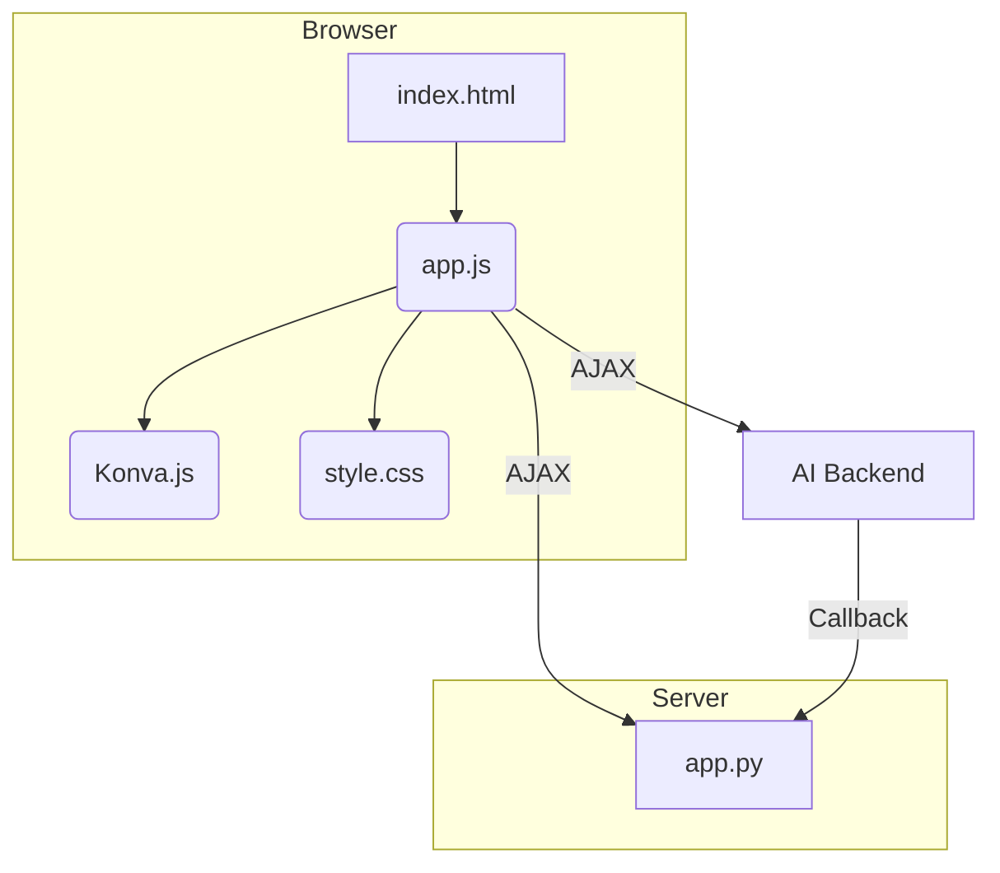
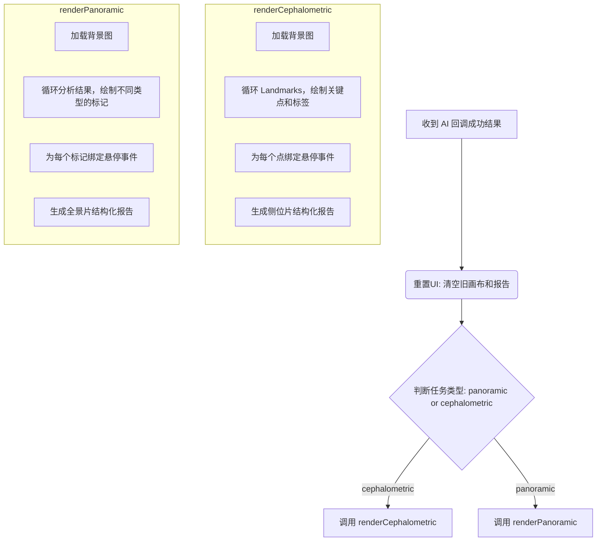

# X-Ray AI分析可视化页面 - 详细设计文档 (LLD)

> **版本:** 2.0
> **日期:** 2025-11-22
> **负责人:** Cascade

---

## 1. 概述

### 1.1. 项目目标

本项目旨在将现有的 MVP (最小可行产品) 前端从一个简单的 JSON 查看器，升级为一个专业的 AI 推理结果可视化分析工具。新系统将支持在全景片和侧位片上精确渲染 AI 标记，并以结构化的方式展示诊断报告，以满足专业医生的临床验证需求。

### 1.2. 设计原则

在 MVP “简约至上” 的基础上，增加以下原则：

- **直观呈现:** 将复杂的 JSON 数据转换为易于理解的视觉元素（点、线、框）和结构化报告。
- **重点突出:** 在视觉上高亮异常或关键的分析结果，引导医生快速定位问题。
- **精准高效:** 确保所有 AI 标记在图像上精确渲染，并提供流畅的交互体验。

---

## 2. 架构与技术选型

### 2.1. 总体架构

系统保留 MVP 的核心架构：**Flask** 提供静态文件和回调服务，**原生 JavaScript** 负责前端逻辑。为满足复杂的渲染需求，引入一个轻量级的 Canvas 库。



### 2.2. 技术选型

- **核心逻辑:** 原生 JavaScript (ES6+)，保持轻量和无构建工具的特点。
- **Canvas 渲染:** **Konva.js**
  - **选型理由:** 相比原生 Canvas API，Konva.js 提供了更简单的对象模型、事件处理（悬停、点击）和图层管理，能大幅简化在图像上绘制和交互图形的复杂度，同时保持高性能。
- **后端服务:** Flask (保持不变)。

### 2.3. 目录结构

为引入第三方库，在 `static` 目录下新增 `lib` 文件夹。

```
web/vibe_coding/web_2/
├── app.py                      # Flask 服务器 (保持不变)
├── static/
│   ├── index.html              # 前端主页面 (结构大改)
│   ├── app.js                  # 前端核心逻辑 (功能大改)
│   ├── style.css               # 样式表 (功能大改)
│   └── lib/
│       └── konva.min.js        # 新增: Konva.js 库
└── readme_xx_lld.md            # 本文档
```

---

## 3. 页面布局与模块设计

页面将采用经典的双栏布局。

```
+-------------------------------------+--------------------------+
|           图像查看区 (70%)          |    AI 分析报告区 (30%)     |
| <div id="image-container">        | <div id="report-container">|
|   <canvas></canvas>               |                          |
| </div>                              | </div>                   |
+-------------------------------------+--------------------------+
```

### 3.1. 图像查看区 (`image-container`)

- **用途:** 负责加载背景 X-Ray 图片，并在其上通过 Canvas 渲染 AI 标记。
- **核心组件:** Konva.js Stage 实例。
- **实现要点:**
  1. **背景图加载:** 动态创建一个 `Image` 对象，加载用户上传的图片。加载完成后，将其设置为 Konva.js 图层的背景。
  2. **响应式缩放:** Canvas 的尺寸需适应容器宽度，同时保持图像的原始宽高比。所有绘制的坐标需要根据缩放比例进行换算。
  3. **图层管理:** 使用不同的图层（`Konva.Layer`）管理不同的标记类型（如关键点、分割区域），便于独立控制显示/隐藏。

### 3.2. AI 分析报告区 (`report-container`)

- **用途:** 动态生成结构化的 HTML 元素，展示 AI 分析结果。
- **实现要点:**
  1. **动态生成:** 根据接收到的 JSON 数据，使用 `document.createElement` 等原生 DOM API 构建报告卡片、标题和键值对。
  2. **可滚动:** 当报告内容超出屏幕高度时，该区域应出现垂直滚动条。
  3. **突出显示:** 为被标记为异常的数据添加特定的 CSS 类（如 `.abnormal`），以便在 `style.css` 中定义高亮样式（如红色文本）。

---

## 4. 核心功能实现详解

### 4.1. 结果渲染流程 (`displayResult` 函数重构)

原有的 `displayResult` 函数将被彻底重构，从显示纯文本 JSON 变为驱动整个可视化渲染的入口。



### 4.2. 侧位片 (Cephalometric) 渲染

- **关键点绘制:**
  - 对 `data.Landmarks` 数组进行遍历。
  - 对每个 `landmark` 对象，在 Canvas 上使用 `Konva.Circle` 绘制一个圆点。
  - **状态区分:** 如果 `landmark.Status === "Missing"`，则设置圆点样式为灰色、空心（`fill: 'transparent', stroke: 'grey'`）。
  - 在圆点旁边，使用 `Konva.Text` 绘制其 `Label`（如 "S"）。
- **悬停交互 (Tooltip):**
  - 为每个 `Konva.Circle` 绑定 `mouseover` 和 `mouseout` 事件。
  - `mouseover`: 创建并显示一个 HTML `div` 作为 Tooltip，内容包含关键点全名（需内置一个映射表）、坐标和置信度。
  - `mouseout`: 隐藏 Tooltip `div`。
  - **全名映射表:** 在 `app.js` 中定义一个常量对象，如 `const LANDMARK_FULL_NAMES = { 'S': '蝶鞍点', 'N': '鼻根点', ... };`

### 4.3. 全景片 (Panoramic) 渲染

全景片的渲染逻辑需要区分**区域性发现**（有独立Mask）和**属性类发现**（针对整颗牙齿的描述）。

- **渲染流程:**
  1.  **绘制牙齿分割区域:** 遍历 `ToothAnalysis` 数组，为每一颗牙齿使用 `Konva.Line` 绘制其 `SegmentationMask`，作为基础交互区域。
  2.  **绘制区域性发现:** 遍历 `implant`, `density_low`, `density_high` 等具有独立坐标的发现，在牙齿分割区域之上叠加绘制对应的色块或边框。

- **标记样式 (区域性发现):**
  
  - **种植体 (`implant`):** 使用 `Konva.Rect` 绘制一个蓝色边框的矩形。
  - **根尖密度影 (`density_low`/`density_high`):** 使用 `Konva.Polygon` 绘制黄色虚线边框。
  - **牙齿分割 (`SegmentationMask`):** 默认使用 `Konva.Line` 绘制一个闭合的绿色轮廓线。

- **交互设计 (Tooltip):**
  - **鼠标悬停在牙齿分割区域 (`SegmentationMask`) 上时:**
    - Tooltip 中应**汇总展示该牙齿所有的属性类发现**（如龋坏、修复牙等）。
    - **内容示例:**
      ```
      牙位: 18
      - 龋坏 (置信度: 0.98)
      - 修复牙 (置信度: 0.95)
      - 牙根吸收 (置信度: 0.95)
      ```
  - **鼠标悬停在独立的区域性发现上时 (如种植体边框):**
    - Tooltip 显示该具体发现的详细信息，如 `Description` 和 `Confidence`。

### 4.4. 结构化报告生成

- **报告模板函数:** 创建独立的函数，如 `buildCephReport(data)` 和 `buildPanoReport(data)`，负责将 JSON 数据转换为 HTML 字符串或 DOM 节点。
- **侧位片报告:**
  1.  创建“骨骼分析”、“牙齿分析”等 `<h2>` 标题。
  2.  遍历每个分析项，创建一个 `div` 容器。
  3.  在容器内并列展示测量值和诊断结论，如 `<span>ANB角: 3.5°</span><span>(骨性I类)</span>`。
  4.  如果分析项被标记为异常，为外层 `div` 添加 `.abnormal` 类。
  5.  对于颈椎成熟度（`Cervical_Vertebral_Maturity_Stage`）的 Base64 图片，创建一个 `` 标签，并将其 `src` 设置为 `data:image/jpeg;base64,${base64String}`。
- **全景片报告:** 逻辑类似，按照 `prd.md` 定义的结构（整体摘要、颌骨与关节等）进行分组和渲染。

### 4.5. 错误处理

当接收到 `status: "FAILURE"` 的回调时：

1.  **清空界面:** 隐藏 `image-container` 和 `report-container`。
2.  **显示错误提示:** 创建一个专门的错误提示 `div` (`id="error-message"`)，将其内容设置为 `error.displayMessage` 的值。
3.  **样式:** 为该 `div` 应用醒目的错误样式（如红色背景，白色文字）。

---

## 5. `app.js` 核心函数变更

| 函数名 | MVP v4 职责 | v2.0 职责 (变更) |
| :--- | :--- | :--- |
| `init()` | 绑定表单事件 | **(扩展)** 增加初始化 Konva Stage 的逻辑。 |
| `onSubmit()` | 发送请求，启动轮询 | **(不变)** 核心逻辑不变。 |
| `startPolling()` | 启动定时器 | **(不变)** |
| `pollResult()` | 查询结果 | **(不变)** |
| `displayResult(json)` | 在 `<pre>` 中显示 JSON | **(重构)** 成为核心渲染引擎，调用 Canvas 绘制和报告生成函数。 |
| `resetUI()` | 重置表单和结果区 | **(扩展)** 增加清空 Canvas 内容和销毁 Konva 对象的逻辑。 |

---

## 6. 迭代与演进

本次重构为后续的功能扩展奠定了坚实的基础：

- **交互增强:** 未来可以在 Canvas 上增加拖动、缩放、测量工具等功能。
- **性能优化:** 对于非常复杂的图像，可以引入 Konva.js 的虚拟化渲染或分层优化技术。
- **组件化:** 如果项目进一步复杂化，当前的原生 JS 模块可以平滑地迁移到如 Vue 或 React 等现代框架中，每个报告组或标记类型都可以成为一个独立的组件。

